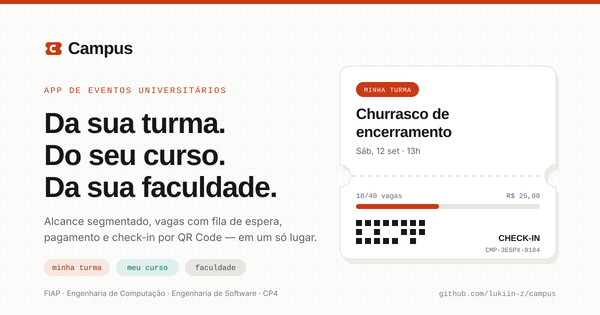

<div align="center">


**Eventos da sua turma, do seu curso e da sua faculdade — com vagas, fila de espera, pagamento e check-in em um só lugar.**

[](https://github.com/lukiin-z/campus/actions/workflows/ci.yml)
[](https://github.com/lukiin-z/campus/actions/workflows/deploy-pages.yml)
[](LICENSE)
[](https://react.dev)
[](https://www.typescriptlang.org)
[](https://vite.dev)
[](https://tailwindcss.com)

</div>

---

## Sumário

- [O problema](#o-problema)
- [Como ver funcionando](#como-ver-funcionando)
- [Funcionalidades](#funcionalidades)
- [Stack, e por que cada escolha](#stack-e-por-que-cada-escolha)
- [Como rodar](#como-rodar)
- [Estrutura de pastas](#estrutura-de-pastas)
- [Documentação completa](#documentação-completa)
- [Equipe](#equipe)
- [Status por checkpoint](#status-por-checkpoint)
- [Licença](#licença)

---

## O problema

A vida social de um curso universitário acontece hoje em ferramentas que não foram feitas
para ela: um grupo de WhatsApp, um story de Instagram e, quando o organizador é
caprichoso, um Google Forms. Isso funciona até o evento crescer. A partir daí, quatro
problemas aparecem sempre nos mesmos pontos.

| Problema | Como acontece hoje |
|---|---|
| **O alcance é errado nas duas direções** | Um churrasco de 40 vagas da turma vira story e chega a centenas de pessoas — e o organizador passa o dia recusando gente. No sentido inverso, a Feira de Carreiras morre em um grupo de 45 pessoas |
| **O controle de vagas é manual** | Planilha com edição simultânea, "quem confirmou manda +1 aqui". Quando lota não existe fila; quando alguém desiste, a vaga evapora |
| **A cobrança é informal** | Um aluno vira tesoureiro sem querer: Pix na conta pessoal, controle por print de comprovante, dinheiro adiantado do próprio bolso |
| **Não sobra memória do que aconteceu** | As fotos morrem em stories de 24h. A gestão seguinte do Centro Acadêmico começa do zero, sem histórico de público, preço ou comparecimento |

> **Para** alunos e organizadores de eventos universitários, **que** perdem tempo e
> público porque divulgação, controle de vagas e cobrança acontecem em ferramentas
> genéricas e desconectadas, **o Campus é um** aplicativo de eventos universitários
> **que** entrega alcance segmentado por turma, curso ou faculdade com vagas, fila de
> espera, pagamento e check-in em um só lugar, **diferente de** grupos de WhatsApp,
> stories e plataformas de ingresso genéricas, **porque** conhece a estrutura acadêmica —
> turma, curso, faculdade — e usa essa estrutura como **regra de visibilidade** do evento,
> não como um campo de texto opcional.

Detalhamento, personas e jornada: [`docs/01-problema-e-personas.md`](docs/01-problema-e-personas.md).

---

## Como ver funcionando

| Link | O que é |
|---|---|
| **[App](https://lukiin-z.github.io/campus/)** | O app React rodando, com dados mockados |
| **[Styleguide](https://lukiin-z.github.io/campus/styleguide/)** | A marca inteira em uma página: logo, paleta com contraste medido, tipografia, todos os componentes em todos os estados |
| **[Protótipo original](https://lukiin-z.github.io/campus/prototipo/)** | O protótipo estático que originou a identidade visual, preservado |
| **[Slides do vídeo](https://lukiin-z.github.io/campus/slides/)** | Deck de apoio da apresentação, navegável por setas |
| **[Arquivo do Figma](https://www.figma.com/design/LRohAtBOH6gyskqkA9cRKp)** | Design system com 64 tokens, 11 estilos de texto e 9 componentes com 34 variants |

<div align="center">

### O elemento de assinatura da marca



</div>

---

## Funcionalidades

| Módulo | O que faz |
|---|---|
| **Alcance segmentado** | Todo evento tem alcance `TURMA`, `CURSO` ou `FACULDADE`, e o alcance determina **sozinho** quem enxerga — em lista, detalhe, feed e acesso por link direto |
| **Vagas sem estouro** | A capacidade nunca é excedida, mesmo com inscrições simultâneas: a verificação e a criação da participação acontecem em uma operação atômica |
| **Lista de espera FIFO** | Lotado não recusa: direciona para a fila. Vaga liberada é **oferecida ao primeiro** com janela de 24 h, e a vaga fica reservada durante a oferta |
| **Pagamento com reserva curta** | Pix e cartão via gateway. A vaga fica reservada por 60 min; sem pagamento, volta para a fila. Só o gateway confirma pagamento, e a confirmação é idempotente |
| **Reembolso com política visível** | Escala 100% / 50% / 0% pela antecedência, **exibida antes da cobrança** e congelada na participação: mudar a política depois não retroage |
| **Check-in de uso único** | Ingresso com QR assinado, válido só na janela do evento e aceito **uma vez**. Cada recusa tem motivo específico: "ingresso já utilizado às 20h14", não "erro" |
| **Feed como memória** | Publica quem esteve no evento. A publicação herda a visibilidade do evento, e não existe feed solto sem evento |
| **Acessibilidade** | Contraste WCAG 2.1 AA verificado par por par, navegação completa por teclado, foco visível e **nenhuma informação transmitida só por cor** |

Os 43 requisitos funcionais e 22 não funcionais estão em
[`docs/02-requisitos.md`](docs/02-requisitos.md); as 25 regras invariantes, em
[`docs/04-regras-de-negocio.md`](docs/04-regras-de-negocio.md).

---

## Stack, e por que cada escolha

| Camada | Escolha | Por que, e não a alternativa óbvia |
|---|---|---|
| App | **React 18 + Vite + TypeScript strict** | Publicação em loja é incompatível com o prazo do semestre; avaliação por link é mais simples para a banca. PWA instalável fica para o CP6 — [ADR-0001](docs/adr/0001-react-vite-em-vez-de-react-native.md) |
| Estilo | **Tailwind com os design tokens no `tailwind.config.ts`** | O nome do token é idêntico ao nome do style no Figma: é isso que liga design e código. Valor arbitrário em `className` é **erro de lint** — [ADR-0002](docs/adr/0002-tailwind-com-design-tokens.md) |
| Dados | **Camada de repositório + MSW interceptando HTTP** | O app fala HTTP de verdade desde já, então exercita carregamento, erro e conflito `409`. No CP6 muda **só quem responde** — nenhuma tela é tocada — [ADR-0003](docs/adr/0003-camada-de-repositorio-com-msw.md) |
| Estado | **Zustand** (sessão/UI) + **TanStack Query** (dados) | Dado de servidor tem cache, invalidação e estado de carregamento; estado de UI não. Misturar os dois é a via rápida para cache desatualizado |
| Formulário | **Zod + React Hook Form** | O schema **chama** as funções de domínio em vez de reimplementar a regra: validação de tela e regra de servidor não podem divergir |
| Domínio | **12 módulos de funções puras** em `app/src/domain/` | Sem React, sem rede, sem mock. É o que permite as mesmas regras rodarem no cliente e no servidor, e testarem em milissegundos |
| Teste | **Vitest + Testing Library + Playwright** | 156 testes: 30 de domínio, 20 de componente, 14 de integração pela camada HTTP real e 4 E2E |
| CI/CD | **GitHub Actions + GitHub Pages** | Lint, escala de espaçamento, formatação, cobertura, build e orçamento de pacote em todo push e PR |

Arquitetura completa, com C4 e o contrato da API planejada:
[`docs/08-arquitetura.md`](docs/08-arquitetura.md).

---

## Como rodar

Pré-requisito: **Node 22.17.0** (o `.nvmrc` fixa a versão).

```bash
git clone https://github.com/lukiin-z/campus.git
cd campus/app
npm ci
npm run dev
```

Abra `http://localhost:5173`. Não há backend nem variável de ambiente para configurar: o
MSW sobe com o app e responde do mock em memória, com um seed rico (1 faculdade, 3 cursos,
4 turmas, 12 usuários e 11 eventos em estados variados — lotado com fila, pago, gratuito,
cancelado, realizado e rascunho).

### Todos os comandos

```bash
npm run dev            # servidor de desenvolvimento
npm run build          # build de produção (tsc -b + vite build)
npm run preview        # serve o build
npm run lint           # ESLint, zero aviso tolerado
npm run format:check   # Prettier
npm run test           # Vitest
npm run test:coverage  # Vitest com o limite de 60% no domínio
npm run test:e2e       # Playwright (precisa de `npx playwright install chromium`)
npm run check:scale    # classes utilitárias fora da escala de 4px
npm run check:size     # orçamento de tamanho do pacote
npm run diagrams       # regenera os SVGs dos diagramas Mermaid
npm run validate:docs  # links, âncoras, blocos Mermaid e SVGs da documentação
```

Da raiz do repositório, sem instalar nada (os dois scripts usam só a stdlib do Node):

```bash
node scripts/validate-docs.mjs
node scripts/render-diagrams.mjs --check
```

---

## Estrutura de pastas

```
campus/
├─ app/                          Aplicação React — a base do CP5
│  ├─ src/
│  │  ├─ pages/                  7 telas, uma por rota
│  │  ├─ components/ui/          Design system: TicketCard, Button, Chip, Badge…
│  │  ├─ components/layout/       Moldura do app: TopBar, BottomNav, AppShell, Toast
│  │  ├─ domain/                 REGRAS DE NEGÓCIO em funções puras (RN-001 a RN-025)
│  │  │                          policy.ts é o único lugar do código com os números
│  │  ├─ services/               Interfaces dos repositórios + implementação HTTP
│  │  ├─ mocks/                  Seed, banco em memória com escrita serializada, MSW
│  │  ├─ store/                  Zustand: sessão e UI
│  │  ├─ hooks/                  TanStack Query: cache e invalidação
│  │  └─ types/domain.ts         Espelha o diagrama de classes, entidade por entidade
│  └─ e2e/                       Playwright
├─ docs/                         Toda a documentação — comece pelo docs/README.md
│  ├─ 05-modelagem/              12 diagramas Mermaid + dicionário de dados
│  ├─ 06-marca/                  Identidade visual, design system, styleguide, SVGs
│  ├─ 09-trello/                 Quadro pronto para importar (JSON, CSV, manual, API)
│  └─ adr/                       6 decisões arquiteturais registradas
├─ prototype/legacy/             O protótipo estático original, preservado
├─ scripts/                      Verificadores: docs, diagramas, escala, pacote
└─ .github/workflows/            CI e publicação no GitHub Pages
```

---

## Documentação completa

**Índice navegável: [`docs/README.md`](docs/README.md)**

| Peso na avaliação | Documento |
|---|---|
| **25%** Documentação e requisitos | [Problema e personas](docs/01-problema-e-personas.md) · [Requisitos](docs/02-requisitos.md) · [Escopo](docs/03-escopo.md) · [Regras de negócio](docs/04-regras-de-negocio.md) · [Glossário](docs/14-glossario.md) |
| **20%** Modelagem UML | [Índice dos diagramas](docs/05-modelagem/README.md) · [Casos de uso](docs/05-modelagem/01-casos-de-uso.md) · [Classes](docs/05-modelagem/02-diagrama-classes.md) · [Modelo ER](docs/05-modelagem/03-modelo-dados-er.md) · [Sequência](docs/05-modelagem/04-diagrama-sequencia.md) · [Atividades](docs/05-modelagem/05-diagrama-atividades.md) · [Estados](docs/05-modelagem/06-diagrama-estados.md) · [Componentes](docs/05-modelagem/07-diagrama-componentes.md) · [Dicionário de dados](docs/05-modelagem/dicionario-de-dados.md) |
| **20%** Identidade visual | [Identidade visual](docs/06-marca/identidade-visual.md) · [Design system](docs/06-marca/design-system.md) · [Guia do Figma](docs/06-marca/guia-figma.md) · [Styleguide](docs/06-marca/styleguide.html) |
| **15%** Pitch | [Pitch](docs/07-pitch.md) · [Roteiro do vídeo](docs/15-video-roteiro.md) · [Slides](docs/15-video-slides.html) |
| **10%** Trello | [Quadro](docs/09-trello/quadro.md) · [Criar o quadro](docs/09-trello/criar-quadro.md) |
| **10%** GitHub | este README · [CONTRIBUTING](CONTRIBUTING.md) · [CI](.github/workflows/ci.yml) |
| Engenharia | [Arquitetura](docs/08-arquitetura.md) · [ADRs](docs/adr/README.md) · [Plano de testes](docs/11-plano-de-testes.md) · [Riscos](docs/12-riscos.md) · [Roadmap CP5–CP6](docs/13-roadmap-cp5-cp6.md) |
| Entrega | [Equipe e papéis](docs/10-equipe-e-papeis.md) · [Checklist do CP4](docs/16-checklist-entrega-cp4.md) |

---

## Equipe

| Integrante | RM | Papel | Responsabilidade no CP4 |
|---|---|---|---|
| Ana Luiza Dourado | RM558793 | UX/UI Designer | Identidade visual, protótipo Figma, design system, personas |
| João Viviani Baldini | RM558596 | Product Owner | Visão de produto, backlog, pitch, priorização MoSCoW |
| Lucas Baraldi | RM555407 | Tech Lead / Arquiteto | Arquitetura, stack, repositório, CI/CD, padrões de código |
| Lucas Zolla | RM557952 | Analista de Requisitos | RF/RNF, escopo, regras de negócio, critérios de aceite |
| Ronaldo Veloso Filho | RM556445 | Modelagem / Analista UML | Diagramas UML, modelo de dados, dicionário de dados |
| Vitor Pantarotto | RM554961 | Scrum Master / QA | Trello, sprints, cerimônias, plano de testes, riscos |

Responsabilidades detalhadas e matriz RACI dos artefatos:
[`docs/10-equipe-e-papeis.md`](docs/10-equipe-e-papeis.md).

**Disciplina:** Engenharia de Software · **Curso:** Engenharia de Computação (3º ano) ·
**Instituição:** FIAP · **Professor:** Hercules Ramos

---

## Status por checkpoint

### CP4 — concepção, documentação e base técnica ✅

| Entrega | Estado |
|---|---|
| Documentação inicial: problema, personas, 43 RF, 22 RNF, escopo, 25 regras | ✅ |
| 12 diagramas Mermaid em 7 tipos, validados, com exports em SVG | ✅ |
| Marca: 6 SVGs à mão, paleta com contraste AA verificado par por par, design system, styleguide | ✅ |
| Arquivo do Figma: 64 tokens, 11 estilos de texto, 9 componentes com 34 variants | ⚠️ telas pendentes — [motivo](docs/06-marca/guia-figma.md#5-o-que-não-foi-construído-e-por-quê) |
| Pitch de 1 minuto, roteiro do vídeo e deck de apoio | ✅ |
| Quadro do Trello pronto para importar por 3 caminhos | ✅ |
| Repositório organizado, CI verde, Pages publicado | ✅ |
| Base do app React com domínio testado e camada de dados trocável | ✅ |

### CP5 — protótipo funcional com dados mockados 🔜

21 RFs funcionando, ambiente de teste acessível por link, diagramas de sequência e
atividade atualizados, validação com 5 alunos e demo ao vivo.
Tarefa por tarefa: [`docs/13-roadmap-cp5-cp6.md`](docs/13-roadmap-cp5-cp6.md).

### CP6 — persistência, integração e entrega final 🔜

API real substituindo o mock, pagamento em sandbox, check-in por leitura de QR,
notificações, moderação, PWA instalável e manual de uso.

---

## Licença

[MIT](LICENSE) — © 2026 Equipe Campus.
