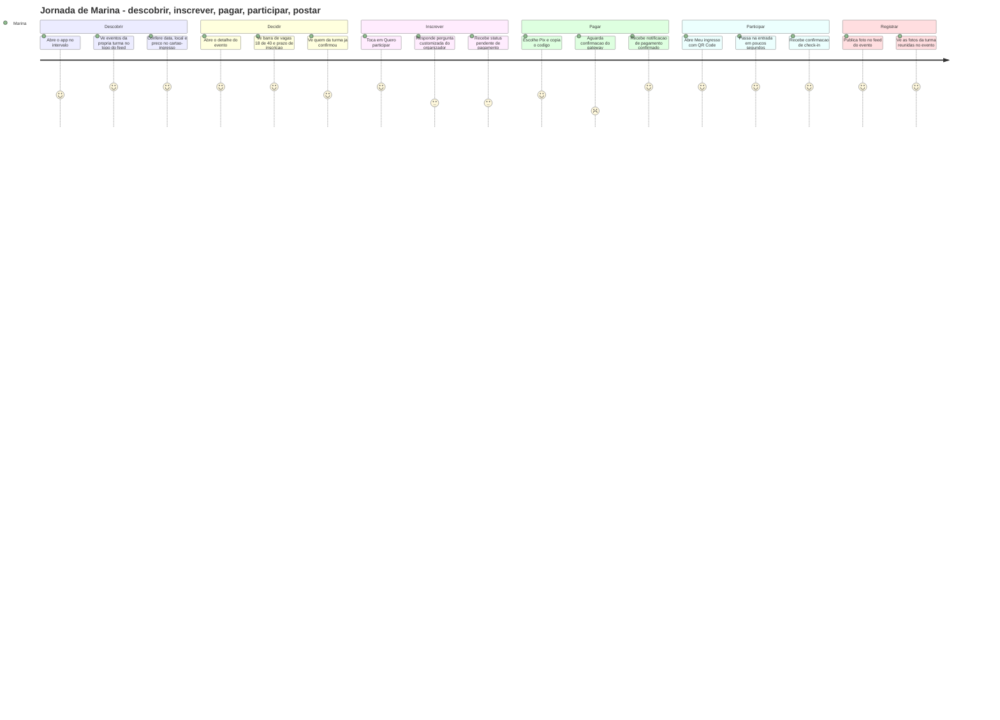

# Problema, personas e jornada

> **Nota sobre números.** Este documento não cita pesquisa de mercado. Todo valor
> numérico aparece rotulado como **premissa do grupo** — ou seja, estimativa adotada
> para dimensionar o projeto, a ser validada com usuários reais no CP5. Não há dado de
> terceiro sem fonte.

## 1. Contexto

A vida social de um curso universitário acontece hoje em ferramentas que não foram
feitas para ela. Um churrasco de turma, um hackathon da faculdade e uma palestra de
curso são organizados no mesmo lugar: um grupo de WhatsApp, um story de Instagram e,
quando o organizador é caprichoso, um Google Forms.

Isso funciona até o evento crescer. A partir daí, quatro problemas aparecem sempre nos
mesmos pontos:

**1. O alcance é errado nas duas direções.** Não existe o conceito de "quem deveria ver
isso". Um churrasco de 40 vagas da turma de Engenharia de Computação do 3º ano é
postado no story e chega a centenas de pessoas da faculdade inteira — e o organizador
passa o dia recusando gente. No sentido inverso, a Feira de Carreiras, que interessa a
todos, morre em um grupo de 45 pessoas porque ninguém repassou.

**2. O controle de vagas é manual e não sobrevive à escala.** Lista numerada no bloco de
notas, planilha compartilhada com edição simultânea, "quem confirmou manda +1 aqui".
Quando lota, não existe fila: existe uma conversa desorganizada sobre quem falou
primeiro. Quando alguém desiste, a vaga simplesmente evapora — ninguém percebe que
abriu, e o evento acontece com lugares vazios e gente que queria ir de fora.

**3. A cobrança é informal e recai sobre uma pessoa física.** Um aluno vira tesoureiro
sem querer: recebe Pix na conta pessoal, controla quem pagou por print de comprovante,
adianta dinheiro do próprio bolso e cobra os atrasados individualmente. Não há recibo,
não há política de reembolso escrita e não há separação entre o caixa do evento e a
conta de quem organizou.

**4. Não sobra memória do que aconteceu.** As fotos ficam espalhadas em stories que
expiram em 24 horas e em galerias privadas. Um calouro que entra no semestre seguinte
não tem como saber o que a turma fez, nem quem organizou, nem se valeu a pena — e a
próxima gestão do Centro Acadêmico começa do zero, sem histórico de público, de preço
praticado ou de taxa de comparecimento.

O efeito acumulado é conhecido: o organizador gasta mais energia em logística do que no
evento, e o participante descobre tarde ou não descobre.

### Premissas de dimensionamento adotadas pelo grupo

| Premissa | Valor adotado | Por que importa para o produto |
|---|---|---|
| Alunos por turma | 35 a 50 | Define o tamanho típico do alcance "turma" e a capacidade média de um evento de turma |
| Turmas por curso | 4 a 8 | Justifica o alcance intermediário "curso" existir em vez de só turma e faculdade |
| Eventos por turma por semestre | 3 a 6 | Volume esperado por turma — o app precisa parecer vivo com pouco conteúdo |
| Faixa de preço de evento pago | R$ 15 a R$ 50 | Ticket baixo: a taxa de gateway pesa proporcionalmente, o que exige Pix |
| Taxa de comparecimento sem check-in | 60% a 75% dos inscritos | Motiva medir presença real, não só inscrição |
| Faculdades atendidas na v1 | 1 | Multi-instituição fica para depois do CP6 |

Todos os valores acima são estimativa do grupo, a serem confrontados com entrevistas de
validação previstas no CP5 (ver [`13-roadmap-cp5-cp6.md`](13-roadmap-cp5-cp6.md)).

## 2. Declaração do problema

> **Para** alunos e organizadores de eventos universitários, **que** perdem tempo e
> público porque a divulgação, o controle de vagas e a cobrança acontecem em ferramentas
> genéricas e desconectadas, **o Campus é um** aplicativo de eventos universitários
> **que** entrega alcance segmentado por turma, curso ou faculdade com vagas, fila de
> espera, pagamento e check-in em um só lugar, **diferente de** grupos de WhatsApp,
> stories do Instagram e plataformas de ingresso genéricas, **porque** conhece a
> estrutura acadêmica — turma, curso, faculdade — e usa essa estrutura como regra de
> visibilidade do evento, não como um campo de texto opcional.

A frase acima é o teste de coerência do escopo: se um requisito não se explica por ela,
ele é candidato a sair (ver [`03-escopo.md`](03-escopo.md)).

## 3. Personas

As três personas foram construídas para cobrir os três lados do problema: quem consome
(descobre e se inscreve), quem produz em pequena escala (turma) e quem produz em escala
institucional (Centro Acadêmico e Atlética). Elas são os atores do diagrama de casos de
uso em [`05-modelagem/01-casos-de-uso.md`](05-modelagem/01-casos-de-uso.md).

---

### Persona 1 — Marina Alves · a participante

| Atributo | Valor |
|---|---|
| Idade | 21 anos |
| Curso / turma | Engenharia de Computação, 3º ano, turma 3ESPX |
| Rotina | Estagia de 9h às 15h, aula das 19h30 às 22h30, segunda a quinta |
| Aparelho | Android intermediário, 4G com franquia limitada, Wi-Fi no campus |
| Renda para lazer | R$ 150 a R$ 250 por mês (premissa do grupo) |

**Comportamento.** Descobre quase tudo por acaso: alguém comenta no intervalo, um story
aparece no fim do dia, um colega manda print no privado. Tem 11 grupos de WhatsApp da
faculdade, silenciou 9. Decide participar quando três coisas estão claras em menos de um
minuto: **quando**, **quanto** e **quem vai**. Se precisar entrar em um grupo novo para
descobrir o preço, desiste.

**Objetivos.**

1. Não perder evento da própria turma por não ter visto a tempo.
2. Saber se ainda tem vaga antes de se animar.
3. Pagar de um jeito que gere prova — sem depender de print de comprovante.
4. Entrar no evento sem ficar em fila de conferência de lista na porta.

**Frustrações.**

1. Descobrir o churrasco da turma no dia seguinte, pelas fotos.
2. "Já lotou" dito por mensagem, sem saber se existe fila ou qual posição ocupa.
3. Pix para a conta pessoal de um colega, sem recibo e sem saber se foi registrado.
4. Precisar decorar o nome de quem está na lista para ser liberada na entrada.

**Cenário de uso.** Terça, 12h40, fila do bandejão. Abre o Campus e vê no topo do feed
que o churrasco da 3ESPX tem 18 de 40 vagas. Toca no ingresso, lê data, local e R$ 25,
inscreve-se, paga por Pix com QR na própria tela e recebe o ingresso com QR Code de
check-in. Tempo total: menos de dois minutos, sem sair do app e sem entrar em grupo
nenhum.

> "Eu não quero mais um grupo. Eu quero saber se ainda tem vaga e quanto custa, sem
> perguntar para ninguém."

---

### Persona 2 — Rafael Souza · o organizador de turma

| Atributo | Valor |
|---|---|
| Idade | 23 anos |
| Curso / turma | Engenharia de Computação, 3º ano, turma 3ESPX — representante de turma |
| Rotina | Trabalha em período integral, aula à noite; organiza 3 a 4 eventos por semestre |
| Aparelho | iPhone, usa muito Notas e planilha do Google |
| Experiência prévia | Já organizou churrasco de 40 pessoas com planilha e Pix na conta pessoal |

**Comportamento.** É o que resolve. Assume a organização porque ninguém mais assume, e
paga o preço disso: vira central de atendimento no privado. Mantém uma planilha com
nome, "pagou?" e "+1", que sempre fica desatualizada. Cobra os atrasados um por um no
dia anterior. Adianta o dinheiro do espaço e reza para fechar a conta.

**Objetivos.**

1. Divulgar só para a própria turma, sem transbordar para a faculdade inteira.
2. Ter o número real de confirmados, atualizado, sem consultar ninguém.
3. Não misturar o dinheiro do evento com o dinheiro dele.
4. Preencher a vaga que abre quando alguém desiste, automaticamente.
5. Saber quem realmente apareceu, para calibrar o próximo evento.

**Frustrações.**

1. Recusar dezenas de pessoas de fora da turma que viram o story.
2. Descobrir na hora que 12 dos 40 confirmados não vieram — comida comprada, prejuízo.
3. Perseguir comprovante de pagamento no privado.
4. Vaga aberta que ninguém ocupa porque não há fila organizada.

**Cenário de uso.** Domingo à noite, decide o churrasco. Cria o evento no Campus em
quatro campos, marca alcance **minha turma**, capacidade 40, R$ 25 e prazo de inscrição
até quinta. Publica: as pessoas da 3ESPX recebem notificação; ninguém de fora vê.
Durante a semana acompanha a barra de vagas e os pagamentos confirmados. Quando alguém
cancela, o primeiro da fila é promovido e notificado sem que Rafael faça nada. No dia,
valida a entrada pelo QR Code e fecha com a lista de presença real.

> "Eu não quero ser tesoureiro nem porteiro. Eu só quero marcar o churrasco."

---

### Persona 3 — Beatriz Nakamura · a organizadora institucional (CA / Atlética)

| Atributo | Valor |
|---|---|
| Idade | 24 anos |
| Curso / turma | Sistemas de Informação, 4º ano — diretora de eventos da Atlética |
| Rotina | Gestão de 1 ano de mandato; 6 a 10 eventos por semestre, alguns de 300 pessoas |
| Aparelho | Android + notebook; usa Instagram, editor de arte e planilha |
| Escala típica | 150 a 400 participantes, ticket de R$ 30 a R$ 50 (premissa do grupo) |

**Comportamento.** Pensa em campanha, não em convite. Produz arte, agenda story, mede
alcance. Já usou plataforma de ingresso genérica e achou boa para vender e ruim para o
resto: a taxa pesa em ticket baixo, o público que compra não é o público da faculdade, e
no fim precisa exportar CSV e conferir na porta com o celular na mão. Não tem CNPJ nem
conta jurídica confiável — a conta muda de mandato para mandato.

**Objetivos.**

1. Alcançar a faculdade inteira sem depender do algoritmo de uma rede social.
2. Vender ingresso com controle de vagas real e fila quando lotar.
3. Fazer check-in de 300 pessoas em fluxo, sem fila de conferência de nome.
4. Deixar histórico para a próxima gestão: público, preço, comparecimento.
5. Distinguir evento aberto da faculdade de evento restrito a um curso.

**Frustrações.**

1. Story que alcança uma fração de quem segue — e quem mais precisava ver não viu.
2. Taxa de plataforma genérica que come margem de ingresso barato.
3. Entrada travada porque a conferência é manual e a lista está em outra aba.
4. Passar o cargo sem passar dado nenhum: a gestão seguinte reinventa tudo.

**Cenário de uso.** Cria a Festa Junina Fora de Época com alcance **faculdade**,
capacidade 300 e R$ 45. Recebe 287 inscrições em quatro dias, e as últimas vagas com
fila de espera ativa. Na porta, dois membros da diretoria fazem check-in por QR Code em
paralelo — cada QR vale uma vez só, então ninguém passa duas pessoas com o mesmo
ingresso. No dia seguinte, o feed do evento tem dezenas de fotos postadas pelos
participantes, e o relatório mostra a presença real contra os inscritos: dado que ela
deixa para a próxima gestão.

> "Eu preciso de alcance de verdade e de porta que ande. Story bonito eu já sei fazer."

---

### Antipersona — quem o Campus **não** atende na v1

Explicitar quem fica de fora é o que impede o escopo de inflar. Ver
[`03-escopo.md`](03-escopo.md).

| Antipersona | Por que não é atendido na v1 | Quando poderia entrar |
|---|---|---|
| **Produtor de evento comercial aberto ao público** (casa de show, festa vendida na cidade) | O eixo do produto é o alcance acadêmico — turma, curso, faculdade. Público aberto elimina justamente a regra que dá valor ao Campus, e traz exigências fiscais e antifraude fora do alcance do semestre | Nunca como foco; no máximo como evento de faculdade com convidados |
| **Coordenação acadêmica querendo controlar presença em aula** | Presença acadêmica tem valor legal e regra institucional própria; misturar com evento social contamina o dado e cria expectativa de integração com sistema de matrícula | Fora do produto |
| **Aluno de outra instituição** | A v1 tem uma única faculdade, e a verificação de identidade é feita por domínio de e-mail institucional. Multi-instituição exige federação de identidade e modelo multi-tenant | Depois do CP6, se o produto seguir |
| **Ex-aluno / egresso** | Sem vínculo com turma ativa, o alcance segmentado não se aplica — o egresso não pertence a nenhum dos três níveis | Como convidado de evento de faculdade, futuro |
| **Fornecedor / patrocinador** | Precisaria de painel comercial, contrato e faturamento — outro produto | Fora do escopo do semestre |
| **Usuário de desktop como plataforma principal** | O uso é situacional e móvel: fila do bandejão, corredor, porta do evento. Desktop é suportado como layout centralizado, mas não é otimizado | Suportado, não priorizado |

## 4. Jornada do usuário

Fluxo completo da participante (Marina), de descobrir a postar. As notas mais baixas são
exatamente onde o produto precisa provar valor — e são os pontos que o plano de testes
cobre primeiro ([`11-plano-de-testes.md`](11-plano-de-testes.md)).

### Pontos de atrito priorizados

| # | Momento | Nota | Causa | Resposta do produto | Requisito |
|---|---|---|---|---|---|
| 1 | Aguardar confirmação do Pix | 2 | Espera sem feedback é o pior momento do fluxo: a pessoa não sabe se deu certo | Notificação do gateway confirma sem ação do usuário e dispara aviso no app; a tela mostra estado "aguardando" explícito com prazo | RF-028, RF-029, RN-012 |
| 2 | Responder pergunta customizada | 3 | Fricção adicionada pelo organizador no meio da inscrição | Perguntas são opcionais para o organizador, limitadas a 5, e nunca bloqueiam a reserva da vaga — a vaga é reservada antes | RF-017, RN-025 |
| 3 | Status "pendente de pagamento" | 3 | A pessoa não entende se já tem vaga ou não | A vaga fica reservada por uma janela explícita, com contagem visível; expirada, volta para a fila | RF-030, RN-012 |
| 4 | Ver quem já confirmou | 4 | Prova social incompleta sem violar privacidade | Mostra avatares dos confirmados da mesma turma, com opt-out no perfil | RF-009, RNF-020 |

## 5. Mapa de empatia condensado

| | Marina (participante) | Rafael (organizador de turma) | Beatriz (CA / Atlética) |
|---|---|---|---|
| **Vê** | Story que já expirou, grupo silenciado | Planilha desatualizada, conversas no privado | Métrica de alcance da rede social, CSV exportado |
| **Ouve** | "Já lotou", "tá no grupo lá" | "Consigo pagar depois?", "posso levar +1?" | "A gestão passada não deixou nada anotado" |
| **Pensa e sente** | Medo de ficar de fora do que a turma faz | Cansaço de ser central de atendimento e caixa | Responsabilidade por 300 pessoas e pelo caixa da entidade |
| **Faz** | Pergunta no privado, confia no boca a boca | Cobra atrasado um por um, adianta dinheiro | Produz arte, agenda story, confere lista na porta |
| **Dor** | Descobrir tarde; pagar sem recibo | Vaga vazia por desistência; prejuízo com no-show | Alcance imprevisível; taxa alta; porta travada |
| **Ganho com o Campus** | Ver primeiro o que é da turma dela, decidir em 1 minuto | Vaga preenchida sozinha, dinheiro separado, presença real | Alcance por estrutura, fila automática, check-in em fluxo, histórico |

## 6. Como isso vira requisito

Cada dor acima tem endereço no restante da documentação:

| Dor | Requisito | Regra de negócio | Caso de uso |
|---|---|---|---|
| Alcance errado | RF-011, RF-015 | RN-001, RN-002 | UC-001, UC-010 |
| Vagas manuais | RF-019, RF-020 | RN-004, RN-015 | UC-002 |
| Vaga que evapora | RF-024, RF-025, RF-026 | RN-006, RN-007, RN-008 | UC-004 |
| Cobrança informal | RF-028, RF-029, RF-031 | RN-012, RN-013, RN-014 | UC-003, UC-018 |
| Porta travada / no-show | RF-033, RF-034 | RN-017, RN-018 | UC-005 |
| Sem memória do evento | RF-036, RF-037 | RN-019 | UC-013 |
