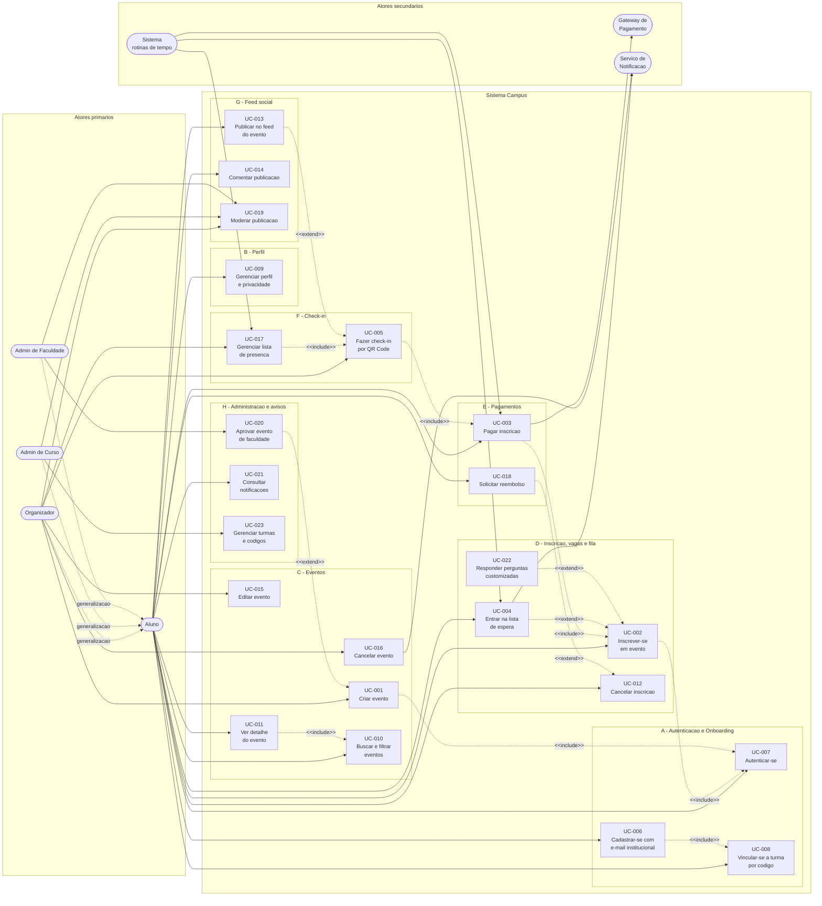

# Diagrama de casos de uso

**Responsável:** Ronaldo Veloso Filho · **Requisitos-fonte:** [`../02-requisitos.md`](../02-requisitos.md)

## 1. Atores

| Ator | Tipo | Descrição | Persona correspondente |
|---|---|---|---|
| **Aluno** | Primário, humano | Usuário verificado com vínculo acadêmico. Descobre, se inscreve, paga, entra no evento e publica | Marina Alves |
| **Organizador** | Primário, humano | **Papel** exercido por um Aluno sobre um evento que criou. Herda tudo de Aluno e acrescenta gestão do próprio evento | Rafael Souza, Beatriz Nakamura |
| **Admin de Curso** | Primário, humano | Aluno com atribuição administrativa em um curso: gerencia turmas e códigos, modera conteúdo do curso | — |
| **Admin de Faculdade** | Primário, humano | Atribuição administrativa na faculdade: aprova evento de alcance `FACULDADE` e modera qualquer conteúdo | — |
| **Gateway de Pagamento** | Secundário, externo | Serviço que processa Pix e cartão e notifica a confirmação. Nunca é acionado pela interface: participa por integração | — |
| **Serviço de Notificação** | Secundário, externo | Entrega push/e-mail. Consumido pelo sistema, não pelo usuário | — |
| **Sistema (rotinas de tempo)** | Secundário, interno | Ator técnico que representa as transições disparadas por prazo, sem intervenção humana: expiração de pagamento, expiração de oferta, marcação de ausente | — |

> **Decisão de modelagem.** `Organizador` é modelado como **generalização de Aluno**, não
> como ator independente. Isso reflete [RN-023](../04-regras-de-negocio.md): não existe
> cadastro de organizador — qualquer aluno passa a exercer o papel ao criar um evento.
> Modelar como ator separado sugeriria um tipo de conta que o sistema não tem, e a
> herança evita repetir 8 associações (ver, filtrar, inscrever-se, pagar, publicar…) em
> dois atores.

## 2. Diagrama

Os 22 casos de uso estão agrupados pelos módulos de [`../02-requisitos.md`](../02-requisitos.md).
Setas cheias são associações ator → caso de uso; setas pontilhadas são relações
`<<include>>` (obrigatória, sempre executa) e `<<extend>>` (opcional, executa sob
condição).

### Por que estas relações, e não outras

| Relação | Tipo | Justificativa |
|---|---|---|
| UC-002 → UC-007 | `include` | Não existe inscrição anônima: autenticar é passo obrigatório embutido, não alternativa |
| UC-003 → UC-002 | `include` | Pagar só existe a partir de uma participação criada. Pagamento avulso não é possível — não há "comprar ingresso" sem reservar vaga (RN-012) |
| UC-005 → UC-003 | `include` | Só há check-in de participação `CONFIRMADA`; em evento pago isso implica pagamento concluído (RN-017, condição 4) |
| UC-011 → UC-010 | `include` | Ver detalhe passa pela resolução de visibilidade do alcance, que é o mesmo mecanismo da busca (RN-001) |
| UC-006 → UC-008 | `include` | Conta sem vínculo acadêmico é inútil: o onboarding é parte do cadastro, não uma etapa opcional posterior (RF-005) |
| UC-017 → UC-005 | `include` | A lista de presença é construída a partir dos check-ins; sem eles não há o que gerenciar |
| UC-004 → UC-002 | `extend` | Entrar na fila é o **desvio condicional** da inscrição quando `vagasDisponiveis = 0` (RN-006). Não é um fluxo independente que o aluno escolhe |
| UC-022 → UC-002 | `extend` | Perguntas customizadas só ocorrem se o organizador as definiu, e **nunca** bloqueiam a reserva (RN-025) |
| UC-018 → UC-012 | `extend` | Reembolso é extensão do cancelamento, condicionada a existir pagamento confirmado e a política vigente (RN-013) |
| UC-013 → UC-005 | `extend` | Publicar no feed exige presença registrada (RN-019); é extensão do check-in, não obrigação |
| UC-020 → UC-001 | `extend` | Aprovação só entra no fluxo quando o alcance é `FACULDADE` e o organizador não é admin (RN-003) |

### Cobertura: caso de uso ↔ requisito

| UC | Nome | RFs cobertos |
|---|---|---|
| UC-001 | Criar evento | RF-010, RF-011, RF-012, RF-018 |
| UC-002 | Inscrever-se em evento | RF-019, RF-020, RF-022, RF-023 |
| UC-003 | Pagar inscrição | RF-028, RF-029, RF-030 |
| UC-004 | Entrar na lista de espera | RF-024, RF-025, RF-026, RF-027 |
| UC-005 | Fazer check-in por QR Code | RF-033, RF-034 |
| UC-006 | Cadastrar-se com e-mail institucional | RF-001, RF-002 |
| UC-007 | Autenticar-se | RF-003, RF-004 |
| UC-008 | Vincular-se a turma por código | RF-005, RF-008 |
| UC-009 | Gerenciar perfil e privacidade | RF-006, RF-007, RF-009 |
| UC-010 | Buscar e filtrar eventos | RF-015 |
| UC-011 | Ver detalhe do evento | RF-016, RF-036 |
| UC-012 | Cancelar inscrição | RF-021 |
| UC-013 | Publicar no feed do evento | RF-037 |
| UC-014 | Comentar publicação | RF-038 |
| UC-015 | Editar evento | RF-013 |
| UC-016 | Cancelar evento | RF-014 |
| UC-017 | Gerenciar lista de presença | RF-032, RF-035 |
| UC-018 | Solicitar reembolso | RF-031 |
| UC-019 | Moderar publicação | RF-042 |
| UC-020 | Aprovar evento de faculdade | RF-041 |
| UC-021 | Consultar notificações | RF-039, RF-040 |
| UC-022 | Responder perguntas customizadas | RF-017 |
| UC-023 | Gerenciar turmas e códigos | RF-043 |

Os 43 RFs estão cobertos por 23 casos de uso.

---

# 3. Especificações textuais dos casos de uso principais

Formato: ator primário, interessados, pré-condições, pós-condições, fluxo principal
numerado, fluxos alternativos e fluxos de exceção. Fluxo alternativo é caminho válido
diferente; fluxo de exceção é erro ou violação de regra.

---

## UC-001 — Criar evento

| Campo | Valor |
|---|---|
| **Identificador** | UC-001 |
| **Ator primário** | Organizador (Aluno que passa a exercer o papel) |
| **Atores secundários** | Admin de Faculdade (em `extend`, se alcance `FACULDADE`), Serviço de Notificação |
| **Interessados** | Organizador (quer divulgar para o público certo); Alunos do alcance (querem saber dos eventos que lhes dizem respeito); Admin de Faculdade (não quer spam institucional) |
| **Requisitos** | RF-010, RF-011, RF-012 · Regras: RN-001, RN-002, RN-003, RN-011 |
| **Frequência esperada** | 3 a 6 vezes por turma por semestre (premissa do grupo) |

**Pré-condições**

1. O usuário está autenticado (UC-007).
2. O usuário tem vínculo acadêmico completo — faculdade, curso e turma (UC-008).

**Pós-condições de sucesso**

1. Existe um `Evento` com `status = PUBLICADO` (ou `EM_APROVACAO`, se alcance
   `FACULDADE` e o organizador não for admin).
2. O usuário está registrado como `organizadorId` do evento.
3. O evento aparece na lista e no feed de todos os alunos do alcance, e de mais ninguém.
4. Os alunos do alcance recebem notificação de novo evento.
5. O organizador **não** está inscrito no próprio evento (RN-016).

**Pós-condição de falha:** nenhum evento é criado; nenhuma notificação é enviada; os
dados preenchidos são preservados na tela.

**Fluxo principal**

1. O Organizador aciona "Criar evento".
2. O sistema apresenta o formulário com o alcance pré-selecionado em `TURMA` (menor
   alcance é o padrão seguro) e os prazos sugeridos: `prazoInscricao = inicio - 2h`,
   `prazoCancelamento = inicio - 24h`.
3. O Organizador informa título, descrição, data e hora de início e fim, local e
   capacidade.
4. O Organizador escolhe o alcance entre `TURMA`, `CURSO` e `FACULDADE`.
5. O sistema valida que a âncora do alcance pertence ao vínculo do organizador (RN-001).
6. O Organizador informa o preço: gratuito ou valor em reais.
7. O Organizador ajusta os prazos de inscrição e de cancelamento, se quiser.
8. O Organizador aciona "Publicar evento".
9. O sistema valida a coerência dos prazos: `criadoEm < prazoInscricao <= inicio < fim`,
   `prazoCancelamento <= inicio`, `fim - inicio <= 7 dias` (RN-011).
10. O sistema valida a capacidade dentro de `[MIN_CAPACITY, MAX_CAPACITY]` = [2, 2000].
11. O sistema cria o evento com `status = PUBLICADO` e `organizadorId` = usuário atual.
12. O sistema enfileira notificação de novo evento para os alunos do alcance.
13. O sistema exibe o detalhe do evento criado e confirma com mensagem de sucesso.

**Fluxos alternativos**

- **A1 — Salvar como rascunho (RF-012).** No passo 8, o Organizador aciona "Salvar
  rascunho". O sistema valida apenas o título (obrigatório), cria o evento com
  `status = RASCUNHO`, não notifica ninguém, e retorna para a lista de eventos do
  organizador. O rascunho é visível apenas a ele. Retomando a edição, o fluxo continua
  do passo 3.
- **A2 — Alcance `FACULDADE` por aluno comum (RN-003 · `extend` UC-020).** No passo 11, se
  `alcance = FACULDADE` e o organizador não tem papel `ADMIN_FACULDADE`, o evento é criado
  com `status = EM_APROVACAO`. O sistema notifica os Admins de Faculdade e informa ao
  organizador que a publicação depende de aprovação. Nenhum aluno é notificado ainda. O
  fluxo continua em UC-020.
- **A3 — Duplicar evento existente (RF-018).** No passo 1, o Organizador escolhe
  "Duplicar" a partir de um evento seu. O sistema abre o formulário preenchido com todos
  os dados do original, exceto data, hora e participantes. O fluxo segue do passo 3.
- **A4 — Evento gratuito.** No passo 6, o Organizador marca "gratuito". O sistema
  desabilita os campos de pagamento e, na inscrição, as participações nascerão
  `CONFIRMADA` em vez de `PENDENTE_PAGAMENTO` (RF-019).
- **A5 — Perguntas customizadas (RF-017 · `extend` UC-022).** Entre os passos 7 e 8, o
  Organizador adiciona até 5 perguntas. O sistema as associa ao evento; elas serão
  apresentadas **após** a reserva da vaga (RN-025).

**Fluxos de exceção**

- **E1 — Campo obrigatório ausente.** No passo 9, título, início, fim, local ou
  capacidade em branco: o sistema marca cada campo faltante com mensagem específica, não
  cria o evento e mantém o preenchido. Retorna ao passo 3.
- **E2 — Prazos incoerentes.** No passo 9, alguma desigualdade de RN-011 é violada (ex.:
  `prazoInscricao > inicio`): o sistema informa qual regra falhou em texto claro
  ("o prazo de inscrição não pode ser depois do início do evento") e retorna ao passo 7.
- **E3 — Evento no passado.** No passo 9, `inicio <= agora`: o sistema recusa com
  "escolha uma data futura" e retorna ao passo 3.
- **E4 — Alcance fora do vínculo.** No passo 5, a âncora não pertence à hierarquia do
  organizador (ex.: aluno de Engenharia escolhendo o curso de Sistemas de Informação):
  o sistema não oferece a opção; se vier por requisição direta, responde `403` e registra
  a tentativa (RNF-012).
- **E5 — Capacidade inválida.** No passo 10, capacidade < 2 ou > 2000, ou não inteira:
  o sistema recusa com a faixa permitida e retorna ao passo 3.
- **E6 — Falha ao persistir.** No passo 11, erro de infraestrutura: nada é criado, o
  sistema informa falha temporária, oferece "tentar de novo" e preserva todo o
  formulário. Nenhuma notificação é enviada.
- **E7 — Sem vínculo de turma.** Pré-condição 2 não satisfeita: o sistema redireciona
  para o onboarding (UC-008) e retoma a criação depois.

---

## UC-002 — Inscrever-se em evento

| Campo | Valor |
|---|---|
| **Identificador** | UC-002 |
| **Ator primário** | Aluno |
| **Atores secundários** | Serviço de Notificação |
| **Interessados** | Aluno (quer a vaga); Organizador (quer contagem confiável); demais alunos (querem fila justa) |
| **Requisitos** | RF-019, RF-020, RF-022, RF-023 · Regras: RN-004, RN-006, RN-009, RN-015, RN-016 |
| **Frequência esperada** | Operação mais frequente do sistema |

**Pré-condições**

1. O Aluno está autenticado (UC-007) e tem vínculo acadêmico.
2. O evento está `PUBLICADO` e visível ao Aluno pelo alcance (RN-001).
3. `agora <= prazoInscricao` (RN-009).
4. O Aluno não tem participação ativa nesse evento (RN-015).

**Pós-condições de sucesso**

1. Existe uma `Participacao` do Aluno no evento com status:
   - `CONFIRMADA`, se o evento é gratuito;
   - `PENDENTE_PAGAMENTO` com `pagamentoExpiraEm` definido, se é pago.
2. `ocupadas` aumentou em exatamente 1, e `ocupadas <= capacidade` continua verdadeiro.
3. O Aluno vê o próprio estado na tela do evento, em vez do botão de inscrição.
4. Em evento gratuito, o ingresso com QR Code já está disponível (RF-033).

**Pós-condição de falha:** nenhuma participação criada; contador de vagas inalterado.

**Fluxo principal**

1. O Aluno abre o detalhe do evento (UC-011).
2. O sistema exibe a ocupação (`ocupadas`/`capacidade`), o prazo de inscrição, o preço e
   o botão principal com o rótulo adequado ao estado.
3. O Aluno aciona "Quero participar".
4. O sistema verifica, em **operação atômica**, que `vagasDisponiveis > 0` (RN-004).
5. O sistema verifica que o Aluno não tem participação ativa nesse evento (RN-015).
6. O sistema verifica que `agora <= prazoInscricao` (RN-009).
7. O sistema cria a `Participacao`:
   - evento gratuito → `CONFIRMADA`;
   - evento pago → `PENDENTE_PAGAMENTO` com
     `pagamentoExpiraEm = min(agora + 60min, prazoInscricao, inicio - 1h)` (RN-012).
8. O sistema incrementa o contador de ocupação do evento.
9. O sistema exibe confirmação: em evento gratuito, "inscrição confirmada" com acesso ao
   ingresso; em evento pago, a tela de pagamento (UC-003).
10. O sistema notifica o Organizador sobre a nova inscrição.

**Fluxos alternativos**

- **A1 — Evento lotado (`extend` UC-004).** No passo 4, `vagasDisponiveis = 0`: o sistema
  substitui a ação por "Entrar na lista de espera" e o fluxo segue em UC-004. Não é erro
  — é o desvio previsto por RN-006.
- **A2 — Perguntas customizadas (`extend` UC-022).** Após o passo 8, se o evento tem
  perguntas, o sistema as apresenta. Respostas ficam pendentes se o Aluno sair da tela; a
  vaga permanece reservada (RN-025).
- **A3 — Aluno é o organizador.** No passo 3, o organizador do evento pode se inscrever
  como qualquer outro e passa a ocupar vaga (RN-016).
- **A4 — Participação anterior encerrada.** No passo 5, o Aluno tem participação
  `CANCELADA` ou `EXPIRADA` nesse evento: a verificação passa (estado terminal não
  bloqueia) e uma **nova** participação é criada, preservando o histórico da anterior.

**Fluxos de exceção**

- **E1 — Concorrência pela última vaga (RNF-013).** Dois alunos acionam o passo 3 ao
  mesmo tempo com 1 vaga: a operação atômica confirma exatamente um. O outro recebe, sem
  recarregar a página, a oferta de lista de espera (A1). Em nenhum cenário
  `ocupadas > capacidade`.
- **E2 — Prazo de inscrição vencido.** No passo 6, `agora > prazoInscricao`: o sistema
  recusa com "inscrições encerradas em <data>", desabilita o botão e atualiza a tela.
- **E3 — Participação ativa já existente.** No passo 5, já existe participação ativa: o
  sistema não cria outra, informa o estado atual ("você já está confirmado") e atualiza a
  tela (RN-015).
- **E4 — Evento fora do alcance.** Pré-condição 2 falha, inclusive por acesso via ID
  direto: o sistema responde `403`/`404` sem revelar a existência do evento e registra a
  tentativa (RNF-012).
- **E5 — Evento cancelado.** No passo 4, o evento está `CANCELADO`: nenhuma inscrição é
  aceita; a tela mostra o motivo do cancelamento (RN-021).
- **E6 — Sessão expirada.** Em qualquer passo, sessão inválida: o sistema leva ao login
  (UC-007) e, após autenticar, retoma a inscrição do passo 3 sem perder o contexto.

---

## UC-003 — Pagar inscrição

| Campo | Valor |
|---|---|
| **Identificador** | UC-003 |
| **Ator primário** | Aluno |
| **Atores secundários** | Gateway de Pagamento (externo), Serviço de Notificação, Sistema (rotina de expiração) |
| **Interessados** | Aluno (quer a vaga garantida e prova de pagamento); Organizador (quer o dinheiro separado da conta pessoal); demais alunos da fila (querem a vaga liberada se não houver pagamento) |
| **Requisitos** | RF-028, RF-029, RF-030 · Regras: RN-012, RN-013, RN-014, RNF-022 |

**Pré-condições**

1. Existe `Participacao` do Aluno no evento com status `PENDENTE_PAGAMENTO`.
2. `agora < pagamentoExpiraEm`.
3. O evento tem `preco > 0`.

**Pós-condições de sucesso**

1. Existe um `Pagamento` com `status = CONFIRMADO`, método, valor e identificador da
   transação do gateway.
2. A `Participacao` está `CONFIRMADA` e o ingresso com QR Code está disponível.
3. O Aluno recebeu notificação de pagamento confirmado.
4. **Nenhum** dado de cartão foi armazenado pelo Campus (RNF-022).

**Pós-condição de falha:** a participação permanece `PENDENTE_PAGAMENTO` até a janela
expirar; nenhuma vaga extra é consumida.

**Fluxo principal**

1. O sistema apresenta a tela de pagamento com valor, prazo restante da janela e a
   **política de reembolso vigente** (RN-013).
2. O Aluno escolhe o método: Pix ou cartão.
3. O sistema solicita ao Gateway a criação da cobrança, informando valor, identificador
   da participação e chave de idempotência.
4. O Gateway responde com os dados da cobrança (código copia-e-cola e imagem do QR, no
   caso do Pix) e um identificador de transação.
5. O sistema grava o `Pagamento` com `status = AGUARDANDO` e o identificador da transação.
6. O sistema exibe as instruções de pagamento e a contagem de tempo restante.
7. O Aluno paga no aplicativo do banco (fora do Campus).
8. O Gateway envia a notificação de confirmação ao sistema.
9. O sistema valida a autenticidade da notificação (assinatura) e a idempotência pela
   chave da transação (RN-014).
10. O sistema muda o `Pagamento` para `CONFIRMADO` e a `Participacao` para `CONFIRMADA`.
11. O sistema emite o ingresso com QR Code (RF-033) e notifica o Aluno.
12. O sistema notifica o Organizador do pagamento recebido.

**Fluxos alternativos**

- **A1 — Pagamento com cartão.** No passo 2, escolhendo cartão, a captura dos dados
  acontece **no ambiente do Gateway** (redirect ou SDK). O Campus recebe apenas o
  identificador da transação e o status. O fluxo segue do passo 8.
- **A2 — Aluno consulta o status manualmente.** Entre os passos 7 e 8, o Aluno aciona
  "já paguei": o sistema consulta o Gateway ativamente. Se confirmado, segue do passo 10;
  se não, informa "ainda não identificamos seu pagamento" e mantém a janela.
- **A3 — Fecha o app durante a espera.** O fluxo continua sem o Aluno: a notificação do
  Gateway (passo 8) é processada de todo modo e a notificação de confirmação chega depois.
- **A4 — Pagamento após promoção da lista de espera.** A participação chega a
  `PENDENTE_PAGAMENTO` por confirmação de oferta (UC-004, A1) em vez de inscrição direta.
  O fluxo é idêntico, com a janela iniciando na confirmação da oferta.

**Fluxos de exceção**

- **E1 — Gateway indisponível na criação da cobrança.** No passo 3, sem resposta: nenhum
  `Pagamento` é gravado, a participação continua `PENDENTE_PAGAMENTO`, e o sistema
  informa "não foi possível gerar a cobrança agora" com opção de tentar de novo. A janela
  **não** é consumida por tentativa falhada — é estendida pelo tempo da indisponibilidade.
- **E2 — Pagamento recusado.** No passo 8, o Gateway informa recusa: `Pagamento` fica
  `RECUSADO`, a participação permanece `PENDENTE_PAGAMENTO` e o Aluno pode tentar outro
  método enquanto a janela durar.
- **E3 — Janela expirada sem pagamento (RN-012).** O ator **Sistema** detecta
  `agora > pagamentoExpiraEm`: a participação vira `EXPIRADA`, a vaga é liberada, a fila
  é acionada (UC-004) e o Aluno é notificado com o motivo.
- **E4 — Pagamento chega depois de expirar.** No passo 8, participação já `EXPIRADA` ou
  `CANCELADA`: o sistema **não** confirma. Solicita estorno ao Gateway, grava
  `Pagamento` como `ESTORNADO` e notifica o Aluno explicando que a vaga foi liberada e o
  valor devolvido (RN-012).
- **E5 — Notificação duplicada (RN-014).** A mesma notificação chega N vezes: a partir da
  segunda, o sistema reconhece a chave de idempotência, responde `200` e **não** repete
  transição nem notificação.
- **E6 — Notificação não autêntica.** No passo 9, assinatura inválida: o sistema descarta,
  responde `401` e registra o evento de segurança. Nada muda de estado.
- **E7 — Divergência de valor.** No passo 9, o valor pago difere do valor da cobrança: o
  sistema não confirma, marca `Pagamento` como `EM_ANALISE` e notifica o Organizador e o
  Aluno. Resolução manual — nunca confirmação automática de valor divergente.

---

## UC-004 — Entrar na lista de espera

| Campo | Valor |
|---|---|
| **Identificador** | UC-004 |
| **Ator primário** | Aluno |
| **Atores secundários** | Serviço de Notificação, Sistema (rotina de expiração de oferta) |
| **Interessados** | Aluno na fila (quer chance real e ordem justa); Organizador (quer o evento cheio); Aluno que desistiu (quer que a vaga seja aproveitada) |
| **Requisitos** | RF-024, RF-025, RF-026, RF-027 · Regras: RN-006, RN-007, RN-008, RN-009 |
| **Relação** | `extend` de UC-002, acionado quando `vagasDisponiveis = 0` |

**Pré-condições**

1. O Aluno está autenticado, com vínculo, e o evento é visível a ele.
2. `vagasDisponiveis = 0` e o evento está `PUBLICADO`.
3. `agora <= prazoInscricao` (RN-009).
4. O Aluno não tem participação ativa nesse evento (RN-015).

**Pós-condições de sucesso**

1. Existe `Participacao` com `status = LISTA_ESPERA` e `posicaoFila` igual ao fim da fila.
2. `ocupadas` **não** mudou — lista de espera não ocupa vaga (RN-004).
3. O Aluno vê a própria posição na fila.

**Fluxo principal**

1. O Aluno abre o detalhe do evento e vê a ocupação em `capacidade/capacidade`, com o
   aviso de lista de espera ativa.
2. O sistema exibe o botão "Entrar na lista de espera" e o tamanho atual da fila.
3. O Aluno aciona o botão.
4. O sistema verifica prazo (RN-009) e ausência de participação ativa (RN-015).
5. O sistema calcula `posicaoFila = (maior posição atual da fila) + 1`.
6. O sistema cria a `Participacao` com `LISTA_ESPERA` e a posição calculada.
7. O sistema exibe "você é o Nº da fila" e explica que, ao surgir vaga, terá 24 h para
   confirmar.
8. O sistema notifica o Organizador de que há demanda acima da capacidade.

**Fluxo de promoção (disparado por evento externo, não pelo Aluno)**

Este é o coração de RN-007. Ele começa quando uma vaga é liberada — por cancelamento
(UC-012), por expiração de pagamento (UC-003 E3) ou por aumento de capacidade (UC-015).

1. O sistema detecta a liberação de vaga.
2. Se a fila está vazia → a vaga volta ao pool para inscrição normal. Fim.
3. O sistema seleciona a participação com **menor** `posicaoFila` em `LISTA_ESPERA`.
4. O sistema muda o status para `OFERTA_PENDENTE` e define
   `ofertaExpiraEm = min(agora + 24h, inicio - 1h)`.
5. A vaga fica **reservada** para essa oferta e não é oferecida a mais ninguém.
6. O sistema decrementa em 1 a `posicaoFila` de todos os demais da fila.
7. O sistema notifica o Aluno com o prazo explícito para confirmar.

**Fluxos alternativos**

- **A1 — Aluno confirma a oferta dentro da janela.** A participação vai para
  `CONFIRMADA` (evento gratuito) ou `PENDENTE_PAGAMENTO` (evento pago, iniciando a janela
  de RN-012 e seguindo para UC-003). A vaga reservada passa a ser ocupada de fato.
- **A2 — Aluno recusa a oferta explicitamente.** A participação vira `CANCELADA`, e o
  processo de promoção recomeça imediatamente para o próximo da fila.
- **A3 — Aluno sai da fila por escolha (RF-027).** A participação em `LISTA_ESPERA` vira
  `CANCELADA` e todas as posições posteriores avançam em 1. `ocupadas` não muda.
- **A4 — Capacidade aumentada em N vagas (RN-005).** O processo de promoção executa N
  vezes em sequência, emitindo N ofertas para os N primeiros da fila.

**Fluxos de exceção**

- **E1 — Oferta expira sem resposta (RN-008).** O ator **Sistema** detecta
  `agora > ofertaExpiraEm`: participação vira `EXPIRADA`, o Aluno é notificado, e o
  processo de promoção recomeça do passo 1 para o próximo da fila. Nenhuma punição: o
  Aluno pode entrar na fila novamente, no fim dela.
- **E2 — Janela de oferta ultrapassaria o início do evento (RN-007, item 5).** No passo 4,
  a janela é truncada para `inicio - 1h`. Se isso resultar em janela menor que 15 min, a
  oferta **não** é emitida: a vaga volta ao pool e a fila é notificada de que o evento
  está com vaga aberta, por ordem de chegada.
- **E3 — Prazo de inscrição vencido ao entrar na fila.** No passo 4, `agora >
  prazoInscricao`: o sistema recusa a entrada na fila. Ofertas já emitidas continuam
  válidas, e a promoção interna continua funcionando (RN-009).
- **E4 — Evento cancelado com fila ativa (RN-022).** Todas as participações em
  `LISTA_ESPERA` e `OFERTA_PENDENTE` viram `CANCELADA`, com notificação e motivo.
- **E5 — Aluno perde o vínculo do alcance enquanto está na fila.** A participação é
  mantida (exceção deliberada de RN-001), mas se a promoção ocorrer o sistema revalida o
  vínculo; se ele não existir mais, a participação vira `CANCELADA` com motivo
  `VINCULO_PERDIDO` e a oferta passa ao próximo.

---

## UC-005 — Fazer check-in por QR Code

| Campo | Valor |
|---|---|
| **Identificador** | UC-005 |
| **Ator primário** | Organizador (opera a leitura) |
| **Atores secundários** | Aluno (apresenta o ingresso), Admin de Curso / Admin de Faculdade (podem operar) |
| **Interessados** | Aluno (quer entrar rápido); Organizador (quer porta fluindo e presença real); demais participantes (não querem fila) |
| **Requisitos** | RF-033, RF-034 · Regras: RN-017, RN-018 · RNF-011 |
| **Restrição de desempenho** | Cada leitura deve resolver em menos de 2 s para a porta não travar |

**Pré-condições**

1. A `Participacao` do Aluno está `CONFIRMADA`.
2. `agora ∈ [inicio - 4h, fim + 2h]` (RN-017, condição 3).
3. Quem opera a leitura é o Organizador do evento ou um admin do escopo.
4. **Nenhuma** `Presenca` registrada para essa participação (RN-018).

**Pós-condições de sucesso**

1. Existe uma `Presenca` com `checkinEm`, `registradoPorId` e `participacaoId`.
2. A `Participacao` está `PRESENTE`.
3. O token do QR daquela participação não é mais aceito.
4. O Aluno passa a poder publicar no feed do evento (RN-019, `extend` UC-013).

**Fluxo principal**

1. O Organizador abre a tela de check-in do seu evento.
2. O sistema mostra o contador "presentes / confirmados" e ativa a câmera.
3. O Aluno apresenta o ingresso com o QR Code (`/ingresso/:id`).
4. O Organizador enquadra o QR; o sistema lê o token.
5. O sistema valida a assinatura HMAC do token (RN-017, condição 1).
6. O sistema valida que o `eventoId` do token é o do evento aberto (condição 2).
7. O sistema valida a janela temporal de check-in (condição 3).
8. O sistema valida que a participação está `CONFIRMADA` (condição 4).
9. O sistema valida que não existe `Presenca` para essa participação (condição 5).
10. O sistema cria a `Presenca` e muda a participação para `PRESENTE`.
11. O sistema exibe confirmação **verde** com nome e foto do Aluno, e atualiza o contador.
12. O sistema notifica o Aluno do check-in realizado.

**Fluxos alternativos**

- **A1 — Check-in por código numérico (contingência de D-06).** Sem câmera funcional ou
  QR ilegível, o Organizador digita o código de 8 dígitos exibido no ingresso. As
  validações dos passos 5 a 9 são idênticas.
- **A2 — Vários operadores em paralelo.** Dois membros da organização leem QRs ao mesmo
  tempo. A verificação do passo 9 é atômica por participação: dois check-ins simultâneos
  do **mesmo** ingresso resultam em um aceito e um recusado por "já utilizado".
- **A3 — Check-in de participação com respostas pendentes.** Perguntas customizadas não
  respondidas não bloqueiam o check-in (RN-025). O sistema apenas sinaliza ao Organizador.
- **A4 — Busca manual pelo nome.** Sem ingresso no celular, o Organizador busca o nome na
  lista de presença (UC-017) e confirma a presença manualmente. A `Presenca` recebe
  `metodo = MANUAL` — distinguível de check-in por QR para auditoria.

**Fluxos de exceção**

Cada recusa exibe motivo **específico**. Mensagem genérica na porta é falha operacional.

- **E1 — Ingresso já utilizado.** Passo 9 falha: "ingresso já utilizado às 20h14" com
  nome de quem entrou. Nenhuma segunda `Presenca` é criada (RN-018).
- **E2 — Token adulterado.** Passo 5 falha: "ingresso inválido"; o sistema registra a
  tentativa como evento de segurança (RNF-011).
- **E3 — Ingresso de outro evento.** Passo 6 falha: "este ingresso é do evento
  <nome>", evitando que o operador conclua erradamente que o ingresso é falso.
- **E4 — Check-in ainda não abriu.** Passo 7 falha por antecedência: "o check-in abre às
  <hora>".
- **E5 — Check-in encerrado.** Passo 7 falha por atraso: "o check-in encerrou às <hora>";
  liberar a entrada passa a ser decisão do organizador, fora do sistema.
- **E6 — Participação não confirmada.** Passo 8 falha: mensagem conforme o estado —
  "pagamento pendente", "inscrição cancelada" ou "vaga expirada".
- **E7 — Operador sem permissão.** Pré-condição 3 falha: `403`, sem revelar dados do
  participante (RN-024).
- **E8 — Sem conexão na porta.** O sistema valida localmente assinatura e janela temporal
  do token e enfileira o registro da presença, marcando `sincronizado = false`.
  A verificação de uso único é reconciliada ao voltar a conexão; conflito detectado é
  reportado ao Organizador com os dois horários. Escopo do CP6 (RFX-11).
- **E9 — Evento cancelado.** Nenhum check-in é aceito; a tela mostra o cancelamento e o
  motivo (RN-021).
