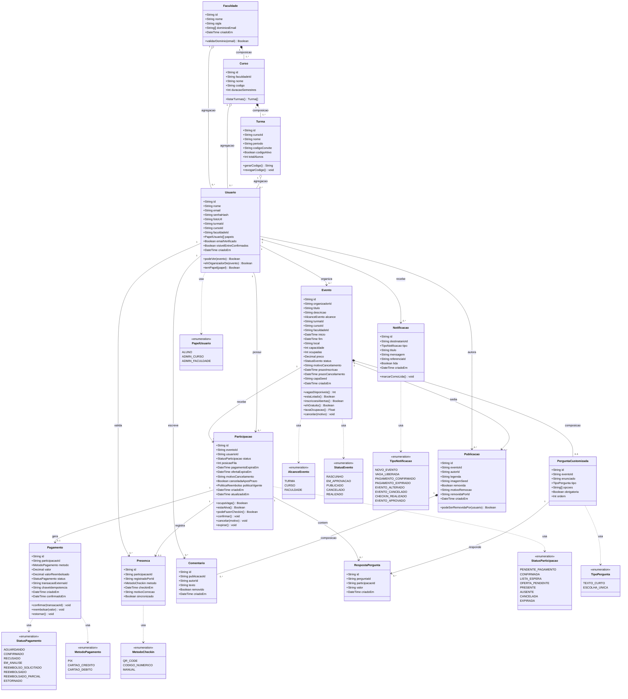

# Diagrama de classes

**Responsável:** Ronaldo Veloso Filho
**Espelhado em código:** [`app/src/types/domain.ts`](../../app/src/types/domain.ts) — divergência
entre este diagrama e aquele arquivo é defeito, não detalhe.

## 1. Diagrama

## 2. O que o diagrama mostra e por que foi modelado assim

O modelo é organizado em três blocos, e a fronteira entre eles é o que sustenta as
regras de negócio.

**Bloco acadêmico** (`Faculdade` → `Curso` → `Turma` → `Usuario`) é a espinha dorsal. É
o que torna possível a regra central do produto — alcance segmentado ([RN-001](../04-regras-de-negocio.md)) —
sem inventar um conceito paralelo de "grupo". Faculdade e Curso, e Curso e Turma, estão
em **composição** (`*--`): um curso não existe fora de uma faculdade, e apagar a
faculdade apaga seus cursos. `Usuario` está em **agregação** (`o--`) com Turma: o aluno
existe independentemente da turma (pode trocar de turma pelo RF-008 e continuar sendo o
mesmo usuário, com o mesmo histórico).

**Bloco de participação** (`Evento` → `Participacao` → `Pagamento` / `Presenca`) é onde
mora a complexidade. Ver as decisões 1 a 4 abaixo.

**Bloco social** (`Publicacao` → `Comentario`) é deliberadamente simples e sempre
pendurado em um evento, porque publicação sem evento seria rede social — fora de escopo
(RFX-01, RFX-02). `Comentario` está em composição com `Publicacao`: remover a publicação
remove seus comentários.

### Decisão 1 — `Participacao` é entidade própria, não tabela de junção

O caminho ingênuo seria uma tabela `evento_usuario` com um campo de status. Foi recusado
porque a relação aluno-evento tem **história e ciclo de vida próprios**: nasce
`PENDENTE_PAGAMENTO` ou `LISTA_ESPERA`, muda de posição na fila, recebe oferta com prazo,
expira, gera pagamento, gera presença, e é a base do reembolso.

`Participacao` guarda `posicaoFila`, `pagamentoExpiraEm`, `ofertaExpiraEm`,
`canceladaAposPrazo` e `politicaVigente` — cinco atributos que não pertencem nem ao
`Usuario` nem ao `Evento`. Ela também é o ponto de ancoragem de `Pagamento`, `Presenca`
e `RespostaPergunta`: sem entidade própria, os três não teriam onde se ligar.

Consequência prática: **um** identificador (`participacaoId`) resolve ingresso, QR Code,
pagamento e presença. Ver [ADR-0004](../adr/0004-participacao-como-entidade-propria.md).

### Decisão 2 — `politicaVigente` congelada na participação

`Participacao.politicaVigente` guarda a política de reembolso **do momento do pagamento**,
não uma referência ao evento. Se o organizador mudar a política depois, quem já pagou
mantém a que aceitou ([RN-013](../04-regras-de-negocio.md)). Uma referência viva ao
evento permitiria alterar retroativamente o direito de quem já pagou.

### Decisão 3 — `Organizador` não é classe

Não existe classe `Organizador`, nem subclasse de `Usuario`. O papel é expresso pela
associação `Usuario "1" --> "0..*" Evento : organiza` e pelo método
`Usuario.ehOrganizadorDe(evento)`.

Motivo: `Organizador` como subclasse implicaria que a pessoa **é** de um tipo, e que
"virar organizador" é uma mudança de identidade. No domínio real, qualquer aluno cria um
evento a qualquer momento, e as permissões de organizador valem só naquele evento
([RN-023](../04-regras-de-negocio.md)). Papéis administrativos, ao contrário, são atributo
do usuário (`papeis: PapelUsuario[]`) porque valem sobre um escopo inteiro, não sobre um
objeto.

### Decisão 4 — `Presenca` é 1:1 com `Participacao`, e separada dela

Poderia ser um par de campos em `Participacao` (`checkinEm`, `registradoPorId`). Ficou
como entidade porque presença é **fato com autoria**: quem validou, quando, por qual
método, e — no caso de correção — por qual motivo ([RN-018](../04-regras-de-negocio.md)).
Fato auditável merece registro próprio e imutável; campo em outra entidade convida a ser
sobrescrito.

A multiplicidade `0..1` expressa exatamente a regra de uso único do QR Code: não existe
segunda presença para a mesma participação.

### Decisão 5 — Alcance como enum + três âncoras nulas

`Evento` tem `alcance: AlcanceEvento` e os três campos `turmaId`, `cursoId`,
`faculdadeId`, dos quais **exatamente um** é preenchido, coerente com o enum.

A alternativa "polimórfica" (uma classe `Escopo` com subclasses `EscopoTurma`,
`EscopoCurso`, `EscopoFaculdade`) foi recusada: três subclasses sem comportamento
próprio, só para carregar um identificador, complicam a consulta mais frequente do
sistema (listar eventos visíveis) sem ganho algum. A invariante fica garantida por
`CHECK` no banco e por tipo discriminado no TypeScript. Ver
[ADR-0005](../adr/0005-alcance-como-enum-com-ancora-condicional.md).

### Decisão 6 — `ocupadas` denormalizado em `Evento`

`Evento.ocupadas` é contagem derivada (poderia ser `COUNT` das participações que ocupam
vaga). Está materializada porque é lida em toda listagem e em todo detalhe, e porque a
verificação atômica de [RN-004](../04-regras-de-negocio.md) precisa de um valor sobre o
qual travar. Consistência garantida por atualização na mesma transação da participação;
uma rotina de reconciliação confere o valor periodicamente.

### Decisão 7 — Enums, não *strings* livres

Nove enumerações substituem campos de texto livre. Isso torna impossível existir
`status = "confirmado "` com espaço, ou `"pago"` em um lugar e `"CONFIRMADO"` em outro —
e faz o diagrama de estados ([`06-diagrama-estados.md`](06-diagrama-estados.md)) ser
verificável contra o código.

## 3. Multiplicidades e o que cada uma proíbe

| Associação | Multiplicidade | O que a multiplicidade impede |
|---|---|---|
| `Faculdade` — `Curso` | 1 : 1..* | Curso órfão; faculdade sem curso nenhum |
| `Curso` — `Turma` | 1 : 1..* | Turma sem curso |
| `Turma` — `Usuario` | 1 : 0..* | Usuário em duas turmas ao mesmo tempo (v1) |
| `Usuario` — `Evento` (organiza) | 1 : 0..* | Evento sem organizador; evento com dois organizadores (v1) |
| `Usuario` — `Participacao` | 1 : 0..* | Participação sem dono |
| `Evento` — `Participacao` | 1 : 0..* | Participação sem evento |
| `Participacao` — `Pagamento` | 1 : 0..1 | Duas cobranças para a mesma vaga; pagamento avulso sem participação |
| `Participacao` — `Presenca` | 1 : 0..1 | **Check-in duplo** — é a expressão estrutural de [RN-018](../04-regras-de-negocio.md) |
| `Evento` — `PerguntaCustomizada` | 1 : 0..5 | Mais de 5 perguntas (`MAX_CUSTOM_QUESTIONS`) |
| `PerguntaCustomizada` — `RespostaPergunta` | 1 : 0..* | Resposta sem pergunta |
| `Participacao` — `RespostaPergunta` | 1 : 0..* | Resposta sem participação |
| `Evento` — `Publicacao` | 1 : 0..* | Publicação sem evento (feed solto) |
| `Publicacao` — `Comentario` | 1 : 0..* | Comentário órfão |

Restrição adicional que a multiplicidade **não** expressa e por isso vive como
invariante: *no máximo uma participação **ativa** por (evento, usuário)*
([RN-015](../04-regras-de-negocio.md)). Participações terminais podem se acumular para o
mesmo par — é o histórico.

## 4. Métodos e onde ficam no código

Os métodos do diagrama não são "getters": cada um encapsula uma regra de negócio. No
app React eles são funções puras da camada de domínio, não métodos de instância — a
tradução está aqui para que o diagrama continue verificável.

| Método no diagrama | Implementação | Regra |
|---|---|---|
| `Evento.vagasDisponiveis()` | `domain/capacity.ts → availableSpots(event)` | RN-004 |
| `Evento.estaLotado()` | `domain/capacity.ts → isFull(event)` | RN-006 |
| `Evento.inscricoesAbertas()` | `domain/deadlines.ts → enrollmentOpen(event, now)` | RN-009 |
| `Evento.taxaOcupacao()` | `domain/capacity.ts → occupancyRate(event)` | — |
| `Evento.cancelar(motivo)` | `domain/event.ts → cancelEvent(event, reason)` | RN-021, RN-022 |
| `Participacao.ocupaVaga()` | `domain/capacity.ts → occupiesSpot(status)` | RN-004 |
| `Participacao.estaAtiva()` | `domain/participation.ts → isActive(status)` | RN-015 |
| `Participacao.podeFazerCheckin()` | `domain/checkin.ts → canCheckIn(participation, event, now)` | RN-017 |
| `Pagamento.confirmar(id)` | `domain/payment.ts → confirmPayment(payment, txId)` | RN-014 |
| `Pagamento.reembolsar(v)` | `domain/refund.ts → computeRefund(...)` | RN-013 |
| `Usuario.podeVer(evento)` | `domain/visibility.ts → canSee(user, event)` | RN-001 |
| `Usuario.ehOrganizadorDe(e)` | `domain/permissions.ts → isOrganizer(user, event)` | RN-023 |
| `Publicacao.podeSerRemovidaPor(u)` | `domain/moderation.ts → canRemove(user, post, event)` | RN-020 |
| `Faculdade.validarDominio(e)` | `domain/auth.ts → isInstitutionalEmail(email, college)` | RF-002 |
| `Turma.gerarCodigo()` | `domain/classGroup.ts → generateInviteCode()` | RF-043 |

## 5. Atributos que **não** existem, de propósito

| Atributo ausente | Por quê |
|---|---|
| `Usuario.cpf`, `.telefone`, `.endereco`, `.dataNascimento` | Minimização de dados pessoais (RNF-020). Nada disso é necessário para o produto funcionar |
| `Pagamento.numeroCartao`, `.cvv`, `.titular` | Dado de cartão nunca entra no nosso modelo (RNF-022). Guardamos só `transacaoExternaId` |
| `Evento.imagemUrl` (arquivo enviado) | Na v1 a capa é gerada localmente a partir de `capaSeed`, sem *upload* nem armazenamento de mídia — evita dependência de storage e de moderação de imagem no CP4/CP5 |
| `Participacao.senhaIngresso` | O token do QR é derivado por HMAC no servidor, não armazenado (RN-017) |
| `Usuario.tipo` | Não existe tipo de usuário: papéis são lista, e organizador é relação (RN-023) |
| `Evento.aprovadoPorId` | Registrado na `Notificacao` de tipo `EVENTO_APROVADO` e no log de auditoria; não polui a entidade principal |
