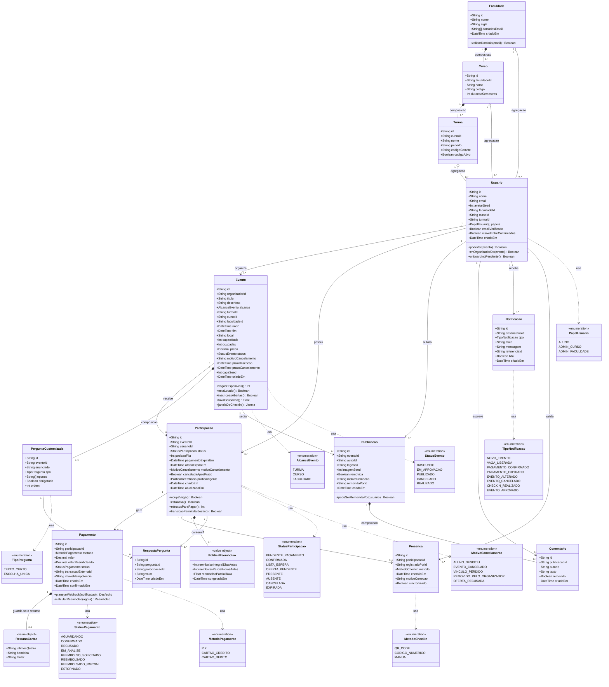

# Diagrama de classes

**Responsável:** Ronaldo Veloso Filho
**Espelhado em código:** [`packages/shared/src/types.ts`](../../packages/shared/src/types.ts)
— divergência entre este diagrama e aquele arquivo é defeito, não detalhe.
`app/src/types/domain.ts` continua existindo, como reexportação de uma linha.

## Histórico de revisões

| Versão | Data | Checkpoint | O que mudou |
|---|---|---|---|
| 1.0 | 2026-09-01 | CP4 | 13 classes de entidade (o texto dizia 14), 9 enumerações, atributos tipados, multiplicidades, composição e agregação, e sete decisões de modelagem |
| 2.0 | 2026-09-02 | CP5 | O documento passa a separar **três categorias de tipo** em dois diagramas: entidade persistida, projeção de leitura e entrada de escrita. Corrigidos cinco atributos que o código nunca teve (`Usuario.senhaHash`, `Usuario.fotoUrl`, `Turma.totalAlunos`) ou que tinham tipo errado (`capaSeed`, `imagemSeed`). Enumerações vão de 9 para **15**. `PoliticaReembolso` e `ResumoCartao` entram como objetos-valor. A tabela "método → implementação" foi refeita: **cinco linhas apontavam para arquivos que não existem** |
| 3.0 | 2026-09-02 | CP6 | **Todos os caminhos mudaram**: os tipos e os 13 módulos de regra migraram de `app/src/domain/` para `packages/shared/src/` ([ADR-0008](../adr/0008-monorepo-com-dominio-compartilhado.md)), e as 16 linhas da tabela "método → implementação" foram reapontadas. Três dos métodos removidos no CP5 **voltam**, porque o CP6 lhes deu endpoint: `Evento.cancelar`, `Turma.gerarCodigo` e a transição de `Participacao`. A seção 6 registra que `Usuario.senhaHash` deixou de ser "alvo do CP6": a coluna existe, e continua fora do tipo do cliente de propósito |

## 0. Três categorias de tipo, e por que não vão no mesmo diagrama

`packages/shared/src/types.ts` declara 45 tipos. Jogar todos em um `classDiagram` produziria a
impressão — falsa e caríssima — de que cada um é uma tabela. As três categorias têm ciclos
de vida, donos e destinos completamente diferentes:

| Categoria | O que é | Quantos | Tem tabela? | Onde está neste documento |
|---|---|---|---|---|
| **Entidade persistida** | Tem identidade própria, sobrevive à requisição, tem linha no banco | 13 | Sim, uma tabela cada | Diagrama 1 |
| **Objeto-valor** | Não tem identidade; é um pedaço de estado de outra coisa | 3 | Coluna(s) da entidade dona, nunca tabela | Diagrama 1, com `<<value object>>` |
| **Projeção de leitura** | O que a API **devolve** para a tela, com relacionamento já resolvido | 10 + 1 união | Não. É `SELECT` com `JOIN`, ou serializador | Diagrama 2 |
| **Entrada de escrita / filtro** | O que a tela **envia**. Vive o tempo de uma requisição | 7 + 3 filtros | Não. É corpo de requisição ou *query string* | Diagrama 2 |

> **Treze entidades aqui, quatorze tabelas no ER — e a diferença é deliberada.** A tabela
> `sessao` do CP6 ([`03-modelo-dados-er.md` §4b](03-modelo-dados-er.md#2-o-que-o-diagrama-mostra-e-por-que-assim))
> **não** tem tipo em `packages/shared/src/types.ts`, e não deve ter: o `refresh_hash` nunca
> atravessa a rede, e um tipo compartilhado é, por definição, um tipo que os dois lados
> conhecem. Estado que só o servidor conhece pertence ao Prisma, não ao pacote.
>
> Não confundir com `SessaoUsuario`, que existe e é **projeção**: usuário + faculdade +
> curso + turma resolvidos, o que `GET /sessao` devolve. Os dois nomes são parecidos e as
> duas coisas são opostas — uma é o segredo que fica no servidor, a outra é o que a tela
> recebe.

A regra que separa as duas últimas da primeira é simples e verificável: **se o tipo
`extends` uma entidade, ou se compõe pedaços de várias, é projeção.** `EventoView extends
Evento` acrescenta `organizador`, `alcanceRotulo`, `vagasDisponiveis`, `taxaOcupacao`,
`inscricoesAbertas`, `totalListaEspera` e `minhaParticipacao` — sete campos que **não
existem no banco**: cinco são derivados e dois são `JOIN`. Modelá-los como colunas seria
criar sete lugares para desalinhar.

> Um detalhe honesto sobre esses cinco: quatro saem de funções de domínio
> (`availableSpots`, `enrollmentOpen`, `waitlistSize`, `alcanceRotulo`) e `taxaOcupacao` é
> calculada em linha dentro de `toEventoView`, embora
> `domain/capacity.ts#occupancyRate` exista para isso. É divergência pequena e real —
> registrada aqui em vez de arredondada.

---

## 1. Entidades persistidas, objetos-valor e enumerações

### As outras cinco enumerações

`MOTIVO_RECUSA_INSCRICAO`, `MOTIVO_RECUSA_LOGIN`, `MOTIVO_RECUSA_ONBOARDING`,
`MOTIVO_RECUSA_CHECKIN` e `DESFECHO_SIMULADO` **não estão no diagrama acima de propósito**:
nenhuma é atributo de entidade. Elas tipam o **corpo da resposta** de uma decisão recusada
(o campo `erro` do `422`, do `409` ou do `200 aceito: false`) e o gatilho da simulação de
gateway. Estão no diagrama 2, onde vivem as formas de conversa com a tela.

Total de enumerações no código: **15**. Dez são atributo de entidade; cinco são vocabulário
de resposta.

---

## 2. Projeções de leitura e entradas de escrita

Nenhum tipo deste diagrama tem tabela, `id` próprio ou ciclo de vida. Ele existe porque a
tela conversa com estes tipos, não com os do diagrama 1 — e porque confundir os dois é o
erro mais caro deste modelo.

```mermaid
classDiagram
    direction LR

    class EventoView {
        <<projection>>
        +Evento tudo
        +Pick~Usuario~ organizador
        +String alcanceRotulo
        +Int vagasDisponiveis
        +Float taxaOcupacao
        +Boolean inscricoesAbertas
        +Int totalListaEspera
        +Participacao minhaParticipacao
    }

    class ParticipacaoView {
        <<projection>>
        +Participacao tudo
        +Pick~Evento~ evento
        +Pagamento pagamento
        +Presenca presenca
    }

    class PagamentoView {
        <<projection>>
        +Pagamento tudo
        +CobrancaPix pix
        +ResumoCartao cartao
        +Int minutosRestantes
    }

    class PublicacaoView {
        <<projection>>
        +Publicacao tudo
        +Pick~Usuario~ autor
        +Pick~Evento~ evento
        +Comentario[] comentarios
    }

    class PresencaView {
        <<projection>>
        +Presenca tudo
        +Pick~Usuario~ participante
    }

    class SessaoUsuario {
        <<projection>>
        +Usuario usuario
        +Faculdade faculdade
        +Curso curso
        +Turma turma
    }

    class PainelCheckin {
        <<projection>>
        +Pick~Evento~ evento
        +Boolean abertoAgora
        +DateTime abreEm
        +DateTime fechaEm
        +Int confirmados
        +Int presentes
        +PresencaView[] presencas
    }

    class TokenIngresso {
        <<projection>>
        +String valor
        +String codigoNumerico
        +String codigoLegivel
        +DateTime emitidoEm
    }

    class ResultadoLogin {
        <<projection>>
        +String token
        +SessaoUsuario sessao
    }

    class ResultadoCheckin {
        <<projection>>
        +Boolean aceito
        +MotivoRecusaCheckin motivo
        +String mensagem
        +Participante participante
        +DateTime registradoEm
    }

    class ResultadoInscricao {
        <<union>>
        CONFIRMADA
        PENDENTE_PAGAMENTO
        SEM_VAGA com acao LISTA_ESPERA
        RECUSADA com MotivoRecusaInscricao
    }

    class CobrancaPix {
        <<value object>>
        +String chave
        +String brCode
        +DateTime expiraEm
    }

    class Credenciais {
        <<input>>
        +String email
        +String senha
    }

    class EntradaOnboarding {
        <<input>>
        +String cursoId
        +String codigoConvite
    }

    class NovoEvento {
        <<input>>
        +String titulo
        +String descricao
        +AlcanceEvento alcance
        +DateTime inicio
        +DateTime fim
        +String local
        +Int capacidade
        +Decimal preco
        +DateTime prazoInscricao
        +DateTime prazoCancelamento
        +Boolean publicar
    }

    class NovoPagamento {
        <<input>>
        +MetodoPagamento metodo
        +ResumoCartao cartao
    }

    class NovaPublicacao {
        <<input>>
        +String eventoId
        +String legenda
        +Int imagemSeed
    }

    class NovoComentario {
        <<input>>
        +String texto
    }

    class FiltroEventos {
        <<input>>
        +FiltroAlcance alcance
        +FiltroPreco preco
        +FiltroPeriodo periodo
        +String busca
    }

    class MotivoRecusaLogin {
        <<enumeration>>
        DOMINIO_NAO_INSTITUCIONAL
        CREDENCIAL_INVALIDA
        EMAIL_NAO_VERIFICADO
    }

    class MotivoRecusaOnboarding {
        <<enumeration>>
        CURSO_INEXISTENTE
        CODIGO_INVALIDO
        CODIGO_INATIVO
        CODIGO_DE_OUTRO_CURSO
    }

    class MotivoRecusaInscricao {
        <<enumeration>>
        PRAZO_ENCERRADO
        JA_INSCRITO
        EVENTO_CANCELADO
        FORA_DO_ALCANCE
        EVENTO_NAO_PUBLICADO
    }

    class MotivoRecusaCheckin {
        <<enumeration>>
        TOKEN_INVALIDO
        OUTRO_EVENTO
        AINDA_NAO_ABRIU
        JA_ENCERROU
        JA_UTILIZADO
        NAO_CONFIRMADA
        SEM_PERMISSAO
        EVENTO_CANCELADO
    }

    class DesfechoSimulado {
        <<enumeration>>
        CONFIRMAR
        RECUSAR
        DUPLICAR
    }

    EventoView ..> ParticipacaoView : irmas, nao herdeiras
    PagamentoView *-- CobrancaPix : derivada, nao armazenada
    PagamentoView ..> ResumoCartao : reflete o que foi guardado
    ParticipacaoView ..> PagamentoView : mesma participacao
    PainelCheckin *-- PresencaView : lista do organizador
    ResultadoLogin *-- SessaoUsuario : o que a store recebe
    ResultadoCheckin ..> MotivoRecusaCheckin : recusa tipada
    ResultadoInscricao ..> MotivoRecusaInscricao : recusa tipada
    Credenciais ..> MotivoRecusaLogin : decideLogin recusa com isto
    EntradaOnboarding ..> MotivoRecusaOnboarding : decideOnboarding recusa com isto
    NovoPagamento *-- ResumoCartao : so o resumo sai do formulario
    NovoPagamento ..> DesfechoSimulado : gatilho do gateway simulado
```

### O que ler neste diagrama

**As projeções não herdam umas das outras.** `EventoView` e `ParticipacaoView` são irmãs:
cada uma `extends` a entidade correspondente e compõe pedaços das outras com `Pick<>`. O
`Pick<>` é a parte importante — `EventoView.organizador` é
`Pick<Usuario, 'id' | 'nome' | 'avatarSeed'>`, **não** `Usuario`. A projeção carrega o mínimo
que a tela desenha, e nada mais: mandar o `Usuario` inteiro exporia `email` de um organizador
a todo mundo que abre a lista de eventos.

**`CobrancaPix` é objeto-valor derivado, e por isso está com `*--`.** Ela é recalculada por
`gerarCobrancaPix` a cada leitura ([RN-028](../04-regras-de-negocio.md)) e não existe em
`db.ts`. Aparece em `PagamentoView` e em lugar nenhum mais.

**`ResumoCartao` aparece três vezes, e é o único tipo que atravessa as três categorias.**
Ver a decisão 9.

**As quatro enumerações de recusa são vocabulário de resposta.** Elas garantem que o código
que a API põe no campo `erro` e o código que a tela testa em `ApiError.codigo` saem do mesmo
conjunto. Sem isso, `if (erro.codigo === 'SEM_VAGA')` seria comparação de literal solto — e
um erro de digitação passaria pelo compilador.

---

## 3. O que o diagrama mostra e por que foi modelado assim

O modelo é organizado em três blocos, e a fronteira entre eles é o que sustenta as
regras de negócio.

**Bloco acadêmico** (`Faculdade` → `Curso` → `Turma` → `Usuario`) é a espinha dorsal. É
o que torna possível a regra central do produto — alcance segmentado ([RN-001](../04-regras-de-negocio.md)) —
sem inventar um conceito paralelo de "grupo". Faculdade e Curso, e Curso e Turma, estão
em **composição** (`*--`): um curso não existe fora de uma faculdade, e apagar a
faculdade apaga seus cursos. `Usuario` está em **agregação** (`o--`) com Turma: o aluno
existe independentemente da turma (pode trocar de turma pelo RF-008 e continuar sendo o
mesmo usuário, com o mesmo histórico).

**Bloco de participação** (`Evento` → `Participacao` → `Pagamento` / `Presenca`) é onde
mora a complexidade. Ver as decisões 1 a 4 abaixo.

**Bloco social** (`Publicacao` → `Comentario`) é deliberadamente simples e sempre
pendurado em um evento, porque publicação sem evento seria rede social — fora de escopo
(RFX-01, RFX-02). `Comentario` está em composição com `Publicacao`: remover a publicação
remove seus comentários.

### Decisão 1 — `Participacao` é entidade própria, não tabela de junção

O caminho ingênuo seria uma tabela `evento_usuario` com um campo de status. Foi recusado
porque a relação aluno-evento tem **história e ciclo de vida próprios**: nasce
`PENDENTE_PAGAMENTO` ou `LISTA_ESPERA`, muda de posição na fila, recebe oferta com prazo,
expira, gera pagamento, gera presença, e é a base do reembolso.

`Participacao` guarda `posicaoFila`, `pagamentoExpiraEm`, `ofertaExpiraEm`,
`canceladaAposPrazo` e `politicaVigente` — cinco atributos que não pertencem nem ao
`Usuario` nem ao `Evento`. Ela também é o ponto de ancoragem de `Pagamento`, `Presenca`
e `RespostaPergunta`: sem entidade própria, os três não teriam onde se ligar.

Consequência prática: **um** identificador (`participacaoId`) resolve ingresso, QR Code,
pagamento e presença. O CP5 confirmou isso de um jeito que o CP4 não previa: o código
numérico de 8 dígitos e o código legível `CMP-3ESPX-0184` são **derivados** de
`participacaoId` por `numericCheckInCode`, o que dispensa qualquer tabela de códigos. Ver
[ADR-0004](../adr/0004-participacao-como-entidade-propria.md).

### Decisão 2 — `politicaVigente` congelada na participação

`Participacao.politicaVigente` guarda a política de reembolso **do momento do pagamento**,
não uma referência ao evento. Se o organizador mudar a política depois, quem já pagou
mantém a que aceitou ([RN-013](../04-regras-de-negocio.md)). Uma referência viva ao
evento permitiria alterar retroativamente o direito de quem já pagou.

No CP5 ela é preenchida por `currentPolicy(agora)` em dois pontos: na criação da
participação paga e na confirmação de uma oferta em evento pago. Os dois estão dentro da
transação, e a segunda sobrescreve a primeira quando a participação passou pela fila.

### Decisão 3 — `Organizador` não é classe

Não existe classe `Organizador`, nem subclasse de `Usuario`. O papel é expresso pela
associação `Usuario "1" --> "0..*" Evento : organiza` e pelo método
`Usuario.ehOrganizadorDe(evento)`.

Motivo: `Organizador` como subclasse implicaria que a pessoa **é** de um tipo, e que
"virar organizador" é uma mudança de identidade. No domínio real, qualquer aluno cria um
evento a qualquer momento, e as permissões de organizador valem só naquele evento
([RN-023](../04-regras-de-negocio.md)). Papéis administrativos, ao contrário, são atributo
do usuário (`papeis: PapelUsuario[]`) porque valem sobre um escopo inteiro, não sobre um
objeto.

### Decisão 4 — `Presenca` é 1:1 com `Participacao`, e separada dela

Poderia ser um par de campos em `Participacao` (`checkinEm`, `registradoPorId`). Ficou
como entidade porque presença é **fato com autoria**: quem validou, quando, por qual
método, e — no caso de correção — por qual motivo ([RN-018](../04-regras-de-negocio.md)).
Fato auditável merece registro próprio e imutável; campo em outra entidade convida a ser
sobrescrito.

A multiplicidade `0..1` expressa exatamente a regra de uso único do QR Code: não existe
segunda presença para a mesma participação. No CP5 ela é verificada em dois níveis:
`decideCheckIn` a consulta para dar a mensagem certa, e `assertInvariants` de `db.ts`
**estoura** se duas presenças existirem para a mesma participação.

### Decisão 5 — Alcance como enum + três âncoras nulas

`Evento` tem `alcance: AlcanceEvento` e os três campos `turmaId`, `cursoId`,
`faculdadeId`, dos quais **exatamente um** é preenchido, coerente com o enum.

A alternativa "polimórfica" (uma classe `Escopo` com subclasses `EscopoTurma`,
`EscopoCurso`, `EscopoFaculdade`) foi recusada: três subclasses sem comportamento
próprio, só para carregar um identificador, complicam a consulta mais frequente do
sistema (listar eventos visíveis) sem ganho algum. A invariante fica garantida por
`CHECK` no banco e por `ancoraCoerente` em `domain/visibility.ts`. Ver
[ADR-0005](../adr/0005-alcance-como-enum-com-ancora-condicional.md).

### Decisão 6 — `ocupadas` denormalizado em `Evento`

`Evento.ocupadas` é contagem derivada (poderia ser `COUNT` das participações que ocupam
vaga). Está materializada porque é lida em toda listagem e em todo detalhe, e porque a
verificação atômica de [RN-004](../04-regras-de-negocio.md) precisa de um valor sobre o
qual travar. Consistência garantida por atualização na mesma transação da participação.

No CP5 quem faz o papel da rotina de reconciliação é `assertInvariants`, que roda ao fim de
**cada** transação e verifica três coisas: `ocupadas <= capacidade`, `ocupadas >= 0` e
`ocupadas` nunca abaixo do número de participações conhecidas que ocupam vaga.

### Decisão 7 — Enums, não *strings* livres

Quinze enumerações substituem campos de texto livre. Isso torna impossível existir
`status = "confirmado "` com espaço, ou `"pago"` em um lugar e `"CONFIRMADO"` em outro —
e faz o diagrama de estados ([`06-diagrama-estados.md`](06-diagrama-estados.md)) ser
verificável contra o código.

### Decisão 8 — As projeções ficam fora do diagrama de entidades

Nova no CP5, e é a decisão que este documento mais precisava. Ver a seção 0.

O gatilho foi concreto: `PagamentoView`, `PainelCheckin`, `ResultadoCheckin` e
`TokenIngresso` nasceram no CP5 e nenhuma delas é tabela. `PainelCheckin`, por exemplo,
tem `confirmados` e `presentes` — dois `COUNT` — e `abertoAgora`, que é uma comparação de
relógio. Colocá-la no diagrama 1 sugeriria três colunas que ninguém deve gravar, e que
estariam erradas um segundo depois de gravadas.

### Decisão 9 — `ResumoCartao` **merece** figurar no modelo de dados, como colunas de `Pagamento`

A pergunta é legítima porque `ResumoCartao` aparece em três papéis:

| Papel | Onde | Categoria |
|---|---|---|
| Entrada de escrita | `NovoPagamento.cartao`, montado no cliente por `resumirCartao` | *input* |
| Estado persistido | `db.resumosCartao: Array<{ pagamentoId } & ResumoCartao>` em `mocks/db.ts` | **persistido** |
| Projeção de leitura | `PagamentoView.cartao`, lido de volta por `toPagamentoView` | *projection* |

**Decisão: sim, entra no modelo de dados — como três colunas anuláveis de `PAGAMENTO`, não
como tabela.** Três justificativas, na ordem em que pesam:

1. **É estado que sobrevive à requisição.** `toPagamentoView` o **lê de volta** para a tela
   mostrar "Visa •••• 4242". Um dado que é escrito, guardado e lido depois é dado
   persistido, e omiti-lo do modelo faria o modelo mentir sobre o que o sistema guarda.
2. **RNF-022 é sobre exatamente isto.** O requisito não diz "não guarde nada de cartão" —
   diz que número e CVV nunca trafegam nem são armazenados. Os quatro últimos dígitos, a
   bandeira e o titular são o que a lei e o produto permitem manter para o aluno reconhecer
   a própria cobrança. **Documentar o que se guarda é a única forma de o inventário LGPD do
   [dicionário de dados](dicionario-de-dados.md) ser auditável.** Esconder isso do modelo
   seria pior que guardar.
3. **Tabela própria não se justifica.** É relação 1:0..1 com `PAGAMENTO`, três campos
   pequenos, nunca consultada isoladamente e nunca filtrada. Uma tabela `resumo_cartao`
   existiria só para hospedar três colunas opcionais e um `JOIN` obrigatório em toda leitura
   de pagamento.

No diagrama 1 ela é `Pagamento "1" *-- "0..1" ResumoCartao`, composição: o resumo não existe
sem a cobrança e morre com ela. No [modelo ER](03-modelo-dados-er.md) são
`ultimos_quatro`, `bandeira_cartao` e `titular_cartao` em `PAGAMENTO`, anuláveis, com
`CHECK` de coerência com `metodo`.

**Por que em `db.ts` está como array separado, então?** Porque a interface `Pagamento` de
`types/domain.ts` espelha a entidade do CP4, e acrescentar três campos a ela mudaria o tipo
que o diagrama 1 documenta. Manter o mock com um array paralelo foi a escolha de menor
acoplamento no CP5 — e é uma diferença de **implementação do mock**, não de modelo. No CP6
as três colunas moram em `pagamento`.

## 4. Multiplicidades e o que cada uma proíbe

| Associação | Multiplicidade | O que a multiplicidade impede |
|---|---|---|
| `Faculdade` — `Curso` | 1 : 1..* | Curso órfão; faculdade sem curso nenhum |
| `Curso` — `Turma` | 1 : 1..* | Turma sem curso |
| `Turma` — `Usuario` | 1 : 0..* | Usuário em duas turmas ao mesmo tempo (v1) |
| `Usuario` — `Evento` (organiza) | 1 : 0..* | Evento sem organizador; evento com dois organizadores (v1) |
| `Usuario` — `Participacao` | 1 : 0..* | Participação sem dono |
| `Evento` — `Participacao` | 1 : 0..* | Participação sem evento |
| `Participacao` — `Pagamento` | 1 : 0..1 | Duas cobranças para a mesma vaga ([RN-027](../04-regras-de-negocio.md)); pagamento avulso sem participação |
| `Participacao` — `PoliticaReembolso` | 1 : 0..1 | Duas políticas congeladas para a mesma participação |
| `Participacao` — `Presenca` | 1 : 0..1 | **Check-in duplo** — é a expressão estrutural de [RN-018](../04-regras-de-negocio.md) |
| `Pagamento` — `ResumoCartao` | 1 : 0..1 | Dois cartões para a mesma cobrança; resumo de cartão sem cobrança |
| `Evento` — `PerguntaCustomizada` | 1 : 0..5 | Mais de 5 perguntas (`MAX_CUSTOM_QUESTIONS`) |
| `PerguntaCustomizada` — `RespostaPergunta` | 1 : 0..* | Resposta sem pergunta |
| `Participacao` — `RespostaPergunta` | 1 : 0..* | Resposta sem participação |
| `Evento` — `Publicacao` | 1 : 0..* | Publicação sem evento (feed solto) |
| `Publicacao` — `Comentario` | 1 : 0..* | Comentário órfão |

Restrição adicional que a multiplicidade **não** expressa e por isso vive como
invariante: *no máximo uma participação **ativa** por (evento, usuário)*
([RN-015](../04-regras-de-negocio.md)). Participações terminais podem se acumular para o
mesmo par — é o histórico. No CP5 quem a garante é `assertInvariants` em `mocks/db.ts`; no
CP6 é o índice único parcial de [`03-modelo-dados-er.md`](03-modelo-dados-er.md).

## 5. Métodos e onde ficam no código

Os métodos do diagrama não são "getters": cada um encapsula uma regra de negócio. No
app React eles são funções puras da camada de domínio, não métodos de instância — a
tradução está aqui para que o diagrama continue verificável.

**Esta tabela foi refeita no CP5, e é o achado mais concreto daquela revisão: cinco linhas
da versão do CP4 apontavam para arquivos que nunca existiram.** No CP6 ela foi reapontada
inteira: os módulos saíram de `app/src/domain/` e vivem em `packages/shared/src/domain/`.
**Nenhuma função mudou de nome, de assinatura ou de comportamento** — a migração foi mover,
não reescrever, e é por isso que a coluna do meio mudou de prefixo e nada mais.

Caminho completo: `packages/shared/src/domain/<módulo>.ts`, exportado por `@campus/shared`.

| Método no diagrama | Implementação real | Regra |
|---|---|---|
| `Evento.vagasDisponiveis()` | `capacity.ts → availableSpots(event)` | RN-004 |
| `Evento.estaLotado()` | `capacity.ts → isFull(event)` | RN-006 |
| `Evento.inscricoesAbertas()` | `deadlines.ts → enrollmentOpen(event, now)` | RN-009 |
| `Evento.taxaOcupacao()` | `capacity.ts → occupancyRate(event)` | — |
| `Evento.janelaDeCheckin()` | `deadlines.ts → checkInWindow(event)` e `checkInOpen(event, now)` | RN-017 |
| `Participacao.ocupaVaga()` | `capacity.ts → occupiesSpot(status)` | RN-004 |
| `Participacao.estaAtiva()` | `participation.ts → isActive(status)` | RN-015 |
| `Participacao.minutosParaPagar()` | `payment.ts → minutesLeftToPay(participacao, now)` | RN-012 |
| `Participacao.transicaoPermitida(d)` | `participation.ts → canTransition(from, to)` | RN-015, diagrama de estados |
| `Pagamento.planejarWebhook(n)` | `payment.ts → planWebhook(pagamento, participacao, notificacao)` | RN-014 |
| `Pagamento.calcularReembolso(t)` | `refund.ts → computeRefund(...)` | RN-013 |
| `Usuario.podeVer(evento)` | `visibility.ts → canSee(usuario, event, options)` | RN-001 |
| `Usuario.ehOrganizadorDe(e)` | `permissions.ts → isOrganizer(usuario, event)` | RN-023 |
| `Usuario.onboardingPendente()` | `auth.ts → onboardingPendente(usuario)` | RF-004, RF-005 |
| `Publicacao.podeSerRemovidaPor(u)` | `permissions.ts → canRemovePost(usuario, post, event)` | RN-020 |
| `Faculdade.validarDominio(e)` | `auth.ts → dominioInstitucional(email, dominios)` | RN-002, RF-002 |

Os três módulos que **sobraram** em `app/src/domain/` não aparecem nesta tabela, e é
coerente: `format.ts`, `eventAction.ts` e `eventSchema.ts` não implementam método de
entidade nenhum. São apresentação — formatação pt-BR, rótulo do botão principal e a forma
do **formulário**, que é diferente da forma do corpo da requisição.

### O que a migração mudou de verdade, e o que não mudou

| Não mudou | Mudou |
|---|---|
| Nome, assinatura e comportamento das 16 funções | O caminho do arquivo, em 16 linhas desta tabela |
| Os testes — os mesmos casos, movidos com as funções | Passaram a rodar em `node` em vez de jsdom: ~2 s contra ~9 s |
| A relação método do diagrama → função | Quem consome: agora são **quatro** consumidores, não um |

O terceiro item é o que justifica a migração inteira. `isFull` decide o rótulo do botão na
tela **e** decide se a API grava. Duas cópias divergiriam na primeira correção feita de um
lado só — e o CP5 produziu quatro divergências desse tipo em um dia
([ADR-0008](../adr/0008-monorepo-com-dominio-compartilhado.md)).

### Métodos removidos no CP5, e o que o CP6 devolveu

Três das linhas abaixo eram "volta no CP6", e voltaram. O registro fica porque a razão da
remoção continua sendo a lição: **o CP5 removeu o método porque não havia código, não porque
a modelagem estivesse errada.**

| Método do CP4 | Situação no CP5 | Estado no CP6 |
|---|---|---|
| `Evento.cancelar(motivo)` | Removido: `domain/event.ts` não existia | **Existe como operação**, não como método: `POST /eventos/{id}/cancelamento`. O motivo é obrigatório por `CHECK ck_evento_cancelado_tem_motivo`, e o cancelamento em cascata é RN-022 |
| `Turma.gerarCodigo()` / `.revogarCodigo()` | Removidos: `domain/classGroup.ts` não existia; os códigos vinham do seed | **Existe como operação**: `GET /admin/turmas/{id}/codigo` gera o novo e desativa o anterior (RF-043). Sobre o método `GET` nessa rota, ver [`../21-api-contrato.md` §6](../21-api-contrato.md#6-divergências-abertas-entre-o-contrato-e-o-resto) |
| `Participacao.confirmar()` / `.expirar()` | Removidos: a transição era escrita pelo handler | Continua **não** sendo método. `POST /participacoes/{id}/confirmar` é a operação; a transição permitida é `canTransition`, e quem escreve é o serviço de aplicação dentro da transação |
| `Participacao.podeFazerCheckin()` | Substituído por `decideCheckIn` | Igual. A decisão recebe sete entradas e devolve motivo — não é predicado de instância |
| `Pagamento.confirmar(txId)` / `.estornar()` | Substituídos por `planejarWebhook` | Igual, e agora com a entrada real: `POST /pagamentos/webhook`, autenticado por HMAC e idempotente pela `chave_idempotencia` |

### Métodos e atributos removidos na revisão do CP5, e por quê

| Método do CP4 | Apontava para | Situação real | Decisão |
|---|---|---|---|
| `Evento.cancelar(motivo)` | `domain/event.ts → cancelEvent(...)` | **`domain/event.ts` não existe.** Só `canCancelEvent` em `permissions.ts` decide *quem* pode; nada executa o cancelamento | Removido do diagrama. Volta no CP6 com o endpoint |
| `Turma.gerarCodigo()` / `.revogarCodigo()` | `domain/classGroup.ts → generateInviteCode()` | **`domain/classGroup.ts` não existe.** Os códigos de convite vêm do seed | Removidos. RF-043 é CP6 |
| `Participacao.podeFazerCheckin()` | `domain/checkin.ts → canCheckIn(...)` | Função não existe com esse nome. A decisão é `decideCheckIn`, que recebe sete entradas e devolve motivo — não é um predicado de instância | Substituído: a decisão é de `Presenca`/serviço, não da participação |
| `Participacao.confirmar()` / `.expirar()` | — | Nenhuma função de domínio; a transição é escrita pelo handler dentro da transação | Removidos. Transição pertence ao [diagrama de estados](06-diagrama-estados.md), não a método |
| `Pagamento.confirmar(txId)` / `.estornar()` | `domain/payment.ts → confirmPayment(...)` | Função não existe. Quem decide é `planWebhook`; quem escreve é o handler | Substituído por `planejarWebhook` |
| `Turma.totalAlunos` (atributo) | — | Nunca existiu em `types/domain.ts` | Removido |
| `Usuario.senhaHash`, `Usuario.fotoUrl` (atributos) | — | Nunca existiram em `types/domain.ts`. A senha é do CP6 (argon2id, RNF-019); a identidade visual é `avatarSeed`, sem *upload* | Removidos; `avatarSeed: Int` acrescentado |

O padrão nas sete linhas é o mesmo, e vale registrar: **o CP4 nomeou métodos pelo verbo do
caso de uso; o CP5 mostrou que o domínio expõe decisões, não comandos.** `planWebhook`
devolve um plano, `planPromotion` devolve um plano, `decideCheckIn` devolve uma decisão,
`resolvePrimaryAction` devolve uma ação. Nenhuma escreve nada. Quem escreve é sempre o
handler, dentro de `transaction`. Essa forma é o que permite testar exaustivamente sem banco
e reusar a mesma regra no servidor no CP6 ([ADR-0003](../adr/0003-camada-de-repositorio-com-msw.md)).

## 6. Atributos que **não** existem, de propósito

| Atributo ausente | Por quê |
|---|---|
| `Usuario.cpf`, `.telefone`, `.endereco`, `.dataNascimento` | Minimização de dados pessoais (RNF-020). Nada disso é necessário para o produto funcionar |
| `Usuario.fotoUrl` | Sem *upload* na v1: a identidade visual é o avatar de iniciais, gerado de `avatarSeed` |
| `Usuario.senhaHash` | **Existe no banco desde o CP6** — `usuario.senha_hash`, Argon2id — e continua fora do tipo do cliente, de propósito. A regra passou a ser convenção do repositório: nenhuma projeção de leitura inclui a coluna, e o único lugar que a lê é a verificação de credencial. Um tipo que a expusesse convidaria a serializá-la em resposta |
| `Pagamento.numeroCartao`, `.cvv` | Nunca entram no modelo (RNF-022). O que sobrevive ao formulário é `ResumoCartao` — ver decisão 9 |
| `Pagamento.brCode` | Payload Pix é derivado por `gerarCobrancaPix`, não armazenado ([RN-028](../04-regras-de-negocio.md)) |
| `Evento.imagemUrl` (arquivo enviado) | Na v1 a capa é gerada localmente a partir de `capaSeed`, sem *upload* nem armazenamento de mídia |
| `Participacao.senhaIngresso` | O token do QR é derivado e assinado a cada emissão, não armazenado (RN-017) |
| `Participacao.codigoNumerico` | Derivado de `participacaoId` por `numericCheckInCode`. Guardá-lo criaria uma segunda verdade sobre o mesmo ingresso |
| `Usuario.tipo` | Não existe tipo de usuário: papéis são lista, e organizador é relação (RN-023) |
| `Evento.aprovadoPorId` | Registrado na `Notificacao` de tipo `EVENTO_APROVADO` e no log de auditoria; não polui a entidade principal |
