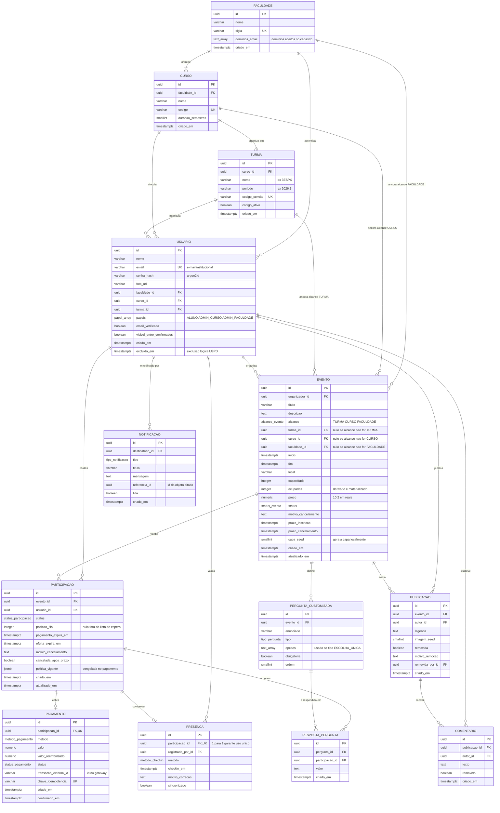

# Modelo de dados (ER)

**Responsável:** Ronaldo Veloso Filho · **Revisão técnica:** Lucas Baraldi
**Detalhamento campo a campo:** [`dicionario-de-dados.md`](dicionario-de-dados.md)

Este é o modelo lógico relacional derivado do [diagrama de classes](02-diagrama-classes.md).
Ele é o alvo do CP6, quando a persistência real substitui o mock. No CP5 as mesmas
entidades existem em memória com os mesmos nomes e tipos.

**SGBD alvo:** PostgreSQL 16 — escolhido pelas restrições `CHECK` compostas, índice único
parcial e tipo `numeric` exato para dinheiro. Todas as três coisas são usadas aqui, e
nenhuma é opcional para as regras de negócio.

## 1. Diagrama entidade-relacionamento



## 2. O que o diagrama mostra e por que assim

O ER é a tradução direta do diagrama de classes, com quatro diferenças deliberadas —
cada uma existe porque o modelo relacional consegue **garantir** algo que o modelo de
objetos apenas descrevia.

**1. As três âncoras de alcance são FKs opcionais com `CHECK` de exclusividade.** Em
`EVENTO`, `turma_id`, `curso_id` e `faculdade_id` são nulos exceto o correspondente ao
valor de `alcance`. Isso torna [RN-001](../04-regras-de-negocio.md) uma restrição do
banco, não uma convenção de código:

```sql
CONSTRAINT ck_evento_ancora_coerente CHECK (
  (alcance = 'TURMA'      AND turma_id IS NOT NULL AND curso_id IS NULL     AND faculdade_id IS NULL) OR
  (alcance = 'CURSO'      AND turma_id IS NULL     AND curso_id IS NOT NULL AND faculdade_id IS NULL) OR
  (alcance = 'FACULDADE'  AND turma_id IS NULL     AND curso_id IS NULL     AND faculdade_id IS NOT NULL)
)
```

**2. `PRESENCA.participacao_id` é FK **única**.** O relacionamento `||--o|` não é
decoração: é o índice único que impede o segundo check-in do mesmo ingresso
([RN-018](../04-regras-de-negocio.md)). A regra passa a ser impossível de violar mesmo
com dois operadores lendo QRs em paralelo, e mesmo se a camada de aplicação tiver um bug.

**3. `PAGAMENTO.chave_idempotencia` é única.** É assim que a idempotência da notificação
do gateway ([RN-014](../04-regras-de-negocio.md), RNF-014) fica garantida: a segunda
tentativa de inserir a mesma chave falha no banco. Idempotência implementada só com
`SELECT` antes do `INSERT` tem janela de corrida; restrição única não tem.

**4. `USUARIO.excluido_em` implementa exclusão lógica.** Exclusão física quebraria as
FKs de participações e publicações e apagaria dado agregado de eventos passados. A
exclusão pedida pelo titular (RNF-021) anonimiza `nome`, `email` e `foto_url`, preenche
`excluido_em` e mantém a linha como chave estrangeira órfã de conteúdo pessoal.

**Uma nota sobre `politica_vigente` em `jsonb`.** É a única coluna semiestruturada do
modelo, e é intencional: a política de reembolso é um pequeno documento imutável
(percentuais e prazos) congelado no momento do pagamento. Normalizá-la em tabela própria
criaria versionamento de política — complexidade sem demanda. Como nunca é consultada
para filtrar, `jsonb` é adequado.

## 3. Restrições de integridade

### Chaves e unicidade

| Tabela | Restrição | Tipo | Regra |
|---|---|---|---|
| `FACULDADE` | `sigla` | `UNIQUE` | — |
| `CURSO` | `codigo` | `UNIQUE` | — |
| `TURMA` | `codigo_convite` | `UNIQUE` | RF-005 |
| `USUARIO` | `email` | `UNIQUE` | RF-001 |
| `PARTICIPACAO` | `(evento_id, usuario_id)` **onde status ativo** | `UNIQUE` parcial | RN-015 |
| `PAGAMENTO` | `participacao_id` | `UNIQUE` | classe 1:0..1 |
| `PAGAMENTO` | `chave_idempotencia` | `UNIQUE` | RN-014 |
| `PRESENCA` | `participacao_id` | `UNIQUE` | RN-018 |
| `RESPOSTA_PERGUNTA` | `(pergunta_id, participacao_id)` | `UNIQUE` | RN-025 |

O índice único parcial de `PARTICIPACAO` é o que torna [RN-015](../04-regras-de-negocio.md)
verdadeiro sem impedir o histórico:

```sql
CREATE UNIQUE INDEX ux_participacao_ativa
  ON participacao (evento_id, usuario_id)
  WHERE status IN ('PENDENTE_PAGAMENTO','CONFIRMADA','LISTA_ESPERA','OFERTA_PENDENTE','PRESENTE');
```

### Restrições de valor (`CHECK`)

| Tabela | Restrição | Regra |
|---|---|---|
| `EVENTO` | `capacidade BETWEEN 2 AND 2000` | RN-004 |
| `EVENTO` | `ocupadas >= 0 AND ocupadas <= capacidade` | **RN-004** — invariante central |
| `EVENTO` | `preco >= 0` | — |
| `EVENTO` | `inicio < fim` | RN-011 |
| `EVENTO` | `fim - inicio <= interval '7 days'` | RN-011 |
| `EVENTO` | `prazo_inscricao <= inicio` | RN-009, RN-011 |
| `EVENTO` | `prazo_cancelamento <= inicio` | RN-010 |
| `EVENTO` | âncora coerente com `alcance` (ver seção 2) | RN-001 |
| `EVENTO` | `status = 'CANCELADO'` exige `motivo_cancelamento IS NOT NULL` | RN-021 |
| `PARTICIPACAO` | `posicao_fila IS NULL` ou `posicao_fila >= 1` | RN-006 |
| `PARTICIPACAO` | `status = 'LISTA_ESPERA'` exige `posicao_fila IS NOT NULL` | RN-006 |
| `PARTICIPACAO` | `status = 'OFERTA_PENDENTE'` exige `oferta_expira_em IS NOT NULL` | RN-007 |
| `PARTICIPACAO` | `status = 'PENDENTE_PAGAMENTO'` exige `pagamento_expira_em IS NOT NULL` | RN-012 |
| `PAGAMENTO` | `valor > 0` | — |
| `PAGAMENTO` | `valor_reembolsado BETWEEN 0 AND valor` | RN-013 |
| `PERGUNTA_CUSTOMIZADA` | `ordem BETWEEN 1 AND 5` | RN-025 |
| `PERGUNTA_CUSTOMIZADA` | `tipo = 'ESCOLHA_UNICA'` exige `array_length(opcoes,1) >= 2` | RN-025 |
| `PUBLICACAO` | `removida = true` exige `motivo_remocao` e `removida_por_id` | RN-020 |

### Ações referenciais

| FK | `ON DELETE` | Por quê |
|---|---|---|
| `CURSO.faculdade_id` | `CASCADE` | Composição: curso não existe sem faculdade |
| `TURMA.curso_id` | `CASCADE` | Composição |
| `USUARIO.turma_id` / `.curso_id` / `.faculdade_id` | `RESTRICT` | Agregação: não se apaga turma com aluno vinculado |
| `EVENTO.organizador_id` | `RESTRICT` | Usuário com evento não é apagado — só anonimizado (RNF-021) |
| `EVENTO.turma_id` / `.curso_id` / `.faculdade_id` | `RESTRICT` | Apagar a âncora deixaria o alcance indefinido |
| `PARTICIPACAO.evento_id` | `RESTRICT` | Evento com participação é **cancelado**, nunca apagado (RN-021) |
| `PARTICIPACAO.usuario_id` | `RESTRICT` | Preserva histórico e a contagem de presença do evento |
| `PAGAMENTO.participacao_id` | `RESTRICT` | Registro financeiro é retido, mesmo com participação cancelada |
| `PRESENCA.participacao_id` | `RESTRICT` | Presença é fato imutável (RN-018) |
| `PRESENCA.registrado_por_id` | `RESTRICT` | Preserva a autoria da validação |
| `PERGUNTA_CUSTOMIZADA.evento_id` | `CASCADE` | Composição |
| `RESPOSTA_PERGUNTA.pergunta_id` | `CASCADE` | Resposta sem pergunta não tem sentido |
| `RESPOSTA_PERGUNTA.participacao_id` | `CASCADE` | — |
| `PUBLICACAO.evento_id` | `RESTRICT` | Feed é a memória do evento |
| `COMENTARIO.publicacao_id` | `CASCADE` | Composição |
| `NOTIFICACAO.destinatario_id` | `CASCADE` | Notificação é transitória por natureza |

## 4. Índices para as consultas reais

Índice sem consulta que o justifique é peso morto. Cada um abaixo existe por uma consulta
que o app faz.

| Índice | Consulta que atende | Frequência |
|---|---|---|
| `ix_evento_turma_inicio (turma_id, inicio) WHERE status='PUBLICADO'` | Lista de eventos filtrada por "minha turma", ordenada por data (RF-015) | Altíssima |
| `ix_evento_curso_inicio (curso_id, inicio) WHERE status='PUBLICADO'` | Filtro "meu curso" | Alta |
| `ix_evento_faculdade_inicio (faculdade_id, inicio) WHERE status='PUBLICADO'` | Filtro "faculdade" | Alta |
| `ix_evento_organizador (organizador_id, criado_em DESC)` | Aba "criados" do perfil (RF-007) | Média |
| `ix_participacao_usuario (usuario_id, criado_em DESC)` | Abas "participando"/"anteriores" (RF-007) | Alta |
| `ix_participacao_fila (evento_id, posicao_fila) WHERE status='LISTA_ESPERA'` | Selecionar o primeiro da fila na promoção (RN-007) | Média, crítica |
| `ix_participacao_expira (pagamento_expira_em) WHERE status='PENDENTE_PAGAMENTO'` | Rotina de expiração de pagamento (RN-012) | Rotina periódica |
| `ix_participacao_oferta (oferta_expira_em) WHERE status='OFERTA_PENDENTE'` | Rotina de expiração de oferta (RN-008) | Rotina periódica |
| `ix_publicacao_evento (evento_id, criado_em DESC) WHERE removida=false` | Feed do evento (RF-036) | Altíssima |
| `ix_notificacao_nao_lida (destinatario_id, criado_em DESC) WHERE lida=false` | Contador de não lidas (RF-040) | Alta |
| `ix_pagamento_transacao (transacao_externa_id)` | Processar notificação do gateway (RN-014) | Média, crítica |

## 5. Tipos enumerados

Enums do PostgreSQL, não `varchar` com `CHECK`: o tipo aparece em toda coluna que o usa,
o valor inválido é rejeitado na entrada, e o conjunto vive em um só lugar.

```sql
CREATE TYPE alcance_evento       AS ENUM ('TURMA','CURSO','FACULDADE');
CREATE TYPE status_evento        AS ENUM ('RASCUNHO','EM_APROVACAO','PUBLICADO','CANCELADO','REALIZADO');
CREATE TYPE status_participacao  AS ENUM ('PENDENTE_PAGAMENTO','CONFIRMADA','LISTA_ESPERA',
                                          'OFERTA_PENDENTE','PRESENTE','AUSENTE','CANCELADA','EXPIRADA');
CREATE TYPE status_pagamento     AS ENUM ('AGUARDANDO','CONFIRMADO','RECUSADO','EM_ANALISE',
                                          'REEMBOLSO_SOLICITADO','REEMBOLSADO','REEMBOLSADO_PARCIAL','ESTORNADO');
CREATE TYPE metodo_pagamento     AS ENUM ('PIX','CARTAO_CREDITO','CARTAO_DEBITO');
CREATE TYPE papel_usuario        AS ENUM ('ALUNO','ADMIN_CURSO','ADMIN_FACULDADE');
CREATE TYPE metodo_checkin       AS ENUM ('QR_CODE','CODIGO_NUMERICO','MANUAL');
CREATE TYPE tipo_pergunta        AS ENUM ('TEXTO_CURTO','ESCOLHA_UNICA');
CREATE TYPE tipo_notificacao     AS ENUM ('NOVO_EVENTO','VAGA_LIBERADA','PAGAMENTO_CONFIRMADO',
                                          'PAGAMENTO_EXPIRADO','EVENTO_ALTERADO','EVENTO_CANCELADO',
                                          'CHECKIN_REALIZADO','EVENTO_APROVADO');
```

Os mesmos nove conjuntos existem como *union types* em
[`app/src/types/domain.ts`](../../app/src/types/domain.ts) — mesma ordem, mesmos nomes.

## 6. A transação que sustenta RN-004

A regra "capacidade nunca é excedida" não é implementável com `SELECT` seguido de
`INSERT`. Com trava de linha, é:

```sql
BEGIN;

  SELECT capacidade, ocupadas
    FROM evento
   WHERE id = :evento_id
     FOR UPDATE;                      -- serializa quem disputa a mesma vaga

  -- Se ocupadas >= capacidade: a aplicação segue para lista de espera (RN-006).

  INSERT INTO participacao (evento_id, usuario_id, status, pagamento_expira_em)
  VALUES (:evento_id, :usuario_id,
          CASE WHEN :preco > 0 THEN 'PENDENTE_PAGAMENTO' ELSE 'CONFIRMADA' END,
          CASE WHEN :preco > 0 THEN now() + interval '60 minutes' ELSE NULL END);

  UPDATE evento SET ocupadas = ocupadas + 1 WHERE id = :evento_id;
  -- ck_evento_ocupadas_le_capacidade é a rede de segurança se algo escapar da trava

COMMIT;
```

Duas requisições simultâneas para a última vaga: a segunda espera a primeira, lê
`ocupadas` já atualizado e vai para a lista de espera. É o teste CT-020 do
[plano de testes](../11-plano-de-testes.md), e o RNF-013.

No CP5, sem banco, a mesma serialização é obtida por uma fila de operações de escrita na
camada mockada — o comportamento observável é idêntico, e o mesmo teste passa nos dois
mundos.

## 7. Volumetria estimada (premissa do grupo)

Base de dimensionamento, não previsão de mercado. Cenário de uma faculdade com 3 cursos,
4 turmas e ~180 alunos ativos em um semestre.

| Tabela | Linhas/semestre | Crescimento | Observação |
|---|---|---|---|
| `FACULDADE` | 1 | nulo | v1 é mono-instituição |
| `CURSO` | 3 | nulo | — |
| `TURMA` | 4 a 12 | por semestre | Nova turma a cada período |
| `USUARIO` | ~180 | por ingresso | — |
| `EVENTO` | 30 a 70 | linear | 3 a 6 por turma + eventos de curso e faculdade |
| `PARTICIPACAO` | 2.000 a 6.000 | linear com eventos | Maior tabela transacional |
| `PAGAMENTO` | 600 a 2.000 | ~30% das participações | Só eventos pagos |
| `PRESENCA` | 1.500 a 4.500 | ~75% das confirmadas | Taxa de comparecimento |
| `PUBLICACAO` | 500 a 2.000 | pós-evento | Concentra picos após eventos grandes |
| `COMENTARIO` | 1.000 a 5.000 | linear com publicações | — |
| `NOTIFICACAO` | 20.000 a 60.000 | maior volume absoluto | Candidata a expurgo após 90 dias |

Conclusão: volume pequeno. Nenhuma decisão do modelo precisou ser tomada por escala — as
decisões foram tomadas por **correção**, e é assim que devem ser lidas.
