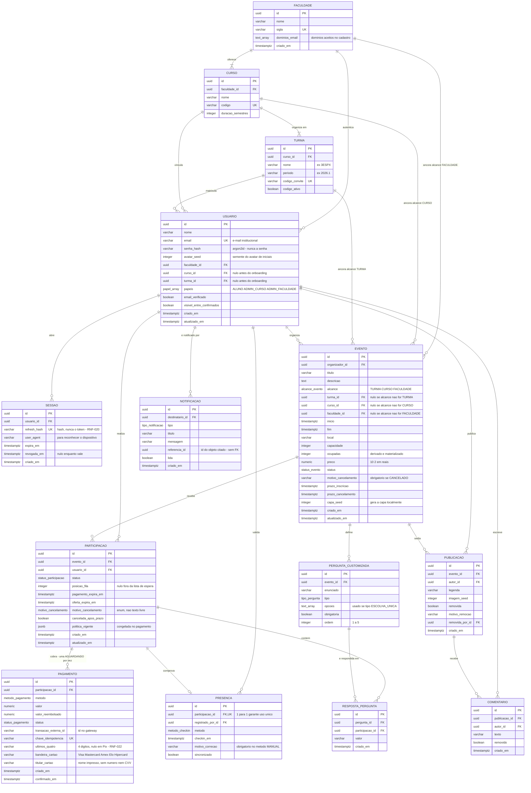

# Modelo de dados (ER)

**Responsável:** Ronaldo Veloso Filho · **Revisão técnica:** Lucas Baraldi
**Detalhamento campo a campo:** [`dicionario-de-dados.md`](dicionario-de-dados.md)

## Histórico de revisões

| Versão | Data | Checkpoint | O que mudou |
|---|---|---|---|
| 1.0 | 2026-09-01 | CP4 | 13 tabelas (o texto dizia 14), restrições `CHECK`, índice único parcial, ações referenciais, índices justificados por consulta, 9 tipos enumerados e a transação de RN-004 |
| 2.0 | 2026-09-02 | CP5 | `USUARIO.foto_url` sai e entra `avatar_seed` — não há *upload* na v1. `PAGAMENTO` recebe as três colunas do resumo de cartão que o CP5 de fato guarda (`ultimos_quatro`, `bandeira_cartao`, `titular_cartao`), com `CHECK` de coerência com `metodo` — a justificativa está na decisão 9 de [`02-diagrama-classes.md`](02-diagrama-classes.md). `PARTICIPACAO.motivo_cancelamento` passa de `text` para o enum que o código já usa. Os tipos enumerados vão de 9 para **10**, e fica registrado por que as outras cinco enumerações do código **não** são tipos do banco |
| 3.0 | 2026-09-02 | CP6 | **Conferido contra o schema que existe**, e não mais contra a intenção. Entra a tabela **`SESSAO`** (refresh revogável, RNF-020) — 14 tabelas. `USUARIO.senha_hash` sai da nota "argon2id — CP6" e passa a ser coluna real; `USUARIO.excluido_em` **sai**, porque não existe no schema, e a exclusão lógica de RNF-021 deixa de ser descrita como implementada. `PARTICIPACAO ||--o| PAGAMENTO` passa a **`||--o{`**: `pagamento.participacao_id` não é único, e o que garante RN-027 é um único **parcial** em `WHERE status='AGUARDANDO'` — a mudança é de cardinalidade, não de nome. `CURSO` e `TURMA` perdem `criado_em`, que o schema não tem, e `USUARIO` ganha `atualizado_em`. Cinco `smallint` viram `integer` e sete `text` viram `varchar` com limite — o único `text` que sobra é `evento.descricao`. Os nomes de índice passam a ser os reais da migration, separando os 8 parciais escritos à mão dos gerados pelo Prisma. A seção 6 ganha o `SELECT ... FOR UPDATE` real ao lado da fila serializada do mock, com a tabela do que muda entre os dois, e a seção das 22 verificações do banco |

Este é o modelo lógico relacional derivado do [diagrama de classes](02-diagrama-classes.md).
**No CP6 ele deixou de ser alvo e passou a ser conferido contra o schema entregue**:
[`api/prisma/schema.prisma`](../../api/prisma/schema.prisma) (14 modelos, 10 enums) e
[`api/prisma/migrations/0001_init/migration.sql`](../../api/prisma/migrations/0001_init/migration.sql)
(588 linhas, com a segunda metade escrita à mão). Divergência entre esta página e aqueles
dois arquivos é defeito, e a revisão 3.0 corrigiu seis.

As mesmas entidades continuam existindo **também** em memória, na fonte mock, com os mesmos
nomes e tipos — e as invariantes que aqui são restrição do banco são verificadas em tempo de
execução por `assertInvariants` em
[`app/src/mocks/db.ts`](../../app/src/mocks/db.ts). Ver a seção 6.

**SGBD:** PostgreSQL 16 — escolhido pelas restrições `CHECK` compostas, índice único parcial
e tipo `numeric` exato para dinheiro. Todas as três coisas são usadas aqui, nenhuma é
opcional para as regras de negócio, e no CP6 as três estão exercitadas: as **22
verificações** de
[`api/prisma/verificar-restricoes.sql`](../../api/prisma/verificar-restricoes.sql) tentam
gravar dado impossível contra um PostgreSQL de verdade e esperam que ele recuse.

## 1. Diagrama entidade-relacionamento



## 2. O que o diagrama mostra e por que assim

O ER é a tradução direta do diagrama de classes, com quatro diferenças deliberadas —
cada uma existe porque o modelo relacional consegue **garantir** algo que o modelo de
objetos apenas descrevia.

**1. As três âncoras de alcance são FKs opcionais com `CHECK` de exclusividade.** Em
`EVENTO`, `turma_id`, `curso_id` e `faculdade_id` são nulos exceto o correspondente ao
valor de `alcance`. Isso torna [RN-001](../04-regras-de-negocio.md) uma restrição do
banco, não uma convenção de código:

```sql
CONSTRAINT ck_evento_ancora_coerente CHECK (
  (alcance = 'TURMA'      AND turma_id IS NOT NULL AND curso_id IS NULL     AND faculdade_id IS NULL) OR
  (alcance = 'CURSO'      AND turma_id IS NULL     AND curso_id IS NOT NULL AND faculdade_id IS NULL) OR
  (alcance = 'FACULDADE'  AND turma_id IS NULL     AND curso_id IS NULL     AND faculdade_id IS NOT NULL)
)
```

**2. `PRESENCA.participacao_id` é FK **única**.** O relacionamento `||--o|` não é
decoração: é o índice único que impede o segundo check-in do mesmo ingresso
([RN-018](../04-regras-de-negocio.md)). A regra passa a ser impossível de violar mesmo
com dois operadores lendo QRs em paralelo, e mesmo se a camada de aplicação tiver um bug.

**3. `PAGAMENTO.chave_idempotencia` é única.** É assim que a idempotência da notificação
do gateway ([RN-014](../04-regras-de-negocio.md), RNF-014) fica garantida: a segunda
tentativa de inserir a mesma chave falha no banco. Idempotência implementada só com
`SELECT` antes do `INSERT` tem janela de corrida; restrição única não tem.

**4. A exclusão lógica de `USUARIO` foi projetada e não foi implementada.** Esta era a
quarta diferença deliberada do modelo, e a revisão do CP6 a removeu do diagrama porque a
coluna não existe: `api/prisma/schema.prisma` declara `criado_em` e `atualizado_em`, e
nenhuma coluna de exclusão. Reconferir com `grep -n "excluido" api/prisma/schema.prisma` —
não devolve nada.

O raciocínio continua válido e é o que se implementaria: exclusão física quebraria as FKs de
participações e publicações e apagaria dado agregado de eventos passados, então a exclusão
pedida pelo titular (RNF-021) anonimizaria `nome` e `email`, preencheria `excluido_em` e
manteria a linha como chave estrangeira órfã de conteúdo pessoal. Mas **RNF-021 não está
atendido no CP6** nessa parte, e `21-api-contrato.md` §5 registra que os endpoints de
exclusão e exportação também não existem. Descrever a coluna como se ela estivesse lá era
transformar intenção em evidência falsa.

`avatar_seed` continua não sendo dado pessoal — é um número que escolhe a cor do avatar de
iniciais, e é por isso que ele sobreviveria a uma anonimização.

**4b. `SESSAO` é tabela nova, e ela existe porque "revogável" exige estado (RNF-020).** No
CP5 não havia servidor: o token era opaco e a sessão morria com a aba, então "revogar" era
fechar o navegador. Com refresh de 30 dias isso deixa de bastar — trocar de senha, sair de
um dispositivo perdido ou expulsar uma sessão suspeita precisam de um lugar onde o servidor
diga "esta não vale mais". Esse lugar é a linha, com `revogada_em`.

Duas decisões de modelagem dentro dela:

- **`refresh_hash`, nunca o token.** A coluna é `UNIQUE` e guarda o hash. Um vazamento do
  banco não dá sessão a ninguém, porque o que está lá não serve para autenticar. É a mesma
  razão de `senha_hash` existir e `senha` não.
- **`user_agent` é anulável e é para a pessoa, não para o sistema.** Serve para reconhecer a
  sessão numa lista de dispositivos ativos. Não participa de nenhuma decisão de
  autorização — e não deve, porque é cabeçalho controlado pelo cliente.

O índice é `(usuario_id, expira_em)`: a consulta real é "as sessões válidas deste usuário", e
ela precisa das duas colunas.

**5. O resumo do cartão são três colunas de `PAGAMENTO`, não uma tabela — e agora elas
existem de fato.** Decidido no CP5, entregue no CP6: `ultimos_quatro`, `bandeira_cartao` e
`titular_cartao` estão em `schema.prisma` e na migration, com **dois `CHECK`** que tornam
RNF-022 garantia do banco:

```sql
CONSTRAINT ck_pagamento_pix_sem_cartao CHECK (
  metodo <> 'PIX'
  OR (ultimos_quatro IS NULL AND bandeira_cartao IS NULL AND titular_cartao IS NULL)
)
CONSTRAINT ck_pagamento_ultimos_quatro_digitos CHECK (
  ultimos_quatro IS NULL OR ultimos_quatro ~ '^[0-9]{4}$'
)
```

E a promessa é verificável em três camadas, que é o que a torna promessa e não intenção: o
schema do contrato recusa o campo (`ResumoCartao` é `additionalProperties: false`), o `CHECK`
recusa a linha, e a verificação 7 de `verificar-restricoes.sql` **prova** que ele recusa.

`ultimos_quatro`, `bandeira_cartao` e `titular_cartao` são o que sobra de um cartão depois do
formulário: `pix.ts#resumirCartao` reduz os dados **no cliente**, e número e CVV nunca entram
em requisição nenhuma (RNF-022).

Três razões para figurar no modelo, e não como tabela:

- É estado que **sobrevive à requisição e é lido de volta** — `toPagamentoView` o devolve
  para a tela mostrar "Visa •••• 4242". Dado escrito, guardado e relido é dado persistido.
- **Documentar o que se guarda é o que torna o inventário LGPD auditável.** RNF-022 não diz
  "não guarde nada de cartão": diz que número e CVV não trafegam nem são armazenados.
  Esconder do modelo o que de fato se guarda seria pior do que guardar.
- Três campos pequenos, nunca consultados isoladamente. Uma tabela `resumo_cartao` existiria
  só para hospedar três colunas opcionais e impor um `JOIN` em toda leitura de pagamento.

Na fonte mock isso vive como `db.resumosCartao`, um array paralelo — diferença de
implementação, não de modelo: acrescentar campos à interface `Pagamento` teria mudado o tipo
que o [diagrama de classes](02-diagrama-classes.md) documenta.

**5b. `PARTICIPACAO → PAGAMENTO` é 1:N, e não 1:0..1 como o CP5 desenhou.** É a correção de
modelagem mais consequente desta revisão, e ela vem de RN-027.

O CP5 desenhou `PARTICIPACAO ||--o| PAGAMENTO` com `participacao_id` **único**: uma
participação, no máximo uma cobrança. O schema do CP6 não é isso — `pagamento_participacao_id_idx`
é índice comum, e o modelo Prisma declara `pagamentos Pagamento[]`, no plural. O que garante
RN-027 é um único **parcial**:

```sql
CREATE UNIQUE INDEX ux_pagamento_aguardando_por_participacao
  ON pagamento (participacao_id)
  WHERE status = 'AGUARDANDO';
```

A diferença entre as duas formas não é sutil, e a forma nova é a certa:

| Único total (CP5) | Único parcial (CP6) |
|---|---|
| Uma cobrança por participação, para sempre | Uma cobrança **aberta** por vez |
| Pix recusado ou expirado **bloqueia** nova tentativa | Cobrança recusada, expirada ou estornada conviver com uma tentativa nova é comportamento legítimo — e frequente |
| Duplo toque em "pagar" falha com erro de banco | Duplo toque devolve a cobrança existente, que é o que RN-027 pede |

É o mesmo raciocínio de `ux_participacao_ativa`: o predicado é o que separa "o estado atual é
único" de "o histórico é proibido". Um único que ignore o status impede a pessoa de tentar de
novo depois de uma recusa — e tentar de novo depois de uma recusa é justamente o caso que
existe.

**6. `PAGAMENTO` não tem coluna para o payload Pix.** O BR Code é recalculado por
`gerarCobrancaPix` a cada leitura, determinístico sobre `(valor, referencia, expiraEm)`
([RN-028](../04-regras-de-negocio.md)). BR Code armazenado é dado derivado que passa a
discordar da fonte na primeira alteração de preço — e quem paga, paga o valor errado com a
bênção do banco de dados.

**Uma nota sobre `politica_vigente` em `jsonb`.** É a única coluna semiestruturada do
modelo, e é intencional: a política de reembolso é um pequeno documento imutável
(percentuais e prazos) congelado no momento do pagamento. Normalizá-la em tabela própria
criaria versionamento de política — complexidade sem demanda. Como nunca é consultada
para filtrar, `jsonb` é adequado.

## 3. Restrições de integridade

### Chaves e unicidade

| Tabela | Restrição | Tipo | Regra |
|---|---|---|---|
| `FACULDADE` | `sigla` | `UNIQUE` | — |
| `CURSO` | `codigo` | `UNIQUE` | — |
| `TURMA` | `codigo_convite` | `UNIQUE` | RF-005 |
| `USUARIO` | `email` | `UNIQUE` | RF-001 |
| `SESSAO` | `refresh_hash` | `UNIQUE` | RNF-020 |
| `PARTICIPACAO` | `(evento_id, usuario_id)` **onde status ativo** | `UNIQUE` parcial | RN-015 |
| `PAGAMENTO` | `participacao_id` **onde `status='AGUARDANDO'`** | `UNIQUE` parcial | **RN-027** — era único total no CP5; ver a decisão 5b |
| `PAGAMENTO` | `chave_idempotencia` | `UNIQUE` | RN-014 |
| `PRESENCA` | `participacao_id` | `UNIQUE` | RN-018 |
| `RESPOSTA_PERGUNTA` | `(pergunta_id, participacao_id)` | `UNIQUE` | RN-025 |
| `PERGUNTA_CUSTOMIZADA` | `(evento_id, ordem)` | `UNIQUE` | RN-025 |

Os dois únicos **parciais** são os que a migration escreve à mão: o Prisma não tem sintaxe
para `WHERE` em índice único. Conferir com
`grep -c 'CREATE UNIQUE INDEX "ux_' api/prisma/migrations/0001_init/migration.sql` — devolve
**2**.

O índice único parcial de `PARTICIPACAO` é o que torna [RN-015](../04-regras-de-negocio.md)
verdadeiro sem impedir o histórico:

```sql
CREATE UNIQUE INDEX ux_participacao_ativa
  ON participacao (evento_id, usuario_id)
  WHERE status IN ('PENDENTE_PAGAMENTO','CONFIRMADA','LISTA_ESPERA','OFERTA_PENDENTE','PRESENTE');
```

Um único que ignorasse o status impediria a pessoa de se inscrever de novo depois de
cancelar — comportamento legítimo e frequente. A verificação 5 de
`verificar-restricoes.sql` cobre os dois lados: recusa a segunda participação ativa **e**
confirma que a reinscrição depois do cancelamento passa. É a única das 22 verificações que
espera sucesso em vez de recusa, e ela existe porque um índice que proíbe demais é tão
defeituoso quanto um que proíbe de menos.

### Restrições de valor (`CHECK`)

São **20**, todas na segunda metade da migration, todas com nome `ck_*`. Conferir com
`grep -c 'ADD CONSTRAINT "ck_' api/prisma/migrations/0001_init/migration.sql`. A tabela
abaixo tem uma linha por restrição, e a ordem é a do arquivo.

| Tabela | Restrição | Regra |
|---|---|---|
| `EVENTO` | `capacidade BETWEEN 2 AND 2000` | RN-004 |
| `EVENTO` | `ocupadas >= 0 AND ocupadas <= capacidade` | **RN-004** — invariante central |
| `EVENTO` | `preco >= 0` | — |
| `EVENTO` | `inicio < fim` | RN-011 |
| `EVENTO` | `fim - inicio <= interval '7 days'` | RN-011 |
| `EVENTO` | `prazo_inscricao <= inicio` | RN-009, RN-011 |
| `EVENTO` | `prazo_cancelamento <= inicio` | RN-010 |
| `EVENTO` | âncora coerente com `alcance` (ver seção 2) | RN-001 |
| `EVENTO` | `status = 'CANCELADO'` exige `motivo_cancelamento IS NOT NULL` | RN-021 |
| `PARTICIPACAO` | `posicao_fila IS NULL` ou `posicao_fila >= 1` | RN-006 |
| `PARTICIPACAO` | `status = 'LISTA_ESPERA'` exige `posicao_fila IS NOT NULL` | RN-006 |
| `PARTICIPACAO` | `status = 'OFERTA_PENDENTE'` exige `oferta_expira_em IS NOT NULL` | RN-007 |
| `PARTICIPACAO` | `status = 'PENDENTE_PAGAMENTO'` exige `pagamento_expira_em IS NOT NULL` | RN-012 |
| `PAGAMENTO` | `valor > 0` | — |
| `PAGAMENTO` | `valor_reembolsado BETWEEN 0 AND valor` | RN-013 |
| `PAGAMENTO` | `metodo = 'PIX'` exige as três colunas de cartão nulas | RNF-022 |
| `PAGAMENTO` | `ultimos_quatro ~ '^[0-9]{4}$'` quando não nulo | RNF-022 |
| `PERGUNTA_CUSTOMIZADA` | `ordem BETWEEN 1 AND 5` | RN-025 |
| `PERGUNTA_CUSTOMIZADA` | `tipo = 'ESCOLHA_UNICA'` exige `array_length(opcoes,1) >= 2` | RN-025 |
| `PUBLICACAO` | `removida = true` exige `motivo_remocao` e `removida_por_id` | RN-020 |

### Ações referenciais

| FK | `ON DELETE` | Por quê |
|---|---|---|
| `CURSO.faculdade_id` | `CASCADE` | Composição: curso não existe sem faculdade |
| `TURMA.curso_id` | `CASCADE` | Composição |
| `USUARIO.turma_id` / `.curso_id` / `.faculdade_id` | `RESTRICT` | Agregação: não se apaga turma com aluno vinculado |
| `SESSAO.usuario_id` | `CASCADE` | Sessão não existe sem titular, e não há nada a preservar nela |
| `EVENTO.organizador_id` | `RESTRICT` | Usuário com evento não é apagado — só anonimizado (RNF-021) |
| `EVENTO.turma_id` / `.curso_id` / `.faculdade_id` | `RESTRICT` | Apagar a âncora deixaria o alcance indefinido |
| `PARTICIPACAO.evento_id` | `RESTRICT` | Evento com participação é **cancelado**, nunca apagado (RN-021) |
| `PARTICIPACAO.usuario_id` | `RESTRICT` | Preserva histórico e a contagem de presença do evento |
| `PAGAMENTO.participacao_id` | `RESTRICT` | Registro financeiro é retido, mesmo com participação cancelada |
| `PRESENCA.participacao_id` | `RESTRICT` | Presença é fato imutável (RN-018) |
| `PRESENCA.registrado_por_id` | `RESTRICT` | Preserva a autoria da validação |
| `PERGUNTA_CUSTOMIZADA.evento_id` | `CASCADE` | Composição |
| `RESPOSTA_PERGUNTA.pergunta_id` | `CASCADE` | Resposta sem pergunta não tem sentido |
| `RESPOSTA_PERGUNTA.participacao_id` | `CASCADE` | — |
| `PUBLICACAO.evento_id` | `RESTRICT` | Feed é a memória do evento |
| `PUBLICACAO.autor_id` / `.removida_por_id` | `RESTRICT` | Preserva a autoria da publicação e da moderação (RN-020) |
| `COMENTARIO.publicacao_id` | `CASCADE` | Composição |
| `COMENTARIO.autor_id` | `RESTRICT` | Preserva a autoria |
| `NOTIFICACAO.destinatario_id` | `CASCADE` | Notificação é transitória por natureza |

São **24 chaves estrangeiras**, e a verificação 11 de `verificar-restricoes.sql` prova o
`RESTRICT` que mais importa: apagar um evento com participação é recusado. `ON UPDATE` é
`CASCADE` em todas — o Prisma o gera assim, e como as chaves são UUID geradas na criação,
nenhuma delas muda na prática.

**`NOTIFICACAO.referencia_id` não tem FK, e é de propósito.** Ela aponta para tabelas
diferentes por tipo — evento, participação, publicação. Uma FK exigiria uma coluna por tipo
ou uma tabela de junção polimórfica, as duas piores que aceitar um id órfão numa notificação
transitória. O consumidor trata "não encontrado" como caminho normal.

## 4. Índices para as consultas reais

Índice sem consulta que o justifique é peso morto. Cada um abaixo existe por uma consulta
que o app faz.

| Índice | Consulta que atende | Frequência |
|---|---|---|
| `ix_evento_turma_inicio (turma_id, inicio) WHERE status='PUBLICADO'` | Lista de eventos filtrada por "minha turma", ordenada por data (RF-015) | Altíssima |
| `ix_evento_curso_inicio (curso_id, inicio) WHERE status='PUBLICADO'` | Filtro "meu curso" | Alta |
| `ix_evento_faculdade_inicio (faculdade_id, inicio) WHERE status='PUBLICADO'` | Filtro "faculdade" | Alta |
| `evento_organizador_id_criado_em_idx` | Aba "criados" do perfil (RF-007) | Média |
| `participacao_usuario_id_criado_em_idx` | Abas "participando"/"anteriores" (RF-007) | Alta |
| `ix_participacao_fila (evento_id, posicao_fila) WHERE status='LISTA_ESPERA'` | Selecionar o primeiro da fila na promoção (RN-007) | Média, crítica |
| `ix_participacao_expira (pagamento_expira_em) WHERE status='PENDENTE_PAGAMENTO'` | Rotina de expiração de pagamento (RN-012) | Rotina periódica |
| `ix_participacao_oferta (oferta_expira_em) WHERE status='OFERTA_PENDENTE'` | Rotina de expiração de oferta (RN-008) | Rotina periódica |
| `ix_publicacao_evento (evento_id, criado_em DESC) WHERE removida=false` | Feed do evento (RF-036) | Altíssima |
| `ix_notificacao_nao_lida (destinatario_id, criado_em DESC) WHERE lida=false` | Contador de não lidas (RF-040) | Alta |
| `pagamento_transacao_externa_id_idx` | Processar notificação do gateway (RN-014) | Média, crítica |
| `sessao_usuario_id_expira_em_idx` | Sessões válidas do titular, para revogar ou listar (RNF-020) | Média |

**Os oito nomes que começam com `ix_` são os índices parciais**, e a distinção de nomes é
intencional: `ix_*` é escrito à mão na migration, `<tabela>_<colunas>_idx` é o que o Prisma
gera. Onde o predicado importa, a migration **derruba** o índice gerado e cria o parcial no
lugar:

```sql
DROP INDEX IF EXISTS "evento_turma_id_inicio_idx";
CREATE INDEX "ix_evento_turma_inicio" ON "evento" ("turma_id", "inicio")
  WHERE "status" = 'PUBLICADO';
```

Conferir a contagem com
`grep -c 'CREATE INDEX "ix_' api/prisma/migrations/0001_init/migration.sql` — devolve **8**.

Um índice sobre a coluna inteira também funcionaria; ele custa espaço e escrita para linhas
que a consulta **nunca lê**. A lista de eventos só olha `PUBLICADO`, e as rotinas de
expiração só olham um status cada.

## 5. Tipos enumerados

Enums do PostgreSQL, não `varchar` com `CHECK`: o tipo aparece em toda coluna que o usa,
o valor inválido é rejeitado na entrada, e o conjunto vive em um só lugar.

```sql
CREATE TYPE alcance_evento       AS ENUM ('TURMA','CURSO','FACULDADE');
CREATE TYPE status_evento        AS ENUM ('RASCUNHO','EM_APROVACAO','PUBLICADO','CANCELADO','REALIZADO');
CREATE TYPE status_participacao  AS ENUM ('PENDENTE_PAGAMENTO','CONFIRMADA','LISTA_ESPERA',
                                          'OFERTA_PENDENTE','PRESENTE','AUSENTE','CANCELADA','EXPIRADA');
CREATE TYPE status_pagamento     AS ENUM ('AGUARDANDO','CONFIRMADO','RECUSADO','EM_ANALISE',
                                          'REEMBOLSO_SOLICITADO','REEMBOLSADO','REEMBOLSADO_PARCIAL','ESTORNADO');
CREATE TYPE metodo_pagamento     AS ENUM ('PIX','CARTAO_CREDITO','CARTAO_DEBITO');
CREATE TYPE papel_usuario        AS ENUM ('ALUNO','ADMIN_CURSO','ADMIN_FACULDADE');
CREATE TYPE metodo_checkin       AS ENUM ('QR_CODE','CODIGO_NUMERICO','MANUAL');
CREATE TYPE tipo_pergunta        AS ENUM ('TEXTO_CURTO','ESCOLHA_UNICA');
CREATE TYPE tipo_notificacao     AS ENUM ('NOVO_EVENTO','VAGA_LIBERADA','PAGAMENTO_CONFIRMADO',
                                          'PAGAMENTO_EXPIRADO','EVENTO_ALTERADO','EVENTO_CANCELADO',
                                          'CHECKIN_REALIZADO','EVENTO_APROVADO');
CREATE TYPE motivo_cancelamento  AS ENUM ('ALUNO_DESISTIU','EVENTO_CANCELADO','VINCULO_PERDIDO',
                                          'REMOVIDO_PELO_ORGANIZADOR','OFERTA_RECUSADA');
```

Os mesmos **dez** conjuntos existem como *union types* em
[`packages/shared/src/types.ts`](../../packages/shared/src/types.ts) — mesma ordem, mesmos
nomes — e como `enum` do Prisma em
[`api/prisma/schema.prisma`](../../api/prisma/schema.prisma), com `@@map` para o nome
snake_case do tipo do banco. **São três declarações do mesmo conjunto**, e é o que se aceitou
para ter tipo do TypeScript, tipo do Prisma e tipo do PostgreSQL: as duas primeiras são
verificadas por compilação contra o mesmo dado, e a terceira recusa na entrada.

`motivo_cancelamento` foi o décimo: no CP4 a coluna era `text`, e o código já a tipava como
enumeração desde o começo. O código venceu.

### As cinco enumerações que **não** são tipos do banco

`MOTIVO_RECUSA_INSCRICAO`, `MOTIVO_RECUSA_LOGIN`, `MOTIVO_RECUSA_ONBOARDING`,
`MOTIVO_RECUSA_CHECKIN` e `DESFECHO_SIMULADO` existem em `packages/shared/src/types.ts` e
**não** viram `CREATE TYPE`. Nenhuma é valor de coluna: elas tipam o campo `erro` do corpo de
uma resposta recusada (`401`, `409`, `422`, ou a resposta com `aceito: false`) e o gatilho da
simulação de gateway. O cabeçalho do `schema.prisma` diz a mesma coisa, com as mesmas
palavras — e é assim que a decisão sobrevive a quem ler só um dos dois arquivos.

Criar tipos de banco para elas seria confundir vocabulário de protocolo com estado
persistido. A recusa de um login não é guardada em lugar nenhum — ela é **dita**. A distinção
é a mesma da seção 0 de [`02-diagrama-classes.md`](02-diagrama-classes.md).

## 6. A transação que sustenta RN-004

A regra "capacidade nunca é excedida" não é implementável com `SELECT` seguido de
`INSERT`. Com trava de linha, é:

```sql
BEGIN;

  SELECT capacidade, ocupadas
    FROM evento
   WHERE id = :evento_id
     FOR UPDATE;                      -- serializa quem disputa a mesma vaga

  -- Se ocupadas >= capacidade: a aplicação segue para lista de espera (RN-006).

  INSERT INTO participacao (evento_id, usuario_id, status, pagamento_expira_em)
  VALUES (:evento_id, :usuario_id,
          CASE WHEN :preco > 0 THEN 'PENDENTE_PAGAMENTO' ELSE 'CONFIRMADA' END,
          CASE WHEN :preco > 0 THEN now() + interval '60 minutes' ELSE NULL END);

  UPDATE evento SET ocupadas = ocupadas + 1 WHERE id = :evento_id;
  -- ck_evento_ocupadas_le_capacidade é a rede de segurança se algo escapar da trava

COMMIT;
```

Duas requisições simultâneas para a última vaga: a segunda espera a primeira, lê
`ocupadas` já atualizado e vai para a lista de espera. É o teste CT-020 do
[plano de testes](../11-plano-de-testes.md), e o RNF-013.

O `ck_evento_ocupadas_le_capacidade` é a **rede embaixo** da trava, não a trava. Se a
transação da aplicação tiver um furo, o banco recusa a escrita em vez de gravar dado
impossível — e a verificação 1 de `verificar-restricoes.sql` prova que ele recusa, contra
um PostgreSQL de verdade. RN-004 deixa de depender de o código estar certo.

### A diferença que mais separa o CP5 do CP6

Esta seção descreve a mesma garantia com dois mecanismos, e vale escrever a diferença por
extenso porque é o que muda entre os dois checkpoints:

| | CP5 — fonte mock | CP6 — fonte api |
|---|---|---|
| Mecanismo | Fila de promessas em `mocks/db.ts` | `SELECT ... FOR UPDATE` no PostgreSQL |
| O que serializa | Uma **única** fila global de escritas, no navegador | A **linha do evento**. Eventos diferentes não se bloqueiam |
| Escopo da garantia | Uma aba, um processo | Todos os processos da API, todas as réplicas |
| Rede de segurança | `assertInvariants` estoura em memória | `CHECK` recusa a escrita e faz `ROLLBACK` |
| O que acontece se falhar | O contador fica errado na aba, até o F5 | A transação não commita |

**A fila do mock é uma boa simulação e não é equivalente.** Ela serializa *todas* as
escritas do app, o que é mais forte que o necessário e por isso funciona; mas ela vale
dentro de um processo. Duas abas do mesmo navegador têm duas filas, e não há nada a
coordenar porque cada uma tem seu próprio banco em memória. O `FOR UPDATE` é o que faz a
garantia valer entre processos — e é a razão de RNF-013 só poder ser **provado** no CP6, com
requisições concorrentes de verdade contra um banco compartilhado.

O que a fila do mock provou, e vale, é a **ordem das operações**: as cinco verificações e as
duas escritas acontecem dentro da mesma transação. Verificar fora e escrever dentro reabriria
a corrida nos dois mundos, e o teste CT-020 pega isso nos dois.

### Como a serialização é feita na fonte mock, linha por linha

`transaction()` em [`app/src/mocks/db.ts`](../../app/src/mocks/db.ts) encadeia cada escrita
na promessa anterior:

- `writeQueue = result.catch(() => undefined)` — a fila continua mesmo se uma transação
  falhar; sem isso, uma exceção travaria todas as escritas seguintes.
- `await Promise.resolve()` antes de executar o trabalho — ponto de rendição que garante que
  duas chamadas concorrentes de fato entrem em ordem, e não sejam otimizadas para o mesmo
  *tick*.
- `assertInvariants(db)` ao fim de **cada** transação, e ele **estoura** em vez de gerar dado
  inconsistente silenciosamente.

As invariantes que `assertInvariants` verifica são o equivalente em memória de restrições
desta página — e cada linha da coluna da direita **existe** no banco do CP6, com o nome que
está ali:

| Invariante verificada em `db.ts` | Restrição no banco do CP6 | Regra | Provada por |
|---|---|---|---|
| `ocupadas <= capacidade` e `ocupadas >= 0` | `ck_evento_ocupadas_le_capacidade` | RN-004 | verificação 1 |
| `ocupadas` nunca abaixo das participações conhecidas que ocupam vaga | nenhuma — é rotina de reconciliação, e ela **não existe** ainda | RN-004 | — |
| uma participação **ativa** por `(evento_id, usuario_id)` | `ux_participacao_ativa` | RN-015 | verificação 5 |
| uma presença por `participacao_id` | `presenca_participacao_id_key` | RN-018 | verificação 9 |

A verificação do contador materializado é deliberadamente frouxa em um ponto: ela checa que
`ocupadas` nunca fica **abaixo** das participações efetivamente conhecidas, não que seja
igual. O motivo está no seed — ele carrega números realistas (233 inscritos na Feira de
Carreiras) sem materializar cada participação, porque fazê-lo exigiria inventar ~1.500
usuários fictícios e tornaria o seed ilegível sem provar nada a mais. O que se quer pegar é
erro de contabilidade **nas escritas**, e é isso que a desigualdade pega.

**O teste CT-020 é a prova.** Ele dispara 50 inscrições concorrentes na última vaga e exige
exatamente uma confirmação, contra os handlers reais — está em
[`app/src/services/inscricao.test.ts`](../../app/src/services/inscricao.test.ts).

### As 22 verificações do banco

O que separa "a restrição existe" de "a restrição funciona" é
[`api/prisma/verificar-restricoes.sql`](../../api/prisma/verificar-restricoes.sql): 11 blocos,
**22 assertivas**, executadas contra um PostgreSQL 16 real. Cada bloco tenta gravar dado
impossível e imprime `ok` quando o banco recusa; qualquer `FALHOU` significa que o banco
aceitou o que não devia.

```bash
psql -U campus -d campus -v ON_ERROR_STOP=0 -f api/prisma/verificar-restricoes.sql
```

Cobertura por regra, contada nos rótulos do arquivo: RN-001 (2), RN-004 (2), RN-006 (1),
RN-007 (1), RN-011 (2), RN-012 (1), RN-013 (1), RN-014 (1), RN-015 (2), RN-018 (1),
RN-020 (1), RN-021 (2 — uma delas é a ação referencial `RESTRICT`), RN-025 (2), RN-027 (1),
RNF-022 (2). Soma **22**, e o comando que reconta é
`grep -c "ok  " api/prisma/verificar-restricoes.sql`.

**Vinte e uma esperam recusa; uma espera sucesso.** A exceção é a reinscrição depois de
cancelar, e ela é a mais informativa das 22: um índice que proibisse isso também estaria
errado. Verificação que só testa o lado da recusa não distingue "restrição correta" de
"restrição rígida demais".

## 7. Volumetria estimada (premissa do grupo)

Base de dimensionamento, não previsão de mercado. Cenário de uma faculdade com 3 cursos,
4 turmas e ~180 alunos ativos em um semestre.

| Tabela | Linhas/semestre | Crescimento | Observação |
|---|---|---|---|
| `FACULDADE` | 1 | nulo | v1 é mono-instituição |
| `CURSO` | 3 | nulo | — |
| `TURMA` | 4 a 12 | por semestre | Nova turma a cada período |
| `USUARIO` | ~180 | por ingresso | — |
| `SESSAO` | 1.500 a 5.000 | uma por login | Expurgo natural: `WHERE expira_em < now()` é apagável a qualquer momento |
| `EVENTO` | 30 a 70 | linear | 3 a 6 por turma + eventos de curso e faculdade |
| `PARTICIPACAO` | 2.000 a 6.000 | linear com eventos | Maior tabela transacional |
| `PAGAMENTO` | 600 a 2.000 | ~30% das participações | Só eventos pagos |
| `PRESENCA` | 1.500 a 4.500 | ~75% das confirmadas | Taxa de comparecimento |
| `PUBLICACAO` | 500 a 2.000 | pós-evento | Concentra picos após eventos grandes |
| `COMENTARIO` | 1.000 a 5.000 | linear com publicações | — |
| `NOTIFICACAO` | 20.000 a 60.000 | maior volume absoluto | Candidata a expurgo após 90 dias |

Conclusão: volume pequeno. Nenhuma decisão do modelo precisou ser tomada por escala — as
decisões foram tomadas por **correção**, e é assim que devem ser lidas.
