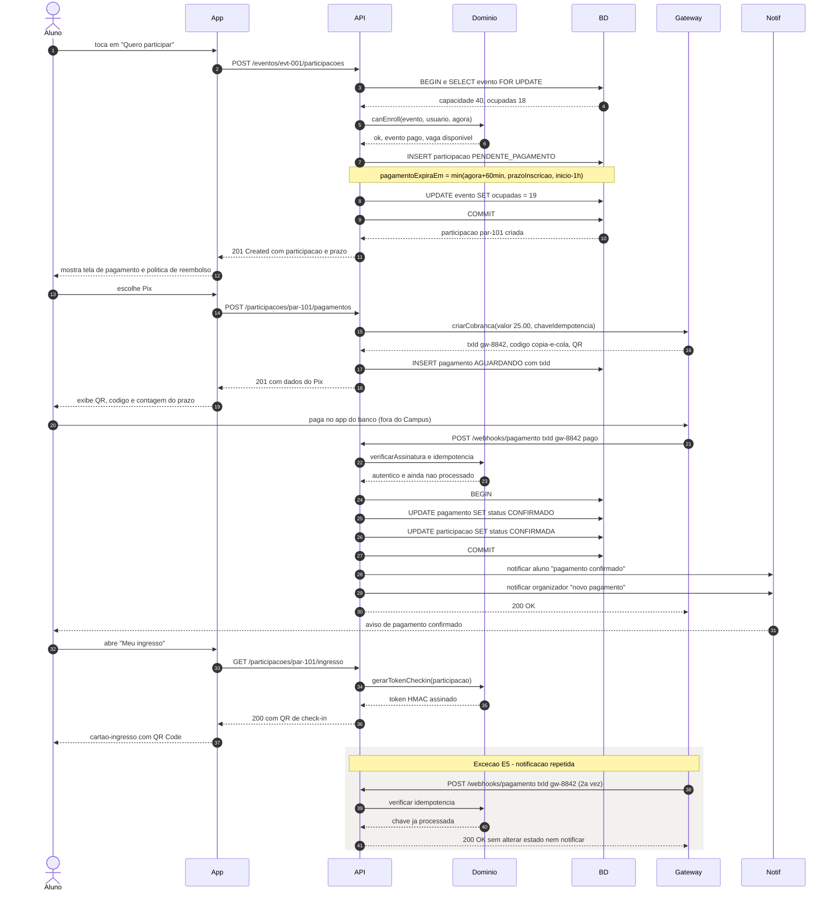
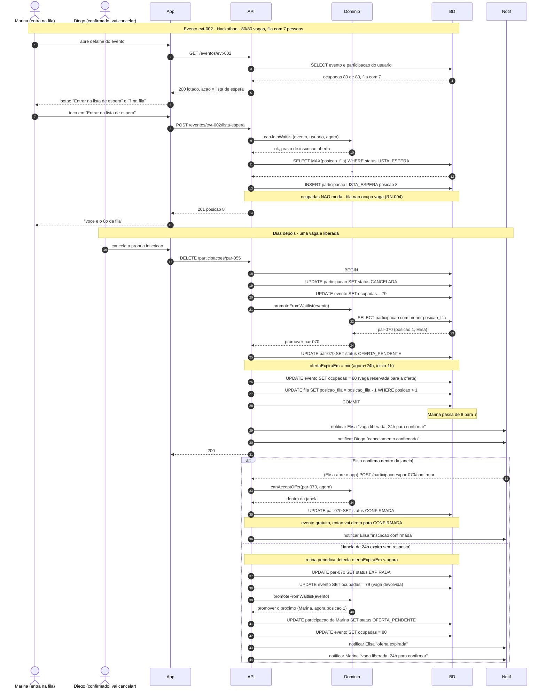
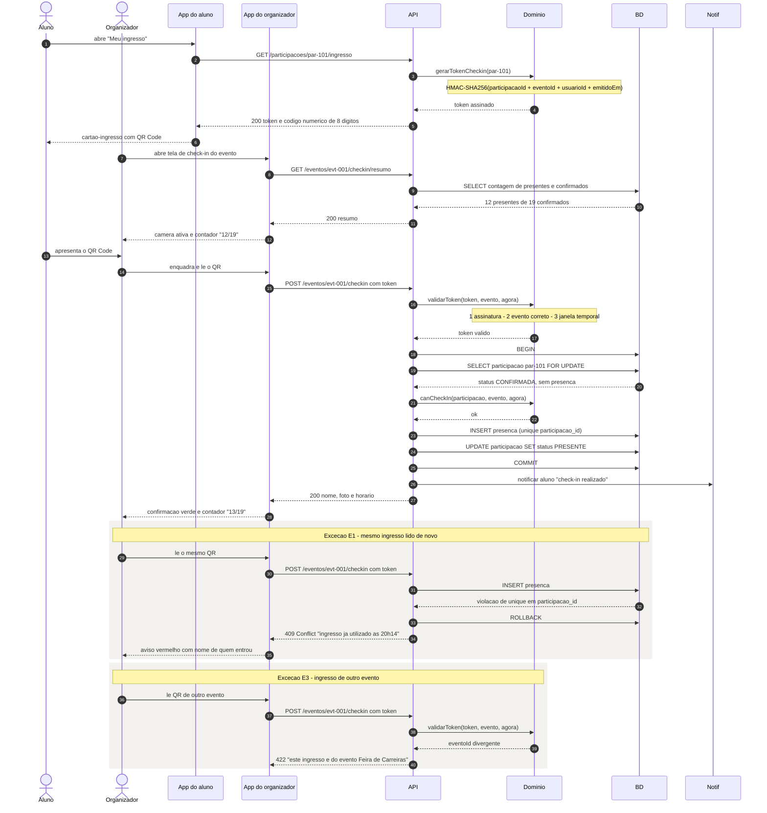

# Diagramas de sequência

**Responsável:** Ronaldo Veloso Filho · **Adianta requisito do CP5**

Três sequências, escolhidas porque são os fluxos onde **a ordem das mensagens é a regra
de negócio** — e onde inverter dois passos produz overbooking, cobrança dupla ou entrada
franqueada. Fluxos simples (listar eventos, editar perfil) não ganham nada com sequência
e por isso não estão aqui.

Participantes recorrentes:

| Participante | Papel |
|---|---|
| `Aluno` / `Organizador` | Ator humano |
| `App` | Front-end React (`app/`) |
| `API` | Camada de aplicação — no CP5, os repositórios com MSW |
| `Dominio` | Regras puras de `app/src/domain/` |
| `BD` | Persistência (mock em memória no CP5, PostgreSQL no CP6) |
| `Gateway` | Gateway de pagamento (externo) |
| `Notif` | Serviço de notificação (externo) |

---

## 1. Inscrição em evento pago, com Pix e confirmação assíncrona

Cobre UC-002 + UC-003 · Regras: RN-004, RN-012, RN-014 · Requisitos: RF-019, RF-028, RF-029

### Por que esta ordem

**A vaga é reservada antes da cobrança (passos 3 a 11), não depois.** Se a cobrança viesse
primeiro, dois alunos poderiam pagar pela mesma última vaga e um deles teria de ser
estornado — transformando um problema de contagem em um problema de dinheiro. Reservar
primeiro converte o pior caso em "vaga presa por 60 minutos", que a janela de
[RN-012](../04-regras-de-negocio.md) limita e a fila de espera aproveita.

**A confirmação vem do gateway, nunca do app (passo 21).** O app do aluno não é fonte
confiável para dizer "paguei". A notificação assíncrona é a única transição para
`CONFIRMADO` ([RN-014](../04-regras-de-negocio.md)), e é por isso que o fluxo continua
funcionando se o aluno fechar o app no passo 20.

**A idempotência é verificada antes de qualquer escrita (passo 22).** O bloco destacado
mostra o caso real: gateways reenviam notificação. Sem a checagem, o aluno receberia duas
notificações e o organizador contaria o pagamento duas vezes.

**O token do QR é gerado na leitura do ingresso (passo 30), não na confirmação.** Assim
ele não precisa ser armazenado, e a validade temporal é sempre calculada contra o horário
atual (RNF-011).

---

## 2. Evento lotado: lista de espera, vaga liberada e promoção

Cobre UC-004 · Regras: RN-006, RN-007, RN-008 · Requisitos: RF-024, RF-025, RF-026

### Por que esta ordem

**A promoção acontece na mesma transação do cancelamento (passos 19 a 28).** Se fosse um
trabalho assíncrono posterior, existiria uma janela em que a vaga está livre e ninguém foi
avisado — exatamente a "vaga que evapora" que o produto promete resolver.

**A vaga é reservada para a oferta (passo 25: `ocupadas` volta a 80).** Contraintuitivo,
mas necessário: durante as 24 h da oferta, ninguém mais pode tomar aquela vaga. Sem essa
reserva, um aluno que confirmasse a oferta poderia descobrir que a vaga já era de outro —
e o overbooking de [RN-004](../04-regras-de-negocio.md) voltaria pela janela.

**Uma oferta por vaga liberada.** O caminho "ofereço a três para garantir que um
confirme" foi recusado: geraria três pessoas com direito à mesma vaga.

**Expiração devolve a vaga e recomeça o processo (ramo `else`).** É o único ponto em que
`ocupadas` diminui sem cancelamento humano, e o motivo de o índice
`ix_participacao_oferta` existir no [modelo de dados](03-modelo-dados-er.md).

---

## 3. Check-in por QR Code na porta do evento

Cobre UC-005 · Regras: RN-017, RN-018 · Requisitos: RF-033, RF-034 · RNF-011

### Por que esta ordem

**A unicidade é garantida pelo banco (exceção E1, passo do `INSERT`), não por um `SELECT`
anterior.** Com dois operadores lendo QRs em paralelo, um `SELECT` "existe presença?"
seguido de `INSERT` tem janela de corrida — dois check-ins passariam. A restrição única em
`presenca.participacao_id` fecha essa janela: o segundo `INSERT` falha, o `ROLLBACK`
desfaz tudo e a resposta é `409` com o horário do check-in original.

**O token é validado antes de tocar o banco (passos 17 a 19).** Token adulterado ou de
outro evento é rejeitado sem consultar nada, o que mantém a leitura abaixo do limite de
2 s exigido na porta e evita usar o banco como oráculo para tentativa de fraude.

**Cada recusa tem código e mensagem próprios** — `409` para ingresso usado, `422` para
evento errado, `403` para operador sem permissão. Na porta de um evento com fila, "erro
ao validar" não é resposta: o operador precisa saber se deve chamar o próximo ou o
segurança.

---

## 4. Como estas sequências viram teste

| Sequência | Teste automatizado | Onde |
|---|---|---|
| 1 — inscrição com Pix | CT-007 (janela de pagamento), CT-010 (notificação idempotente) | `payment.test.ts` |
| 1 — reserva antes da cobrança | CT-001, CT-020 (concorrência pela última vaga) | `capacity.test.ts` |
| 2 — promoção FIFO | CT-004 (promove o primeiro), CT-005 (posições avançam) | `waitlist.test.ts` |
| 2 — expiração de oferta | CT-006 (passa ao próximo) | `waitlist.test.ts` |
| 3 — uso único do QR | CT-023 (segunda leitura recusada) | `checkin.test.ts` |
| 3 — token de outro evento | CT-022 (validação do token) | `checkin.test.ts` |
| 1 — fluxo ponta a ponta | E2E: abrir feed, abrir evento, inscrever-se, ver confirmação | `e2e/inscricao.spec.ts` |
