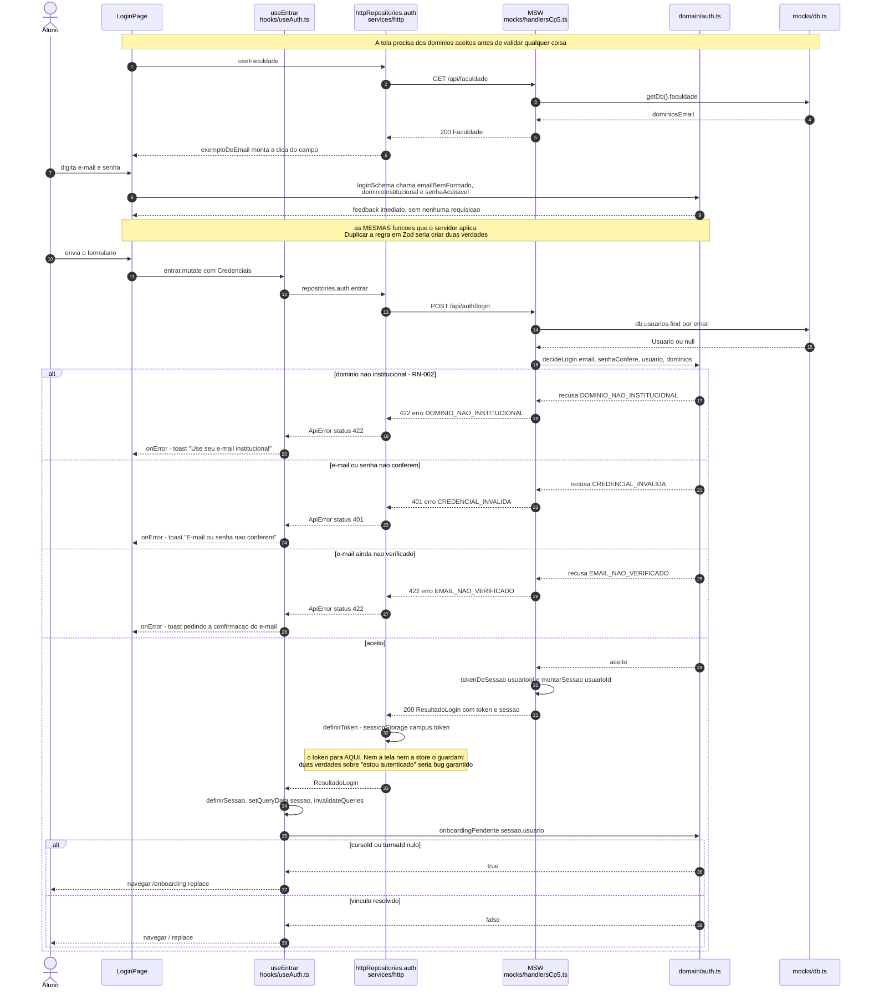
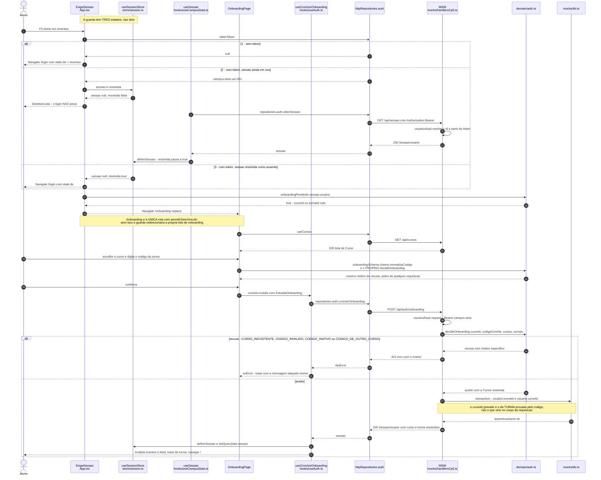
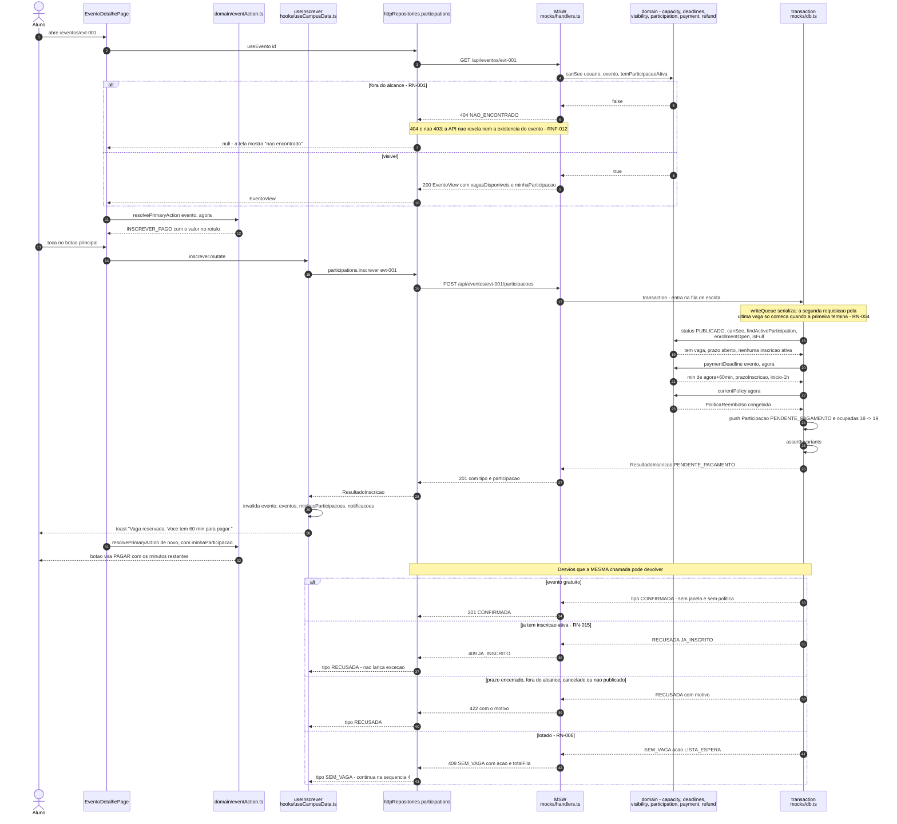
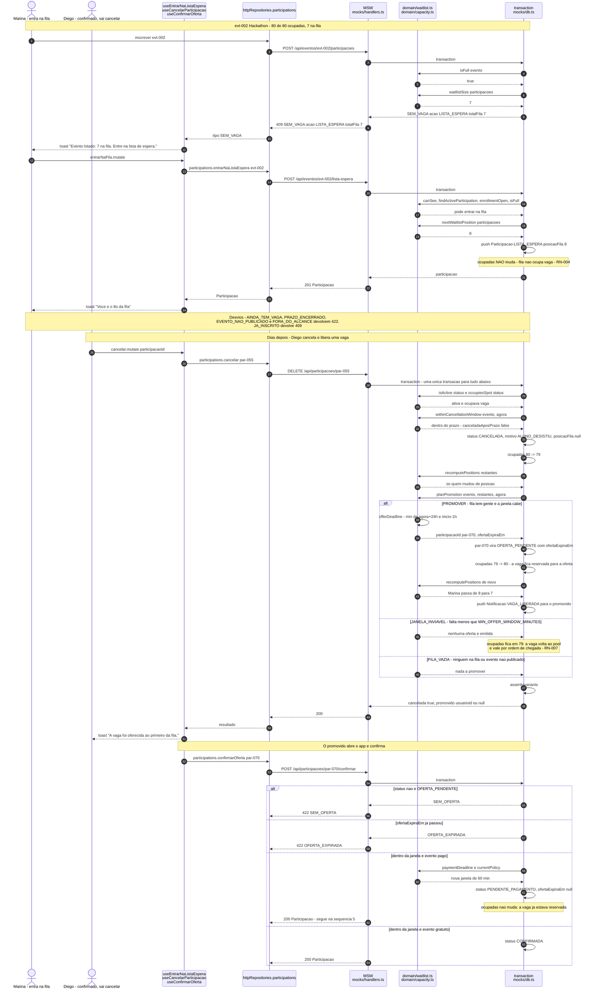
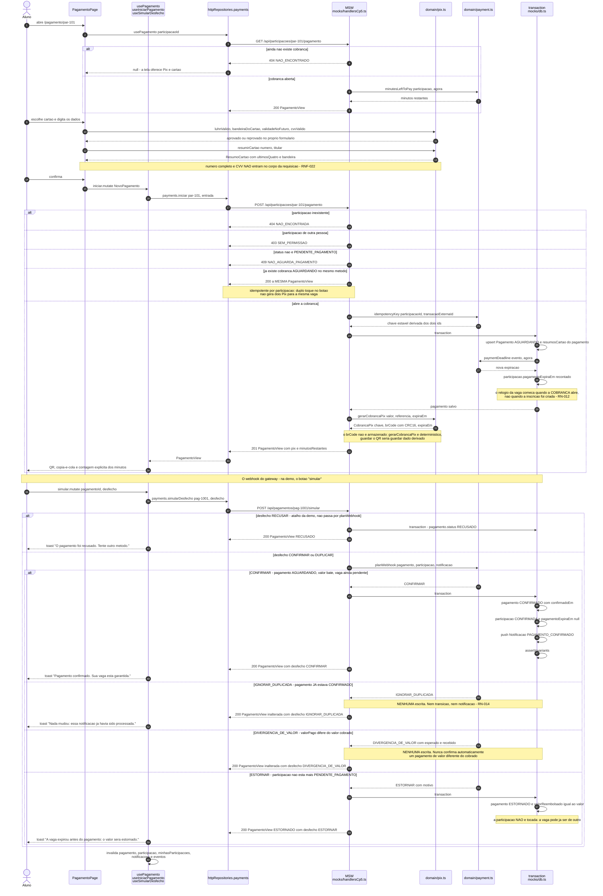
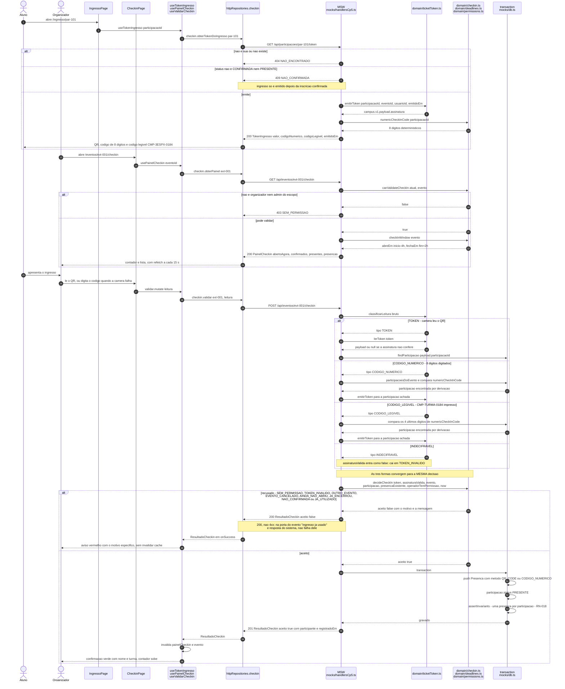
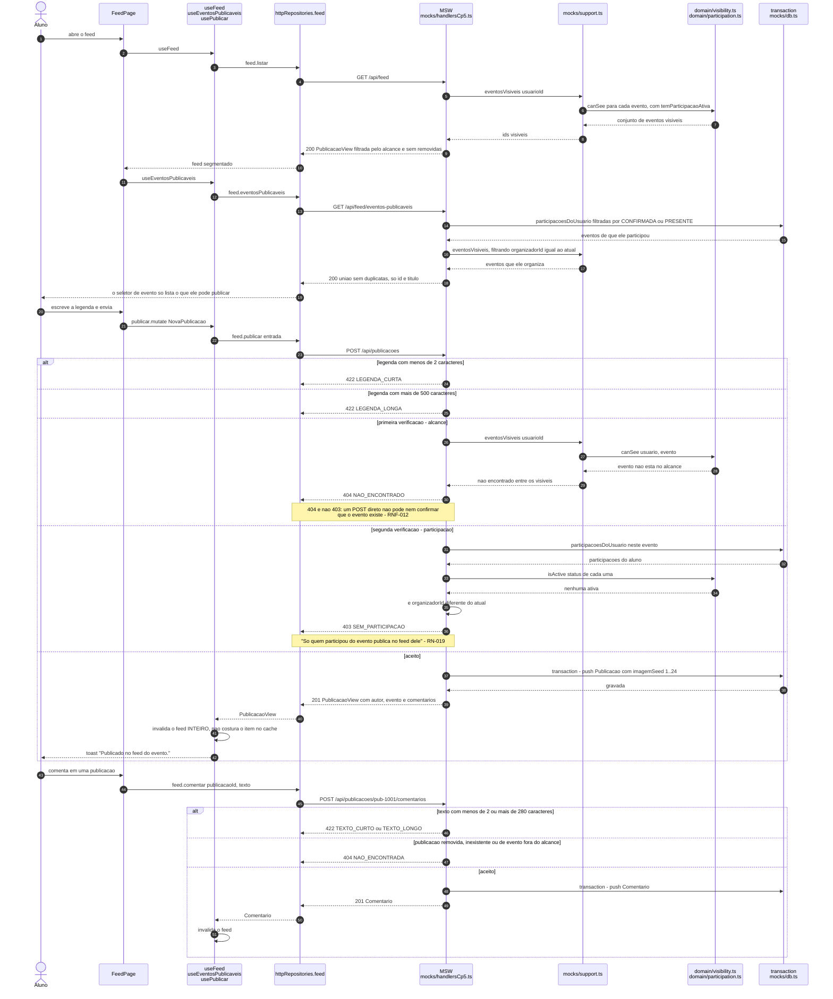

# Diagramas de sequência

**Responsável:** Ronaldo Veloso Filho · **Exigido no CP5**

## Histórico de revisões

| Versão | Data | Checkpoint | O que mudou |
|---|---|---|---|
| 1.0 | 2026-09-01 | CP4 | Três sequências desenhadas a partir da **intenção** do produto: Pix com webhook, lista de espera e check-in por QR. Participantes genéricos (`App`, `API`, `Dominio`, `BD`, `Gateway`, `Notif`) e nomes de função hipotéticos |
| 2.0 | 2026-09-02 | CP5 | Sete sequências desenhadas a partir do **código que existe**. Participantes passam a ser os arquivos reais; toda função citada existe em `app/src/domain/`; todo endpoint e todo código de status são os de `app/src/mocks/`. Novas: login, onboarding com a guarda de três estados, inscrição com vaga, pagamento simulado, check-in e publicação no feed |

## O que estas sequências descrevem

Cada diagrama mostra **a cadeia inteira, de ponta a ponta**:

```
tela  ->  hook  ->  repositorio  ->  endpoint  ->  funcao de dominio  ->  transacao
```

e a volta, com o **código de status real** e a **resposta de desvio real**. Nome de
arquivo, de hook, de função e de endpoint aparecem exatamente como estão no código —
divergência entre este documento e `app/src/` é defeito, não detalhe.

Foram escolhidos os fluxos em que **a ordem das mensagens é a regra de negócio**, e onde
inverter dois passos produz overbooking, cobrança dupla ou entrada franqueada. Listar
eventos e editar perfil não ganham nada com sequência e por isso não estão aqui.

### Participantes e o que cada um é no código

| Participante | Arquivo | Papel |
|---|---|---|
| `Tela` | `app/src/pages/*.tsx` | Componente de página. Não conhece HTTP nem o mock |
| `Hook` | `app/src/hooks/*.ts` | Ponte tela → dados. Política de cache e de invalidação |
| `Svc` | `app/src/services/http/index.ts` | Implementação dos repositórios. Monta `Authorization: Bearer`, converte erro em `ApiError` |
| `API` | `app/src/mocks/handlers.ts` e `handlersCp5.ts` | "API" do CP5 sobre MSW. Devolve os mesmos status da API do CP6 |
| `Sup` | `app/src/mocks/support.ts` | Fronteira do mock: `usuarioAtual`, `eventosVisiveis`, `erro`, projeções |
| `Dom` | `app/src/domain/*.ts` | Funções puras de decisão. Nenhuma escreve nada |
| `BD` | `app/src/mocks/db.ts` | Estado em memória + `transaction()` serializada + `assertInvariants()` |

Duas propriedades do `BD` valem para **todas** as sequências abaixo:

- **`transaction()` serializa as escritas.** É a versão em memória do `SELECT ... FOR UPDATE`
  de [RN-004](../04-regras-de-negocio.md): duas inscrições simultâneas para a última vaga
  produzem exatamente uma confirmação (RNF-013, CT-020).
- **`assertInvariants()` roda ao fim de cada transação** e estoura se `ocupadas > capacidade`,
  se houver duas participações ativas do mesmo aluno no mesmo evento (RN-015) ou duas
  presenças para a mesma participação (RN-018).

---

## 1. Login

Cobre UC-007 · Regras: RN-002 · Requisitos: RF-002, RF-003
Código: `LoginPage`, `useEntrar`, `AuthRepository.entrar`, `POST /api/auth/login`, `decideLogin`



### Leitura do diagrama

`decideLogin` decide **as três recusas e a ordem delas**; o handler decide apenas o
**status HTTP** de cada uma. Essa separação é o motivo de a mesma função servir ao
formulário (feedback imediato, sem rede) e ao servidor (autoridade) sem duplicar a regra.

A ordem das verificações é a ordem do que a pessoa consegue corrigir: domínio errado é
"conta errada", credencial inválida é "erro de digitação", e-mail não verificado é
"pendência de ação anterior".

**Na prática, `422 DOMINIO_NAO_INSTITUCIONAL` quase nunca chega à tela** —
`features/auth/loginSchema.ts` chama `dominioInstitucional` no `refine` do Zod e barra antes
do envio. O ramo continua no diagrama porque a autoridade é o servidor (RNF-012): um `curl`
direto tem de receber a mesma recusa, e é isso que o desenho documenta.

### Por que esta ordem

**`401` para credencial e `422` para domínio, e não `401` para tudo.** Um é "tente de
novo", o outro é "esta conta nunca vai servir" — e a tela reage diferente: no primeiro
caso mantém o e-mail e limpa a senha, no segundo explica quais domínios são aceitos.
Colapsar os dois em `401` apagaria a informação de que o aluno usou o Gmail pessoal.

**O token é guardado pela camada de serviço, dentro de `entrar` (passo 24).** Quem chama
`entrar` recebe a sessão pronta e não precisa saber que existe cabeçalho `Authorization`.
No CP6 o valor passa a ser um JWT assinado e **nada acima desta camada muda**
([ADR-0003](../adr/0003-camada-de-repositorio-com-msw.md)).

**`sessionStorage`, não `localStorage`.** Fechar a aba encerra a sessão — o comportamento
certo para app usado em computador de laboratório compartilhado, que é o cenário real das
personas (RNF-020).

**O destino depois do login é decidido por `onboardingPendente`, não pela tela.** Mandar
para o feed quem não tem turma produziria uma tela vazia sem explicação: sem vínculo,
`canSee` não deixa nenhum evento de turma ou de curso passar (RF-004).

---

## 2. Onboarding do primeiro acesso e a guarda de três estados

Cobre UC-008 · Regras: RN-003 · Requisitos: RF-004, RF-005
Código: `ExigeSessao` em `App.tsx`, `useSessao`, `OnboardingPage`, `useConcluirOnboarding`,
`POST /api/auth/onboarding`, `decideOnboarding`



### Leitura do diagrama

Os três ramos do primeiro `alt` **são** a guarda `ExigeSessao`. O ramo 2 é o que não
existia no CP4: tratar "carregando" como "não autenticado" fazia o F5 em qualquer rota
profunda piscar o login e perder o destino.

`state.de` é o que devolve a pessoa para onde ela estava — e é por isso que o redirecionamento
carrega `pathname` em vez de mandar todo mundo para a raiz.

`resolvida` na store separa **"ainda não sei"** de **"sei que não há sessão"**. Sem essa
distinção, a guarda não tem como escolher entre esqueleto e redirecionamento.

### Por que esta ordem

**A invalidação do cache acontece depois de `definirSessao`, não antes.** O onboarding
muda o vínculo, e o vínculo muda o que `canSee` deixa passar: a lista de eventos e o feed
que estavam em cache foram calculados para um usuário **sem turma**. Invalidar antes de a
sessão nova estar na store recarregaria com o vínculo velho.

**Quatro motivos de recusa, não um.** "Código de outro curso" é o erro que o aluno comete
quando escolhe o curso errado na tela anterior — e a mensagem genérica o deixaria preso
tentando o mesmo código. O motivo específico diz para onde voltar
([RN-003](../04-regras-de-negocio.md)).

**Todos os quatro motivos são `422`, nenhum é `404`.** Código inexistente não é "recurso
não encontrado": é entrada inválida em um formulário. `404` faria a tela mostrar
"não encontrado" em vez de marcar o campo.

**`/onboarding` exige sessão e mesmo assim é permitida sem vínculo.** É o único destino
autorizado enquanto curso e turma não estão resolvidos. Sem o `permitirSemVinculo`, a
guarda entraria em laço: `/onboarding` → vínculo pendente → `/onboarding`.

---

## 3. Inscrição com vaga disponível

Cobre UC-002 · Regras: RN-001, RN-004, RN-009, RN-012, RN-013, RN-015 · Requisitos: RF-019, RF-020
Código: `EventoDetalhePage`, `resolvePrimaryAction`, `useInscrever`,
`POST /api/eventos/:id/participacoes`, `transaction`



### Leitura do diagrama

**Tudo o que decide a inscrição acontece DENTRO da transação.** As cinco verificações
(`status`, `canSee`, `findActiveParticipation`, `enrollmentOpen`, `isFull`), o cálculo dos
prazos e as duas escritas — `push` da participação e `ocupadas += 1` — estão no mesmo
`transaction()`. Verificar fora e escrever dentro reabriria a corrida que RN-004 fecha.

**A camada de serviço converte recusa em resultado, não em exceção.** `inscrever` captura
`ApiError` e devolve `{ tipo: 'SEM_VAGA' }` ou `{ tipo: 'RECUSADA' }`. Exceção fica reservada
ao que a tela não sabe tratar: falha de rede, `500`, `401`. É essa separação que permite a
tela mostrar a mensagem certa em vez de "algo deu errado".

**`resolvePrimaryAction` é chamada duas vezes:** antes e depois da mutação. O botão não é
"inscrever-se" com estados — ele é **derivado** do estado atual da participação, e por isso
muda sozinho quando o cache é invalidado.

### Por que esta ordem

**A vaga é reservada antes da cobrança.** Se a cobrança viesse primeiro, dois alunos
poderiam pagar pela mesma última vaga e um deles teria de ser estornado — transformando
um problema de contagem em um problema de dinheiro. Reservar primeiro converte o pior caso
em "vaga presa por 60 minutos", que a janela de [RN-012](../04-regras-de-negocio.md) limita
e a fila de espera aproveita.

**`PENDENTE_PAGAMENTO` ocupa vaga de propósito.** `occupiesSpot` inclui esse estado:
reservar sem segurar a vaga permitiria vender a mesma vaga duas vezes.

**A política de reembolso é congelada na criação da participação, não lida do evento.**
`politicaVigente` guarda `currentPolicy(agora)`. Se o organizador mudar a política depois,
quem já se inscreveu mantém a que aceitou ([RN-013](../04-regras-de-negocio.md)).

**`409` para "já inscrito" e `422` para o resto.** `409` é conflito com o estado atual do
recurso — existe uma inscrição sua ali. Prazo encerrado e fora do alcance não são conflito:
são entrada inválida.

---

## 4. Evento lotado: lista de espera, oferta e confirmação

Cobre UC-004 · Regras: RN-006, RN-007, RN-008 · Requisitos: RF-024, RF-025, RF-027
Código: `useEntrarNaListaEspera`, `useCancelarParticipacao`, `useConfirmarOferta`,
`nextWaitlistPosition`, `planPromotion`, `offerDeadline`, `recomputePositions`



### Leitura do diagrama

**A promoção acontece na mesma transação do cancelamento.** Se fosse um trabalho
assíncrono posterior, existiria uma janela em que a vaga está livre e ninguém foi avisado —
exatamente a "vaga que evapora" que o produto promete resolver.

**`recomputePositions` é chamada duas vezes.** Uma vez depois do cancelamento (porque quem
saiu pode ter estado na fila) e outra depois da promoção (porque o promovido deixa a fila).
Devolve **só quem muda**, e não a fila inteira.

**`planPromotion` tem três desfechos, não um.** `JANELA_INVIAVEL` é o que o CP4 não previa:
oferta com menos de `MIN_OFFER_WINDOW_MINUTES` não é emitida, e a vaga volta a valer por
ordem de chegada. Emitir uma oferta de 3 minutos seria oferecer o que ninguém consegue aceitar.

### Por que esta ordem

**A vaga é reservada para a oferta — `ocupadas` volta a 80.** Contraintuitivo, mas
necessário: durante as 24 h da oferta ninguém mais pode tomar aquela vaga. Sem essa reserva,
quem confirmasse a oferta poderia descobrir que a vaga já era de outro, e o overbooking de
[RN-004](../04-regras-de-negocio.md) voltaria pela janela.

**Uma oferta por vaga liberada.** O caminho "ofereço a três para garantir que um confirme"
foi recusado: geraria três pessoas com direito à mesma vaga.

**`planPromotion` não escreve nada.** É função pura de decisão; quem aplica é o handler,
na mesma transação. É o que a torna testável exaustivamente (CT-004 a CT-006) sem montar
banco nem servidor.

**Confirmar oferta em evento pago devolve `PENDENTE_PAGAMENTO`, não `CONFIRMADA`.** Aceitar
a vaga não paga a vaga: abre a janela de [RN-012](../04-regras-de-negocio.md) de novo, com
`paymentDeadline` recontado a partir de agora.

### Divergência do CP4 anotada aqui

O CP4 desenhava um ramo `else` com **rotina periódica** expirando a oferta
(`OFERTA_PENDENTE → EXPIRADA`) e devolvendo a vaga. **No CP5 esse ramo não existe.**
`offerExpired()` e `paymentExpired()` existem em `domain/`, são testadas, e **nenhum
handler as chama**: não há processo agendado no navegador. Por isso ele não está no
diagrama — ver a seção "Transições que o CP5 ainda não executa" em
[`06-diagrama-estados.md`](06-diagrama-estados.md).

---

## 5. Pagamento simulado: cobrança, webhook e os quatro desfechos

Cobre UC-003 · Regras: RN-012, RN-014, **RN-026, RN-027, RN-028** · Requisitos: RF-026 a RF-030
Decisões: [ADR-0006](../adr/0006-abstracao-de-gateway-de-pagamento.md)
Código: `PagamentoPage`, `usePagamento`, `useIniciarPagamento`, `useSimularDesfecho`,
`POST /api/participacoes/:id/pagamento`, `POST /api/pagamentos/:id/simular`,
`gerarCobrancaPix`, `paymentDeadline`, `minutesLeftToPay`, `planWebhook`



### Leitura do diagrama

**Quatro desfechos de `planWebhook`, e dois deles não escrevem nada.**
`IGNORAR_DUPLICADA` e `DIVERGENCIA_DE_VALOR` devolvem `200` com a projeção **inalterada**.
Isso não é um caminho de erro: é exatamente o comportamento que
[RN-014](../04-regras-de-negocio.md) exige. Gateway reenvia notificação; sem a checagem, o
aluno receberia duas notificações e o organizador contaria o pagamento duas vezes.

**A ordem das verificações dentro de `planWebhook` não é acidental:**

1. duplicada → não repete transição nem notificação;
2. valor divergente → nunca confirma automaticamente;
3. participação já encerrada → estorna, porque a vaga pode já ser de outro.

**Nenhum desfecho devolve `201`.** A cobrança (`POST .../pagamento`) devolve `201` quando
cria e `200` quando reaproveita a existente. O webhook devolve sempre `200`: ele não cria
recurso, só relata um fato externo.

**A cobrança Pix é derivada, não armazenada.** `gerarCobrancaPix` é determinística sobre
`(valor, referencia, expiraEm)`. Guardar o `brCode` desalinharia o QR do valor na primeira
alteração de preço. `PagamentoView.pix` só é preenchido quando `metodo === 'PIX'` **e**
`status === 'AGUARDANDO'` — QR de cobrança já paga é convite a pagar duas vezes.

### Por que esta ordem

**A janela de RN-012 é recontada quando a cobrança abre, não quando a inscrição nasce.**
`paymentDeadline` é chamada nos dois momentos, e a segunda chamada sobrescreve a primeira.
O relógio da vaga começa quando o aluno de fato tem um QR na tela — caso contrário, quem
demorasse cinco minutos para escolher o método receberia 55.

**A idempotência vive em dois lugares diferentes, de propósito.** Na abertura da cobrança
ela é por **participação** (mesma cobrança devolvida em vez de duas criadas); no webhook
ela é por **estado do pagamento** (`status === 'CONFIRMADO'` → ignora). São defeitos
diferentes: duplo toque no botão versus reenvio do gateway.

**A confirmação vem do webhook, nunca da tela.** O app do aluno não é fonte confiável para
dizer "paguei". A única transição para `CONFIRMADO` passa por `planWebhook`, e é por isso
que o fluxo continua correto se o aluno fechar o app depois de escanear o QR.

**O cartão é reduzido no cliente, antes de qualquer requisição.** `resumirCartao` roda na
tela: número completo e CVV não entram no corpo, não passam pelo MSW e não existem no
`db.ts` (RNF-022).

### Duas honestidades sobre a simulação

- **`DESFECHO_SIMULADO` tem três valores** (`CONFIRMAR`, `RECUSAR`, `DUPLICAR`), e
  `planWebhook` tem **quatro** desfechos mais `DESCONHECIDO`. Não é o mesmo conjunto:
  o enum é o **gatilho** da demo, os desfechos são a **decisão** do domínio.
- `CONFIRMAR` e `DUPLICAR` entram no **mesmo caminho** do handler. A idempotência aparece
  porque a segunda chamada encontra o pagamento já `CONFIRMADO`, não porque o corpo disse
  "duplicar" — o que é mais fiel ao gateway real, que também não avisa que está reenviando.
  `DIVERGENCIA_DE_VALOR` é, hoje, alcançável apenas pelo teste unitário de `planWebhook`:
  o handler envia `valorPago = pagamento.valor`.

---

## 6. Check-in na porta do evento

Cobre UC-005, UC-017 · Regras: RN-017, RN-018, **RN-029** · Requisitos: RF-033, RF-034, RF-035
Código: `IngressoPage`, `useTokenIngresso`, `CheckinPage`, `usePainelCheckin`,
`useValidarCheckin`, `GET /api/participacoes/:id/token`, `GET` e `POST /api/eventos/:id/checkin`,
`classificarLeitura`, `emitirToken`, `lerToken`, `decideCheckIn`, `canValidateCheckIn`



### Leitura do diagrama

**As sete condições de [RN-017](../04-regras-de-negocio.md) estão em `decideCheckIn`, na
ordem em que ficam mais baratas e mais informativas:**

| Ordem no código | Motivo devolvido | Condição de RN-017 |
|---|---|---|
| 1 | `SEM_PERMISSAO` | 1 — quem lê é organizador ou admin do escopo |
| 2 | `TOKEN_INVALIDO` | 2 — assinatura válida |
| 3 | `OUTRO_EVENTO` | 3 — `eventoId` do token igual ao da leitura |
| 4 | `EVENTO_CANCELADO` | 4 — condição **acrescentada no CP5** pelo código |
| 5 | `AINDA_NAO_ABRIU` / `JA_ENCERROU` | 5 — janela temporal |
| 6 | `TOKEN_INVALIDO` | 2 — token íntegro, mas a participação não existe |
| 7 | `JA_UTILIZADO` | 6 — nenhuma presença já registrada |
| 8 | `NAO_CONFIRMADA` | 7 — participação em `CONFIRMADA` |

A permissão vem **primeiro** porque é a única verificação que não depende de nada lido:
recusar sem tocar em token nem em banco não dá pista nenhuma a quem tenta fraudar.

**`EVENTO_CANCELADO` não estava no CP4.** O código a acrescentou, e o código está certo:
sem ela, um evento cancelado com ingressos já emitidos aceitaria presença. RN-017 foi
corrigida de 6 para 7 condições por causa disto.

**A unicidade vem antes do status, e isso foi corrigido no CP5.** O aceite grava a
`Presenca` **e** muda a participação para `PRESENTE` na mesma transação — logo, na segunda
leitura do mesmo ingresso as duas condições estão violadas ao mesmo tempo. Com a ordem
anterior (status antes de unicidade), a resposta era `NAO_CONFIRMADA` com a mensagem
"Check-in já registrado.", e **`JA_UTILIZADO` era ramo morto**: o motivo que RN-018 existe
para produzir, e o único que carrega o **horário do primeiro uso**, nunca chegava a quem
consome a API.

O defeito foi visto na porta simulada, no navegador, e a ordem foi invertida em
[`domain/checkin.ts`](../../app/src/domain/checkin.ts). Hoje a segunda leitura devolve
`JA_UTILIZADO` com "Ingresso já utilizado às 19:13." — que é o que o operador precisa ler.
A troca é segura porque a presença tem relação 1:1 com a participação: existir presença já
implica que a entrada aconteceu, e `PRESENTE` sem linha de presença continua caindo na
condição de status. Teste de regressão nomeado em `checkin.test.ts`, "unicidade responde
ANTES do status".

**`200` na recusa, `201` no aceite.** O aceite cria um recurso (`Presenca`); a recusa não
cria nada. Devolver `4xx` na recusa mandaria a resposta para `onError` do hook, onde a
tela mostraria "erro ao validar" — e na porta de um evento com fila isso não é resposta:
o operador precisa saber se chama o próximo ou o segurança.

**As três formas de leitura não têm tabela de códigos.** `codigoNumerico` e `codigoLegivel`
são **derivados** do id da participação por `numericCheckInCode`. Não há armazenamento para
dessincronizar, e a busca é por derivação. O preço é uma varredura em
`participacoesDoEvento` — aceitável no volume real e substituível por índice no CP6.

### Por que esta ordem

**A unicidade é verificada por `decideCheckIn` e garantida por `assertInvariants`.** A
verificação existe para dar a **mensagem certa** — "ingresso já utilizado às 20h14" —
antes de tentar escrever. A garantia é estrutural: `assertInvariants` estoura se houver
duas presenças para a mesma participação, e no CP6 é o índice único em
`presenca.participacao_id` que fecha a janela de corrida entre dois operadores lendo QRs
em paralelo ([RN-018](../04-regras-de-negocio.md)).

**A leitura é classificada antes de ser resolvida.** `classificarLeitura` não consulta
nada: é um `switch` sobre a forma do texto. Texto vazio ou lixo vira `INDECIFRAVEL` e
recebe `TOKEN_INVALIDO` sem uma consulta ao banco.

**O token é reemitido quando a entrada é código digitado.** As três formas precisam chegar
a `decideCheckIn` com o mesmo `CheckInTokenPayload`; reemitir a partir da participação
encontrada é o que unifica os caminhos sem duplicar a decisão.

**A recusa não invalida cache.** `useValidarCheckin` só invalida `painelCheckin` e `evento`
quando `resultado.aceito` é verdadeiro. Recusa não mudou nada — refazer as duas consultas
custaria latência na fila da porta sem trazer dado novo.

---

## 7. Publicar no feed do evento

Cobre UC-013, UC-014 · Regras: RN-001, RN-019 · Requisitos: RF-036, RF-037, RF-038
Código: `FeedPage`, `useFeed`, `useEventosPublicaveis`, `usePublicar`, `useComentar`,
`POST /api/publicacoes`, `POST /api/publicacoes/:id/comentarios`, `eventosVisiveis`, `canSee`, `isActive`



### Leitura do diagrama

**A verificação é dupla e as duas metades devolvem status diferentes.**

| Verificação | Função | Falha devolve |
|---|---|---|
| Alcance — o evento existe **para você**? | `eventosVisiveis` → `canSee` | `404 NAO_ENCONTRADO` |
| Participação — você **esteve** nele? | `isActive` sobre `participacoesDoUsuario`, ou `organizadorId` | `403 SEM_PARTICIPACAO` |

A ordem importa: verificar participação primeiro revelaria, pelo `403`, que o evento
existe. Com alcance primeiro, quem não pode ver recebe `404` e não aprende nada.

**A mesma verificação de alcance serve leitura e escrita.** `eventosVisiveis` é a função
que filtra o `GET /api/feed` **e** a que autoriza o `POST /api/publicacoes`. Sem isso, um
POST direto publicaria em evento invisível — o defeito clássico de esconder na UI e
esquecer no servidor (RNF-012).

**O comentário devolve `404` para "fora do alcance", nunca `403`.** Publicação de evento
que você não pode ver não é "proibido comentar": é "não existe para você".

### Por que esta ordem

**Publicar invalida o feed inteiro em vez de costurar o item novo no cache.** O feed é
segmentado por alcance, e quem decide se a publicação aparece — e em que posição — é o
servidor, não a tela. Inserir localmente mostraria a publicação para quem o `canSee` do
servidor excluiria.

**`eventosPublicaveis` existe para o seletor não oferecer o impossível.** Ele é a união de
"eventos de que participei com `CONFIRMADA` ou `PRESENTE`" e "eventos que eu organizo".
Sem ele, o aluno escolheria um evento na lista para receber `403` depois de escrever a
legenda.

### Divergência anotada aqui

Existem hoje **três** critérios de "quem pode publicar", e eles não coincidem:

| Onde | Critério |
|---|---|
| `POST /api/publicacoes` (autoridade) | `isActive(status)` **ou** ser o organizador |
| `GET /api/feed/eventos-publicaveis` (o que o seletor oferece) | `CONFIRMADA` ou `PRESENTE`, **ou** ser o organizador |
| `domain/permissions.ts#canPostToEvent` | `PRESENTE` **e** evento já começado, ou ser o organizador — **função não chamada por nenhum handler** |

`canPostToEvent` é a versão mais restrita e a mais fiel a
[RN-019](../04-regras-de-negocio.md); o handler é o que está no ar. **O código venceu no
diagrama** — está desenhado o que o handler faz. A convergência é dívida registrada para o
CP6, quando `canPostToEvent` passa a ser chamada pelo serviço de aplicação.

---

## 8. Como estas sequências viram teste

Tabela levantada dos arquivos de teste que **existem** hoje — os identificadores `CT-` foram
lidos dos próprios `it(...)`, não do plano de testes.

| Sequência | Caso de teste | Arquivo |
|---|---|---|
| 1 — login e as três recusas | CT-032 — `decideLogin` com domínio pessoal, senha errada e e-mail não verificado | `app/src/domain/auth.test.ts` |
| 2 — onboarding e os quatro motivos | CT-033 — `decideOnboarding` com código inválido, inativo, de outro curso e curso inexistente | `app/src/domain/auth.test.ts` |
| 3 — quem ocupa vaga | CT-001 — `occupiesSpot` para os oito estados | `app/src/domain/capacity.test.ts` |
| 3 — vaga e lotação a partir do seed | CT-002 — 18/40 tem 22 livres; 80/80 está lotado | `app/src/domain/capacity.test.ts` |
| 3 — janela de pagamento | CT-007 — `paymentDeadline` truncado pelo prazo e por `inicio - 1h` | `app/src/domain/payment.test.ts` |
| 3 — a inscrição pelo endpoint, com desvios | CT-002, CT-018, CT-003, CT-012, CT-027 — contra os handlers do MSW | `app/src/services/inscricao.test.ts` |
| 3 — concorrência pela última vaga | **CT-020 — 50 inscrições simultâneas confirmam exatamente uma** (RNF-013) | `app/src/services/inscricao.test.ts` |
| 3 — botão principal por estado | CT-003, CT-015, CT-027 — `resolvePrimaryAction` | `app/src/domain/eventAction.test.ts` |
| 4 — fila FIFO e posição de entrada | CT-003 — `orderedWaitlist`, `nextWaitlistPosition` | `app/src/domain/waitlist.test.ts` |
| 4 — promoção e janela da oferta | CT-004 — promove só o primeiro; janela truncada; janela inviável não emite oferta | `app/src/domain/waitlist.test.ts` |
| 4 — posições avançam | CT-005 — `recomputePositions` depois da promoção | `app/src/domain/waitlist.test.ts` |
| 4 — cancelar promove na mesma operação | CT-004, CT-005 — pelo endpoint `DELETE /api/participacoes/:id` | `app/src/services/inscricao.test.ts` |
| 5 — quatro desfechos do webhook | **CT-010 — `planWebhook` exaustivo, incluindo os dois que não escrevem** | `app/src/domain/payment.test.ts` |
| 5 — cobrança Pix e redução do cartão | CT-034, CT-035 — `gerarCobrancaPix`, CRC16, `resumirCartao` | `app/src/domain/pix.test.ts` |
| 6 — token do ingresso e as três leituras | CT-036, CT-037 — `emitirToken`, `lerToken`, `classificarLeitura` | `app/src/domain/ticketToken.test.ts` |
| 6 — as recusas de `decideCheckIn` e a ordem entre elas | CT-022, CT-023, CT-024 — cada condição com seu motivo, a ordem das verificações, a mensagem por status e os códigos de contingência | `app/src/domain/checkin.test.ts` |
| 7 — alcance como autoridade | CT-011 a CT-014 — `canSee` por turma, curso, faculdade e participação ativa | `app/src/domain/visibility.test.ts` |
| 7 — alcance na escrita do feed | ❌ **sem teste.** `POST /api/publicacoes` não é exercitado por nenhum teste de integração | — |
| 3 — fluxo ponta a ponta | E2E: abrir feed, abrir evento, inscrever-se, ver confirmação | `app/e2e/inscricao.spec.ts` |

**A lacuna que resta é a escrita no feed.** `POST /api/publicacoes` é o endpoint com a
verificação dupla mais delicada do CP5 — alcance com `404` e participação com `403` — e é o
único fluxo desenhado neste documento sem teste que exercite o handler. A sequência 7 é,
hoje, a especificação mais completa daquele comportamento, e é por isso que ela está
desenhada ramo por ramo, com os três critérios divergentes de "quem pode publicar"
tabelados. Ver [`../11-plano-de-testes.md`](../11-plano-de-testes.md).
