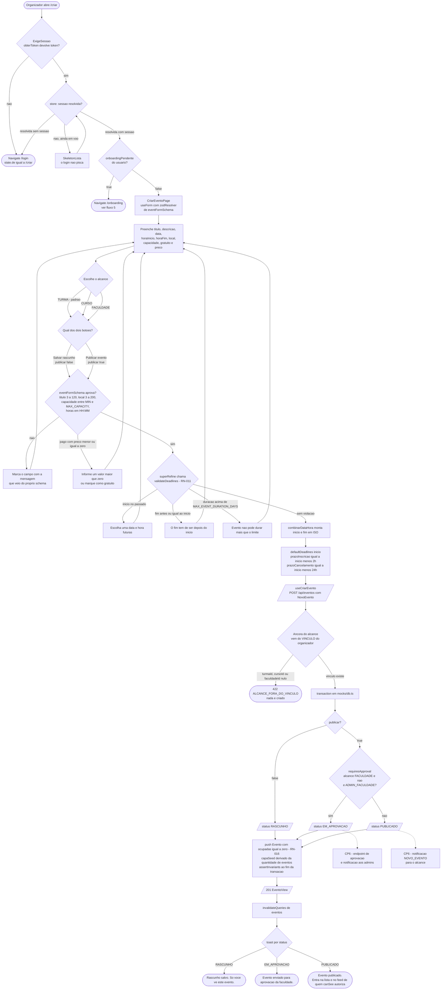
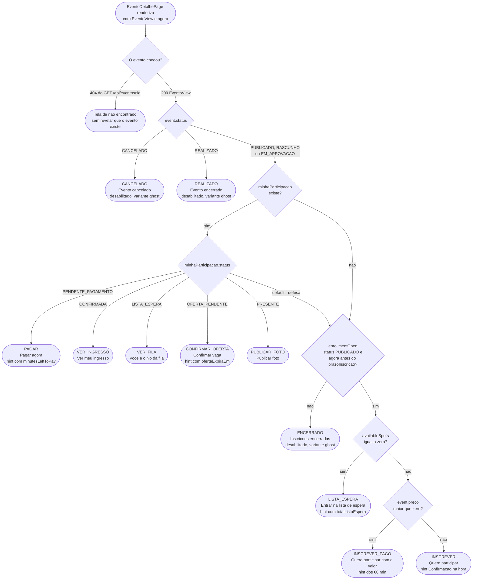
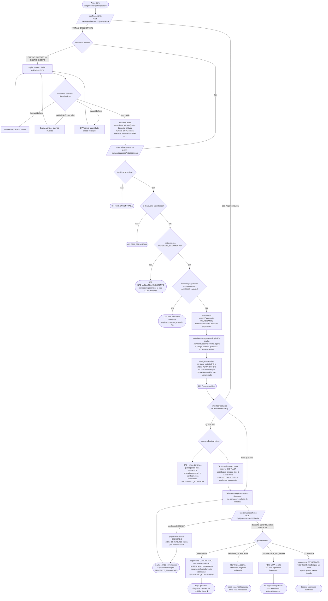
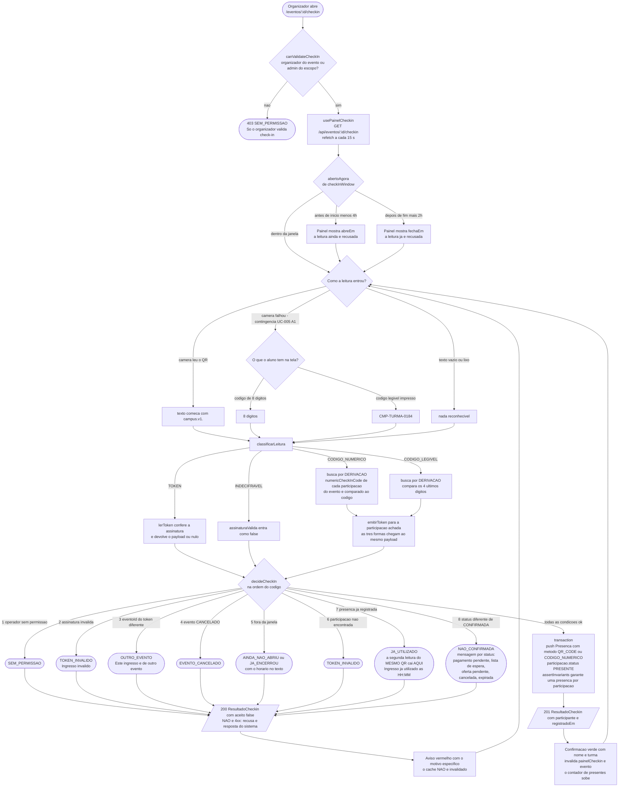
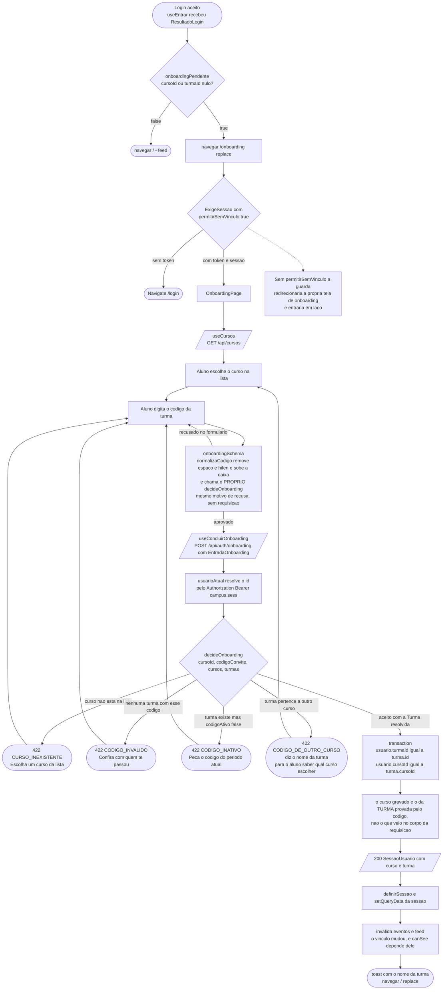

# Diagramas de atividade

**Responsável:** Ronaldo Veloso Filho · **Exigido no CP5**

## Histórico de revisões

| Versão | Data | Checkpoint | O que mudou |
|---|---|---|---|
| 1.0 | 2026-09-01 | CP4 | Dois fluxos, desenhados a partir da **intenção**: criação e publicação de evento, e decisão do botão principal com nove estados |
| 2.0 | 2026-09-02 | CP5 | Cinco fluxos, desenhados a partir do **código**. O de criação passa a mostrar a guarda de três estados, os prazos automáticos e as duas etapas que o CP5 não implementou; o do botão passa a ter os **onze** `PrimaryActionKind` reais. Novos: pagamento com a janela de RN-012, check-in na porta com a contingência do código digitado, e onboarding do primeiro acesso |
| 2.1 | 2026-09-02 | CP6 | Conferido: os cinco fluxos de decisão continuam válidos contra o contrato do CP6, porque descrevem **decisões**, e nenhuma decisão mudou — o que mudou é quem as executa. Os caminhos citados no texto foram reapontados: as funções de regra vivem em `packages/shared/src/domain/`, e `resolvePrimaryAction` continua em `app/src/domain/eventAction.ts`, porque é rótulo de botão e não domínio ([ADR-0008](../adr/0008-monorepo-com-dominio-compartilhado.md)) |

O ciclo de vida da `Participacao` — os 8 estados de `STATUS_PARTICIPACAO` e as transições
que o código executa — está em [`06-diagrama-estados.md`](06-diagrama-estados.md), que é
onde uma máquina de estados pertence. Este documento é sobre **decisões em sequência**,
não sobre estados.

---

## 1. Criar e publicar evento

Cobre UC-001 · Regras: RN-001, RN-003, RN-011, RN-016 · Requisitos: RF-010 a RF-012
Código: `CriarEventoPage`, `eventFormSchema`, `defaultDeadlines`, `useCriarEvento`,
`POST /api/eventos`, `requiresApproval`

### Leitura do diagrama

**Duas decisões do organizador, não três.** Alcance e cobrança. O CP4 previa uma terceira
— perguntas customizadas — e um passo de ajuste manual dos prazos: **nenhum dos dois existe
no formulário do CP5**. `eventFormSchema` não tem campo de pergunta nem de prazo, e
`defaultDeadlines` calcula os dois a partir do início, sempre.

**A validação é em duas camadas do mesmo schema.** O `z.object` cobre forma e faixa; o
`superRefine` chama `validateDeadlines` do domínio em vez de reimplementar RN-011. É o que
garante que a mensagem que o formulário mostra é a mesma que o servidor mostraria.

**A âncora de alcance nunca vem do corpo da requisição.** O handler a lê do vínculo do
organizador (`usuario.turmaId`, `.cursoId`, `.faculdadeId`). Aceitar a âncora do cliente
permitiria publicar um evento na turma de outra pessoa com um `curl`
([RN-001](../04-regras-de-negocio.md), invariante 2, RNF-012).

**Os dois nós pontilhados são o que o CP5 não faz.** Não há endpoint de aprovação, e
`POST /api/eventos` **não** enfileira notificação `NOVO_EVENTO`. `EM_APROVACAO` é um estado
que o CP5 sabe **criar** e não sabe **resolver** — está no diagrama assim, pontilhado, porque
omitir seria fingir que o fluxo fecha.

### Por que esta ordem

**O padrão é o menor alcance.** O formulário abre com `TURMA`. Errar para menos gera um
evento pouco divulgado; errar para mais expõe um churrasco de 40 pessoas à faculdade
inteira — que é literalmente o problema descrito em
[`../01-problema-e-personas.md`](../01-problema-e-personas.md). Padrão seguro é o que falha
para o lado barato.

**Validação em cascata, com retorno ao passo certo.** Cada erro volta para `FILL`
preservando o resto do preenchimento — é o `useForm` que mantém os valores. Formulário
longo que apaga tudo em um erro é a forma mais eficiente de perder o organizador.

**A aprovação é um desvio, não uma etapa.** `requiresApproval` só devolve `true` para
`alcance = FACULDADE` de quem não é `ADMIN_FACULDADE`
([RN-003](../04-regras-de-negocio.md)). Modelar aprovação como etapa obrigatória de todo
evento adicionaria fricção em 90% dos casos para resolver um risco que existe em 10%.

**`ocupadas` nasce em zero, e o organizador não é inscrito.** Criar evento não é
participar dele ([RN-016](../04-regras-de-negocio.md)) — o que também é o motivo de
`canPostToEvent` e o handler do feed tratarem organizador como caso separado.

---

## 2. Decisão da ação principal do detalhe do evento

Cobre UC-011 · Requisitos: RF-016
Código: `resolvePrimaryAction` em `app/src/domain/eventAction.ts`, consumido por `EventoDetalhePage`

Este diagrama **é** a especificação de `resolvePrimaryAction`. Os onze destinos são os onze
valores de `PrimaryActionKind`, na ordem exata em que a função os testa.

### Leitura do diagrama

**Onze destinos, cada um com rótulo, dica e variante próprios.** O ganho é direto: o aluno
nunca toca em um botão para descobrir que não podia. E `K9` é o desvio de
[RN-006](../04-regras-de-negocio.md) — "lotado" não é erro, é outro caminho.

**`minhaParticipacao` só chega com estado ATIVO.** `toEventoView` a preenche com
`findActiveParticipation`, que filtra por `isActive`. Consequência: `CANCELADA`, `EXPIRADA`
e `AUSENTE` **nunca** entram no `switch` — o ramo `default` existe como defesa, não como
caminho. É por isso que, depois de cancelar, o botão volta a `INSCREVER` em vez de mostrar
"cancelado".

**`RASCUNHO` e `EM_APROVACAO` caem em `ENCERRADO`.** Não há ramo próprio: `enrollmentOpen`
devolve `false` para qualquer status diferente de `PUBLICADO`, e o botão diz "Inscrições
encerradas". Só o organizador e os admins do escopo chegam a essa tela, porque `canSee`
barra os demais com `404`.

**A ordem `status do evento` → `minha participação` → `prazo` → `vaga` → `preço` não é
arbitrária.** Estado do evento vem primeiro porque cancela qualquer outra consideração;
participação vem antes de prazo porque quem já tem vaga não é afetado pelo prazo ter
encerrado — o ingresso continua valendo.

---

## 3. Pagar a inscrição, e a janela que expira

Cobre UC-003 · Regras: RN-012, RN-014, **RN-026, RN-027, RN-028** · Requisitos: RF-026 a RF-030
Código: `PagamentoPage`, `usePagamento`, `useIniciarPagamento`, `useSimularDesfecho`,
`paymentDeadline`, `minutesLeftToPay`, `gerarCobrancaPix`, `planWebhook`

### Leitura do diagrama

**A janela de [RN-012](../04-regras-de-negocio.md) é recontada quando a cobrança abre.**
`paymentDeadline` é chamada duas vezes na vida de uma participação paga: na inscrição e
aqui — e a segunda sobrescreve a primeira. Quem demora cinco minutos para escolher o método
não perde cinco minutos de janela.

**A idempotência tem duas formas diferentes no mesmo fluxo.** Na abertura da cobrança é por
**participação e método** (`IDEM`); no webhook é por **estado do pagamento** (`PLAN`). São
defeitos diferentes: duplo toque no botão versus reenvio do gateway.

**Dois dos quatro desfechos não escrevem nada.** `IGNORAR_DUPLICADA` e
`DIVERGENCIA_DE_VALOR` devolvem `200` com a projeção intacta. Não é caminho de erro: é o
comportamento que [RN-014](../04-regras-de-negocio.md) exige.

### O nó `VENC`: o que o CP5 faz e o que não faz

Esta é a divergência mais importante deste documento, e está desenhada de propósito:

| Aspecto | CP5 | CP6 |
|---|---|---|
| Cálculo da janela | `paymentDeadline` na escrita, `minutesLeftToPay` na leitura — **funciona** | igual |
| Exibição da contagem | `PagamentoView.minutosRestantes`, calculado pelo servidor — **funciona** | igual |
| Detecção do vencimento | `paymentExpired` existe e é testada — **nenhum handler a chama** | rotina agendada |
| Transição para `EXPIRADA` | **não acontece** | rotina agendada |
| Liberação da vaga e promoção da fila | **não acontece** | mesma transação da expiração |

Consequência observável hoje: a contagem chega a zero e a tela avisa, mas
`POST /api/participacoes/:id/pagamento` continua aceitando a cobrança, porque a única
verificação do handler é `status !== 'PENDENTE_PAGAMENTO'`. **O código venceu no diagrama** —
o ramo pontilhado é o único jeito honesto de mostrar isso.

---

## 4. Check-in na porta do evento, com a contingência do código digitado

Cobre UC-005, UC-017 · Regras: RN-017, RN-018, **RN-029** · Requisitos: RF-033 a RF-035
Código: `CheckinPage`, `usePainelCheckin`, `useValidarCheckin`, `classificarLeitura`,
`decideCheckIn`, `canValidateCheckIn`, `checkInWindow`

### Leitura do diagrama

**As três formas de leitura convergem para a mesma decisão.** É o ponto do diagrama: a
contingência do código digitado não é um fluxo paralelo com regras próprias — ela resolve a
participação por **derivação** e reemite o token, entrando em `decideCheckIn` pela mesma
porta. Uma segunda implementação da decisão seria uma segunda chance de divergir.

**Não existe tabela de códigos.** `codigoNumerico` e `codigoLegivel` são calculados de
`participacaoId` por `numericCheckInCode`. Nada armazenado, nada para dessincronizar.

**Oito recusas, oito mensagens.** Na porta de um evento com fila, "erro ao validar" não é
resposta: o operador precisa saber se chama o próximo ou o segurança. `NAO_CONFIRMADA` vai
além e tem **uma mensagem por status** — "pagamento pendente", "está na lista de espera",
"inscrição cancelada", "check-in já registrado".

**A ordem entre as condições 7 e 8 decide qual mensagem o operador lê — e ela foi
corrigida no CP5.** O aceite grava a `Presenca` **e** muda a participação para `PRESENTE` na
mesma transação, então a segunda leitura do mesmo ingresso viola as duas condições juntas.
Na ordem anterior (status antes de unicidade) a resposta era `NAO_CONFIRMADA`, "Check-in já
registrado.", e `JA_UTILIZADO` era **ramo morto** — o único motivo que traz o **horário do
primeiro uso** nunca era devolvido.

A unicidade passou para a frente. A garantia de recusa era idêntica nas duas ordens; o que
mudou é que o operador agora lê a que hora aquele ingresso já entrou, que é a informação de
que ele precisa para decidir. Ver RN-017 e RN-018 em
[`../04-regras-de-negocio.md`](../04-regras-de-negocio.md).

**A recusa volta para `LEIT`, não para o começo.** A câmera continua ativa e o operador lê
o próximo. Recusa não invalida cache porque nada mudou — e latência na fila da porta custa
mais que dado levemente velho.

### Por que esta ordem

**Permissão primeiro.** É a única verificação que não depende de nada lido. Recusar sem
tocar em token nem em banco não dá pista nenhuma a quem tenta fraudar, e é a mais barata.

**Janela temporal antes de status da participação.** "O check-in abre às 18h30" é uma
informação acionável; "inscrição não confirmada" às 6h da manhã não é. A ordem coloca
primeiro o motivo que resolve o problema do operador.

**Unicidade por último.** É a única condição que exige ter encontrado a participação e
consultado `presencas`. Verificá-la antes exigiria os dois passos anteriores de todo jeito.

---

## 5. Onboarding do primeiro acesso

Cobre UC-008 · Regras: RN-003 · Requisitos: RF-004, RF-005
Código: `ExigeSessao`, `OnboardingPage`, `useCursos`, `useConcluirOnboarding`,
`decideOnboarding`, `normalizaCodigo`, `POST /api/auth/onboarding`

### Leitura do diagrama

**Quatro recusas, quatro caminhos de volta diferentes.** `CODIGO_DE_OUTRO_CURSO` volta para
a **seleção de curso**, não para o campo de código: é o erro que o aluno comete quando
escolhe o curso errado na tela anterior, e mandá-lo digitar o código de novo o deixaria
preso tentando o mesmo código.

**A invalidação do cache vem depois de gravar a sessão.** A lista de eventos e o feed em
cache foram calculados para um usuário **sem turma** — `canSee` não deixava passar nenhum
evento de turma ou de curso. Invalidar antes de a sessão nova estar na store recarregaria
com o vínculo velho.

**O código é a prova de vínculo, não o seletor de curso.** O seletor existe para reduzir a
busca e dar a mensagem certa quando os dois discordam; a verdade gravada é
`turma.cursoId` ([RN-003](../04-regras-de-negocio.md)).

**`decideOnboarding` roda duas vezes, e isso é o desenho, não desperdício.** O
`onboardingSchema` da feature a chama para dar a recusa **antes** da requisição; o handler a
chama de novo porque a autoridade é o servidor (RNF-012). Como é a **mesma** função, as duas
respostas nunca divergem — e é isso que separa "validação de formulário" de "regra
duplicada".

---

## 6. Onde cada fluxo está implementado

| Fluxo | Decisão vive em | Autoridade vive em |
|---|---|---|
| 1 — criar e publicar | `domain/eventSchema.ts`, `domain/deadlines.ts`, `domain/permissions.ts#requiresApproval` | `POST /api/eventos` em `mocks/handlers.ts` |
| 2 — ação principal | `domain/eventAction.ts#resolvePrimaryAction` | a própria função — é decisão de UI derivada de dado do servidor |
| 3 — pagamento | `domain/payment.ts`, `domain/pix.ts` | `POST /api/participacoes/:id/pagamento` e `POST /api/pagamentos/:id/simular` em `mocks/handlersCp5.ts` |
| 4 — check-in | `domain/checkin.ts`, `domain/ticketToken.ts`, `domain/deadlines.ts`, `domain/permissions.ts` | `POST /api/eventos/:id/checkin` em `mocks/handlersCp5.ts` |
| 5 — onboarding | `domain/auth.ts#decideOnboarding` | `POST /api/auth/onboarding` em `mocks/handlersCp5.ts` |

Em todos os cinco, **a decisão é função pura e a escrita é do handler**. É o que permite
testar o fluxo inteiro sem DOM e sem servidor, e é o que faz a migração do CP6 mover a
autoridade sem reescrever a regra ([ADR-0003](../adr/0003-camada-de-repositorio-com-msw.md)).
