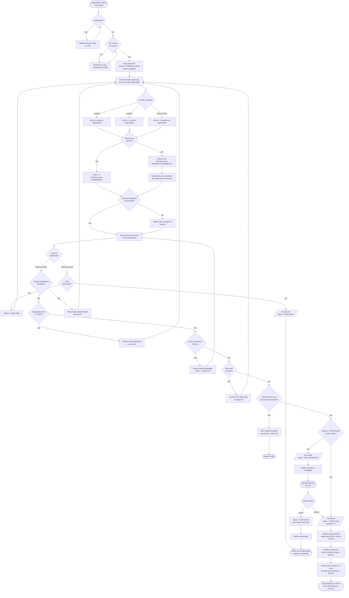
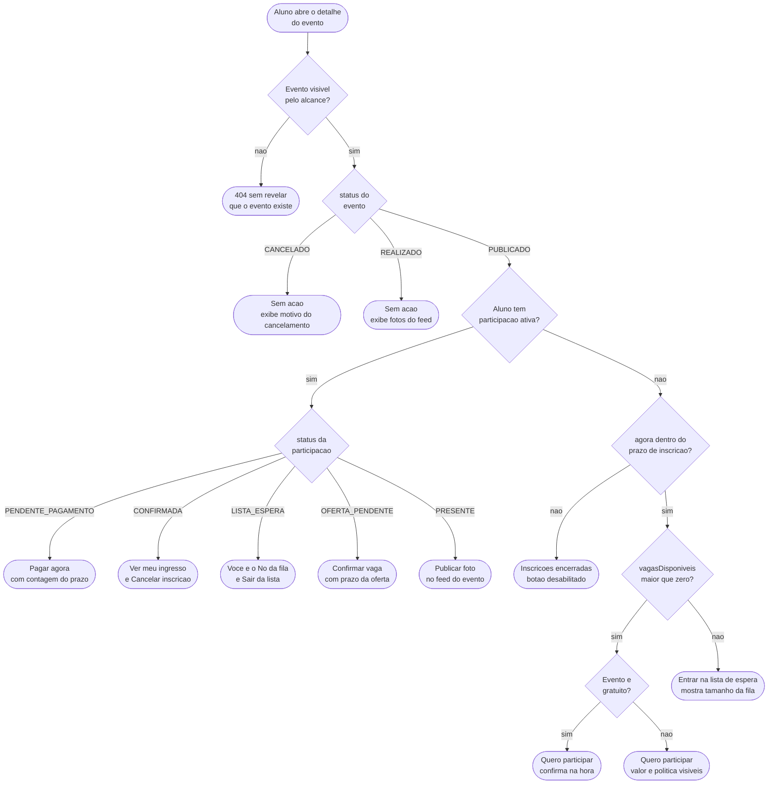

# Diagrama de atividades

**Responsável:** Ronaldo Veloso Filho · **Adianta requisito do CP5**

Fluxo completo de criação e publicação de evento (UC-001), do toque em "Criar evento" até
o evento visível para o alcance. Este é o fluxo com mais decisões do sistema — alcance,
cobrança e aprovação —, e é onde a maior parte dos erros de preenchimento acontece.

## 1. Criação e publicação de evento

### O que o diagrama mostra e por que assim

**Três decisões do organizador, e apenas três.** Alcance, cobrança e perguntas. Tudo o
mais é validação. Isso é deliberado: o organizador de turma (persona Rafael) desiste se o
formulário parecer trabalho. As sugestões automáticas de prazo (`inicio - 2h` para
inscrição, `inicio - 24h` para cancelamento) existem para que os dois campos mais
esquecidos nunca fiquem em branco.

**O padrão é o menor alcance.** O formulário abre com `TURMA` selecionado. Errar para
menos gera um evento pouco divulgado; errar para mais expõe um churrasco de 40 pessoas à
faculdade inteira — que é literalmente o problema descrito em
[`../01-problema-e-personas.md`](../01-problema-e-personas.md). Padrão seguro é o que
falha para o lado barato.

**Validação em cascata, com retorno ao passo certo.** Cada exceção volta para o ponto
específico do formulário (`ERR_PRZ` → `PRAZOS`, não → `FILL`), preservando o resto do
preenchimento. Formulário longo que apaga tudo em um erro é a forma mais eficiente de
perder o organizador.

**A aprovação é um desvio, não uma etapa.** O ramo `APROV` só existe para
`alcance = FACULDADE` de aluno comum ([RN-003](../04-regras-de-negocio.md)). Admin de
Faculdade publica direto. Modelar a aprovação como etapa obrigatória de todo evento
adicionaria fricção em 90% dos casos para resolver um risco que existe em 10%.

**A recusa devolve ao rascunho, não descarta.** No ramo `DEC -- recusa`, o evento volta a
`RASCUNHO` com o motivo. O organizador ajusta e submete de novo, sem redigitar nada.

**Uma trilha só termina em evento visível: `PUB`.** Rascunho e recusa terminam em
`DRAFT_END` (só o organizador vê) e a violação de alcance em `FIM_ERR` (nada criado).
Nenhum caminho publica sem passar por todas as validações.

---

## 2. Fluxo de decisão da inscrição

Complemento menor, mas denso: é a decisão que o app toma **ao renderizar o botão
principal** do detalhe do evento. Todos os estados do botão saem daqui — e é por isso que
o botão nunca é só "Inscrever-se".

Nove estados de botão, cada um com rótulo próprio. O ganho é direto: o aluno nunca toca
em um botão para descobrir que não podia. E o `B9` é o desvio de
[RN-006](../04-regras-de-negocio.md) — "lotado" não é erro, é outro caminho.

Este diagrama é a especificação da função `resolvePrimaryAction()` em
`app/src/domain/eventAction.ts`, e cada ramo tem um teste unitário correspondente.
