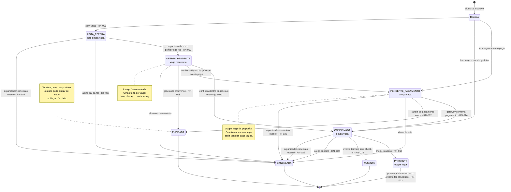
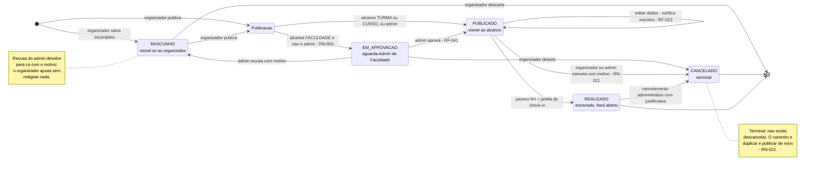

# Diagramas de estados

**Responsável:** Ronaldo Veloso Filho

Dois ciclos de vida: `Participacao` e `Evento`. São as duas entidades cujo comportamento
**é** definido pelo estado — e onde uma transição faltante ou indevida produz overbooking,
cobrança sem vaga ou check-in de quem cancelou.

Cada transição do diagrama corresponde a uma regra de negócio. Transição sem regra é
transição inventada.

---

## 1. Ciclo de vida de `Participacao`

### O que o diagrama mostra e por que assim

**Oito estados, dos quais quatro ocupam vaga ou a reservam.** A coluna que importa não é
"quem está confirmado", é "quem ocupa vaga". `PENDENTE_PAGAMENTO`, `CONFIRMADA`,
`PRESENTE` ocupam; `OFERTA_PENDENTE` mantém a vaga reservada; `LISTA_ESPERA` não ocupa. Os
três terminais (`CANCELADA`, `EXPIRADA`, `AUSENTE`) liberam. Esse agrupamento é a
implementação literal de [RN-004](../04-regras-de-negocio.md), e está em uma única função:
`occupiesSpot(status)`.

**A entrada é uma decisão, não um estado inicial fixo.** O pseudoestado `<<choice>>`
mostra que "inscrever-se" tem três destinos possíveis dependendo de vaga e preço. Isso
evita o erro clássico de modelar `PENDENTE` como estado inicial universal e depois precisar
de uma transição imediata `PENDENTE → CONFIRMADA` para eventos gratuitos.

**`PRESENTE` é terminal e blindado.** A única saída é o fim do ciclo. Nem cancelamento do
evento reverte presença ([RN-022](../04-regras-de-negocio.md)): o fato aconteceu, e a taxa
de comparecimento histórica do organizador depende disso.

**`AUSENTE` existe e é diferente de `CANCELADA`.** Quem cancelou liberou a vaga em tempo;
quem faltou não. Fundir os dois estados apagaria justamente o dado que o organizador
precisa para dimensionar o próximo churrasco.

**Existe caminho de volta de `OFERTA_PENDENTE` para `PENDENTE_PAGAMENTO`.** Aceitar uma
oferta em evento pago não confirma nada — abre a janela de pagamento de
[RN-012](../04-regras-de-negocio.md). Sem essa transição, o produto teria de escolher entre
dar vaga de graça a quem estava na fila ou perder a oferta.

**`EXPIRADA` não é castigo.** É terminal para *aquela* participação. O aluno pode criar
outra, no fim da fila ([RN-008](../04-regras-de-negocio.md)) — que é o que o índice único
**parcial** do [modelo de dados](03-modelo-dados-er.md) permite: estados terminais não
bloqueiam nova participação.

### Transições proibidas (e por quê)

O que o diagrama **não** tem é tão informativo quanto o que ele tem.

| Transição inexistente | Por que é proibida |
|---|---|
| `LISTA_ESPERA → CONFIRMADA` (direto) | Pularia a oferta com janela. Quem está na fila precisa **aceitar** a vaga; confirmar sozinho inscreveria quem talvez já tenha desistido ([RN-007](../04-regras-de-negocio.md)) |
| `CONFIRMADA → PENDENTE_PAGAMENTO` | Não se "descobra" uma vaga já paga. Alteração de preço dá direito a reembolso integral, não a nova cobrança ([RN-013](../04-regras-de-negocio.md)) |
| `EXPIRADA → qualquer coisa` | Estado terminal. Reativar seria dar vaga que já pode ter sido oferecida a outro |
| `CANCELADA → CONFIRMADA` | Idem. "Voltar" a uma participação cancelada burlaria a fila |
| `AUSENTE → PRESENTE` | Check-in fora da janela é decisão operacional do organizador, não do sistema. Correção de erro cria nova `Presenca` com `motivoCorrecao` ([RN-018](../04-regras-de-negocio.md)) |
| `PRESENTE → CANCELADA` | Presença é fato imutável ([RN-022](../04-regras-de-negocio.md)) |
| `[*] → CONFIRMADA` em evento pago | Só o gateway confirma pagamento ([RN-014](../04-regras-de-negocio.md)) |
| `PENDENTE_PAGAMENTO → PRESENTE` | Check-in exige `CONFIRMADA`. Entrar sem pagar é a falha que RN-017, condição 4, previne |

Essas oito proibições estão codificadas em uma tabela de transições permitidas em
`app/src/domain/participation.ts`, e o teste CT-029 tenta cada uma delas e espera recusa.

---

## 2. Ciclo de vida de `Evento`

### O que o diagrama mostra e por que assim

**A publicação também é uma decisão.** O `<<choice>>` reflete que "publicar" tem dois
destinos conforme alcance e papel ([RN-003](../04-regras-de-negocio.md)). Um estado
`AGUARDANDO` obrigatório para todo evento adicionaria fricção em 90% dos casos.

**`PUBLICADO → PUBLICADO` é transição explícita.** Editar um evento publicado não muda o
estado, mas **tem efeito**: notifica os inscritos das mudanças sensíveis e, em caso de
alteração de data, local ou preço, abre direito a reembolso integral por 48 h
([RN-013](../04-regras-de-negocio.md)). Autotransição explícita documenta que a edição não
é operação silenciosa.

**`REALIZADO` é automático, por tempo.** O evento não é "encerrado" por ninguém: passa a
`REALIZADO` quando `agora > fim + CHECKIN_CLOSES_HOURS_AFTER`. É a transição que também
marca as participações `CONFIRMADA` restantes como `AUSENTE`
([RN-018](../04-regras-de-negocio.md)) e libera o feed para publicações dos presentes
([RN-019](../04-regras-de-negocio.md)).

**`CANCELADO` é terminal, e a ausência de volta é a regra.** Um evento que
"descancelasse" deixaria pessoas inscritas em um evento com condições possivelmente
diferentes das que aceitaram — e com reembolsos já processados. Duplicar e publicar de novo
força consentimento novo.

**`REALIZADO → CANCELADO` existe, e é exceção administrativa.** Cancelar evento já
ocorrido não apaga presenças; encerra o evento para novas ações (publicações, moderação
pendente). Está no diagrama porque acontece na prática — evento realizado indevidamente,
denúncia posterior — e omiti-lo obrigaria a improvisar depois.

### Transições proibidas

| Transição inexistente | Por que é proibida |
|---|---|
| `CANCELADO → PUBLICADO` | Ver acima: consentimento não retroage ([RN-021](../04-regras-de-negocio.md)) |
| `REALIZADO → PUBLICADO` | Reabrir inscrição para evento que já aconteceu não tem significado |
| `PUBLICADO → RASCUNHO` | Despublicar evento com inscritos os deixaria com participação em evento invisível. O caminho é cancelar |
| `PUBLICADO → EM_APROVACAO` | O alcance não aumenta depois de publicado ([RN-002](../04-regras-de-negocio.md)), então a aprovação nunca passa a ser necessária depois |
| `RASCUNHO → REALIZADO` | Evento não realizado nunca foi publicado |

---

## 3. Como os dois ciclos se cruzam

A tabela abaixo é a especificação do efeito em cascata de
[RN-022](../04-regras-de-negocio.md), e é o teste CT-028.

| Transição do `Evento` | Efeito nas `Participacao` |
|---|---|
| `RASCUNHO → PUBLICADO` | Nenhuma existe ainda. Notificação `NOVO_EVENTO` para o alcance |
| `EM_APROVACAO → PUBLICADO` | Idem, mais notificação `EVENTO_APROVADO` ao organizador |
| `PUBLICADO → PUBLICADO` (edição sensível) | Nenhuma transição; notificação `EVENTO_ALTERADO` e janela de 48 h para reembolso integral |
| `PUBLICADO → REALIZADO` | `CONFIRMADA` → `AUSENTE`; `LISTA_ESPERA` e `OFERTA_PENDENTE` → `CANCELADA`; `PRESENTE` inalterada |
| `PUBLICADO → CANCELADO` | `CONFIRMADA`, `PENDENTE_PAGAMENTO`, `LISTA_ESPERA`, `OFERTA_PENDENTE` → `CANCELADA` com `motivo = EVENTO_CANCELADO`; pagamentos confirmados → `REEMBOLSO_SOLICITADO` (100%); `PRESENTE` inalterada |
| `REALIZADO → CANCELADO` | `AUSENTE` e `PRESENTE` inalteradas; nenhum reembolso automático |
| Aumento de capacidade em N | Dispara N vezes a promoção da fila ([RN-005](../04-regras-de-negocio.md), [RN-007](../04-regras-de-negocio.md)) |
