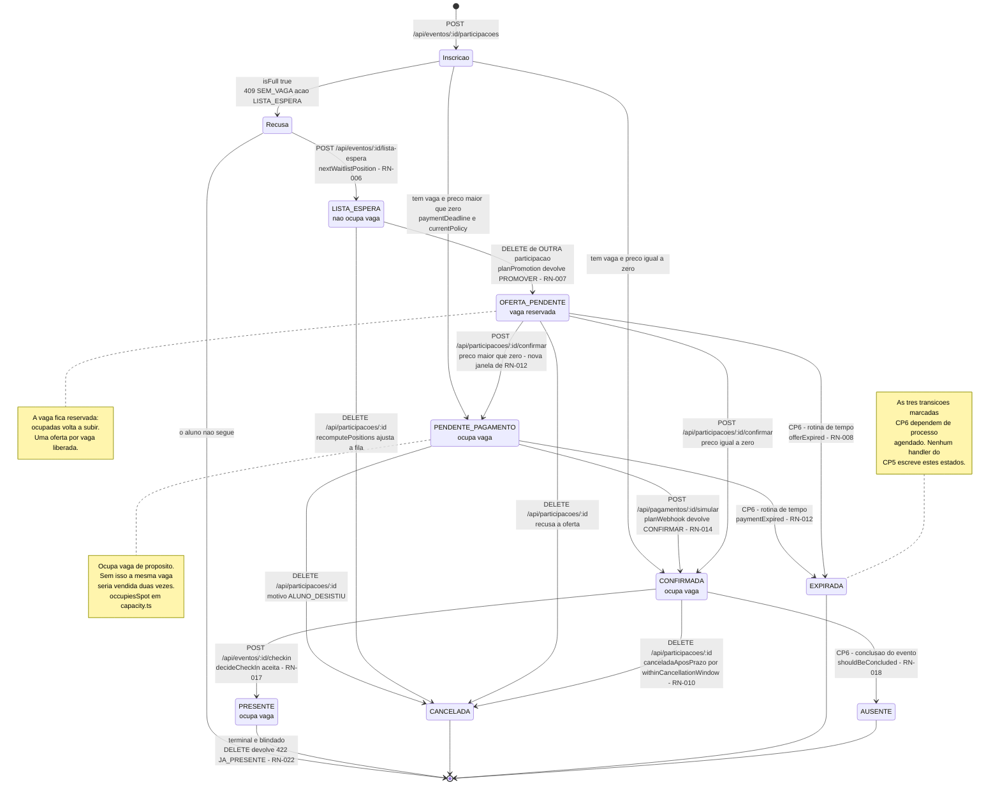
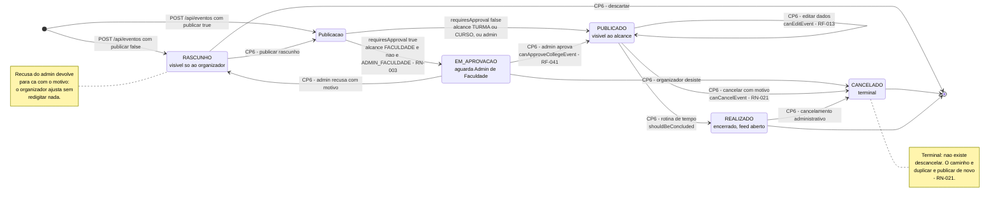

# Diagramas de estados

**Responsável:** Ronaldo Veloso Filho

## Histórico de revisões

| Versão | Data | Checkpoint | O que mudou |
|---|---|---|---|
| 1.0 | 2026-09-01 | CP4 | Dois ciclos de vida com as transições **previstas** pelas regras de negócio, e as 13 transições proibidas documentadas |
| 2.0 | 2026-09-02 | CP5 | Cada transição passa a citar **o endpoint e a função que a executam**. A entrada deixa de ser um único `<<choice>>`: `LISTA_ESPERA` tem endpoint próprio. Novas seções "Quem executa cada transição no CP5" e "Transições que o CP5 ainda não executa", esta última com as quatro que dependem de rotina de tempo. O ciclo de `Evento` ganha a mesma distinção |

Dois ciclos de vida: `Participacao` e `Evento`. São as duas entidades cujo comportamento
**é** definido pelo estado — e onde uma transição faltante ou indevida produz overbooking,
cobrança sem vaga ou check-in de quem cancelou.

Cada transição do diagrama corresponde a uma regra de negócio. Transição sem regra é
transição inventada. E, a partir do CP5, cada transição do diagrama corresponde também a
**uma linha de código que a executa** — ou está marcada como pendente.

---

## 1. Ciclo de vida de `Participacao`

Oito estados, como em `STATUS_PARTICIPACAO` de
[`app/src/types/domain.ts`](../../app/src/types/domain.ts). O rótulo de cada transição diz
qual endpoint a dispara e qual função de domínio a decide.

### O que o diagrama mostra e por que assim

**Oito estados, dos quais quatro ocupam vaga ou a reservam.** A coluna que importa não é
"quem está confirmado", é "quem ocupa vaga". `PENDENTE_PAGAMENTO`, `CONFIRMADA`,
`PRESENTE` ocupam; `OFERTA_PENDENTE` mantém a vaga reservada; `LISTA_ESPERA` não ocupa. Os
três terminais (`CANCELADA`, `EXPIRADA`, `AUSENTE`) liberam. Esse agrupamento é a
implementação literal de [RN-004](../04-regras-de-negocio.md), e está em uma única função:
`occupiesSpot(status)`.

**A entrada é uma decisão, não um estado inicial fixo.** O primeiro `<<choice>>` mostra
que `POST /api/eventos/:id/participacoes` tem três desfechos conforme vaga e preço. Isso
evita o erro clássico de modelar `PENDENTE` como estado inicial universal e depois precisar
de uma transição imediata `PENDENTE → CONFIRMADA` para eventos gratuitos.

**A entrada na fila exige um segundo pedido explícito — e isso é novo no CP5.** O CP4
desenhava `LISTA_ESPERA` como um dos três destinos do mesmo `<<choice>>`. No código, evento
lotado devolve **`409 SEM_VAGA` com `acao: LISTA_ESPERA` e `totalFila`, sem criar nada**: a
participação na fila só nasce se o aluno chamar `POST /api/eventos/:id/lista-espera`. Daí o
segundo `<<choice>>` (`Recusa`) no diagrama. A diferença importa: entrar na fila é
consentimento, não consequência automática de um toque no botão.

**`PRESENTE` é terminal e blindado — e o código recusa explicitamente.** A única saída é o
fim do ciclo. `DELETE /api/participacoes/:id` verifica `isActive` primeiro (que aceita
`PRESENTE`) e só então barra com `422 JA_PRESENTE`. Nem cancelamento do evento reverte
presença ([RN-022](../04-regras-de-negocio.md)): o fato aconteceu, e a taxa de comparecimento
histórica do organizador depende disso.

**`AUSENTE` existe e é diferente de `CANCELADA`.** Quem cancelou liberou a vaga em tempo;
quem faltou não. Fundir os dois estados apagaria justamente o dado que o organizador
precisa para dimensionar o próximo churrasco.

**Existe caminho de volta de `OFERTA_PENDENTE` para `PENDENTE_PAGAMENTO`.** Aceitar uma
oferta em evento pago não confirma nada — abre a janela de pagamento de
[RN-012](../04-regras-de-negocio.md). Sem essa transição, o produto teria de escolher entre
dar vaga de graça a quem estava na fila ou perder a oferta.

**`EXPIRADA` não é castigo.** É terminal para *aquela* participação. O aluno pode criar
outra, no fim da fila ([RN-008](../04-regras-de-negocio.md)) — que é o que o índice único
**parcial** do [modelo de dados](03-modelo-dados-er.md) permite: estados terminais não
bloqueiam nova participação.

**Três dos oito estados o CP5 nunca escreve.** `EXPIRADA` e `AUSENTE` dependem de rotina de
tempo, e não há processo agendado dentro de um navegador. Eles continuam no diagrama porque
`decideCheckIn` já sabe recusar quem está neles, `planWebhook` já sabe estornar um pagamento
que chegou para uma vaga `EXPIRADA`, e o seed já traz um `AUSENTE` para a tela exercitar o
caso. Ver "Transições que o CP5 ainda não executa", abaixo.

### Quem executa cada transição no CP5

Tabela verificável: abra o arquivo, ache a linha. Divergência aqui é defeito.

| Transição | Endpoint que a dispara | Função que a decide | Arquivo |
|---|---|---|---|
| `[*] → PENDENTE_PAGAMENTO` | `POST /api/eventos/:id/participacoes` | `isFull`, `enrollmentOpen`, `canSee`, `paymentDeadline`, `currentPolicy` | `mocks/handlers.ts` |
| `[*] → CONFIRMADA` | idem, com `preco = 0` | idem, sem `paymentDeadline` | `mocks/handlers.ts` |
| `[*] → LISTA_ESPERA` | `POST /api/eventos/:id/lista-espera` | `nextWaitlistPosition` | `mocks/handlers.ts` |
| `PENDENTE_PAGAMENTO → CONFIRMADA` | `POST /api/pagamentos/:id/simular` | `planWebhook` → `CONFIRMAR` | `mocks/handlersCp5.ts` |
| `PENDENTE_PAGAMENTO → CANCELADA` | `DELETE /api/participacoes/:id` | `isActive`, `occupiesSpot`, `withinCancellationWindow` | `mocks/handlers.ts` |
| `LISTA_ESPERA → OFERTA_PENDENTE` | `DELETE /api/participacoes/:id` de **outra** participação | `planPromotion` → `PROMOVER`, `offerDeadline` | `mocks/handlers.ts` |
| `LISTA_ESPERA → CANCELADA` | `DELETE /api/participacoes/:id` | `recomputePositions` | `mocks/handlers.ts` |
| `OFERTA_PENDENTE → CONFIRMADA` | `POST /api/participacoes/:id/confirmar` | `preco = 0` | `mocks/handlers.ts` |
| `OFERTA_PENDENTE → PENDENTE_PAGAMENTO` | idem, com `preco > 0` | `paymentDeadline`, `currentPolicy` | `mocks/handlers.ts` |
| `OFERTA_PENDENTE → CANCELADA` | `DELETE /api/participacoes/:id` | `isActive` | `mocks/handlers.ts` |
| `CONFIRMADA → PRESENTE` | `POST /api/eventos/:id/checkin` | `decideCheckIn` aceita | `mocks/handlersCp5.ts` |
| `CONFIRMADA → CANCELADA` | `DELETE /api/participacoes/:id` | `withinCancellationWindow` marca `canceladaAposPrazo` | `mocks/handlers.ts` |

Duas coisas que a tabela deixa explícitas:

- **`LISTA_ESPERA → OFERTA_PENDENTE` não é disparada pelo dono da participação.** Quem
  chama o endpoint é outra pessoa, cancelando a inscrição dela. É a única transição do
  ciclo em que o sujeito da mudança não é o autor da requisição — e o motivo de a promoção
  acontecer **na mesma transação** do cancelamento (RN-007).
- **`ESTORNAR` do webhook não muda a participação.** Quando `planWebhook` devolve `ESTORNAR`,
  só `Pagamento` transita (para `ESTORNADO`). A participação já não estava mais em
  `PENDENTE_PAGAMENTO` — e a vaga pode já ser de outro.

### Transições que o CP5 ainda não executa

**Duas dessas transições passaram a acontecer durante a integração do CP5.** Este quadro
registrava quatro transições com função de decisão escrita, testada em unidade e **nunca
chamada por handler nenhum** — o pior formato de defeito, porque a regra parecia coberta.
As duas de expiração foram ligadas; as outras duas continuam faltando o gatilho, e o quadro
diz qual.

| Transição | Função de decisão | Estado | Como é disparada, ou o que falta |
|---|---|---|---|
| `PENDENTE_PAGAMENTO → EXPIRADA` | `paymentExpired` em `domain/payment.ts` | ✅ **executa** | `mocks/expiracao.ts#aplicarExpiracoes`, chamada em toda requisição por `support.ts#abrirRequisicao`. A vaga é liberada e a cobrança passa a ser recusada com `409 NAO_AGUARDA_PAGAMENTO` |
| `OFERTA_PENDENTE → EXPIRADA` | `offerExpired` em `domain/waitlist.ts` | ✅ **executa** | Mesma passagem. A vaga é reoferecida ao próximo da fila por `planPromotion`, e o motivo do encerramento fica `OFERTA_RECUSADA` |
| `CONFIRMADA → AUSENTE` | `shouldBeConcluded` em `domain/deadlines.ts` | ❌ não executa | Falta a conclusão do evento. Quem não fez check-in continua `CONFIRMADA` depois do evento; `AUSENTE` só aparece no seed |
| qualquer estado ativo `→ CANCELADA` por cancelamento do **evento** | — | ❌ não executa | Falta o endpoint de cancelamento de evento. A cascata de RN-022 não é exercitável no CP5 |

**Por que na borda da requisição e não em processo agendado.** O CP5 roda dentro de um
service worker no navegador de quem abriu a página: um temporizador ali expiraria a vaga de
quem está com a aba aberta e não a de quem fechou — o oposto do que se quer. Expiração
preguiçosa também é determinística no teste (o teste move a data no dado, não espera) e é o
que a API do CP6 vai fazer no guard de todo jeito, com job agendado por cima. O raciocínio
completo está no cabeçalho de
[`mocks/expiracao.ts`](../../app/src/mocks/expiracao.ts).

Isso é limitação de ambiente, não de modelo: **não há processo agendado dentro de um
navegador**. No CP6 as três primeiras são o componente `A3` do
[diagrama de componentes](07-diagrama-componentes.md) — separado da API justamente porque o
modo de falha é diferente: se a API cai, ninguém se inscreve; se as rotinas param, vagas
ficam presas e a fila congela.

### Transições proibidas (e por quê)

O que o diagrama **não** tem é tão informativo quanto o que ele tem.

| Transição inexistente | Por que é proibida |
|---|---|
| `LISTA_ESPERA → CONFIRMADA` (direto) | Pularia a oferta com janela. Quem está na fila precisa **aceitar** a vaga; confirmar sozinho inscreveria quem talvez já tenha desistido ([RN-007](../04-regras-de-negocio.md)) |
| `CONFIRMADA → PENDENTE_PAGAMENTO` | Não se "descobra" uma vaga já paga. Alteração de preço dá direito a reembolso integral, não a nova cobrança ([RN-013](../04-regras-de-negocio.md)) |
| `EXPIRADA → qualquer coisa` | Estado terminal. Reativar seria dar vaga que já pode ter sido oferecida a outro |
| `CANCELADA → CONFIRMADA` | Idem. "Voltar" a uma participação cancelada burlaria a fila |
| `AUSENTE → PRESENTE` | Check-in fora da janela é decisão operacional do organizador, não do sistema. Correção de erro cria nova `Presenca` com `motivoCorrecao` ([RN-018](../04-regras-de-negocio.md)) |
| `PRESENTE → CANCELADA` | Presença é fato imutável ([RN-022](../04-regras-de-negocio.md)) |
| `[*] → CONFIRMADA` em evento pago | Só o gateway confirma pagamento ([RN-014](../04-regras-de-negocio.md)) |
| `PENDENTE_PAGAMENTO → PRESENTE` | Check-in exige `CONFIRMADA`. Entrar sem pagar é a falha que RN-017, condição 4, previne |

Essas oito proibições estão codificadas na tabela `ALLOWED` de
[`app/src/domain/participation.ts`](../../app/src/domain/participation.ts), exposta por
`canTransition(from, to)` e `allowedTransitions(from)`. O teste CT-029 tenta cada uma delas
e espera recusa.

**Honestidade sobre a fronteira:** `canTransition` **não é chamada por nenhum handler**.
No CP5 as proibições valem porque cada handler verifica o estado de origem que lhe importa
antes de escrever — `status !== 'OFERTA_PENDENTE'` em `confirmar`, `isActive` em `cancelar`,
`status !== 'CONFIRMADA'` em `decideCheckIn`. A tabela é a especificação; os `if` dos
handlers são a aplicação. Fazer o serviço de aplicação do CP6 chamar `canTransition` antes
de toda escrita é dívida registrada, e é o que transforma a especificação em barreira única.

---

## 2. Ciclo de vida de `Evento`

No CP5 o código executa **apenas a criação**: `POST /api/eventos` grava `RASCUNHO`,
`EM_APROVACAO` ou `PUBLICADO` e nada mais. Não existe endpoint de edição, de aprovação nem
de cancelamento de evento, e não existe rotina que conclua o evento por tempo. As transições
marcadas `CP6` no diagrama estão especificadas e não implementadas.

### O que o diagrama mostra e por que assim

**A publicação também é uma decisão, e ela já está no código.** O `<<choice>>` é literalmente
`requiresApproval(usuario, alcance)` em `domain/permissions.ts`, chamada dentro da transação
de `POST /api/eventos` ([RN-003](../04-regras-de-negocio.md)). Um estado `AGUARDANDO`
obrigatório para todo evento adicionaria fricção em 90% dos casos.

**`EM_APROVACAO` é um estado que o CP5 sabe criar e não sabe resolver.** Isso é
desconfortável e está no diagrama de propósito: `canApproveCollegeEvent` existe em
`domain/permissions.ts`, é testada, e não há endpoint que a chame. Um evento de faculdade
criado por aluno comum fica em `EM_APROVACAO` até o CP6 — visível só para
`ADMIN_FACULDADE`, porque é o que `canSee` decide para esse status.

**`PUBLICADO → PUBLICADO` é transição explícita.** Editar um evento publicado não muda o
estado, mas **tem efeito**: notifica os inscritos das mudanças sensíveis e, em caso de
alteração de data, local ou preço, abre direito a reembolso integral por 48 h
([RN-013](../04-regras-de-negocio.md)). Autotransição explícita documenta que a edição não
é operação silenciosa.

**`REALIZADO` é automático, por tempo.** O evento não é "encerrado" por ninguém: passa a
`REALIZADO` quando `agora > fim + CHECKIN_CLOSES_HOURS_AFTER`. É a transição que também
marca as participações `CONFIRMADA` restantes como `AUSENTE`
([RN-018](../04-regras-de-negocio.md)) e libera o feed para publicações dos presentes
([RN-019](../04-regras-de-negocio.md)).

**`CANCELADO` é terminal, e a ausência de volta é a regra.** Um evento que
"descancelasse" deixaria pessoas inscritas em um evento com condições possivelmente
diferentes das que aceitaram — e com reembolsos já processados. Duplicar e publicar de novo
força consentimento novo.

**`REALIZADO → CANCELADO` existe, e é exceção administrativa.** Cancelar evento já
ocorrido não apaga presenças; encerra o evento para novas ações (publicações, moderação
pendente). Está no diagrama porque acontece na prática — evento realizado indevidamente,
denúncia posterior — e omiti-lo obrigaria a improvisar depois.

### Transições proibidas

| Transição inexistente | Por que é proibida |
|---|---|
| `CANCELADO → PUBLICADO` | Ver acima: consentimento não retroage ([RN-021](../04-regras-de-negocio.md)) |
| `REALIZADO → PUBLICADO` | Reabrir inscrição para evento que já aconteceu não tem significado |
| `PUBLICADO → RASCUNHO` | Despublicar evento com inscritos os deixaria com participação em evento invisível. O caminho é cancelar |
| `PUBLICADO → EM_APROVACAO` | O alcance não aumenta depois de publicado ([RN-002](../04-regras-de-negocio.md)), então a aprovação nunca passa a ser necessária depois |
| `RASCUNHO → REALIZADO` | Evento não realizado nunca foi publicado |

---

## 3. Como os dois ciclos se cruzam

A tabela abaixo é a especificação do efeito em cascata de
[RN-022](../04-regras-de-negocio.md), e é o teste CT-028. A última coluna diz o que o CP5
executa hoje — nenhuma dessas cascatas é acionável, porque **nenhuma transição de `Evento`
depois da criação tem endpoint**.

| Transição do `Evento` | Efeito nas `Participacao` | No CP5 |
|---|---|---|
| `RASCUNHO → PUBLICADO` | Nenhuma existe ainda. Notificação `NOVO_EVENTO` para o alcance | Transição não existe. Na **criação** direta com `publicar: true` o evento nasce `PUBLICADO` e **nenhuma notificação é enfileirada** |
| `EM_APROVACAO → PUBLICADO` | Idem, mais notificação `EVENTO_APROVADO` ao organizador | Não implementado |
| `PUBLICADO → PUBLICADO` (edição sensível) | Nenhuma transição; notificação `EVENTO_ALTERADO` e janela de 48 h para reembolso integral | Não implementado |
| `PUBLICADO → REALIZADO` | `CONFIRMADA` → `AUSENTE`; `LISTA_ESPERA` e `OFERTA_PENDENTE` → `CANCELADA`; `PRESENTE` inalterada | Não implementado. `shouldBeConcluded` existe e não é chamada — é a última função de decisão do domínio sem gatilho |
| `PUBLICADO → CANCELADO` | `CONFIRMADA`, `PENDENTE_PAGAMENTO`, `LISTA_ESPERA`, `OFERTA_PENDENTE` → `CANCELADA` com `motivo = EVENTO_CANCELADO`; pagamentos confirmados → `REEMBOLSO_SOLICITADO` (100%); `PRESENTE` inalterada | Não implementado. `canCancelEvent` e `computeRefund` existem e não são chamadas |
| `REALIZADO → CANCELADO` | `AUSENTE` e `PRESENTE` inalteradas; nenhum reembolso automático | Não implementado |
| Aumento de capacidade em N | Dispara N vezes a promoção da fila ([RN-005](../04-regras-de-negocio.md), [RN-007](../04-regras-de-negocio.md)) | Não implementado. `canChangeCapacity` e `spotsOpenedByCapacityChange` existem e não são chamadas |

O padrão é consistente e vale registrar: **o CP5 entregou o ciclo de vida da `Participacao`
e a criação do `Evento`.** A administração do evento — editar, aprovar, cancelar, mudar
capacidade — tem domínio pronto e testado, e não tem endpoint. É exatamente o recorte do
[roadmap](../13-roadmap-cp5-cp6.md): as funções puras primeiro, a autoridade depois.
