# Diagrama de componentes

**Responsável:** Ronaldo Veloso Filho · **Revisão técnica:** Lucas Baraldi
**Complementa:** [`../08-arquitetura.md`](../08-arquitetura.md) (C4, contrato de API, ADRs)

## Histórico de revisões

| Versão | Data | Checkpoint | O que mudou |
|---|---|---|---|
| 1.0 | 2026-09-01 | CP4 | Cinco camadas do cliente, servidor-alvo do CP6 e serviços externos. Tabela de dependências permitidas e proibidas |
| 2.0 | 2026-09-02 | CP5 | Camada de rotas e a guarda `ExigeSessao` viram componentes próprios; `src/features/` entra como camada de composição; a fronteira do mock se abre em `handlers.ts`, `handlersCp5.ts`, `support.ts` e `db.ts`; os hooks e os 15 módulos de domínio aparecem por nome. A tabela de dependências passa a citar **a regra de ESLint que a executa**, e as duas lacunas dessa regra ficam registradas |

Visão em camadas dos componentes do sistema e das dependências entre eles. O objetivo é
mostrar **onde está a fronteira que permite trocar o mock pela API real sem tocar em tela**
(RNF-016), que é a decisão técnica mais importante do projeto.

## 1. Componentes e camadas

```mermaid
flowchart TB
    subgraph CLIENTE["Cliente - navegador mobile-first"]
        direction TB

        subgraph L0["Rotas - src/App.tsx"]
            direction LR
            RT["12 rotas<br/>login publica<br/>11 protegidas"]
            GD["ExigeSessao<br/>guarda de tres estados<br/>sem token, em voo, resolvida"]
        end

        subgraph L1["Apresentacao - src/pages e src/components"]
            direction LR
            P1["Paginas - src/pages<br/>Login, Onboarding, Feed, Eventos,<br/>EventoDetalhe, Checkin, CriarEvento,<br/>Perfil, Notificacoes, Ingresso,<br/>Pagamento, NaoEncontrada"]
            P2["Design System - src/components/ui<br/>Button, Field, Modal, Tabs, QrCode,<br/>TicketCard, PostCard, ProgressBar,<br/>Badge, Chip, Avatar, EventCover, Feedback"]
            P3["Layout - src/components/layout<br/>AppShell, TopBar, BottomNav,<br/>ToastViewport, Logo"]
        end

        subgraph LF["Composicao por feature - src/features"]
            direction LR
            F1["features/auth<br/>PerfisDemo, loginSchema,<br/>onboardingSchema, perfis"]
            F2["features/pagamento<br/>CardForm, PixPanel,<br/>GatewaySimulator, cardSchema,<br/>usePaymentCountdown"]
            F3["features/checkin<br/>ScannerInput, ScanResult,<br/>demoCodes"]
            F4["features/feed<br/>Composer, PublicacaoCard,<br/>limites"]
            F5["features/participacao<br/>BlocoPrazo, PosicaoNaFila,<br/>notificacoes, tempo,<br/>useContagemRegressiva"]
        end

        subgraph L2["Estado - src/store, src/hooks e src/lib"]
            direction LR
            S1["Zustand - src/store<br/>session.ts sessao e resolvida<br/>ui.ts toasts"]
            S2["Hooks - src/hooks<br/>useCampusData, useAuth, usePagamento,<br/>useCheckin, useFeedSocial"]
            S3["src/lib/queryClient.ts<br/>queryKeys centralizadas<br/>retry que nao repete erro de negocio"]
        end

        subgraph L3["Dominio - src/domain - 15 modulos puros"]
            direction LR
            D1["capacity, waitlist,<br/>deadlines, participation"]
            D2["payment, refund, pix,<br/>checkin, ticketToken"]
            D3["auth, visibility, permissions,<br/>eventAction, eventSchema, format"]
            D4["policy.ts<br/>o unico lugar com numeros"]
        end

        subgraph L4["Contratos de dados - src/services/index.ts"]
            direction LR
            R1["AuthRepository<br/>EventsRepository<br/>ParticipationsRepository"]
            R2["PaymentsRepository<br/>CheckinRepository"]
            R3["FeedRepository<br/>NotificationsRepository"]
            R4["ApiError<br/>definirToken e obterToken"]
        end

        subgraph L5["Implementacao atual - CP5"]
            direction LR
            M1["services/http/index.ts<br/>fetch sobre /api<br/>Authorization Bearer<br/>token em sessionStorage"]
            M2["MSW<br/>mocks/browser.ts e mocks/server.ts"]
            M6["mocks/handlers.ts - base do CP4<br/>eventos, participacoes, fila,<br/>feed, notificacoes"]
            M7["mocks/handlersCp5.ts - novo<br/>auth, onboarding, pagamento,<br/>check-in, escrita no feed"]
            M5["mocks/support.ts - fronteira<br/>usuarioAtual, eventosVisiveis,<br/>aplicarFiltros, erro, projecoes"]
            M4["mocks/db.ts<br/>transaction serializada<br/>assertInvariants"]
            M3["mocks/seed.ts<br/>1 faculdade, 3 cursos, 4 turmas,<br/>12 usuarios, 11 eventos"]
        end
    end

    subgraph SERVIDOR["Servidor - alvo do CP6"]
        direction TB
        A1["API REST<br/>Node e Fastify"]
        A2["Servicos de aplicacao<br/>casos de uso"]
        A3["Rotinas de tempo<br/>expiracao de pagamento,<br/>expiracao de oferta,<br/>marcacao de ausente,<br/>conclusao do evento"]
        A4["Autenticacao<br/>JWT e argon2id"]
        A5["Assinatura HMAC<br/>do token de check-in"]
    end

    subgraph DADOS["Persistencia - CP6"]
        DB[("PostgreSQL 16<br/>enums, CHECK compostos,<br/>indice unico parcial")]
    end

    subgraph EXTERNOS["Servicos externos"]
        direction TB
        X1["Gateway de pagamento<br/>Pix e cartao"]
        X2["Servico de notificacao<br/>push e e-mail"]
        X3["Object storage<br/>fotos do feed - CP6"]
    end

    RT --> GD
    RT --> P1
    GD --> S1
    GD --> R4
    GD --> D3

    P1 --> P2
    P1 --> P3
    P1 --> F1
    P1 --> F2
    P1 --> F3
    P1 --> F4
    P1 --> F5
    P1 --> S1
    P1 --> S2
    P1 --> D1
    P1 --> D2
    P1 --> D3

    F1 --> S2
    F2 --> S2
    F3 --> S2
    F4 --> S2
    F5 --> S2
    F1 --> P2
    F2 --> P2
    F3 --> P2
    F4 --> P2
    F5 --> P2
    F1 --> D3
    F2 --> D2
    F3 --> D2
    F4 --> D3
    F5 --> D1

    P2 --> D2
    P2 --> D1
    P3 --> S1
    P3 --> S2

    S2 --> S3
    S2 --> R1
    S2 --> R2
    S2 --> R3
    S2 --> S1

    D1 --> D4
    D2 --> D4
    D3 --> D4

    R1 -.-> |"implementada por"| M1
    R2 -.-> |"implementada por"| M1
    R3 -.-> |"implementada por"| M1

    M1 --> |"HTTP no CP5"| M2
    M2 --> M6
    M2 --> M7
    M6 --> M7
    M6 --> M5
    M7 --> M5
    M6 --> M4
    M7 --> M4
    M5 --> M4
    M4 --> M3
    M6 --> D1
    M7 --> D2
    M7 --> D3
    M5 --> D1
    M5 --> D3

    M1 ==> |"CP6 - mesma interface,<br/>MSW desligado"| A1

    A1 --> A2
    A1 --> A4
    A2 --> D1
    A2 --> D2
    A2 --> D3
    A2 --> A5
    A2 --> DB
    A3 --> DB
    A3 --> D1
    A3 --> D2
    A2 --> X1
    A2 --> X2
    A2 --> X3
    X1 --> |"notificacao de pagamento"| A1
```

## 2. O que o diagrama mostra e por que assim

### A fronteira que importa está entre L4 e L5

`src/services/index.ts` define **sete interfaces** — `AuthRepository`, `EventsRepository`,
`ParticipationsRepository`, `PaymentsRepository`, `CheckinRepository`, `FeedRepository`,
`NotificationsRepository` — mais `ApiError` e o par `definirToken` / `obterToken`. A
apresentação, as features e a camada de estado dependem **apenas** dessas interfaces.
Nenhuma página importa `fetch`, `axios`, `msw` ou `seed`.

Consequência: a migração do CP6 é a seta `==>` do diagrama. `httpRepositories` já fala HTTP
hoje — o que muda é **quem responde**: hoje o MSW intercepta e responde do mock em memória;
no CP6 a requisição sai para a API real. Nenhum arquivo de `src/pages/`, `src/features/` ou
`src/components/` é tocado. É o RNF-016, e a razão da
[ADR-0003](../adr/0003-camada-de-repositorio-com-msw.md).

A alternativa comum — repositório mock que devolve objetos direto, sem HTTP — foi recusada
porque esconde tudo o que dá errado em rede real: estado de carregamento, erro, latência,
código de status, `409` de conflito. O app que "nunca falha" no CP5 quebraria no CP6.

### `obterToken` é exportado de `services/index.ts`, não de `services/http/`

É uma exceção deliberada e vale ser explícita: a guarda de rota (`GD`) precisa saber se há
sessão **sem** importar a implementação de transporte. Por isso `definirToken` e `obterToken`
são reexportados pelo módulo de contratos. O token em si continua vivendo em um só lugar —
`services/http/index.ts`, em `sessionStorage`. Guardá-lo também na store criaria duas
verdades sobre "estou autenticado".

### `src/features/` é composição, não uma camada nova

As cinco pastas de feature agrupam o que pertence a um fluxo: formulário, *schema* de
validação daquele formulário, estados de retorno, e componentes de apresentação específicos.
Elas **consomem** hooks, design system e domínio — exatamente como uma página consome. Não
introduzem direção nova de dependência.

O critério de recorte é simples: componente usado por **mais de um** fluxo é design system
(`components/ui`); componente que só existe por causa de um fluxo é feature. `CardForm` só
faz sentido no pagamento; `Button` faz sentido em todos.

Três observações do que de fato está lá:

- **Feature pode ter hook local.** `features/pagamento/usePaymentCountdown.ts` e
  `features/participacao/useContagemRegressiva.ts` são estado de UI (um contador de
  relógio), não acesso a dado. Hook que fala com repositório continua em `src/hooks/`.
- **Feature pode ter Zod próprio.** `loginSchema`, `onboardingSchema` e `cardSchema` são
  conveniência de formulário, e — como `domain/eventSchema.ts` — **chamam** as funções de
  domínio em vez de reimplementar a regra.
- **`demoCodes` e `perfis` são afordâncias de demonstração**, e ficam nas features de
  propósito: são o que permite mostrar check-in e troca de perfil ao vivo sem poluir o
  domínio com dado de apresentação.

### A fronteira do mock agora tem quatro peças, não uma

O `handlers.ts` do CP4 passou de 750 linhas, e a fronteira natural é a que separa o que
existia no CP4 do que o CP5 acrescentou:

| Peça | O que contém | Por que separada |
|---|---|---|
| `mocks/handlers.ts` | eventos, participações, fila, cancelamento, feed de leitura, notificações | Base do CP4. Exporta o array final `handlers` juntando os dois arquivos |
| `mocks/handlersCp5.ts` | login, logout, onboarding, pagamento, webhook simulado, token do ingresso, painel e validação de check-in, escrita no feed | O que o CP5 acrescentou. Arquivo próprio mantém o diff do checkpoint legível |
| `mocks/support.ts` | `BASE`, `latencia`, `usuarioAtual`, `erro`, `eventosVisiveis`, `aplicarFiltros`, `toEventoView`, `toParticipacaoView`, `tokenDeSessao`, `SENHA_DEMO` | Peças que os **dois** arquivos de handler usam. Duplicá-las criaria duas resoluções de "quem é o usuário atual" |
| `mocks/db.ts` | `Database`, `transaction`, `assertInvariants`, buscas auxiliares | Estado e integridade. É o único módulo que escreve |

`usuarioAtual` merece destaque porque é a peça mais sensível de `support.ts`: resolve o
usuário em **três níveis**, do mais específico ao padrão — cabeçalho `x-usuario-id`
(afordância de teste para cenário multiusuário, CT-020), `Authorization: Bearer campus.sess.<id>`
(o caminho que o app usa depois do login) e, por último, o usuário fixo do seed (para o mock
também responder a `curl` e a teste de integração sem passar pela tela de login). No CP6 o
primeiro nível deixa de existir e o segundo passa a ser JWT assinado.

### A camada de domínio é usada pelos dois lados

`src/domain/` (L3) aparece consumido **tanto** pelos handlers e por `support.ts` (L5)
**quanto** pelos serviços de aplicação e pelas rotinas de tempo do servidor (A2, A3). Isso é
deliberado: capacidade, fila, prazo, reembolso, pagamento, check-in, autenticação e alcance
são funções puras sobre tipos de domínio, sem dependência de React, de banco ou de rede.

Efeito prático: os testes de `capacity.ts`, `waitlist.ts`, `payment.ts`, `refund.ts`,
`participation.ts`, `visibility.ts` e `eventAction.ts` valem para os dois mundos, e as regras
de [`../04-regras-de-negocio.md`](../04-regras-de-negocio.md) têm **uma** implementação, não
duas versões que divergem com o tempo.

Uma ressalva honesta: no CP6, com backend em Node, esse código pode ser compartilhado como
pacote. Se o backend fosse em outra linguagem, as regras seriam reimplementadas no servidor
(a implementação do cliente passaria a ser apenas conveniência de UI, e o servidor seria a
autoridade — RNF-012). A decisão de manter Node no servidor é, em boa parte, por causa disso.

### `policy.ts` é o único lugar com números

Todos os parâmetros de [RN-004 a RN-017](../04-regras-de-negocio.md) — janela de pagamento,
janela de oferta, escala de reembolso, abertura e fechamento do check-in, faixa de
capacidade, duração máxima, prazos padrão — vivem em `domain/policy.ts`. Nenhum módulo de
domínio, e muito menos um componente de UI, carrega `60`, `24` ou `0.5` literalmente. Mudar
uma política é editar um arquivo, e os testes que dependem dela apontam para a mesma fonte.

### As rotinas de tempo são componente próprio (A3), e é o que falta no CP5

Quatro transições do [diagrama de estados](06-diagrama-estados.md) não têm ator humano:
expiração de pagamento, expiração de oferta, marcação de ausente e conclusão do evento. As
quatro têm função de decisão escrita e testada em `domain/` — `paymentExpired`,
`offerExpired`, `shouldBeConcluded` — e **nenhuma é chamada por handler nenhum**: não existe
processo agendado dentro de um navegador.

Está separado da API porque o modo de falha é diferente: se a API cai, ninguém se inscreve;
se as rotinas param, vagas ficam presas e a fila congela — sintoma silencioso, que precisa de
alarme próprio.

### O gateway aparece duas vezes, nas duas direções

`A2 → X1` é a criação da cobrança (síncrona, iniciada pelo usuário). `X1 → A1` é a
notificação de confirmação (assíncrona, iniciada pelo gateway). São caminhos distintos com
requisitos distintos: o primeiro precisa de retorno rápido para a tela; o segundo precisa de
verificação de assinatura e idempotência ([RN-014](../04-regras-de-negocio.md)).

No CP5 o gateway não existe: `POST /api/pagamentos/:id/simular` ocupa o lugar de `X1 → A1`,
e é chamado pela própria demo. O nome do método no repositório é `simularDesfecho` de
propósito — para ninguém confundir simulação com fluxo real
([ADR-0006](../adr/0006-abstracao-de-gateway-de-pagamento.md)).

Desenhar uma seta bidirecional esconderia que a notificação é uma **entrada** no sistema —
superfície pública que precisa ser tratada como não confiável.

### O storage só existe no CP6

`X3` está no diagrama sem uso no CP4/CP5: as capas de evento e as imagens do feed são
geradas localmente a partir de `capaSeed` / `imagemSeed` (gradiente determinístico em SVG).
Isso elimina *upload*, armazenamento e moderação de imagem dos dois primeiros checkpoints —
e faz o app funcionar sem rede externa nenhuma, o que também serve à demo.

## 3. Dependências permitidas e proibidas

A regra é: **a dependência sempre aponta para dentro**. Rotas → apresentação → features →
estado → domínio. Nada aponta de volta.

A coluna "executada por" cita a regra de
[`app/.eslintrc.cjs`](../../app/.eslintrc.cjs) que reprova a linha. `npm run lint` roda com
`--max-warnings 0`: aviso quebra o CI (RNF-017).

| De | Para | Permitido? | Executada por | Motivo |
|---|---|---|---|---|
| `pages/` | `components/ui/` e `components/layout/` | ✅ | — | Uso normal do design system |
| `pages/` | `domain/` | ✅ | — | Só funções puras: `resolvePrimaryAction`, `formatPrice`, `checkInWindow`, `eventFormSchema` |
| `pages/` | `hooks/` e `store/` | ✅ | — | A ponte para os dados |
| `pages/` | `services/` (interface) | ✅ | — | Direto só para `obterToken`; dado sempre via hook |
| `pages/` | `mocks/` | ❌ | `no-restricted-imports` em `src/pages/**/*.tsx`, grupo `**/mocks/**` | Acoplaria a tela ao mock e quebraria o RNF-016 |
| `pages/` | `axios`, `msw` | ❌ | mesma regra, grupo `axios`, `msw`, `msw/*` | Toda chamada passa por repositório |
| `components/ui/` | `domain/format`, `domain/payment`, `domain/participation` | ✅ | — | Só rótulo e formatação: `formatRelative`, `formatPrice`, `STATUS_PARTICIPACAO_ROTULO` |
| `components/ui/` | `services/`, `store/`, `mocks/` | ❌ | `no-restricted-imports` em `src/components/ui/**/*.tsx` | Componente de design system é apresentacional: recebe dados por props |
| `components/ui/` | valor de cor, fonte, raio ou espaçamento literal | ❌ | `no-restricted-syntax` sobre `className` com `[` e sobre `style` | Só token do `tailwind.config.ts` (RNF-017) |
| `components/layout/` | `hooks/`, `store/` | ✅ | — | `AppShell` e `TopBar` leem a sessão e os toasts. Não estão sob a regra de `components/ui/**`, e isso é intencional |
| `domain/` | React, `react-router-dom`, `services/`, `mocks/`, `components/` | ❌ | `no-restricted-imports` em `src/domain/**/*.ts` | Domínio é puro e testável sem DOM. É o que permite reusar a regra no servidor no CP6 |
| `domain/` | `domain/policy.ts` | ✅ | — | Fonte única de parâmetros |
| `domain/` | `zod` | ✅ | — | `eventSchema.ts` é a única exceção, e ele **chama** as funções de domínio em vez de reimplementar a regra |
| `services/` (interface) | implementação concreta | ⚠️ | — | Inversão de dependência. O `import { httpRepositories } from './http'` está no fim de `services/index.ts`, isolado como *container* e comentado como o único ponto a mudar no CP6 |
| `mocks/` | `domain/` | ✅ | — | O mock **aplica** as regras, para se comportar como a API real |
| `mocks/handlers*.ts` | `mocks/support.ts` e `mocks/db.ts` | ✅ | — | Fronteira interna do mock |

### As duas lacunas da fronteira executável

Registradas aqui porque fronteira que o CI não verifica é fronteira que depende da boa
vontade do revisor — exatamente o que este projeto decidiu não fazer:

1. **`src/features/**` não tem `override` no ESLint.** Hoje um módulo de feature pode
   importar `mocks/` ou `axios` e o lint passa. A regra de `src/pages/**/*.tsx` precisa ser
   estendida para `src/features/**/*.{ts,tsx}` — é uma linha de configuração, e sem ela a
   camada nova nasce fora da barreira.
2. **O grupo `**/hooks/use*Query*` da regra de `components/ui/**` não casa com arquivo
   nenhum.** Nenhum hook do projeto se chama `use...Query...`: eles são `useCampusData`,
   `useAuth`, `usePagamento`, `useCheckin`, `useFeedSocial`. O padrão é morto; o que de fato
   protege essa camada são os grupos `**/services/**`, `**/store/**` e `**/mocks/**`, que
   funcionam. Trocar por `**/hooks/**` fecharia a intenção original.

Nenhuma das duas é falha de modelagem — são **desvios entre o diagrama e a regra
executável**, e o critério do projeto é que a regra executável vença. Ficam como dívida com
dono e tamanho conhecidos.

## 4. Mapa componente → pasta

| Componente do diagrama | Caminho |
|---|---|
| Rotas e guarda `ExigeSessao` | [`app/src/App.tsx`](../../app/src/App.tsx) |
| Páginas | [`app/src/pages/`](../../app/src/pages) |
| Design System | [`app/src/components/ui/`](../../app/src/components/ui) |
| Layout | [`app/src/components/layout/`](../../app/src/components/layout) |
| Composição por feature | `app/src/features/` |
| Zustand (sessão e UI) | [`app/src/store/`](../../app/src/store) |
| Hooks de dados | [`app/src/hooks/`](../../app/src/hooks) |
| Cache e `queryKeys` | [`app/src/lib/queryClient.ts`](../../app/src/lib/queryClient.ts) |
| Domínio | [`app/src/domain/`](../../app/src/domain) |
| Contratos de repositório | [`app/src/services/index.ts`](../../app/src/services/index.ts) |
| Implementação HTTP | [`app/src/services/http/index.ts`](../../app/src/services/http/index.ts) |
| Handlers do CP4 | [`app/src/mocks/handlers.ts`](../../app/src/mocks/handlers.ts) |
| Handlers do CP5 | [`app/src/mocks/handlersCp5.ts`](../../app/src/mocks/handlersCp5.ts) |
| Fronteira compartilhada do mock | [`app/src/mocks/support.ts`](../../app/src/mocks/support.ts) |
| Estado em memória e transação | [`app/src/mocks/db.ts`](../../app/src/mocks/db.ts) |
| Seed | [`app/src/mocks/seed.ts`](../../app/src/mocks/seed.ts) |
| Tipos de domínio | [`app/src/types/domain.ts`](../../app/src/types/domain.ts) |
| Fronteira executável | [`app/.eslintrc.cjs`](../../app/.eslintrc.cjs) |
| API, serviços de aplicação, rotinas de tempo, banco | não existem ainda — CP6, ver [`../13-roadmap-cp5-cp6.md`](../13-roadmap-cp5-cp6.md) |
