# Diagrama de componentes

**Responsável:** Ronaldo Veloso Filho · **Revisão técnica:** Lucas Baraldi
**Complementa:** [`../08-arquitetura.md`](../08-arquitetura.md) (C4, contrato de API, ADRs)

## Histórico de revisões

| Versão | Data | Checkpoint | O que mudou |
|---|---|---|---|
| 1.0 | 2026-09-01 | CP4 | Cinco camadas do cliente, servidor-alvo do CP6 e serviços externos. Tabela de dependências permitidas e proibidas |
| 2.0 | 2026-09-02 | CP5 | Camada de rotas e a guarda `ExigeSessao` viram componentes próprios; `src/features/` entra como camada de composição; a fronteira do mock se abre em `handlers.ts`, `handlersCp5.ts`, `support.ts` e `db.ts`; os hooks e os 15 módulos de domínio aparecem por nome. A tabela de dependências passa a citar **a regra de ESLint que a executa**, e as duas lacunas dessa regra ficam registradas |
| 3.0 | 2026-09-02 | CP6 | O diagrama passa a mostrar o **monorepo de três workspaces**: `packages/shared` como fronteira própria, com a regra executável de `scripts/check-contrato.mjs`; o workspace `api` com os módulos do NestJS, o Prisma e o PostgreSQL. A camada L5 deixa de ser "o mock" e passa a ser **duas implementações atrás da mesma interface**. O servidor sai de "alvo do CP6" e entra como componente entregue. A tabela de dependências ganha as linhas do pacote compartilhado e da API, e a primeira das duas lacunas do CP5 continua aberta |

Visão em camadas dos componentes do sistema e das dependências entre eles. O objetivo é
mostrar **onde está a fronteira que permite trocar a fonte de dados sem tocar em tela**
(RNF-016), que é a decisão técnica mais importante do projeto.

No CP5 essa fronteira era uma promessa verificável em teste. No CP6 ela é o que segura duas
implementações vivas ao mesmo tempo — o mock em memória, que sustenta o ambiente publicado
sem backend, e a API real sobre PostgreSQL.

## 1. Componentes e camadas

```mermaid
flowchart TB
    subgraph CLIENTE["Cliente - navegador mobile-first"]
        direction TB

        subgraph L0["Rotas - src/App.tsx"]
            direction LR
            RT["12 rotas<br/>login publica<br/>11 protegidas"]
            GD["ExigeSessao<br/>guarda de tres estados<br/>sem token, em voo, resolvida"]
        end

        subgraph L1["Apresentacao - src/pages e src/components"]
            direction LR
            P1["Paginas - src/pages<br/>Login, Onboarding, Feed, Eventos,<br/>EventoDetalhe, Checkin, CriarEvento,<br/>Perfil, Notificacoes, Ingresso,<br/>Pagamento, NaoEncontrada"]
            P2["Design System - src/components/ui<br/>Button, Field, Modal, Tabs, QrCode,<br/>TicketCard, PostCard, ProgressBar,<br/>Badge, Chip, Avatar, EventCover, Feedback"]
            P3["Layout - src/components/layout<br/>AppShell, TopBar, BottomNav,<br/>ToastViewport, Logo"]
        end

        subgraph LF["Composicao por feature - src/features"]
            direction LR
            F1["features/auth<br/>PerfisDemo, loginSchema,<br/>onboardingSchema, perfis"]
            F2["features/pagamento<br/>CardForm, PixPanel,<br/>GatewaySimulator, cardSchema,<br/>usePaymentCountdown"]
            F3["features/checkin<br/>ScannerInput, ScanResult,<br/>demoCodes"]
            F4["features/feed<br/>Composer, PublicacaoCard,<br/>limites"]
            F5["features/participacao<br/>BlocoPrazo, PosicaoNaFila,<br/>notificacoes, tempo,<br/>useContagemRegressiva"]
        end

        subgraph L2["Estado - src/store, src/hooks e src/lib"]
            direction LR
            S1["Zustand - src/store<br/>session.ts sessao e resolvida<br/>ui.ts toasts"]
            S2["Hooks - src/hooks<br/>useCampusData, useAuth, usePagamento,<br/>useCheckin, useFeedSocial"]
            S3["src/lib/queryClient.ts<br/>queryKeys centralizadas<br/>retry que nao repete erro de negocio"]
        end

        subgraph L3["Apresentacao derivada - app/src/domain - 3 modulos"]
            direction LR
            D3["format.ts - pt-BR<br/>eventAction.ts - rotulo do botao<br/>eventSchema.ts - forma do formulario"]
        end

        subgraph L4["Contratos de dados - app/src/services/index.ts"]
            direction LR
            R1["AuthRepository<br/>EventsRepository<br/>ParticipationsRepository"]
            R2["PaymentsRepository<br/>CheckinRepository"]
            R3["FeedRepository<br/>NotificationsRepository"]
            R4["ApiError<br/>definirToken e obterToken"]
        end

        subgraph L5["Transporte e fontes - duas implementacoes, uma interface"]
            direction LR
            M1["lib/api.ts - fabrica de cliente<br/>tempo limite, renovacao de sessao,<br/>ApiError versus NetworkError"]
            M8["services/sessao.ts<br/>accessToken e refreshToken<br/>em sessionStorage"]
            M0["services/http/index.ts<br/>implementa os 7 repositorios<br/>Authorization Bearer"]
            M2["MSW - fonte mock<br/>mocks/browser.ts e server.ts"]
            M6["mocks/handlers.ts - 14 rotas<br/>base do CP4"]
            M7["mocks/handlersCp5.ts - 16 rotas<br/>auth, pagamento, check-in, feed"]
            M5["mocks/support.ts<br/>usuarioAtual, eventosVisiveis,<br/>aplicarFiltros, erro, projecoes"]
            M4["mocks/db.ts<br/>transaction serializada<br/>assertInvariants"]
            M3["mocks/seed.ts<br/>1 faculdade, 3 cursos, 4 turmas,<br/>13 usuarios, 13 eventos"]
        end
    end

    subgraph PKG["packages/shared - @campus/shared - fronteira verificada"]
        direction LR
        SH1["domain - 13 modulos puros<br/>capacity, waitlist, deadlines,<br/>participation, payment, refund"]
        SH2["domain - continuacao<br/>pix, checkin, ticketToken,<br/>auth, visibility, permissions"]
        SH3["types.ts - 14 entidades,<br/>15 enumeracoes, projecoes<br/>schemas.ts - Zod de forma e faixa"]
        SH4["policy.ts<br/>o unico lugar com numeros"]
        SH5{{"scripts/check-contrato.mjs<br/>so zod e import relativo<br/>28 arquivos, 68 imports"}}
    end

    subgraph SERVIDOR["api - campus-api - NestJS 10 sobre Express"]
        direction TB
        A0["main.ts + helmet + CORS<br/>config/ambiente.ts valida no boot<br/>sem JWT_SECRET nao sobe"]
        A1["Modulos HTTP - 10 tags<br/>saude, autenticacao, academico,<br/>eventos, participacoes, pagamentos,<br/>checkin, feed, notificacoes, admin"]
        A2["Servicos de aplicacao<br/>casos de uso - quem escreve"]
        A6["comum - filtro de excecao,<br/>ValidationPipe com Zod,<br/>erros com codigo estavel"]
        A3["Rotinas de tempo<br/>expiracao de pagamento e de oferta,<br/>marcacao de ausente,<br/>conclusao do evento"]
        A4["Autenticacao<br/>JWT 15 min + refresh revogavel<br/>argon2id na senha"]
        A5["Assinatura HMAC<br/>webhook e token de check-in"]
        A7["seed - dados.ts e ids.ts<br/>o mesmo dado do mock"]
    end

    subgraph DADOS["Persistencia"]
        PR["prisma/schema.prisma<br/>14 modelos, 10 enums<br/>PrismaService"]
        MG["migrations/0001_init<br/>20 CHECK, 2 unicos parciais,<br/>8 indices parciais"]
        DB[("PostgreSQL 16<br/>enums nativos,<br/>SELECT FOR UPDATE")]
        VR{{"verificar-restricoes.sql<br/>22 verificacoes<br/>o banco recusa"}}
    end

    subgraph EXTERNOS["Servicos externos"]
        direction TB
        X1["Gateway de pagamento<br/>Pix e cartao"]
        X2["Servico de notificacao<br/>push e e-mail"]
        X3["Object storage<br/>fotos do feed - fora do escopo v1"]
    end

    RT --> GD
    RT --> P1
    GD --> S1
    GD --> R4
    GD --> SH2

    P1 --> P2
    P1 --> P3
    P1 --> F1
    P1 --> F2
    P1 --> F3
    P1 --> F4
    P1 --> F5
    P1 --> S1
    P1 --> S2
    P1 --> D3
    P1 --> SH1
    P1 --> SH2

    F1 --> S2
    F2 --> S2
    F3 --> S2
    F4 --> S2
    F5 --> S2
    F1 --> P2
    F2 --> P2
    F3 --> P2
    F4 --> P2
    F5 --> P2
    F1 --> D3
    F2 --> SH1
    F3 --> SH2
    F4 --> D3
    F5 --> SH1

    P2 --> D3
    P2 --> SH1
    P3 --> S1
    P3 --> S2

    S2 --> S3
    S2 --> R1
    S2 --> R2
    S2 --> R3
    S2 --> S1

    D3 --> SH1
    D3 --> SH3
    SH1 --> SH4
    SH2 --> SH4
    SH3 --> SH4
    SH5 -.-> |"reprova import<br/>fora da lista"| PKG

    R1 -.-> |"implementada por"| M0
    R2 -.-> |"implementada por"| M0
    R3 -.-> |"implementada por"| M0

    M0 --> M1
    M1 --> M8
    M1 -.-> |"fonte mock<br/>fetch interceptado"| M2
    M2 --> M6
    M2 --> M7
    M6 --> M7
    M6 --> M5
    M7 --> M5
    M6 --> M4
    M7 --> M4
    M5 --> M4
    M4 --> M3
    M6 --> SH1
    M7 --> SH2
    M5 --> SH2

    M1 ==> |"fonte api<br/>HTTP real sobre /api"| A0

    A0 --> A1
    A1 --> A6
    A1 --> A2
    A1 --> A4
    A2 --> SH1
    A2 --> SH2
    A2 --> SH3
    A2 --> A5
    A2 --> PR
    A3 --> PR
    A3 --> SH1
    A3 --> SH2
    A7 --> PR
    PR --> MG
    MG --> DB
    PR --> DB
    VR -.-> |"prova que recusa"| DB
    A2 --> X1
    A2 --> X2
    X1 --> |"POST /api/pagamentos/webhook<br/>assinado e idempotente"| A1
```



## 2. O que o diagrama mostra e por que assim

### A fronteira que importa está entre L4 e L5

`app/src/services/index.ts` define **sete interfaces** — `AuthRepository`,
`EventsRepository`, `ParticipationsRepository`, `PaymentsRepository`, `CheckinRepository`,
`FeedRepository`, `NotificationsRepository` — mais `ApiError` e o par `definirToken` /
`obterToken`. A apresentação, as features e a camada de estado dependem **apenas** dessas
interfaces. Nenhuma página importa `fetch`, `axios`, `msw` ou `seed`.

**No CP6 essa fronteira deixou de ser promessa e passou a ter duas implementações vivas.**
É a mudança mais importante deste diagrama entre os dois checkpoints. No CP5 havia uma
implementação (`httpRepositories`) e um único servidor por baixo dela — o MSW, no mesmo
processo. Agora há dois destinos possíveis para a mesma requisição:

| Fonte | Quem responde | Para que continua existindo |
|---|---|---|
| **mock** | MSW em service worker, sobre `mocks/db.ts` em memória | O ambiente de teste publicado é conteúdo estático no GitHub Pages, **sem processo em execução**. Desligar o mock desligaria o link que a avaliação abre |
| **api** | `campus-api` sobre PostgreSQL | Dado real, persistido, com transação e as restrições do banco |

O plano do CP4 dizia "MSW desligado no CP6" — e essa parte do plano foi revista. As duas
convivem porque atendem a necessidades diferentes, e conviver só é possível porque a
interface entre L4 e L5 não mudou.

O que **não** foi tocado na migração: nenhum arquivo de `app/src/pages/`,
`app/src/features/` ou `app/src/components/`. É o RNF-016, e a razão da
[ADR-0003](../adr/0003-camada-de-repositorio-com-msw.md).

A seleção é `VITE_DATA_SOURCE`, e ela é **uma linha** —
[`app/src/services/index.ts`](../../app/src/services/index.ts):

```ts
export const repositories: Repositories = escolherRepositorios(import.meta.env.VITE_DATA_SOURCE);
export const usandoApiReal: boolean = import.meta.env.VITE_DATA_SOURCE === 'api';
```

O segundo `export` existe por um motivo que não é óbvio e é o tipo de detalhe que custa uma
tarde: `main.tsx` precisa saber a fonte para **não** registrar o MSW. Com o worker no ar, o
interceptador captura a requisição antes de ela sair da máquina, e o app conversaria com o
mock **acreditando** estar falando com a API. Não haveria erro; haveria dado errado com cara
de dado certo.

O tipo da variável é declarado em
[`app/src/vite-env.d.ts`](../../app/src/vite-env.d.ts) como `'mock' | 'api'`, e não como
`string`: sem isso, um erro de digitação passaria pelo `tsc` e só apareceria em runtime, com
o app silenciosamente caindo no padrão.

A alternativa comum — repositório mock que devolve objetos direto, sem HTTP — foi recusada
porque esconde tudo o que dá errado em rede real: estado de carregamento, erro, latência,
código de status, `409` de conflito. O app que "nunca falha" no CP5 quebraria no CP6. A
recusa se pagou: `app/src/lib/api.ts` existe hoje exatamente porque a API real **falha de
verdade** — tempo limite, `401` por token expirado, resposta que não chega — e nada disso
era exercitado quando o servidor rodava no mesmo processo.

### `packages/shared` é a fronteira nova, e ela é verificada

O domínio saiu de `app/src/domain/` e virou um workspace
([ADR-0008](../adr/0008-monorepo-com-dominio-compartilhado.md)). O diagrama mostra o pacote
como subgrafo próprio, **fora** do cliente, porque é isso que ele é: biblioteca consumida
pelos dois lados.

| No pacote | Fora do pacote |
|---|---|
| 13 módulos de regra: `capacity`, `waitlist`, `deadlines`, `participation`, `payment`, `refund`, `pix`, `checkin`, `ticketToken`, `auth`, `visibility`, `permissions`, `policy` | 3 módulos que **não são domínio**: `format` (pt-BR), `eventAction` (rótulo do botão), `eventSchema` (forma do formulário) |
| `types.ts` — 14 entidades, 15 enumerações, projeções | Nada que importe React, `fetch`, Prisma, NestJS ou `msw` |
| `schemas.ts` — Zod de forma e faixa, usado pelo formulário **e** pelo `ValidationPipe` | — |

A caixa hexagonal `scripts/check-contrato.mjs` no diagrama não é decoração: é a regra
executável. Ela reprova o build se qualquer arquivo do pacote importar algo fora de `zod` e
imports relativos, **com o motivo nomeado** — "a API não roda React", "o app não tem banco",
"hash de senha é do servidor, não do domínio puro". Ela também compara o `alias` do Vite com
o `paths` do TypeScript, porque divergir entre os dois produz o pior sintoma possível: o
`tsc` passa e o app serve código velho.

```
node scripts/check-contrato.mjs
  28 arquivos do pacote compartilhado verificados
  68 imports analisados
  fronteira do contrato preservada
```

O motivo de a fronteira ser executável, e não confiada, está registrado: o CP5 produziu
quatro divergências entre pares de código que **nasceram idênticos**, em um único dia de
trabalho. A quinta seria a cópia do domínio na API.

### O servidor saiu de "alvo do CP6" e entrou como componente

No CP5 o subgrafo do servidor era intenção. Agora tem arquivo, e três peças merecem nota
porque não são óbvias no desenho.

**`config/ambiente.ts` derruba o processo no boot.** Não é validação de conveniência: sem
`DATABASE_URL`, sem `JWT_SECRET` de 32+ caracteres ou sem `WEBHOOK_SECRET`, a API **não
sobe**, e a mensagem diz qual variável falta. O modo de falha que isso impede é o pior de
todos — a API sobe, responde `/health` com `ok`, e quebra na primeira assinatura de token;
ou pior, **não** quebra, porque alguém deixou um valor padrão. Segredo com padrão não é
segredo. `process.env` é lido nesse arquivo e em nenhum outro.

**`comum/` é o que faz a forma de erro ser uma só.** Filtro de exceção, `ValidationPipe` que
consome os schemas Zod do pacote compartilhado, e as classes de erro com código estável. Sem
esse módulo, cada controlador inventaria seu formato de recusa — que é como um contrato de
erro apodrece.

**O Prisma aparece separado do banco, e o motivo é a migration.** `schema.prisma` declara 14
modelos e 10 enums, mas **não tem sintaxe** para `CHECK`, índice único parcial nem índice
parcial — as três garantias centrais do modelo. Elas vivem em `migrations/0001_init`, na
metade escrita à mão sobre o SQL gerado: **20 `CHECK`**, `ux_participacao_ativa` (RN-015),
`ux_pagamento_aguardando_por_participacao` (RN-027) e 8 índices parciais. Regerar a
migration a partir do schema apagaria essa metade — está escrito no cabeçalho do arquivo.

A segunda caixa hexagonal, `verificar-restricoes.sql`, é o que separa "a restrição existe" de
"a restrição funciona": **22 verificações** que tentam gravar dado impossível e esperam que o
PostgreSQL recuse.

### `obterToken` é exportado de `services/index.ts`, não de `services/http/`

É uma exceção deliberada e vale ser explícita: a guarda de rota (`GD`) precisa saber se há
sessão **sem** importar a implementação de transporte. Por isso `definirToken` e `obterToken`
são reexportados pelo módulo de contratos. O token em si continua vivendo em um só lugar —
`services/http/index.ts`, em `sessionStorage`. Guardá-lo também na store criaria duas
verdades sobre "estou autenticado".

### `src/features/` é composição, não uma camada nova

As cinco pastas de feature agrupam o que pertence a um fluxo: formulário, *schema* de
validação daquele formulário, estados de retorno, e componentes de apresentação específicos.
Elas **consomem** hooks, design system e domínio — exatamente como uma página consome. Não
introduzem direção nova de dependência.

O critério de recorte é simples: componente usado por **mais de um** fluxo é design system
(`components/ui`); componente que só existe por causa de um fluxo é feature. `CardForm` só
faz sentido no pagamento; `Button` faz sentido em todos.

Três observações do que de fato está lá:

- **Feature pode ter hook local.** `features/pagamento/usePaymentCountdown.ts` e
  `features/participacao/useContagemRegressiva.ts` são estado de UI (um contador de
  relógio), não acesso a dado. Hook que fala com repositório continua em `src/hooks/`.
- **Feature pode ter Zod próprio.** `loginSchema`, `onboardingSchema` e `cardSchema` são
  conveniência de formulário, e — como `domain/eventSchema.ts` — **chamam** as funções de
  domínio em vez de reimplementar a regra.
- **`demoCodes` e `perfis` são afordâncias de demonstração**, e ficam nas features de
  propósito: são o que permite mostrar check-in e troca de perfil ao vivo sem poluir o
  domínio com dado de apresentação.

### A fonte mock tem quatro peças, não uma

O `handlers.ts` do CP4 passou de 750 linhas, e a fronteira natural é a que separa o que
existia no CP4 do que o CP5 acrescentou:

| Peça | O que contém | Por que separada |
|---|---|---|
| `mocks/handlers.ts` | eventos, participações, fila, cancelamento, feed de leitura, notificações | Base do CP4. Exporta o array final `handlers` juntando os dois arquivos |
| `mocks/handlersCp5.ts` | login, logout, onboarding, pagamento, webhook simulado, token do ingresso, painel e validação de check-in, escrita no feed | O que o CP5 acrescentou. Arquivo próprio mantém o diff do checkpoint legível |
| `mocks/support.ts` | `BASE`, `latencia`, `usuarioAtual`, `erro`, `eventosVisiveis`, `aplicarFiltros`, `toEventoView`, `toParticipacaoView`, `tokenDeSessao`, `SENHA_DEMO` | Peças que os **dois** arquivos de handler usam. Duplicá-las criaria duas resoluções de "quem é o usuário atual" |
| `mocks/db.ts` | `Database`, `transaction`, `assertInvariants`, buscas auxiliares | Estado e integridade. É o único módulo que escreve |

`usuarioAtual` merece destaque porque é a peça mais sensível de `support.ts`: resolve o
usuário em **três níveis**, do mais específico ao padrão — cabeçalho `x-usuario-id`
(afordância de teste para cenário multiusuário, CT-020), `Authorization: Bearer campus.sess.<id>`
(o caminho que o app usa depois do login) e, por último, o usuário fixo do seed (para a
fonte mock também responder a `curl` e a teste de integração sem passar pela tela de login).

**A previsão do CP5 sobre esses três níveis não se cumpriu, e é o tipo de coisa que vale
corrigir em vez de arredondar.** O CP5 escreveu que "no CP6 o primeiro nível deixa de existir
e o segundo passa a ser JWT assinado". Os três continuam existindo — porque a fonte mock
continua existindo, e ela precisa dos três para sustentar o ambiente publicado e o teste de
concorrência. O que é verdade é mais preciso: **na fonte `api`** nenhum dos três vale. Lá a
identidade sai do JWT verificado com `JWT_SECRET`, `x-usuario-id` é ignorado e não há usuário
padrão — requisição sem token é `401`. Os dois mundos passam a ter regras de identidade
diferentes de propósito: um é afordância de demonstração, o outro é autenticação.

### A camada de domínio é usada pelos dois lados — e agora isso é literal

O subgrafo `packages/shared` aparece consumido **por quatro** componentes: pela apresentação
e pelas features do cliente, pelos handlers e por `support.ts` da fonte mock, pelos serviços
de aplicação da API e pelas rotinas de tempo. Isso é deliberado: capacidade, fila, prazo,
reembolso, pagamento, check-in, autenticação e alcance são funções puras sobre tipos de
domínio, sem dependência de React, de banco ou de rede.

Efeito prático medido: os **243 testes** do pacote passaram a cobrir o domínio da API sem
que uma linha de teste fosse escrita para ela. O teste do domínio deixou de ser "teste do
front".

```
npm run test:dominio        # 12 arquivos, 243 testes, ~2 s
node scripts/check-contrato.mjs
```

No CP5 esta seção terminava com uma ressalva: "no CP6, com backend em Node, esse código
**pode** ser compartilhado como pacote". A ressalva foi resolvida — ele **é** um pacote. A
outra metade dela continua verdadeira e vale registrar: se o backend fosse em outra
linguagem, as 29 regras seriam reimplementadas no servidor, a implementação do cliente
passaria a ser conveniência de UI e o servidor seria a única autoridade (RNF-012). A decisão
de manter Node no servidor é, em boa parte, por causa disso.

### `policy.ts` é o único lugar com números

Todos os parâmetros de [RN-004 a RN-017](../04-regras-de-negocio.md) — janela de pagamento,
janela de oferta, escala de reembolso, abertura e fechamento do check-in, faixa de
capacidade, duração máxima, prazos padrão — vivem em
[`packages/shared/src/domain/policy.ts`](../../packages/shared/src/domain/policy.ts).
Nenhum módulo de domínio, e muito menos um componente de UI, carrega `60`, `24` ou `0.5`
literalmente. Mudar uma política é editar um arquivo, e os testes que dependem dela apontam
para a mesma fonte.

**No CP6 o `policy.ts` ganhou um vizinho, e a distinção importa.** Os números de
**configuração de operação** — TTL do token, janela de limite de taxa, porta, origens de
CORS — vivem em [`api/src/config/ambiente.ts`](../../api/src/config/ambiente.ts), lidos de
variável de ambiente e validados no boot. O critério é: número que é **regra de negócio**
fica no pacote e vale nos dois lados; número que muda por ambiente fica na configuração da
API. Uma janela de pagamento de 60 minutos é regra; um TTL de access token de 15 minutos é
operação.

### As rotinas de tempo são componente próprio (A3) — e no CP6 têm onde rodar

Quatro transições do [diagrama de estados](06-diagrama-estados.md) não têm ator humano:
expiração de pagamento, expiração de oferta, marcação de ausente e conclusão do evento. As
quatro têm função de decisão escrita e testada no pacote — `paymentExpired`, `offerExpired`,
`shouldBeConcluded`.

No CP5 **nenhuma era chamada por handler nenhum**, porque não existe processo agendado
dentro de um navegador — foi o defeito 11 de [`../17-jornada.md`](../17-jornada.md), e a
correção paliativa foi `mocks/expiracao.ts`, que aplica os prazos na borda de cada
requisição. Isso funciona para a demonstração e não é um processo: se ninguém abrir o app, o
prazo não vence.

No CP6 elas têm onde rodar de verdade, sobre os índices parciais que existem para elas:
`ix_participacao_expira` (`WHERE status='PENDENTE_PAGAMENTO'`) e `ix_participacao_oferta`
(`WHERE status='OFERTA_PENDENTE'`). Estão separadas da API porque o modo de falha é
diferente: se a API cai, ninguém se inscreve e todos percebem em segundos; se as rotinas
param, vagas ficam presas e a fila congela — sintoma silencioso, que precisa de alarme
próprio.

### O gateway aparece duas vezes, nas duas direções

`A2 → X1` é a criação da cobrança (síncrona, iniciada pelo usuário). `X1 → A1` é a
notificação de confirmação (assíncrona, iniciada pelo gateway). São caminhos distintos com
requisitos distintos: o primeiro precisa de retorno rápido para a tela; o segundo precisa de
verificação de assinatura e idempotência ([RN-014](../04-regras-de-negocio.md)).

No CP5 o gateway não existia: `POST /api/pagamentos/:id/simular` ocupava o lugar de
`X1 → A1`, e era chamado pela própria demo. O nome do método no repositório é
`simularDesfecho` de propósito — para ninguém confundir simulação com fluxo real
([ADR-0006](../adr/0006-abstracao-de-gateway-de-pagamento.md)).

**No CP6 a entrada existe de verdade**, e é o que mudou aqui: `POST /api/pagamentos/webhook`
está no contrato, autenticado por assinatura HMAC no cabeçalho `X-Assinatura` — a **única**
superfície do sistema autenticada por assinatura em vez de token. O `simular` continua
existindo e continua declarado no contrato, com "só fora de produção" na própria descrição:
ele é o que permite demonstrar confirmação, recusa e notificação duplicada ao vivo, sem
provedor.

Desenhar uma seta bidirecional esconderia que a notificação é uma **entrada** no sistema —
superfície pública que precisa ser tratada como não confiável.

### O storage continua sem uso, e agora isso é decisão fechada

`X3` está no diagrama sem consumidor: as capas de evento e as imagens do feed são geradas
localmente a partir de `capaSeed` / `imagemSeed` (gradiente determinístico em SVG). No CP5
isso era adiamento; no CP6 é escopo fechado — não há `upload`, `storage` nem moderação de
imagem na v1, e `NovaPublicacao` carrega legenda e semente, não arquivo. O efeito colateral
que vale registrar é que o app funciona **sem nenhuma rede externa**, o que serve à
demonstração e ao ambiente de avaliação.

## 3. Dependências permitidas e proibidas

A regra é: **a dependência sempre aponta para dentro**. Rotas → apresentação → features →
estado → domínio. Nada aponta de volta.

A coluna "executada por" cita a regra que reprova a linha. `npm run lint` roda com
`--max-warnings 0`: aviso quebra o CI (RNF-017). No CP6 há **dois** verificadores de
fronteira, e eles cobrem escopos diferentes:

| Verificador | Escopo | O que reprova |
|---|---|---|
| [`app/.eslintrc.cjs`](../../app/.eslintrc.cjs) | dentro do workspace `app` | *import* proibido entre camadas do cliente, valor literal em `className` |
| [`scripts/check-contrato.mjs`](../../scripts/check-contrato.mjs) | o workspace `packages/shared` | qualquer *import* que não seja `zod` ou relativo — com o motivo nomeado |
| `api/.eslintrc.cjs` | dentro do workspace `api` | `process.env` fora de `src/config/` |

| De | Para | Permitido? | Executada por | Motivo |
|---|---|---|---|---|
| `pages/` | `components/ui/` e `components/layout/` | ✅ | — | Uso normal do design system |
| `pages/` | `@campus/shared` e `app/src/domain/` | ✅ | — | Só funções puras: `resolvePrimaryAction`, `formatPrice`, `checkInWindow`, `eventFormSchema` |
| `pages/` | `hooks/` e `store/` | ✅ | — | A ponte para os dados |
| `pages/` | `services/` (interface) | ✅ | — | Direto só para `obterToken`; dado sempre via hook |
| `pages/` | `mocks/` | ❌ | `no-restricted-imports` em `src/pages/**/*.tsx`, grupo `**/mocks/**` | Acoplaria a tela a **uma** das fontes e quebraria o RNF-016 |
| `pages/` | `axios`, `msw` | ❌ | mesma regra, grupo `axios`, `msw`, `msw/*` | Toda chamada passa por repositório |
| `pages/` | `lib/api.ts` | ❌ | não coberto | Cliente HTTP é da camada L5. Ver a lacuna 3 |
| `components/ui/` | `format`, `payment`, `participation` | ✅ | — | Só rótulo e formatação: `formatRelative`, `formatPrice`, `STATUS_PARTICIPACAO_ROTULO` |
| `components/ui/` | `services/`, `store/`, `mocks/` | ❌ | `no-restricted-imports` em `src/components/ui/**/*.tsx` | Componente de design system é apresentacional: recebe dados por props |
| `components/ui/` | valor de cor, fonte, raio ou espaçamento literal | ❌ | `no-restricted-syntax` sobre `className` com `[` e sobre `style` | Só token do `tailwind.config.ts` (RNF-017) |
| `components/layout/` | `hooks/`, `store/` | ✅ | — | `AppShell` e `TopBar` leem a sessão e os toasts. Não estão sob a regra de `components/ui/**`, e isso é intencional |
| `packages/shared/` | `zod` e import relativo | ✅ | `check-contrato.mjs` | Única dependência de runtime, e é isomórfica |
| `packages/shared/` | React, Prisma, NestJS, `msw`, `argon2`, `node:*` | ❌ | `check-contrato.mjs`, com o motivo por padrão | "a API não roda React", "o app não tem banco", "API de Node não existe no navegador" |
| `packages/shared/` | `vitest` | ⚠️ | `check-contrato.mjs` | **Só** em arquivo `.test.ts`. Permiti-lo em produção abriria a porta para `vi.mock` dentro do domínio |
| `app/src/types/domain.ts` | declaração própria de tipo | ❌ | `check-contrato.mjs` | O arquivo é reexportação. Tipo que atravessa a rede pertence ao pacote |
| `app/src/domain/` | `@campus/shared` | ✅ | — | Os três módulos de apresentação **chamam** o domínio em vez de reimplementar a regra |
| `services/` (interface) | implementação concreta | ⚠️ | — | Inversão de dependência. O `import { httpRepositories } from './http'` está no fim de `services/index.ts`, isolado como *container* — é o ponto onde a seleção de fonte entra |
| `mocks/` | `@campus/shared` | ✅ | — | A fonte mock **aplica** as regras, para se comportar como a API real |
| `mocks/handlers*.ts` | `mocks/support.ts` e `mocks/db.ts` | ✅ | — | Fronteira interna da fonte mock |
| `api/src/**` | `process.env` | ❌ | `api/.eslintrc.cjs` | Configuração entra por `src/config/ambiente.ts`, que valida no boot. Uma segunda porta de entrada é uma variável que ninguém validou |
| `api/src/**` | `@campus/shared` | ✅ | — | As regras vêm do pacote. Reescrevê-las na API é o que a ADR-0008 recusou |

### As lacunas da fronteira executável

Registradas aqui porque fronteira que o CI não verifica é fronteira que depende da boa
vontade do revisor — exatamente o que este projeto decidiu não fazer.

1. **`src/features/**` continua sem `override` no ESLint.** Aberta desde o CP5, e ainda
   aberta. Um módulo de feature pode importar `mocks/` ou `axios` e o lint passa. A regra de
   `src/pages/**/*.tsx` precisa ser estendida para `src/features/**/*.{ts,tsx}` — é uma
   linha de configuração.
2. **O grupo `**/hooks/use*Query*` da regra de `components/ui/**` não casa com arquivo
   nenhum.** Nenhum hook do projeto se chama `use...Query...`: eles são `useCampusData`,
   `useAuth`, `usePagamento`, `useCheckin`, `useFeedSocial`. O padrão é morto; o que de fato
   protege essa camada são os grupos `**/services/**`, `**/store/**` e `**/mocks/**`, que
   funcionam. Trocar por `**/hooks/**` fecharia a intenção original.
3. **Nova no CP6: `app/src/lib/api.ts` não está em nenhum grupo proibido.** O cliente HTTP
   com renovação de sessão é camada L5, e uma tela poderia importá-lo direto, contornando os
   repositórios. Fechável acrescentando `**/lib/api` ao grupo da regra de `src/pages/**`.
4. **Nova no CP6: uma cópia de cada ferramenta é verificação fraca.** Duas cópias de `vite`
   no monorepo produziram erro de tipo *nominal* cuja causa não aparece na mensagem
   ([ADR-0008](../adr/0008-monorepo-com-dominio-compartilhado.md)). Hoje isso é `npm ls vite`
   na mão; um `npm ls --depth=1` no CI fecharia.

Nenhuma das quatro é falha de modelagem — são **desvios entre o diagrama e a regra
executável**, e o critério do projeto é que a regra executável vença. Ficam como dívida com
dono e tamanho conhecidos.

## 4. Mapa componente → pasta

| Componente do diagrama | Caminho |
|---|---|
| Rotas e guarda `ExigeSessao` | [`app/src/App.tsx`](../../app/src/App.tsx) |
| Páginas | [`app/src/pages/`](../../app/src/pages) |
| Design System | [`app/src/components/ui/`](../../app/src/components/ui) |
| Layout | [`app/src/components/layout/`](../../app/src/components/layout) |
| Composição por feature | `app/src/features/` |
| Zustand (sessão e UI) | [`app/src/store/`](../../app/src/store) |
| Hooks de dados | [`app/src/hooks/`](../../app/src/hooks) |
| Cache e `queryKeys` | [`app/src/lib/queryClient.ts`](../../app/src/lib/queryClient.ts) |
| Apresentação derivada (3 módulos) | [`app/src/domain/`](../../app/src/domain) |
| Contratos de repositório | [`app/src/services/index.ts`](../../app/src/services/index.ts) |
| Fábrica de cliente HTTP | [`app/src/lib/api.ts`](../../app/src/lib/api.ts) |
| Guarda dos dois tokens | [`app/src/services/sessao.ts`](../../app/src/services/sessao.ts) |
| Implementação dos repositórios | [`app/src/services/http/index.ts`](../../app/src/services/http/index.ts) |
| Handlers do CP4 — 14 rotas | [`app/src/mocks/handlers.ts`](../../app/src/mocks/handlers.ts) |
| Handlers do CP5 — 16 rotas | [`app/src/mocks/handlersCp5.ts`](../../app/src/mocks/handlersCp5.ts) |
| Fronteira compartilhada da fonte mock | [`app/src/mocks/support.ts`](../../app/src/mocks/support.ts) |
| Estado em memória e transação | [`app/src/mocks/db.ts`](../../app/src/mocks/db.ts) |
| Seed do mock | [`app/src/mocks/seed.ts`](../../app/src/mocks/seed.ts) |
| Reexportação dos tipos | [`app/src/types/domain.ts`](../../app/src/types/domain.ts) |
| **Domínio, tipos e schemas** | [`packages/shared/src/`](../../packages/shared/src) |
| **Parâmetros de negócio** | [`packages/shared/src/domain/policy.ts`](../../packages/shared/src/domain/policy.ts) |
| **Contrato da API** | [`api/openapi.yaml`](../../api/openapi.yaml) · leitura em [`../21-api-contrato.md`](../21-api-contrato.md) |
| **Configuração validada no boot** | [`api/src/config/ambiente.ts`](../../api/src/config/ambiente.ts) |
| **Erros com código estável e filtro único** | [`api/src/comum/`](../../api/src/comum) |
| **Esquema e cliente de dados** | [`api/prisma/schema.prisma`](../../api/prisma/schema.prisma) |
| **As garantias que o Prisma não declara** | [`api/prisma/migrations/0001_init/migration.sql`](../../api/prisma/migrations/0001_init/migration.sql) |
| **A prova de que o banco recusa** | [`api/prisma/verificar-restricoes.sql`](../../api/prisma/verificar-restricoes.sql) |
| **Seed da API** | [`api/src/seed/`](../../api/src/seed) |
| Fronteira executável do cliente | [`app/.eslintrc.cjs`](../../app/.eslintrc.cjs) |
| Fronteira executável do pacote | [`scripts/check-contrato.mjs`](../../scripts/check-contrato.mjs) |

Os módulos HTTP são um diretório cada em `api/src/`: `saude`, `auth`, `academico`, `eventos`,
`participacoes`, `pagamentos`, `checkin`, `feed`, `notificacoes` — mais `comum`, `config`,
`prisma`, `expiracao` e `seed`, que não são tags do contrato. A rota de administração de
turmas mora em `academico`, porque é o mesmo agregado.

O inventário medido do que a API entregou, com o comando que reproduz cada número, fica em
[`../24-checklist-entrega-cp6.md`](../24-checklist-entrega-cp6.md) — que é onde uma medição
pode ser refeita, e não neste diagrama. Diagrama que carrega número medido envelhece na
primeira execução.
