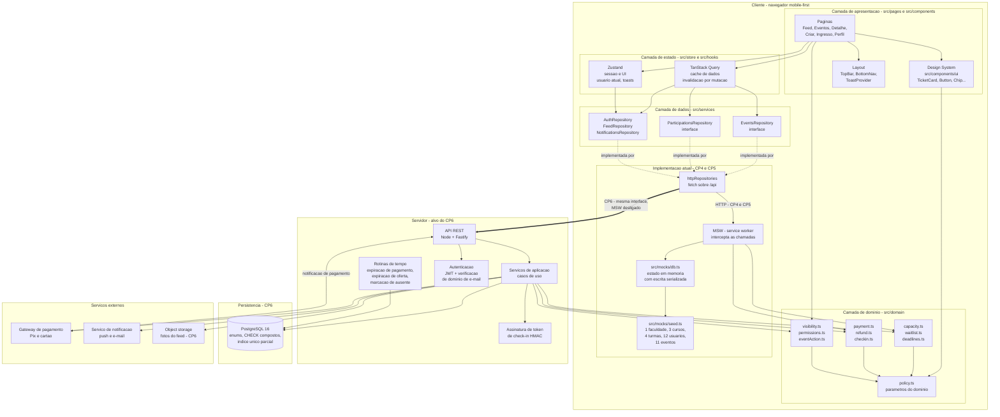

# Diagrama de componentes

**Responsável:** Ronaldo Veloso Filho · **Revisão técnica:** Lucas Baraldi
**Complementa:** [`../08-arquitetura.md`](../08-arquitetura.md) (C4, contrato de API, ADRs)

Visão em camadas dos componentes do sistema e das dependências entre eles. O objetivo é
mostrar **onde está a fronteira que permite trocar o mock pela API real sem tocar em tela**
(RNF-016), que é a decisão técnica mais importante do projeto.

## 1. Componentes e camadas

## 2. O que o diagrama mostra e por que assim

### A fronteira que importa está entre L4 e L5

`src/services/` define **interfaces** (`EventsRepository`, `ParticipationsRepository`,
`AuthRepository`, `FeedRepository`, `NotificationsRepository`). A camada de apresentação e
a de estado dependem apenas dessas interfaces. Nenhuma página importa `fetch`, `axios`,
`msw` ou `seed`.

Consequência: a migração do CP6 é a seta `==>` do diagrama. `httpRepositories` já fala HTTP
hoje — o que muda é **quem responde**: hoje o MSW intercepta e responde do mock em memória;
no CP6 a requisição sai para a API real. Nenhum arquivo de `src/pages/` ou
`src/components/` é tocado. É o RNF-016, e a razão da [ADR-0003](../adr/0003-camada-de-repositorio-com-msw.md).

A alternativa comum — repositório mock que devolve objetos direto, sem HTTP — foi recusada
porque esconde tudo o que dá errado em rede real: estado de carregamento, erro, latência,
código de status, `409` de conflito. O app que "nunca falha" no CP5 quebraria no CP6.

### A camada de domínio é usada pelos dois lados

`src/domain/` (L3) aparece consumido **tanto** pelo MSW (L5) **quanto** pelos serviços de
aplicação do servidor (A2). Isso é deliberado: as regras de capacidade, fila, prazo,
reembolso e check-in são funções puras sobre tipos de domínio, sem dependência de React,
de banco ou de rede.

Efeito prático: os testes de `capacity.ts`, `waitlist.ts` e `refund.ts` valem para os dois
mundos, e as regras de negócio de [`../04-regras-de-negocio.md`](../04-regras-de-negocio.md)
têm **uma** implementação, não duas versões que divergem com o tempo.

Uma ressalva honesta: no CP6, com backend em Node, esse código pode ser compartilhado como
pacote. Se o backend fosse em outra linguagem, as regras seriam reimplementadas no servidor
(a implementação do cliente passaria a ser apenas conveniência de UI, e o servidor seria a
autoridade — RNF-012). A decisão de manter Node no servidor é, em boa parte, por causa
disso.

### `policy.ts` é o único lugar com números

Todos os parâmetros de [RN-012 a RN-017](../04-regras-de-negocio.md) — janela de pagamento,
janela de oferta, escala de reembolso, abertura de check-in — vivem em `domain/policy.ts`.
Nenhum módulo de domínio, e muito menos um componente de UI, carrega `60`, `24` ou `0.5`
literalmente. Mudar uma política é editar um arquivo, e os testes que dependem dela
apontam para a mesma fonte.

### As rotinas de tempo são componente próprio (A3)

Três transições do [diagrama de estados](06-diagrama-estados.md) não têm ator humano:
expiração de pagamento, expiração de oferta e marcação de ausente. No CP5 elas são
simuladas na camada mockada; no CP6 são um processo agendado do servidor, com acesso direto
ao banco.

Está separado da API porque o modo de falha é diferente: se a API cai, ninguém se inscreve;
se as rotinas param, vagas ficam presas e a fila congela — sintoma silencioso, que precisa
de alarme próprio.

### O gateway aparece duas vezes, nas duas direções

`A2 → X1` é a criação da cobrança (síncrona, iniciada pelo usuário). `X1 → A1` é a
notificação de confirmação (assíncrona, iniciada pelo gateway). São caminhos distintos com
requisitos distintos: o primeiro precisa de retorno rápido para a tela; o segundo precisa de
verificação de assinatura e idempotência ([RN-014](../04-regras-de-negocio.md)).

Desenhar uma seta bidirecional esconderia que a notificação é uma **entrada** no sistema —
superfície pública que precisa ser tratada como não confiável.

### O storage só existe no CP6

`X3` está no diagrama sem uso no CP4/CP5: as capas de evento e as imagens do feed são
geradas localmente a partir de `capaSeed` / `imagemSeed` (gradiente determinístico em SVG).
Isso elimina *upload*, armazenamento e moderação de imagem dos dois primeiros checkpoints —
e faz o app funcionar sem rede externa nenhuma, o que também serve à demo.

## 3. Dependências permitidas e proibidas

A regra é: **a dependência sempre aponta para dentro**. Apresentação → estado → domínio.
Nada aponta de volta.

| De | Para | Permitido? | Motivo |
|---|---|---|---|
| `pages/` | `components/ui/` | ✅ | Uso normal do design system |
| `pages/` | `domain/` | ✅ | Só funções puras de decisão (ex.: `resolvePrimaryAction`) |
| `pages/` | `services/` (interface) | ✅ | Via TanStack Query |
| `pages/` | `mocks/` | ❌ | Acoplaria a tela ao mock e quebraria o RNF-016 |
| `pages/` | `fetch` / `axios` direto | ❌ | Toda chamada passa por repositório |
| `components/ui/` | `services/` ou `store/` | ❌ | Componente de design system é apresentacional: recebe dados por props |
| `components/ui/` | valor de cor/fonte/raio literal | ❌ | Só token do `tailwind.config.ts` (RNF-017) |
| `domain/` | React, `services/`, `mocks/` | ❌ | Domínio é puro e testável sem DOM |
| `domain/` | `domain/policy.ts` | ✅ | Fonte única de parâmetros |
| `services/` (interface) | implementação concreta | ❌ | Inversão de dependência: quem sabe da implementação é o *container* em `services/index.ts` |
| `mocks/` | `domain/` | ✅ | O mock **aplica** as regras, para se comportar como a API real |

O ESLint do projeto tem uma regra `no-restricted-imports` que reprova as linhas ❌ acima —
a fronteira é verificada pelo CI, não pela boa vontade do revisor.

## 4. Mapa componente → pasta

| Componente do diagrama | Caminho |
|---|---|
| Páginas | [`app/src/pages/`](../../app/src/pages) |
| Design System | [`app/src/components/ui/`](../../app/src/components/ui) |
| Layout | [`app/src/components/layout/`](../../app/src/components/layout) |
| Zustand (sessão/UI) | [`app/src/store/`](../../app/src/store) |
| TanStack Query | `app/src/hooks/` + `app/src/lib/queryClient.ts` |
| Domínio | [`app/src/domain/`](../../app/src/domain) |
| Interfaces de repositório | [`app/src/services/`](../../app/src/services) |
| Implementação HTTP | `app/src/services/http/` |
| MSW | [`app/src/mocks/`](../../app/src/mocks) |
| Seed | [`app/src/mocks/seed.ts`](../../app/src/mocks/seed.ts) |
| Tipos de domínio | [`app/src/types/domain.ts`](../../app/src/types/domain.ts) |
| API, serviços, rotinas, banco | não existem ainda — CP6, ver [`../13-roadmap-cp5-cp6.md`](../13-roadmap-cp5-cp6.md) |
