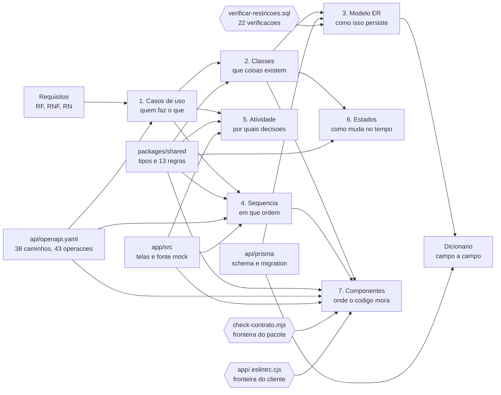

# Modelagem UML

**Responsável:** Ronaldo Veloso Filho (RM556445) — Modelagem / Analista UML
**Peso na avaliação do CP6:** parte de *"documentação final: completa, atualizada,
coerente"* (15%) e de *"evolução do projeto"* (15%)

## Histórico de revisões

| Versão | Data | Checkpoint | O que mudou |
|---|---|---|---|
| 1.0 | 2026-09-01 | CP4 | Sete documentos, 12 diagramas Mermaid, desenhados a partir dos requisitos e das regras de negócio. Peso de 20% no CP4 |
| 2.0 | 2026-09-02 | CP5 | Os mesmos sete documentos, **redesenhados a partir do código**. 12 diagramas passam a 20: as sequências vão de 3 para 7, as atividades de 2 para 5, e as classes se dividem em entidade persistida × projeção de leitura × entrada de escrita. Todo participante de sequência é um arquivo real, toda função citada existe, todo endpoint e todo código de status são os de `app/src/mocks/`. Onde o código divergia do CP4, o **código venceu** — e a divergência está registrada no documento onde apareceu |
| 3.0 | 2026-09-02 | CP6 | Conferidos contra o **backend**, e não mais só contra o front. 20 diagramas passam a **21**: nova sequência 3.1 com o caminho da API real e o `SELECT ... FOR UPDATE`, que é a diferença mais importante entre os dois checkpoints. O ER ganha a tabela `sessao` (14 tabelas) e perde `usuario.excluido_em`, que não existe no schema; `PARTICIPACAO → PAGAMENTO` passa de 1:0..1 para **1:N**, com o único parcial de RN-027. Componentes passa a mostrar o monorepo de três workspaces, `@campus/shared` como fronteira verificada, os módulos da API, o Prisma e o Postgres. Os caminhos de `app/src/domain/` foram reapontados em todos os sete documentos |

Sete documentos, **21 diagramas** em Mermaid dentro dos `.md` (renderizam direto no GitHub)
e exportados em SVG para [`exports/`](exports). Cada diagrama vem com um texto explicando
**o que ele mostra e por que aquela decisão de modelagem** — o critério do professor é
coerência, não quantidade.

## O contrato desta pasta: o código é a verdade

No CP4 estes diagramas descreviam a **intenção**. No CP5 passaram a descrever o que existe
em `app/src/`. No CP6 a fonte cresceu: são **quatro** artefatos, e a regra é operacional, não
retórica.

| Artefato | O que ele é fonte de |
|---|---|
| [`packages/shared/src/`](../../packages/shared/src) | Tipos, enumerações e as 13 funções de regra citadas nos diagramas |
| [`api/openapi.yaml`](../../api/openapi.yaml) | Todo endpoint e todo código de status — 38 caminhos, 43 operações |
| [`api/prisma/schema.prisma`](../../api/prisma/schema.prisma) + a migration | Toda tabela, coluna, tipo, `CHECK` e índice do ER e do dicionário |
| [`app/src/`](../../app/src) | Tela, hook, repositório, e a fonte mock que continua viva |

- Participante de diagrama de sequência é **arquivo**: `LoginPage`, `useEntrar`,
  `httpRepositories.auth`, `mocks/handlersCp5.ts`, `packages/shared/src/domain/auth.ts`,
  `mocks/db.ts`, `lib/api.ts`.
- Toda função citada **existe** e está com o nome exato: `decideLogin`, `decideOnboarding`,
  `planPromotion`, `planWebhook`, `decideCheckIn`, `classificarLeitura`, `paymentDeadline`,
  `minutesLeftToPay`, `gerarCobrancaPix`, `resolvePrimaryAction`, `canSee`,
  `canValidateCheckIn`, `currentPolicy`.
- **O que o código não faz não é desenhado como se fizesse.** É a regra que mais trabalhou
  nesta revisão: `usuario.excluido_em` saiu do ER, três `CHECK` inexistentes saíram do
  dicionário, e a transição `CONFIRMADA → AUSENTE` continua marcada como sem executor.
- **Divergência encontrada é registrada, não arredondada.** Cada documento traz no histórico
  o que a revisão corrigiu; o que é código e não doc está em
  [`../21-api-contrato.md` §6](../21-api-contrato.md#6-divergências-abertas-entre-o-contrato-e-o-resto).

## Índice

| # | Diagrama | Tipo Mermaid | Blocos | Arquivo | Exigido no |
|---|---|---|---|---|---|
| 1 | **Casos de uso** — 23 casos, 7 atores, relações `include`/`extend`, coloridos pelo estado da implementação. Conferidos contra as 43 operações do CP6: nenhum caso de uso novo, sete ganharam endpoint | `flowchart` | 1 | [`01-casos-de-uso.md`](01-casos-de-uso.md) | CP4 |
| 2 | **Classes** — 13 entidades, 3 objetos-valor e 10 enumerações no primeiro diagrama; 11 projeções de leitura, 7 entradas de escrita e as 5 enumerações de resposta no segundo. `sessao` é a 14ª tabela e **não** tem tipo compartilhado, de propósito | `classDiagram` ×2 | 2 | [`02-diagrama-classes.md`](02-diagrama-classes.md) | CP4 |
| 3 | **Modelo ER** — **14 tabelas**, 20 `CHECK`, 2 únicos parciais, 8 índices parciais, 10 tipos enumerados, o `SELECT ... FOR UPDATE` de RN-004 e as 22 verificações que provam que o banco recusa | `erDiagram` | 1 | [`03-modelo-dados-er.md`](03-modelo-dados-er.md) | CP4 |
| 4 | **Sequência** — login; onboarding e a guarda de três estados; inscrição com vaga; **a mesma inscrição contra a API real, com a trava de linha**; lista de espera, oferta e confirmação; pagamento com os 4 desfechos do webhook; check-in com as 3 formas de leitura; publicar no feed | `sequenceDiagram` ×8 | 8 | [`04-diagrama-sequencia.md`](04-diagrama-sequencia.md) | **CP5** |
| 5 | **Atividade** — criar e publicar evento; decisão da ação principal com os 11 `PrimaryActionKind`; pagamento com a expiração da janela; check-in na porta com a contingência do código digitado; onboarding do primeiro acesso | `flowchart` ×5 | 5 | [`05-diagrama-atividades.md`](05-diagrama-atividades.md) | **CP5** |
| 6 | **Estados** — ciclo de vida de `Participacao` (8 estados, com o endpoint de cada transição) e de `Evento` (5 estados), e o que ainda não tem executor | `stateDiagram-v2` ×2 | 2 | [`06-diagrama-estados.md`](06-diagrama-estados.md) | CP4 |
| 7 | **Componentes** — o monorepo de três workspaces, `@campus/shared` como fronteira verificada, as duas fontes de dados atrás de uma interface, os módulos da API, o Prisma e o Postgres | `flowchart` | 1 | [`07-diagrama-componentes.md`](07-diagrama-componentes.md) | CP4 |
| — | **Dicionário de dados** — **14 entidades** campo a campo, 10 tipos enumerados, inventário LGPD e os 20 tipos que **não** são tabela | tabelas | — | [`dicionario-de-dados.md`](dicionario-de-dados.md) | CP4 |
| — | *este arquivo* — encadeamento dos diagramas | `flowchart` | 1 | — | — |

Total: **21 blocos Mermaid** nesta pasta, distribuídos em 4 tipos de diagrama. Recontar com
`node scripts/validate-docs.mjs`, que percorre todos os blocos de `docs/`.

## Como os diagramas se encadeiam

Nenhum diagrama existe por obrigação de entrega: cada um responde a uma pergunta que o
anterior deixou aberta. No CP5 a seta que importava era a do código — ele deixou de ser
destino e passou a ser **fonte**. No CP6 aquela seta se abriu em quatro, e duas delas são
verificadores: a modelagem passou a ter como conferir a si mesma.



| Pergunta | Diagrama que responde |
|---|---|
| Quem interage com o sistema, e para quê? E o que o CP5 fechou? | Casos de uso |
| Quais conceitos existem, e o que é entidade versus projeção versus entrada? | Classes |
| Como esses conceitos são persistidos com integridade garantida? | ER + dicionário |
| Em que ordem as mensagens trafegam, por quais arquivos, e com quais status? | Sequência |
| Que decisões o sistema toma, e o que acontece quando falham? | Atividade |
| Como uma entidade muda de estado, qual endpoint executa cada mudança, e quais mudanças são proibidas? | Estados |
| Onde cada regra vive no código, e o que pode depender de quê? | Componentes |
| O que muda quando a fonte de dados é a API real, e não o mock? | Sequência 3.1 |
| Quem prova que a restrição do banco recusa, e não apenas existe? | ER, seção das 22 verificações |

## Rastreabilidade: requisito → diagrama

| Grupo de requisitos | Diagramas que o modelam |
|---|---|
| RF-001 a RF-005 (autenticação, onboarding) | UC-006 a UC-008 · sequências 1 e 2 · atividade 5 |
| RF-010 a RF-018 (eventos) | UC-001, UC-015, UC-016 · classe `Evento` · atividade 1 · estados 2 |
| RF-019 a RF-023 (inscrição e vagas) | UC-002 · classe `Participacao` · sequência 3 · atividade 2 · estados 1 · transação de RN-004 |
| RF-024 a RF-027 (lista de espera) | UC-004 · sequência 4 · estados 1 |
| RF-026 a RF-030 (pagamentos) | UC-003, UC-018 · classes `Pagamento`, `PagamentoView` · sequência 5 · atividade 3 |
| RF-031 a RF-035 (check-in) | UC-005, UC-017 · classes `Presenca`, `TokenIngresso`, `PainelCheckin` · sequência 6 · atividade 4 |
| RF-036 a RF-038 (feed) | UC-013, UC-014 · classes `Publicacao`, `Comentario` · sequência 7 |
| RF-039, RF-040 (notificações) | UC-021 · classe `Notificacao` |
| RF-041 a RF-043 (administração) | UC-019, UC-020, UC-023 · estados 2 (`EM_APROVACAO`) |
| RNF-011 a RNF-014 (segurança e confiabilidade) | Sequência 5 (idempotência), sequência 6 (uso único), sequências 3 e **3.1** (serialização), ER (restrições e as 22 verificações) |
| RNF-016 (duas fontes atrás de uma interface) | Componentes · sequência 3.1, seção "o que não muda" |
| RNF-020 (sessão revogável) | ER e dicionário, tabela `sessao` · sequência 3.1, bloco de renovação |
| RNF-022 (dado de cartão) | Classes decisão 9 · ER seção 2 item 5 · dicionário seções 7 e 15 |

## Renderizar e validar os diagramas

Todo bloco Mermaid é validado antes de commitar — diagrama quebrado no GitHub é entrega
quebrada.

```bash
node scripts/render-diagrams.mjs --check
```

Valida a sintaxe de **todos** os blocos Mermaid da documentação (não só desta pasta) e
falha com o arquivo e a linha do bloco com erro. Para gerar/atualizar os SVGs de
[`exports/`](exports):

```bash
node scripts/render-diagrams.mjs
```

Equivalente, de dentro de `app/`:

```bash
npm run diagrams
```

O renderizador é o `@mermaid-js/mermaid-cli`, invocado por `npx` sob demanda — não é
dependência do app, porque arrasta o Chromium do Puppeteer e pesaria no CI. Se você já tem
o binário instalado, aponte `MMDC_BIN` para ele.

A validação de documentação, que também confere link quebrado, âncora inexistente, bloco
não fechado e SVG malformado:

```bash
node scripts/validate-docs.mjs
```

## Convenções adotadas nos diagramas

| Convenção | Por quê |
|---|---|
| Rótulos sem acento dentro dos blocos Mermaid | Alguns renderizadores (incluindo o do GitHub, em versões antigas) quebram com acento em rótulo não citado. O texto explicativo em português acentuado fica fora do bloco |
| Nomes de classe e entidade em português | O domínio é discutido em português com o professor e o grupo; o **código** usa inglês nos campos e nas funções (ver [`../14-glossario.md`](../14-glossario.md)) |
| Nome de arquivo, hook, função, tipo e endpoint **exatamente** como no código | É o que torna o diagrama verificável: dá para abrir o arquivo e conferir. Onde o código está em inglês, o rótulo fica em inglês |
| Enumerações com valores em `MAIUSCULA_COM_UNDERLINE` | Mesma forma no PostgreSQL, no TypeScript e nos diagramas — o valor é literalmente o mesmo texto nos três lugares |
| Um diagrama por pergunta, não um diagrama por entidade | Diagrama que tenta mostrar tudo não mostra nada |
| Transições proibidas documentadas explicitamente | O que o modelo **impede** é metade da especificação. Ver "Transições proibidas" em [`06-diagrama-estados.md`](06-diagrama-estados.md) |
| Transição sem executor marcada `CP6`, nunca omitida nem desenhada como pronta | Omitir esconde a lacuna; desenhar como pronta mente. Ver "Transições que o CP5 ainda não executa" em [`06-diagrama-estados.md`](06-diagrama-estados.md) |

### Armadilhas de Mermaid conhecidas neste projeto

Custaram tempo de alguém. Ficam registradas para não custarem de novo.

| Armadilha | Sintoma | Forma correta |
|---|---|---|
| Chave múltipla em `erDiagram` | `Parse error` na linha da coluna | `FK,UK` — com vírgula e **sem espaço**. `FK UK` quebra o parser |
| **Ponto e vírgula em texto de `sequenceDiagram`** | `Expecting 'NEWLINE', ... got 'INVALID'` | `;` é separador de instrução. Use `.` ou `-` no texto de `Note` e de mensagem |
| Parêntese e colchete não escapados em rótulo de nó de `flowchart` | `Parse error` no nó | Reescreva sem parêntese, ou use `<br/>` para quebrar a frase |
| Bloco não fechado | `validate-docs.mjs` reprova o arquivo inteiro | Toda cerca ```` ```mermaid ```` precisa da cerca de fechamento |
| Acento em rótulo não citado | Renderiza torto ou quebra em versão antiga | Rótulo sem acento dentro do bloco; a prosa acentuada fica fora |
