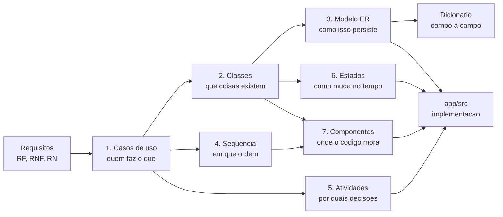

# Modelagem UML

**Responsável:** Ronaldo Veloso Filho (RM556445) — Modelagem / Analista UML
**Peso na avaliação do CP4:** 20% — *"diagrama(s) corretos e condizentes com a ideia proposta"*

Sete diagramas, todos em **Mermaid** dentro dos `.md` (renderizam direto no GitHub) e
exportados em SVG para [`exports/`](exports). Cada diagrama vem com um texto explicando
**o que ele mostra e por que aquela decisão de modelagem** — o critério do professor é
coerência, não quantidade.

## Índice

| # | Diagrama | Tipo Mermaid | Arquivo | Exigido no |
|---|---|---|---|---|
| 1 | **Casos de uso** — 23 casos, 7 atores, relações `include`/`extend`, e especificação textual completa de UC-001 a UC-005 | `flowchart` | [`01-casos-de-uso.md`](01-casos-de-uso.md) | CP4 |
| 2 | **Classes** — 14 classes, 9 enumerações, atributos tipados, multiplicidades, composição e agregação | `classDiagram` | [`02-diagrama-classes.md`](02-diagrama-classes.md) | CP4 |
| 3 | **Modelo ER** — 14 tabelas, restrições, índices e a transação que sustenta RN-004 | `erDiagram` | [`03-modelo-dados-er.md`](03-modelo-dados-er.md) | CP4 |
| 4 | **Sequência** — Pix com confirmação assíncrona; lista de espera e promoção; check-in por QR | `sequenceDiagram` ×3 | [`04-diagrama-sequencia.md`](04-diagrama-sequencia.md) | CP5 (adiantado) |
| 5 | **Atividades** — criação e publicação de evento; decisão do botão principal | `flowchart` ×2 | [`05-diagrama-atividades.md`](05-diagrama-atividades.md) | CP5 (adiantado) |
| 6 | **Estados** — ciclo de vida de `Participacao` (8 estados) e de `Evento` (5 estados) | `stateDiagram-v2` ×2 | [`06-diagrama-estados.md`](06-diagrama-estados.md) | CP4 |
| 7 | **Componentes** — camadas do app, fronteira mock→API, dependências proibidas | `flowchart` | [`07-diagrama-componentes.md`](07-diagrama-componentes.md) | CP4 |
| — | **Dicionário de dados** — 14 entidades campo a campo + inventário LGPD | tabelas | [`dicionario-de-dados.md`](dicionario-de-dados.md) | CP4 |

Total: **12 diagramas Mermaid** distribuídos em 7 tipos de modelagem.

## Como os diagramas se encadeiam

Nenhum diagrama existe por obrigação de entrega: cada um responde a uma pergunta que o
anterior deixou aberta.



| Pergunta | Diagrama que responde |
|---|---|
| Quem interage com o sistema, e para quê? | Casos de uso |
| Quais conceitos existem, e como se relacionam? | Classes |
| Como esses conceitos são persistidos com integridade garantida? | ER + dicionário |
| Em que ordem as mensagens trafegam, e por que essa ordem? | Sequência |
| Que decisões o sistema toma, e o que acontece quando falham? | Atividades |
| Como uma entidade muda de estado, e quais mudanças são proibidas? | Estados |
| Onde cada regra vive no código, e o que pode depender de quê? | Componentes |

## Rastreabilidade: requisito → diagrama

| Grupo de requisitos | Diagramas que o modelam |
|---|---|
| RF-001 a RF-005 (autenticação, onboarding) | UC-006, UC-007, UC-008 · `usuario`, `turma` |
| RF-010 a RF-018 (eventos) | UC-001, UC-015, UC-016 · classe `Evento` · atividades 1 · estados 2 |
| RF-019 a RF-023 (inscrição e vagas) | UC-002 · classe `Participacao` · sequência 1 · estados 1 · transação de RN-004 |
| RF-024 a RF-027 (lista de espera) | UC-004 · sequência 2 · estados 1 |
| RF-028 a RF-032 (pagamentos) | UC-003, UC-018 · classe `Pagamento` · sequência 1 |
| RF-033 a RF-035 (check-in) | UC-005, UC-017 · classe `Presenca` · sequência 3 |
| RF-036 a RF-038 (feed) | UC-013, UC-014 · classes `Publicacao`, `Comentario` |
| RF-039, RF-040 (notificações) | UC-021 · classe `Notificacao` |
| RF-041 a RF-043 (administração) | UC-019, UC-020, UC-023 · estados 2 (`EM_APROVACAO`) |
| RNF-011 a RNF-014 (segurança e confiabilidade) | Sequência 1 (idempotência), sequência 3 (uso único), ER (restrições) |
| RNF-016 (troca do mock pela API) | Componentes |

## Renderizar e validar os diagramas

Todo bloco Mermaid é validado antes de commitar — diagrama quebrado no GitHub é entrega
quebrada.

```bash
node scripts/render-diagrams.mjs --check
```

Valida a sintaxe de **todos** os blocos Mermaid da documentação (não só desta pasta) e
falha com o arquivo e a linha do bloco com erro. Para gerar/atualizar os SVGs de
[`exports/`](exports):

```bash
node scripts/render-diagrams.mjs
```

Equivalente, de dentro de `app/`:

```bash
npm run diagrams
```

O renderizador é o `@mermaid-js/mermaid-cli`, invocado por `npx` sob demanda — não é
dependência do app, porque arrasta o Chromium do Puppeteer e pesaria no CI. Se você já tem
o binário instalado, aponte `MMDC_BIN` para ele.

## Convenções adotadas nos diagramas

| Convenção | Por quê |
|---|---|
| Rótulos sem acento dentro dos blocos Mermaid | Alguns renderizadores (incluindo o do GitHub, em versões antigas) quebram com acento em rótulo não citado. O texto explicativo em português acentuado fica fora do bloco |
| Nomes de classe e entidade em português | O domínio é discutido em português com o professor e o grupo; o **código** usa inglês (ver [`../14-glossario.md`](../14-glossario.md)) |
| Enumerações com valores em `MAIUSCULA_COM_UNDERLINE` | Mesma forma no PostgreSQL, no TypeScript e nos diagramas — o valor é literalmente o mesmo texto nos três lugares |
| Um diagrama por pergunta, não um diagrama por entidade | Diagrama que tenta mostrar tudo não mostra nada |
| Transições proibidas documentadas explicitamente | O que o modelo **impede** é metade da especificação. Ver seções "Transições proibidas" em [`06-diagrama-estados.md`](06-diagrama-estados.md) |
