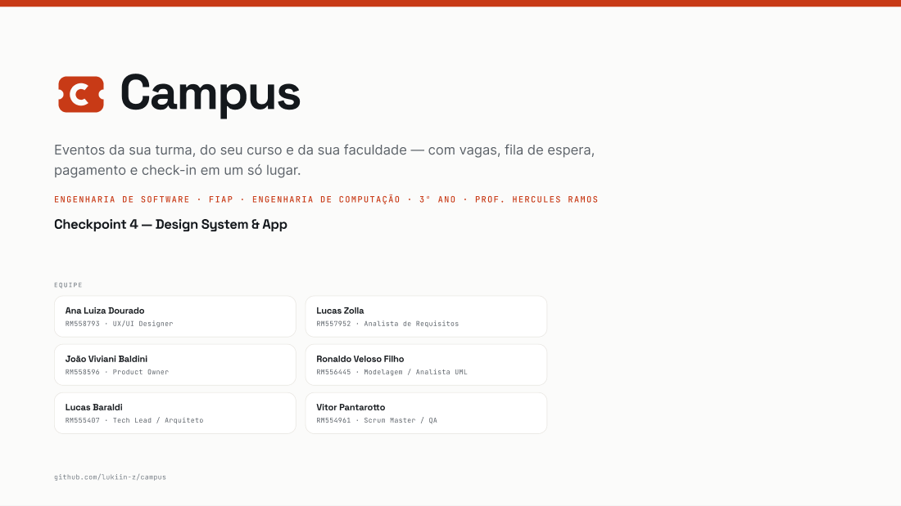
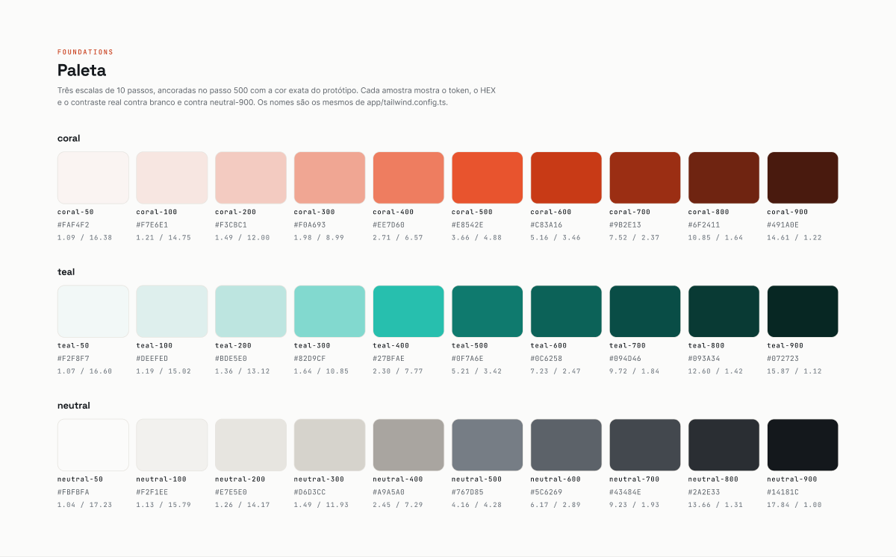

# Arquivo do Figma — o que existe, o que falta e como continuar

**Responsável:** Ana Luiza Dourado (RM558793) — UX/UI Designer
**Arquivo:** [Campus — Design System & App (CP4)](https://www.figma.com/design/LRohAtBOH6gyskqkA9cRKp)
`fileKey`: `LRohAtBOH6gyskqkA9cRKp`
**Conta:** `baraldilucas` · plano **Starter** (equipe "A equipe de Lucas Baraldi")

> **Leia primeiro:** o arquivo foi construído de verdade, não é um roteiro. Mas o plano
> Starter do Figma impôs dois limites duros durante a construção, e a seção 5 registra
> exatamente o que ficou de fora por causa deles e como completar em ~20 minutos. Nada
> aqui é estimativa: são os erros que a API devolveu, citados literalmente.

---

## 1. O que já está construído

### Estrutura de páginas

| Página | Conteúdo | Estado |
|---|---|---|
| **📋 Cover & Foundations** | Capa (logo, nome, disciplina, tabela dos 6 integrantes) + paleta completa, escala tipográfica renderizada, espaçamento, raios e sombras | ✅ pronto |
| **🧩 Components** | 9 componentes, 4 deles com *variant sets* | ✅ pronto |
| **📱 Screens & Prototype** | Página criada, **vazia** | ⚠️ pendente (ver seção 5) |

### Tokens: 64 *variables* na coleção `campus/tokens`

| Grupo | Quantidade | Nomes |
|---|---|---|
| Escala de cor | 30 | `color/coral/50` … `color/coral/900`, `color/teal/*`, `color/neutral/*` |
| Cor semântica | 17 | `color/semantic/bg`, `surface`, `surface-2`, `border`, `border-strong`, `text`, `text-muted`, `text-subtle`, `text-disabled`, `accent`, `accent-strong`, `accent-hover`, `accent-soft`, `accent-2`, `accent-2-hover`, `accent-2-soft`, `danger` |
| Espaçamento | 12 | `space/1` … `space/24` (base 4px) |
| Raio | 5 | `radius/sm`, `md`, `lg`, `xl`, `full` |

As 16 variáveis semânticas são **alias** das escalas, não cor solta: `color/semantic/accent-strong`
aponta para `color/coral/600`. Trocar o passo do botão primário muda em um lugar só — exatamente
como no `tailwind.config.ts`. Cada variável tem `scopes` explícito (`TEXT_FILL`, `FRAME_FILL`,
`GAP`, `CORNER_RADIUS`) e uma `description` com o HEX e a razão de contraste medida.

### Estilos de texto: 11

`text/mono/xs` · `text/mono/sm` · `text/body/xs` · `text/body/sm` · `text/body/md` ·
`text/body/md-strong` · `text/display/sm` · `text/display/md` · `text/display/lg` ·
`text/display/xl` · `text/display/2xl`

### Estilos de efeito: 3

`shadow/sm` · `shadow/md` · `shadow/lg` — todos com `neutral-900` + alfa, nunca preto puro
(preto sobre fundo quente cria borda acinzentada suja).

### Componentes: 9 (34 variants no total)

| Componente | Propriedades e valores | Variants |
|---|---|---|
| **`Button`** | `variant` = primary · secondary · ghost · danger<br>`state` = default · hover · disabled | 12 |
| **`TicketCard`** | `alcance` = turma · curso · faculdade<br>`preco` = pago · gratuito | 6 |
| **`StatusBadge`** | `status` = confirmada · pendente · lista-espera · presente · cancelada | 5 |
| **`ScopeBadge`** | `alcance` = turma · curso · faculdade | 3 |
| **`Avatar`** | `tamanho` = sm (32) · md (40) · lg (80) | 3 |
| **`Input`** | `state` = default · focus · erro | 3 |
| **`Chip`** | `state` = default · active | 2 |
| **`EventListItem`** | — | 1 |
| **`ProgressBar`** | — | 1 |

Cada componente tem `description` preenchida com a razão de existir e a restrição de
acessibilidade que ele carrega. Exemplo, do `Button`:

> "Ação. Uma ação primária por tela. O preenchimento primário usa `accent-strong`
> (#C83A16), não o coral da marca: branco sobre #E8542E dá 3,66:1 e reprova WCAG AA.
> Altura mínima de 44px (área de toque)."

### O cartão-ingresso picotado, construído de verdade

O `TicketCard` não é um retângulo com uma linha: o picote é um `FRAME` chamado `Picote`
com três filhos —

1. uma `LINE` com `strokeWeight = 2` e `dashPattern = [8, 8]`;
2. duas `ELLIPSE` de 20×20 preenchidas com `color/semantic/bg`, posicionadas com centro
   exatamente sobre a borda esquerda e direita do cartão (`clipsContent = false` no
   cartão para elas vazarem);

e é isso que produz a leitura de ingresso destacável.

> **Defeito encontrado e corrigido durante a construção:** a primeira versão usava um
> `RECTANGLE` preenchido com `dashPattern`. Saiu **sólido**. `dashPattern` age sobre o
> **stroke**, não sobre o fill — um retângulo preenchido ignora o padrão. A correção foi
> trocar por uma `LINE` com stroke tracejado. Vale para quem for editar: não mexa no tipo
> do nó da divisória.

### Evidência visual

| Print | Página |
|---|---|
|  | 📋 Cover & Foundations — capa |
|  | 📋 Cover & Foundations — paleta |

Na paleta, os dois números sob cada amostra são o contraste **calculado dentro do próprio
Figma** contra branco e contra `neutral-900`. Eles conferem, dígito por dígito, com a
tabela de [`identidade-visual.md`](identidade-visual.md#4-verificação-de-contraste-wcag-21-aa):
`coral-600` = 5.16 / 3.46, `neutral-600` = 6.17 / 2.89.

---

## 2. O mapa que liga design e código

Esta é a razão de o arquivo existir: **o nome do style/variable no Figma é idêntico ao
nome do token no Tailwind.** Não há tradução, não há planilha de equivalência.

| Figma | `app/tailwind.config.ts` | Uso no código |
|---|---|---|
| `color/coral/500` | `colors.coral[500]` | `bg-coral-500`, `text-coral-500` |
| `color/coral/600` | `colors.coral[600]` | `bg-coral-600` |
| `color/neutral/600` | `colors.neutral[600]` | `text-neutral-600` |
| `color/semantic/bg` | `colors.bg` | `bg-bg` |
| `color/semantic/surface` | `colors.surface` | `bg-surface` |
| `color/semantic/surface-2` | `colors['surface-2']` | `bg-surface-2` |
| `color/semantic/border` | `colors.border` | `border-border` |
| `color/semantic/border-strong` | `colors['border-strong']` | `border-border-strong` |
| `color/semantic/text` | `colors.text` | `text-text` |
| `color/semantic/text-muted` | `colors['text-muted']` | `text-text-muted` |
| `color/semantic/accent` | `colors.accent` | `text-accent` |
| `color/semantic/accent-strong` | `colors['accent-strong']` | `bg-accent-strong` |
| `color/semantic/accent-2` | `colors['accent-2']` | `bg-accent-2` |
| `color/semantic/danger` | `colors.danger` | `bg-danger` |
| `text/mono/xs` | `fontSize['mono-xs']` | `font-mono text-mono-xs` |
| `text/mono/sm` | `fontSize['mono-sm']` | `font-mono text-mono-sm` |
| `text/body/sm` | `fontSize['body-sm']` | `text-body-sm` |
| `text/body/md` | `fontSize['body-md']` | `text-body-md` |
| `text/display/sm` | `fontSize['display-sm']` | `font-display text-display-sm` |
| `text/display/xl` | `fontSize['display-xl']` | `font-display text-display-xl` |
| `space/4` | `spacing[4]` | `p-4`, `gap-4` |
| `radius/lg` | `borderRadius.lg` | `rounded-lg` |
| `shadow/md` | `boxShadow.md` | `shadow-md` |

**A regra que mantém os dois em sincronia:** mudar um token exige atualizar os **três**
lugares no mesmo PR — este arquivo do Figma, o `tailwind.config.ts` e a tabela de
[`identidade-visual.md`](identidade-visual.md). A prova visual é
[`styleguide.html`](styleguide.html), que renderiza a marca inteira em uma página.

---

## 3. Como o grupo edita e estende o arquivo

### Antes de mexer

1. Abra [o arquivo](https://www.figma.com/design/LRohAtBOH6gyskqkA9cRKp) e olhe a aba
   **Local variables** (ícone de variáveis no painel direito). Tudo que é cor, espaço ou
   raio já existe ali.
2. Olhe a lista de **Text styles** e **Effect styles**. Não crie estilo novo sem antes
   confirmar que não existe.

### Regras de edição

| Faça | Não faça |
|---|---|
| Aplicar cor pela **variable** (`color/semantic/accent-strong`) | Digitar `#C83A16` no seletor de cor |
| Aplicar tipografia pelo **text style** (`text/display/sm`) | Ajustar tamanho e peso à mão |
| Usar **instância** do componente nas telas | Copiar e colar o desenho do componente |
| Editar o **componente principal** quando a mudança vale para todos | Editar cada instância |
| Criar variant nova dentro do *component set* existente | Criar um componente novo chamado `Button 2` |
| Renomear mantendo o padrão `grupo/subgrupo/nome` | Nome solto tipo `Coral escuro` |

### Para adicionar um componente novo

1. Confirme que existe **terceiro caso concreto** de uso — o design system não cria
   abstração antes disso (regra do [`design-system.md`](design-system.md)).
2. Monte com auto-layout, aplicando **só** variables e text styles existentes.
3. Converta em componente (`Ctrl/Cmd + Alt + K`), nomeie e **preencha a `description`**
   com a razão de existir e a restrição de acessibilidade.
4. Registre o componente em [`design-system.md`](design-system.md) no mesmo PR.

### Para mudar uma cor da paleta

1. Edite o **valor da variable** na coleção `campus/tokens` — nunca as instâncias.
2. Recalcule o contraste dos pares afetados e atualize a tabela da seção 4 de
   [`identidade-visual.md`](identidade-visual.md).
3. Atualize o `tailwind.config.ts` com o mesmo valor.
4. Rode `node scripts/validate-docs.mjs` e abra `styleguide.html` para conferir.

---

## 4. Prototipagem — o que ligar quando as telas existirem

Os três fluxos que o CP5 precisa demonstrar, com a transição sugerida:

| Fluxo | Ligações | Transição |
|---|---|---|
| **A — entrada** | Splash/Login → Onboarding → Feed | `Push` para a esquerda, 300ms, `Ease out` |
| **B — inscrição** | Feed → Detalhe do evento → (ação principal) → Meu ingresso | `Push` na ida; `Smart Animate` no botão que muda de rótulo, 200ms |
| **C — criação** | Feed → Criar evento → (publicar) → Detalhe do evento | `Push`; volta com `Move out` |

Em todas as telas, a `BottomNav` liga para Feed, Eventos, Criar e Perfil — use
**`Navigate to`** com `Instant`, porque troca de aba não é transição narrativa.

---

## 5. O que NÃO foi construído, e por quê

Dois limites do plano **Starter** interromperam a construção. Os dois são fato verificado,
com a mensagem literal que a API devolveu.

### Limite 1 — 3 páginas por arquivo

```
Error: in createPage: The Starter plan only comes with 3 pages.
Upgrade to Professional for unlimited pages
```

O plano do CP4 previa 5 páginas (Foundations, Components, Screens, Prototype, Cover). Os
cinco conteúdos foram **consolidados em 3**: Cover e Foundations na mesma página, e Screens
e Prototype na mesma. Nada de conteúdo foi cortado por esse limite — só reorganizado.

### Limite 2 — cota de chamadas do MCP

```
You've reached the Figma MCP tool call limit on the Starter plan.
Upgrade your plan for more tool calls
```

Esta é a que doeu: a cota estourou **depois** dos tokens, estilos, capa, foundations e os
9 componentes, e **antes** das 8 telas. O que ficou pendente:

| Pendente | Onde | Substituto que já existe |
|---|---|---|
| 8 telas em frames de 390×844 | Página 📱 Screens & Prototype | 4 telas de referência renderizadas em [`styleguide.html`](styleguide.html), seção "Telas de referência" — e o **app React funcionando** em `app/`, que é a mesma UI em código |
| Ligações de protótipo dos 3 fluxos | idem | Roteiro pronto na seção 4 acima; o app tem navegação real por React Router |
| Componentes `TopBar`, `BottomNav`, `Toast`, `EmptyState`, `Skeleton` | Página 🧩 Components | Todos existem implementados em `app/src/components/` e renderizados no `styleguide.html` |
| Prints das páginas de componentes | `docs/06-marca/figma/` | Os 2 prints da seção 1; os componentes são visíveis abrindo o arquivo |

### Como completar as telas em ~20 minutos, à mão

O trabalho braçal — tokens, estilos e componentes — está feito. Montar as telas com
instâncias é rápido:

1. Abra a página **📱 Screens & Prototype**.
2. Crie um frame `390 × 844` (`F`, depois escolha *iPhone 14* no painel direito).
   Nomeie: `01 Splash e Login`.
3. Duplique 7 vezes (`Ctrl/Cmd + D`) e renomeie:
   `02 Onboarding` · `03 Feed` · `04 Eventos` · `05 Detalhe do evento` ·
   `06 Criar evento` · `07 Meu ingresso` · `08 Perfil`.
4. Em cada frame: fundo = variable `color/semantic/bg`.
5. Arraste **instâncias** (não cópias) da página Components:
   - toda tela: `TopBar` no topo, `BottomNav` no rodapé;
   - `03 Feed`: `TicketCard` (`alcance=turma, preco=pago` e `alcance=faculdade, preco=gratuito`) em faixa horizontal;
   - `04 Eventos`: `Chip` (um `state=active`, três `state=default`) + 4 `EventListItem`;
   - `05 Detalhe`: `ScopeBadge`, `ProgressBar`, `Button` (`variant=primary, state=default`);
   - `06 Criar`: 5 `Input` (`state=default`) + 2 `Button` (primary e ghost);
   - `07 Meu ingresso`: `TicketCard` + `StatusBadge` (`status=confirmada`);
   - `08 Perfil`: `Avatar` (`tamanho=lg`), `StatusBadge`, 2 `EventListItem`.
6. Conteúdo: use **exatamente** o do seed canônico (está em `app/src/mocks/seed.ts` e nas
   variants do `TicketCard`) — Churrasco 18/40 R$ 25, Hackathon lotado com fila de 7,
   Marina Alves · ECOMP · 3ESPX, código `CMP-3ESPX-0184`. Nada de texto inventado.
7. Aba **Prototype**: ligue conforme a tabela da seção 4.
8. Tire print de cada página (`Ctrl/Cmd + Shift + E` → PNG 1×) e salve em
   `docs/06-marca/figma/` como `03-components.png`, `04-screens.png`, `05-prototype.png`.
   Depois referencie na tabela de evidência da seção 1.

### Se o grupo preferir subir para Professional

Com o plano pago, a construção restante volta a poder ser automatizada pelo MCP. O que
falta é mecânico: 8 frames de instâncias e 3 fluxos de ligação.

---

## 6. Onde este arquivo é citado

| Documento | Para quê |
|---|---|
| [`identidade-visual.md`](identidade-visual.md) | O arquivo do Figma como um dos três lugares onde os tokens vivem |
| [`design-system.md`](design-system.md) | Inventário de componentes, espelhado no arquivo |
| [`../16-checklist-entrega-cp4.md`](../16-checklist-entrega-cp4.md) | Link do Figma na entrega do Teams |
| [`../../README.md`](../../README.md) | Link do Figma no cartão de visitas do repositório |
| [`../15-video-roteiro.md`](../15-video-roteiro.md) | Bloco 0:40–1:10, em que a designer apresenta o design system |
