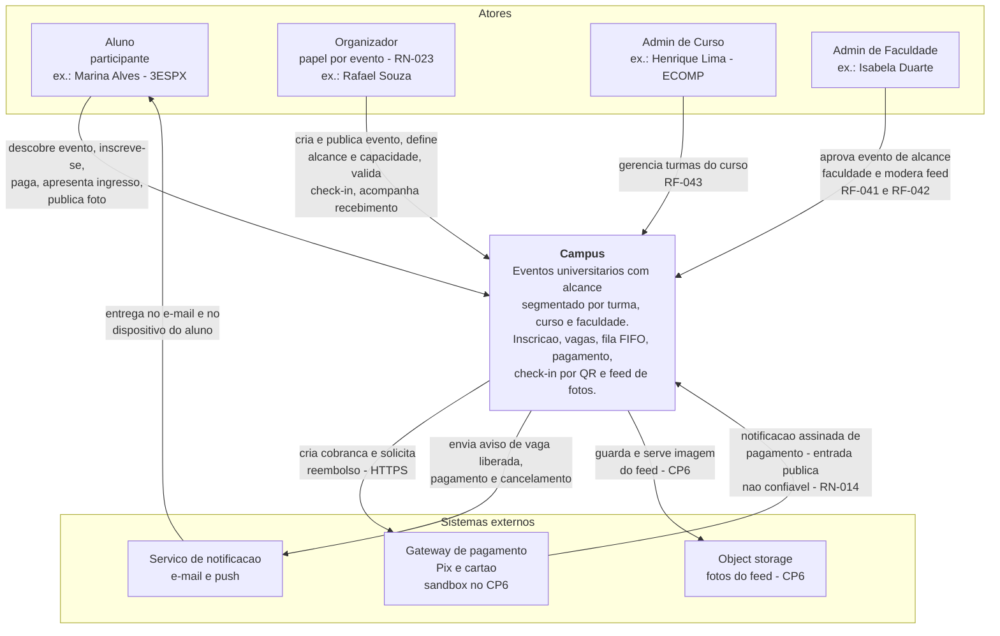
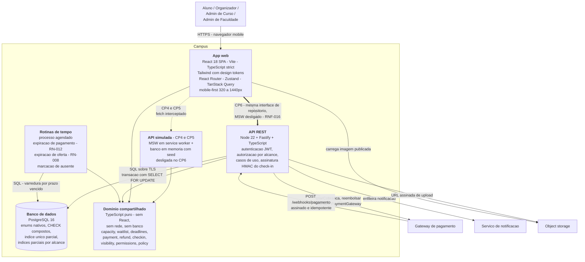
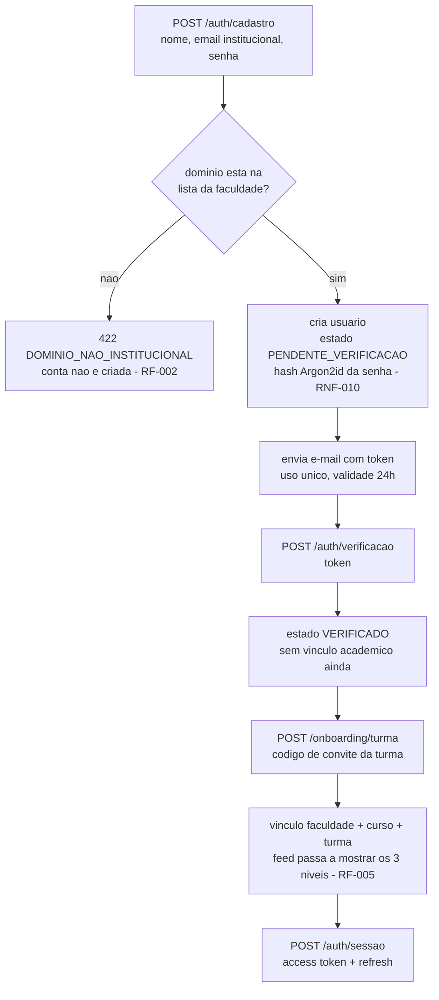

# Arquitetura

## Histórico de revisões

| Versão | Data | Checkpoint | O que mudou |
|---|---|---|---|
| 1.0 | 2026-09-01 | CP4 | Versão inicial: C4 níveis 1 e 2, decisões de stack, camadas do front, contrato de 41 endpoints, autenticação, token de check-in, substituição do mock |
| 1.1 | 2026-09-02 | CP5 | §5.11 reescrita com as 28 rotas implementadas e a **decisão** sobre as três divergências de nome; nota sobre o `openapi.yaml` do CP6 passar a ser a fonte única do contrato |


**Responsável técnico:** Lucas Baraldi (Tech Lead / Arquiteto)
**Complementa:** [`05-modelagem/07-diagrama-componentes.md`](05-modelagem/07-diagrama-componentes.md)
(camadas e fronteira mock→API) · [`adr/README.md`](adr/README.md) (decisões e alternativas
recusadas)

Este documento descreve **o estado da arquitetura** e o contrato que o CP6 vai implementar.
Os *motivos* de cada escolha, com as alternativas recusadas e o custo assumido, estão nas
ADRs — e são citados por número em cada seção.

---

## 1. Visão geral e princípios

O Campus é uma aplicação web mobile-first (React SPA) que hoje conversa com uma API
simulada e, no CP6, passa a conversar com uma API REST real sobre PostgreSQL. A regra de
negócio é escrita uma vez, como função pura, e usada pelos dois lados.

### Princípio 1 — A dependência aponta para dentro

Apresentação depende de estado; estado depende de interface de dados; todos dependem do
domínio; **o domínio não depende de ninguém**. `src/domain/` não importa React, não importa
`fetch`, não conhece banco e não sabe que existe uma tela. É a única forma de a mesma regra
valer no cliente e no servidor sem duas implementações que divergem com o tempo.

### Princípio 2 — Regra de negócio é função pura

Capacidade, fila FIFO, prazos, política de reembolso e validade de check-in são funções sem
efeito colateral, sobre tipos de domínio. Elas recebem estado e instante, devolvem decisão.

Consequência prática: as 25 regras de [`04-regras-de-negocio.md`](04-regras-de-negocio.md)
são testáveis sem DOM, sem rede e sem banco — o que é o que torna viável cobrir ≥ 60% do
domínio (RNF-015) com seis pessoas em papéis acumulados.

Corolário: **todo parâmetro numérico vive em `src/domain/policy.ts`.** Nenhum módulo carrega
`60`, `24` ou `0.5` literalmente. Mudar a janela de pagamento é editar um arquivo.

### Princípio 3 — O servidor é a autoridade de autorização (RNF-012)

A verificação de alcance no cliente existe para não mostrar botão que vai falhar. **Ela não
é segurança.** A decisão que vale é a do servidor: um aluno de outra turma recebe `403` ou
lista vazia, **inclusive ao acessar por ID direto**, e a tentativa é registrada.

O mesmo vale para as outras três autoridades do sistema:

| Autoridade | Quem decide | Nunca decide |
|---|---|---|
| Visibilidade por alcance (RN-001) | Servidor, comparando vínculo do usuário com a âncora do evento | UI, filtro de consulta do cliente |
| Confirmação de pagamento (RN-014) | Notificação assinada do gateway | App do aluno dizendo "paguei" |
| Ocupação de vaga (RN-004, RNF-013) | Transação no banco com `SELECT … FOR UPDATE` | Contador em cache no cliente |
| Uso único do ingresso (RN-017, RN-018) | Índice `UNIQUE (participacao_id)` em `presenca` | Verificação prévia com `SELECT` |

### Princípio 4 — A fronteira trocável é uma só

Existe **um** ponto onde a fonte de dados pode ser substituída: as interfaces de
`src/services/`. É o que torna RNF-016 verificável por `git diff` em vez de por promessa —
ver [ADR-0003](adr/0003-camada-de-repositorio-com-msw.md) e a seção 8 deste documento.

### Princípio 5 — Estado ilegal é impossível, não improvável

Sempre que a escolha existir, a invariante é declarada onde o banco ou o compilador a
imponha: `CHECK` composto para a âncora de alcance
([ADR-0005](adr/0005-alcance-como-enum-com-ancora-condicional.md)), índice único parcial para
participação ativa ([ADR-0004](adr/0004-participacao-como-entidade-propria.md)), união
discriminada em TypeScript, interface de pagamento sem campo de cartão
([ADR-0006](adr/0006-abstracao-de-gateway-de-pagamento.md)).

---

## 2. Modelo C4

### Nível 1 — Contexto



Duas leituras que o diagrama força:

- **O gateway aparece nas duas direções, e são caminhos diferentes.** A criação da cobrança é
  síncrona e iniciada por nós; a confirmação é assíncrona e iniciada pelo gateway. A segunda
  é uma **entrada pública** e precisa de verificação de assinatura e idempotência.
- **`Organizador` não é um tipo de conta.** `PapelUsuario` tem `ALUNO`, `ADMIN_CURSO` e
  `ADMIN_FACULDADE`; ser organizador é papel **por evento** (RN-023). O ator existe no
  diagrama porque o conjunto de casos de uso é distinto, não porque exista uma conta
  diferente.

### Nível 2 — Contêineres



Por que **quatro** contêineres e não três:

| Contêiner | Existe separado porque |
|---|---|
| App web | Artefato estático, publicável em CDN, versionado e implantado de forma independente da API |
| API REST | Única fronteira de autorização e de escrita transacional |
| Rotinas de tempo | **O modo de falha é diferente.** Se a API cai, ninguém se inscreve e todos percebem em segundos. Se as rotinas param, vagas ficam presas em `PENDENTE_PAGAMENTO`, a fila de `evt-002` congela e **nada dá erro** — sintoma silencioso, que exige alarme próprio (seção 9) |
| Banco | Guardião das invariantes: `CHECK` de âncora, unicidade de participação ativa, unicidade de presença, unicidade de chave de idempotência |

O **domínio compartilhado** não é contêiner: é biblioteca em TypeScript consumida pelo app,
pela API simulada e pela API real. Ele só pode ser compartilhado porque o servidor também é
Node — e essa é boa parte do motivo de o servidor ser Node.

---

## 3. Decisões de stack por camada

| Camada | Escolha | Alternativas consideradas | Trade-off assumido | ADR |
|---|---|---|---|---|
| Plataforma de entrega | Web mobile-first (SPA), PWA instalável no CP6 | React Native + Expo; Flutter; nativo separado | Sem câmera nativa (QR depende de `getUserMedia` + fallback numérico) e sem push nativo em iOS antigo — em troca de entrega por link, sem loja | [0001](adr/0001-react-vite-em-vez-de-react-native.md) |
| Build e dev server | Vite 6 | Next.js (`output: export`); Create React App | Sem SSR nem otimização de imagem prontas; em troca, artefato estático e HMR imediato | [0001](adr/0001-react-vite-em-vez-de-react-native.md) |
| UI | React 18 + TypeScript `strict` | Vue; Svelte | Bundle maior que Svelte; em troca, é o que o time domina e onde está o ecossistema de teste | [0001](adr/0001-react-vite-em-vez-de-react-native.md) |
| Estilo | Tailwind CSS com tokens em `tailwind.config.ts` | CSS Modules + variáveis CSS; styled-components; MUI/Chakra | `className` longo no JSX e curva do utilitário; em troca, valor mágico vira erro de lint e o nome do token é o mesmo do Figma | [0002](adr/0002-tailwind-com-design-tokens.md) |
| Roteamento | React Router 6 | TanStack Router; roteamento por arquivo | Sem type-safety de rota; em troca, familiaridade e menos configuração | — |
| Estado de sessão e UI | Zustand | Context + `useReducer`; Redux Toolkit | Menos convenção que Redux; em troca, sem *boilerplate* para um escopo pequeno (usuário atual, toasts) | — |
| Estado de servidor | TanStack Query | `useEffect` + `fetch`; SWR | Uma dependência a mais; em troca, cache, *retry*, invalidação por mutação e estados de carregamento/erro prontos — que são justamente o que a decisão de mock exige exercitar | [0003](adr/0003-camada-de-repositorio-com-msw.md) |
| Acesso a dados | Interfaces de repositório + implementação HTTP única | Mock devolvendo objeto direto; `json-server`; backend real já no CP5 | Service worker a mais para manter e depuração em duas camadas; em troca, RNF-016 verificável e estados de erro reais desde o CP4 | [0003](adr/0003-camada-de-repositorio-com-msw.md) |
| Fonte de dados no CP4/CP5 | MSW + banco em memória com o seed canônico | Fixtures em JSON estático | Concorrência real não é testável no CP5; em troca, link público funcional e demo offline | [0003](adr/0003-camada-de-repositorio-com-msw.md) |
| Formulário e validação | React Hook Form + Zod | Formik + Yup; validação manual | Duas dependências; em troca, o mesmo esquema Zod valida no cliente e (no CP6) na API | — |
| Domínio | Funções puras em `src/domain/`, parâmetros em `policy.ts` | Regra dentro do componente; regra só no servidor | Duplicação aparente entre cliente e servidor — resolvida por compartilhamento, não por reescrita | [0003](adr/0003-camada-de-repositorio-com-msw.md) |
| Modelo de dados — relação aluno×evento | `Participacao` como entidade própria | Junção `evento_usuario` com PK composta; estado derivado dos filhos; `Inscricao` + `ItemListaEspera` | Mais uma tabela, mais um join, índice único parcial que precisa ser mantido em sincronia com o enum | [0004](adr/0004-participacao-como-entidade-propria.md) |
| Modelo de dados — alcance | Enum + 3 FKs opcionais com `CHECK` de exclusividade | Hierarquia polimórfica de escopo; coluna `escopo_id` sem tipo; três tabelas de evento | Duas colunas sempre nulas por linha e `CHECK` de três ramos para manter | [0005](adr/0005-alcance-como-enum-com-ancora-condicional.md) |
| Banco (CP6) | PostgreSQL 16 | MySQL; SQLite; banco de documentos | Operação um pouco mais pesada; em troca, enums nativos, `CHECK` composto e índice único parcial — que é onde as invariantes moram | — |
| API (CP6) | Node 22 + Fastify | Express; NestJS; backend em outra linguagem | Menos convenção que NestJS; **e o motivo decisivo é outro**: Node permite compartilhar `src/domain/` com o cliente. Backend em outra linguagem obrigaria a reimplementar as 25 regras | — |
| Pagamento | Interface `PaymentGateway` de 4 métodos, simulador no CP5 | SDK do provedor direto; HTTP direto sem interface; adiar para o CP6 | Abstração antes do terceiro caso concreto e tradução de status a manter; em troca, RNF-022 garantido por tipo e o plano B de D-02 já implementado | [0006](adr/0006-abstracao-de-gateway-de-pagamento.md) |
| Teste unitário e de componente | Vitest + Testing Library + jsdom | Jest | Ecossistema menor; em troca, mesma configuração do Vite e execução rápida | — |
| Teste E2E | Playwright (1 fluxo) | Cypress | Instalação de navegador pesada (ver pendência no [roadmap](13-roadmap-cp5-cp6.md)); em troca, execução em três motores e boa interação com MSW | — |
| Hospedagem CP4/CP5 | GitHub Pages, base `/campus/` | Vercel; Netlify | Só conteúdo estático, sem função de servidor; em troca, custo zero e sem cadastro adicional (P-02) | — |

---

## 4. Estratégia de camadas do front

As cinco camadas são as do
[diagrama de componentes](05-modelagem/07-diagrama-componentes.md). A regra é única:
**a dependência aponta para dentro, e nada aponta de volta.**

| # | Camada | Pastas | Pode importar | É proibido de importar |
|---|---|---|---|---|
| L1 | Apresentação | `src/pages/`, `src/components/layout/` | `components/ui/`, `store/`, `hooks/`, `domain/` (só função pura de decisão), `types/` | `mocks/*`, `msw`, `axios`, `fetch` direto, implementação concreta de repositório |
| L1b | Design System | `src/components/ui/` | `types/`, utilitários de classe, tokens do Tailwind | `services/`, `store/`, `hooks/` de dados, `mocks/`, valor literal de cor/fonte/raio |
| L2 | Estado | `src/store/`, `src/hooks/`, `src/lib/queryClient.ts` | `services/` (**interface**), `domain/`, `types/` | `mocks/*`, `msw`, `src/services/http/*` diretamente (a implementação vem do *container*) |
| L3 | Domínio | `src/domain/` | `src/domain/policy.ts`, `types/` | React, `services/`, `store/`, `mocks/`, qualquer I/O |
| L4 | Interfaces de dados | `src/services/` (apenas contratos + `index.ts`) | `types/`, `domain/` (para tipos de erro) | implementação concreta, exceto no *container* `services/index.ts` |
| L5 | Implementação | `src/services/http/`, `src/mocks/` | `services/` (interface), `domain/`, `types/` | `pages/`, `components/`, `store/` |

### A regra que o CI aplica

A fronteira está implementada em `app/.eslintrc.cjs`, em três `overrides` de
`no-restricted-imports` — esta é a configuração real, não uma intenção:

```js
// app/.eslintrc.cjs — overrides, resumido
overrides: [
  {
    // Telas e componentes nao conhecem a origem dos dados nem o mock.
    files: ['src/pages/**/*.tsx', 'src/components/**/*.tsx'],
    rules: { 'no-restricted-imports': ['error', { patterns: [
      { group: ['**/mocks/**', '@/mocks/*'],
        message: 'Tela/componente nao importa o mock. Fale com src/services - RNF-016.' },
      { group: ['axios', 'msw', 'msw/*'],
        message: 'Nenhuma tela faz HTTP direto. Toda chamada passa por um repositorio.' },
    ] }] },
  },
  {
    // Componente de design system e apresentacional: recebe dados por props.
    files: ['src/components/ui/**/*.tsx'],
    rules: { 'no-restricted-imports': ['error', { patterns: [
      { group: ['**/services/**', '**/store/**', '**/hooks/use*Query*', '**/mocks/**'],
        message: 'Componente de design system nao busca dado nem le store.' },
    ] }] },
  },
  {
    // Dominio e puro: e o que permite reusar as mesmas regras no servidor no CP6.
    files: ['src/domain/**/*.ts'],
    rules: { 'no-restricted-imports': ['error', { patterns: [
      { group: ['react', 'react-dom', 'react-router-dom',
                '**/services/**', '**/mocks/**', '**/components/**'],
        message: 'src/domain e puro: so tipos e outras funcoes de dominio. Ver ADR-0003.' },
    ] }] },
  },
]
```

Além disso, no conjunto principal de regras: `no-restricted-syntax` reprova **qualquer `[`**
em `className` — em literal de string e em *template literal*, o que cobre toda forma de
valor arbitrário do Tailwind — e proíbe `style` inline
([ADR-0002](adr/0002-tailwind-com-design-tokens.md)),
`@typescript-eslint/no-explicit-any` é `error` (o `any` exige desabilitar na linha, o que
aparece no diff) e `no-console` só admite `warn` e `error`.

Onde a verificação automática **não** chega — declarado, para não haver ilusão de cobertura:

| Buraco | Por que o lint não pega | Onde fica |
|---|---|---|
| `fetch` global dentro de `src/pages/` | As regras restringem *imports*; `fetch` é global e não é importado | Revisão de PR. Fechável com `no-restricted-globals` para `fetch` nas pastas de apresentação — melhoria registrada, ainda não implementada |
| Escolha semântica errada de token (`text-disabled` em texto de conteúdo) | O valor existe e é token válido; o defeito é de contraste, não de sintaxe | Checklist de PR de tela e revisão da designer |
| Regra de negócio reimplementada dentro de `src/mocks/` | Nenhuma regra estática distingue "aplicar o domínio" de "reescrever o domínio" | Bloqueador de PR, por revisão humana |
| `className` cujo valor vem de variável calculada em outro lugar | A regra é análise estática: casa literal de string e *template literal*, não valor computado | Revisão de PR + busca por hexadecimal no CI |

---

## 5. Contrato da API planejada

Convenções válidas para todas as rotas:

- Base: **`/api`** — o valor que a implementação HTTP usa hoje (`BASE_URL` em
  [`app/src/services/http/index.ts`](../app/src/services/http/index.ts)) e que o MSW
  intercepta. As rotas abaixo são relativas a essa base. Versionar em `/api/v1` é decisão do
  CP6: hoje seria uma constante a mais sem nenhum cliente externo para proteger.
- `Authorization: Bearer <accessToken>` em tudo, exceto `/auth/*` e `/webhooks/*`.
- Corpo e resposta em `application/json; charset=utf-8`; instantes em ISO 8601 com fuso;
  **dinheiro sempre em centavos inteiros**.
- Erro tem sempre o mesmo formato:

```json
{ "erro": "SEM_VAGA", "mensagem": "Este evento esta lotado.", "acao": "LISTA_ESPERA" }
```

`erro` é código estável (contrato); `mensagem` é texto para humano (pode mudar); `acao` é
opcional e diz ao cliente qual é o próximo passo possível.

- Códigos usados de forma consistente: `401` sem sessão válida · `403` sem permissão ou fora
  do alcance (RNF-012) · `404` inexistente **ou** invisível por alcance, sem revelar a
  diferença · `409` conflito de estado (vaga, duplicidade, ingresso usado) · `422` regra de
  negócio violada · `410` prazo/janela expirada · `429` limite de tentativas.

### 5.1 Autenticação (RF-001 a RF-004)

| Método | Rota | Request | Response | Erros específicos |
|---|---|---|---|---|
| `POST` | `/auth/cadastro` | `nome`, `email`, `senha` | `201` `{ usuarioId, estado: "PENDENTE_VERIFICACAO" }` | `409 EMAIL_JA_CADASTRADO` · `422 DOMINIO_NAO_INSTITUCIONAL` (RF-002) · `422 SENHA_FRACA` · `429` |
| `POST` | `/auth/verificacao` | `token` | `204` | `410 TOKEN_EXPIRADO` · `422 TOKEN_INVALIDO` · `409 JA_VERIFICADO` |
| `POST` | `/auth/sessao` | `email`, `senha` | `200` `{ accessToken, expiraEm, usuario }` + cookie `refresh` | `401 CREDENCIAL_INVALIDA` · `403 CONTA_NAO_VERIFICADA` · `429 MUITAS_TENTATIVAS` |
| `POST` | `/auth/sessao/renovacao` | — (cookie `refresh`) | `200` `{ accessToken, expiraEm }` | `401 REFRESH_INVALIDO` · `401 REFRESH_REVOGADO` |
| `DELETE` | `/auth/sessao` | — | `204` (revoga o refresh) | `401` |
| `POST` | `/auth/recuperacao` | `email` | `202` (resposta idêntica para e-mail inexistente) | `429` |
| `PUT` | `/auth/senha` | `token`, `novaSenha` | `204` (revoga todas as sessões) | `410 TOKEN_EXPIRADO` · `422 SENHA_FRACA` · `422 TOKEN_JA_USADO` |

### 5.2 Onboarding e perfil (RF-005 a RF-009, RNF-021)

| Método | Rota | Request | Response | Erros específicos |
|---|---|---|---|---|
| `POST` | `/onboarding/turma` | `codigoConvite` | `200` `{ faculdade, curso, turma }` | `404 CODIGO_INEXISTENTE` · `409 JA_VINCULADO` · `422 TURMA_ENCERRADA` |
| `GET` | `/me` | — | `200` `{ id, nome, email, foto, papel, faculdade, curso, turma, preferencias }` | `401` |
| `PATCH` | `/me` | `nome?`, `foto?` | `200` perfil atualizado | `422 NOME_INVALIDO` |
| `GET` | `/me/participacoes` | `?estado=participando\|criados\|anteriores` | `200` `{ itens: [{ participacaoId, evento, status, posicaoFila?, pagamentoExpiraEm? }] }` | `401` · `422 ESTADO_DESCONHECIDO` |
| `PUT` | `/me/turma` | `codigoConvite` | `200` `{ turmaAnterior, turmaAtual }` (histórico preservado, RF-008) | `404 CODIGO_INEXISTENTE` · `422 MESMA_TURMA` |
| `PATCH` | `/me/preferencias` | `aparecerEntreConfirmados?`, `notificacoes?` | `200` preferências | `422` |
| `GET` | `/me/exportacao` | — | `200` JSON com os dados do titular (RNF-021) | `401` · `429` |
| `DELETE` | `/me` | `senha` | `202` `{ exclusaoEfetivaAte }` (até 15 dias, RNF-021) | `401 SENHA_INVALIDA` · `409 EVENTO_ATIVO_COMO_ORGANIZADOR` |

### 5.3 Eventos (RF-010 a RF-018, RN-002, RN-003, RN-021)

| Método | Rota | Request | Response | Erros específicos |
|---|---|---|---|---|
| `POST` | `/eventos` | `titulo`, `descricao`, `inicio`, `fim`, `local`, `capacidade` (2–2000), `precoCentavos`, `alcance`, `ancoraId`, `prazoInscricao`, `prazoCancelamento` | `201` `{ id, status: "RASCUNHO" }` | `403 FORA_DO_ALCANCE` (âncora não é do usuário) · `422 PRAZOS_INCOERENTES` (RN-011) · `422 CAPACIDADE_FORA_DA_FAIXA` |
| `GET` | `/eventos` | `?alcance=&curso=&turma=&de=&ate=&gratuito=&busca=&pagina=&porPagina=` | `200` `{ itens: [resumo], total, pagina }` — **já filtrado por alcance no servidor** | `401` · `422 FILTRO_INVALIDO` |
| `GET` | `/eventos/{id}` | — | `200` detalhe + `{ minhaParticipacao?, acaoPrimaria }` | `403 FORA_DO_ALCANCE` · `404` (invisível responde `404`, sem revelar existência) |
| `PATCH` | `/eventos/{id}` | campos editáveis | `200` evento | `403 NAO_ORGANIZADOR` · `409 EVENTO_CANCELADO` · `422 ALCANCE_NAO_PODE_AUMENTAR` (RN-002) · `422 CAPACIDADE_ABAIXO_DE_OCUPADAS` (RN-005) |
| `POST` | `/eventos/{id}/publicacao` | — | `200` `{ status: "PUBLICADO" }` ou `202` `{ status: "EM_APROVACAO" }` quando `alcance = FACULDADE` (RN-003) | `403 NAO_ORGANIZADOR` · `409 JA_PUBLICADO` · `422 DADOS_INCOMPLETOS` |
| `DELETE` | `/eventos/{id}` | `motivo` | `200` `{ status: "CANCELADO", participacoesCanceladas, reembolsosSolicitados }` (RN-022) | `403 NAO_ORGANIZADOR` · `409 JA_CANCELADO` (irreversível, RN-021) · `409 EVENTO_JA_REALIZADO` |
| `POST` | `/eventos/{id}/duplicacao` | `inicio`, `fim` | `201` `{ id, status: "RASCUNHO" }` (RF-018) | `403` · `404` |
| `PUT` | `/eventos/{id}/perguntas` | `perguntas: [{ enunciado, tipo, opcoes?, obrigatoria }]` | `200` lista | `403` · `409 EVENTO_PUBLICADO_COM_INSCRITOS` · `422 MAXIMO_5_PERGUNTAS` |
| `GET` | `/eventos/{id}/participantes` | `?status=&pagina=` | `200` `{ itens: [{ participacaoId, aluno, status, respostas }], resumo }` | `403 NAO_ORGANIZADOR` |

### 5.4 Participações (RF-019 a RF-023, RN-004, RN-015, RN-025)

| Método | Rota | Request | Response | Erros específicos |
|---|---|---|---|---|
| `POST` | `/eventos/{id}/participacoes` | `respostas?: [{ perguntaId, valor }]` | `201` `{ participacaoId, status: "PENDENTE_PAGAMENTO" \| "CONFIRMADA", pagamentoExpiraEm? }` | **`409 { "erro": "SEM_VAGA", "acao": "LISTA_ESPERA" }`** (RN-006) · `409 PARTICIPACAO_ATIVA_EXISTENTE` (RN-015, RF-022) · `422 PRAZO_ENCERRADO` (RN-009) · `422 RESPOSTA_OBRIGATORIA_AUSENTE` · `403 FORA_DO_ALCANCE` · `404` |
| `GET` | `/participacoes/{id}` | — | `200` `{ status, evento, pagamento?, posicaoFila?, prazos }` | `403 NAO_E_SUA_PARTICIPACAO` · `404` |
| `DELETE` | `/participacoes/{id}` | — | `200` `{ status: "CANCELADA", vagaLiberada, reembolso? }` | `409 JA_CANCELADA` · `422 EVENTO_JA_REALIZADO` · `422 APOS_PRAZO_SEM_REEMBOLSO` (RN-010, informativo em `acao`) · `403` |
| `PUT` | `/participacoes/{id}/respostas` | `respostas` | `200` respostas | `403` · `422 EVENTO_JA_INICIADO` (RN-025: resposta não bloqueia a vaga) |

### 5.5 Lista de espera (RF-024 a RF-027, RN-006 a RN-008)

| Método | Rota | Request | Response | Erros específicos |
|---|---|---|---|---|
| `POST` | `/eventos/{id}/lista-espera` | — | `201` `{ participacaoId, status: "LISTA_ESPERA", posicaoFila }` | `409 HA_VAGA_DISPONIVEL` com `{ "acao": "INSCREVER" }` · `409 JA_NA_FILA` · `422 PRAZO_ENCERRADO` · `403 FORA_DO_ALCANCE` |
| `GET` | `/eventos/{id}/lista-espera` | `?pagina=` | `200` `{ itens: [{ posicaoFila, aluno, desde }], total }` | `403 NAO_ORGANIZADOR` |
| `POST` | `/participacoes/{id}/confirmar` | — (aceita a oferta de vaga) | `200` `{ status: "CONFIRMADA" \| "PENDENTE_PAGAMENTO", pagamentoExpiraEm? }` | `410 OFERTA_EXPIRADA` (RN-008) · `409 SEM_OFERTA_PENDENTE` · `409 SEM_VAGA` · `403` |
| `DELETE` | `/participacoes/{id}/lista-espera` | — | `204` (fila reordenada) | `409 NAO_ESTA_NA_FILA` · `403` |

### 5.6 Pagamentos (RF-028 a RF-032, RN-012 a RN-014, RNF-022)

| Método | Rota | Request | Response | Erros específicos |
|---|---|---|---|---|
| `POST` | `/participacoes/{id}/pagamentos` | `metodo` (`PIX` \| `CARTAO_CREDITO` \| `CARTAO_DEBITO`) | `201` `{ pagamentoId, status: "AGUARDANDO", expiraEm, pix?: { copiaECola, qrCodeBase64 }, redirecionamento?: { url } }` — **nenhum dado de cartão trafega por aqui** | `410 JANELA_DE_PAGAMENTO_EXPIRADA` (RN-012) · `409 PAGAMENTO_ATIVO_EXISTENTE` · `422 EVENTO_GRATUITO` · `422 PARTICIPACAO_NAO_PENDENTE` · `403` |
| `GET` | `/pagamentos/{id}` | — | `200` `{ status, valorCentavos, metodo, transacaoId, pagoEm? }` | `403 NAO_E_SEU_PAGAMENTO` · `404` |
| `POST` | `/webhooks/pagamento` | corpo do provedor + cabeçalho de assinatura | `200` sempre que a assinatura é válida — **inclusive em reprocessamento** (RN-014) | `401 ASSINATURA_INVALIDA` · `422 CORPO_MALFORMADO`. Sem `Authorization`: superfície pública, autenticada por assinatura |
| `POST` | `/pagamentos/{id}/reembolso` | `motivo` | `202` `{ status: "REEMBOLSO_SOLICITADO", valorCentavos, percentual }` | `409 REEMBOLSO_JA_SOLICITADO` · `422 FORA_DA_POLITICA` (RN-013, com `politicaVigente` no corpo) · `422 PAGAMENTO_NAO_CONFIRMADO` · `403` |
| `GET` | `/eventos/{id}/recebimentos` | `?de=&ate=` | `200` `{ totalConfirmadoCentavos, totalReembolsadoCentavos, porMetodo, itens }` (RF-032) | `403 NAO_ORGANIZADOR` |

### 5.7 Check-in (RF-033 a RF-035, RN-017, RN-018, RNF-011)

| Método | Rota | Request | Response | Erros específicos |
|---|---|---|---|---|
| `GET` | `/participacoes/{id}/ingresso` | — | `200` `{ codigoIngresso: "CMP-3ESPX-0184", token, expiraEm, codigoNumerico }` | `409 PARTICIPACAO_NAO_CONFIRMADA` · `422 FORA_DA_JANELA_DE_CHECKIN` · `403 NAO_E_SUA_PARTICIPACAO` |
| `POST` | `/eventos/{id}/checkin` | `token` **ou** `codigoNumerico` | `200` `{ aluno: { nome, foto }, horario, contador: { presentes, confirmados } }` | `401 TOKEN_INVALIDO` (assinatura) · `409 INGRESSO_JA_UTILIZADO` com `{ horarioOriginal }` (RN-017/RN-018) · `422 INGRESSO_DE_OUTRO_EVENTO` · `422 FORA_DA_JANELA` · `403 OPERADOR_SEM_PERMISSAO` |
| `GET` | `/eventos/{id}/checkin/resumo` | — | `200` `{ presentes, confirmados, ultimosCheckins }` | `403 OPERADOR_SEM_PERMISSAO` |
| `GET` | `/eventos/{id}/presencas` | `?pagina=` | `200` `{ itens: [{ aluno, checkinEm, metodo }], total }` (RF-035) | `403 NAO_ORGANIZADOR` |

### 5.8 Feed (RF-036 a RF-038, RN-019, RN-020)

| Método | Rota | Request | Response | Erros específicos |
|---|---|---|---|---|
| `GET` | `/feed` | `?cursor=&porPagina=` | `200` `{ itens: [{ publicacaoId, evento, autor, imagemUrl, legenda, comentarios }], proximoCursor }` — segmentado por alcance no servidor | `401` · `422 CURSOR_INVALIDO` |
| `POST` | `/eventos/{id}/publicacoes` | `imagem` (URL assinada) + `legenda` | `201` `{ publicacaoId }` | `403 NAO_ESTEVE_PRESENTE` (RN-019) · `422 EVENTO_NAO_REALIZADO` · `422 IMAGEM_INVALIDA` · `429` |
| `POST` | `/publicacoes/{id}/comentarios` | `texto` | `201` `{ comentarioId }` | `403 FORA_DO_ALCANCE` · `404` · `422 TEXTO_VAZIO` · `429` |
| `DELETE` | `/publicacoes/{id}` | — | `204` (autor ou moderador) | `403 NAO_AUTOR_NEM_MODERADOR` · `404` |

### 5.9 Notificações (RF-039, RF-040)

| Método | Rota | Request | Response | Erros específicos |
|---|---|---|---|---|
| `GET` | `/notificacoes` | `?naoLidas=&cursor=` | `200` `{ itens: [{ id, tipo, titulo, corpo, lidaEm, criadoEm, alvo }], naoLidas, proximoCursor }` | `401` |
| `PATCH` | `/notificacoes/{id}` | `lida: true` | `204` | `403` · `404` |
| `POST` | `/notificacoes/leitura` | — (marca todas) | `204` | `401` |

### 5.10 Administração (RF-041 a RF-043, RN-003, RN-020, RN-024)

| Método | Rota | Request | Response | Erros específicos |
|---|---|---|---|---|
| `GET` | `/admin/eventos` | `?status=EM_APROVACAO&pagina=` | `200` `{ itens, total }` | `403 PAPEL_INSUFICIENTE` (RN-024) |
| `POST` | `/eventos/{id}/aprovacao` | `decisao: "APROVAR" \| "REPROVAR"`, `motivo?` | `200` `{ status: "PUBLICADO" \| "RASCUNHO" }` | `403 PAPEL_INSUFICIENTE` · `409 NAO_ESTA_EM_APROVACAO` · `422 MOTIVO_OBRIGATORIO_NA_REPROVACAO` |
| `POST` | `/publicacoes/{id}/moderacao` | `acao: "OCULTAR" \| "RESTAURAR"`, `motivo` | `200` `{ ocultadaPor, motivo, em }` (RN-020: registra autor e motivo) | `403 PAPEL_INSUFICIENTE` · `422 MOTIVO_OBRIGATORIO` · `409 JA_OCULTADA` |
| `GET` | `/admin/turmas` | `?cursoId=` | `200` `{ itens: [{ id, codigo, codigoConvite, semestre, alunos }] }` | `403 PAPEL_INSUFICIENTE` |
| `POST` | `/admin/turmas` | `cursoId`, `codigo`, `semestre` | `201` `{ id, codigoConvite }` (RF-043) | `403 PAPEL_INSUFICIENTE` · `409 CODIGO_DUPLICADO` · `422` |
| `PATCH` | `/admin/turmas/{id}` | `codigo?`, `semestre?`, `ativa?` | `200` turma | `403` · `409 CODIGO_DUPLICADO` |

**Total: 41 endpoints em 10 módulos.**

### 5.11 O que já existe hoje, e o que ainda não

**Estado em 02/09/2026 (CP5): 28 rotas implementadas** nos handlers do MSW e exercitadas
pelo app. Doze vieram do CP4
([`app/src/mocks/handlers.ts`](../app/src/mocks/handlers.ts)); dezesseis são do CP5
([`app/src/mocks/handlersCp5.ts`](../app/src/mocks/handlersCp5.ts)).

Do CP4:

`GET /api/sessao` · `GET /api/eventos` · `GET /api/eventos/destaque` ·
`GET /api/eventos/:id` · `POST /api/eventos` ·
`POST /api/eventos/:id/participacoes` · `POST /api/eventos/:id/lista-espera` ·
`GET /api/participacoes` · `GET /api/participacoes/:id` ·
`DELETE /api/participacoes/:id` · `POST /api/participacoes/:id/confirmar` ·
`GET /api/feed` · `GET /api/notificacoes` · `POST /api/notificacoes/:id/lida`

Do CP5, por módulo:

| Módulo | Rotas |
|---|---|
| Autenticação | `GET /api/faculdade` · `GET /api/cursos` · `GET /api/cursos/:id/turmas` · `POST /api/auth/login` · `POST /api/auth/logout` · `POST /api/auth/onboarding` |
| Pagamento | `POST /api/participacoes/:id/pagamento` · `GET /api/participacoes/:id/pagamento` · `POST /api/pagamentos/:id/simular` |
| Check-in | `GET /api/participacoes/:id/token` · `GET /api/eventos/:id/checkin` · `POST /api/eventos/:id/checkin` |
| Feed | `GET /api/feed/eventos-publicaveis` · `POST /api/publicacoes` · `POST /api/publicacoes/:id/comentarios` |
| Notificações | `POST /api/notificacoes/lidas` |

#### As três divergências de nome: decisão tomada no CP5

O CP4 registrou três nomes implementados diferentes do contrato desta seção e disse que "o
contrato ganha". **Ao implementar o CP5, a decisão se inverteu**: os nomes do mock
prevalecem, e é esta seção que se ajusta. O motivo não é conveniência — é que os três
argumentos originais não sobreviveram ao contato com o código:

| Rota | O que o CP4 propunha | Por que o mock ganhou |
|---|---|---|
| `GET /api/sessao` | `POST /auth/sessao` + `GET /me` | O CP5 separou de fato as duas operações: `POST /api/auth/login` cria a sessão e `GET /api/sessao` lê o titular. O argumento do CP4 estava certo no diagnóstico e errado no nome: o que faltava era o `login`, não renomear a leitura. E `GET /api/sessao` devolve usuário + faculdade + curso + turma **resolvidos**, que é o que toda tela consome junto — `GET /me` devolveria o usuário e obrigaria o cliente a montar o resto |
| `GET /api/participacoes` | `GET /me/participacoes` | O titular sai do token, não do caminho. Repetir `/me` no caminho não acrescenta garantia nenhuma e cria um segundo lugar para a autorização divergir |
| `POST /api/notificacoes/:id/lida` | `PATCH /api/notificacoes/:id` com `{ "lida": true }` | "Foi lida" é um **evento**, não uma edição parcial de recurso. O `PATCH` genérico convida a aceitar qualquer campo do corpo, e o CP5 acrescentou `POST /api/notificacoes/lidas` (marcar todas) — que no modelo `PATCH` não teria forma natural |

**Consequência de processo:** a partir do CP6, o contrato deixa de ser descrito aqui. A fonte
única passa a ser `docs/21-api-contrato.md` e `api/openapi.yaml` — os dois entregues no
CP6 —, e esta seção passa a referenciá-los em vez de duplicá-los. Manter uma tabela de endpoints escrita à mão
em paralelo a um OpenAPI é garantir que os dois divirjam — foi exatamente o que aconteceu
entre o CP4 e o CP5, e o registro está em [`17-jornada.md`](17-jornada.md).

`GET /api/eventos/destaque` continua fora da tabela de contrato porque é conveniência da
faixa do feed, servida pela mesma consulta de `GET /api/eventos` com filtro e limite — no
CP6 ela vira parâmetro, não rota.

### Notas de contrato que valem mais que a tabela

- **`404` para invisível.** Um evento de turma acessado por quem não é da turma responde
  `404`, não `403 "voce nao pode ver"`. Revelar a existência do evento já é vazamento de
  alcance. O `403` só aparece onde a existência do recurso **já** é conhecida pelo
  solicitante (ex.: ele é participante mas não organizador).
- **`409` versus `422`.** `409` é conflito com o **estado atual** e pode deixar de acontecer
  (a vaga pode abrir, e por isso vem com `acao`). `422` é regra de negócio violada e não vai
  mudar por espera (prazo encerrado, evento gratuito recebendo pagamento).
- **`429` onde há custo ou enumeração:** login, recuperação de senha, exportação de dados,
  publicação de foto e comentário.
- **O webhook responde `200` no reprocessamento.** Responder erro faria o gateway reenviar
  indefinidamente. Idempotência é resposta de sucesso sem efeito, não recusa.

---

## 6. Estratégia de autenticação e autorização

### Identidade: e-mail institucional com verificação de domínio

A identidade da conta é o **e-mail institucional** (RF-001), e o domínio é verificado contra
uma lista de domínios cadastrados como pertencentes à faculdade (RF-002 — no seed,
`fiap.com.br`). Isso é o que substitui integração com sistema acadêmico, ao qual não temos
acesso.

É também o motivo pelo qual **login social foi recusado** (RFX-03): autenticar com Google
reintroduz o problema que o produto resolve — qualquer pessoa entraria, e o alcance por
turma/curso perderia sentido.

Fluxo completo:



Enquanto a conta está `PENDENTE_VERIFICACAO`, o login responde `403 CONTA_NAO_VERIFICADA` —
não `401`. Sem vínculo acadêmico concluído, a sessão existe mas o feed é vazio e a API
responde `403 SEM_VINCULO_ACADEMICO` nas rotas de evento: alcance sem âncora não é
computável.

### Senha: Argon2id (RNF-010)

Hash **Argon2id** com salt por usuário, parâmetros de memória/tempo/paralelismo definidos na
implementação do CP6 e registrados junto do hash (o formato do Argon2 já os carrega, o que
permite reajuste sem invalidar senha antiga). Alternativa aceita pelo requisito: bcrypt com
custo ≥ 12. A senha nunca aparece em log, em URL ou em resposta (RNF-009), e a redefinição
revoga todas as sessões ativas.

### Sessão: access token curto + refresh rotativo

| Token | Formato | Validade | Onde fica | Por quê |
|---|---|---|---|---|
| **Access** | JWT assinado (HS256), com `sub`, `papel`, `turmaId`, `cursoId`, `faculdadeId`, `exp` | **15 minutos** (premissa do grupo) | **Só em memória** — no store Zustand, nunca em `localStorage` nem em cookie | Não persistir é o que impede que XSS ou extensão leia o token. Janela curta limita o dano de um token vazado a minutos |
| **Refresh** | Opaco (aleatório), com hash guardado no banco | **7 dias**, rotativo a cada uso | Cookie `HttpOnly; Secure; SameSite=Strict; Path=/api/auth/sessao/renovacao` | `HttpOnly` torna o token ilegível por JavaScript; caminho restrito reduz a superfície; rotação permite detectar reuso e revogar a família inteira |

Ao reabrir o app, não há access token em memória: o cliente chama
`POST /auth/sessao/renovacao`, o cookie viaja sozinho e a sessão é reconstruída. É assim que
RF-003 ("permaneço autenticado ao reabrir o app") é cumprido **sem** guardar credencial em
armazenamento legível.

**O custo honesto dessa escolha:** cookie `SameSite=Strict` com `HttpOnly` só funciona se o
app e a API estiverem no **mesmo site**. Hoje o app é servido em `lukiin-z.github.io`, e uma
API em outro domínio faria do cookie um cookie de terceiro — bloqueado pelos navegadores da
matriz do RNF-019. Consequência de arquitetura, não detalhe de configuração: **no CP6, app e
API precisam ser servidos sob o mesmo domínio** (ou dois subdomínios do mesmo site
registrável), o que passa a ser critério de escolha da hospedagem. Se isso não for possível
no nível gratuito, a alternativa é refresh token em memória com re-login a cada abertura —
pior experiência, mesma segurança — e **nunca** access token em `localStorage`.

O claim de papel e vínculo dentro do JWT serve para o servidor evitar uma consulta por
requisição, não para o cliente decidir nada. Mudança de turma (RF-008) e de papel invalida
o refresh, forçando a emissão de um access token novo com os claims corretos.

### Autorização por alcance, no servidor (RNF-012)

A verificação acontece em **duas etapas obrigatórias**, e nenhuma delas está no cliente:

1. **Filtro na consulta.** Toda listagem de evento e o feed recebem, no `WHERE`, as âncoras
   do usuário autenticado — o que usa os três índices parciais da
   [ADR-0005](adr/0005-alcance-como-enum-com-ancora-condicional.md). O cliente não envia
   "minha turma"; o servidor a lê do token.
2. **Verificação no acesso direto.** Toda rota `/eventos/{id}` e derivadas revalidam a
   âncora do evento contra o vínculo do solicitante antes de responder. Se não pertence,
   responde `404` (sem revelar existência) e **registra a tentativa** no log de segurança.

A matriz completa de permissões por papel está em
[`04-regras-de-negocio.md`](04-regras-de-negocio.md) (RN-024). Três cortes que a arquitetura
impõe:

- Ser **organizador** é papel por evento (RN-023), resolvido por consulta ao evento, não por
  claim no token.
- `ADMIN_CURSO` age dentro do próprio curso; `ADMIN_FACULDADE`, dentro da própria faculdade.
  O escopo do administrador também é verificado contra a âncora — administrador não é
  curinga.
- O organizador **não** é participante automático (RN-016): ver a lista de participantes e
  estar nela são autorizações diferentes.

---

## 7. Token de check-in

O ingresso do aluno carrega um token assinado, gerado **no momento em que o ingresso é
aberto** (`GET /participacoes/{id}/ingresso`), não na confirmação da inscrição.

### Payload

```json
{
  "v": 1,
  "par": "par-101",
  "evt": "evt-001",
  "usr": "usr-marina",
  "iat": 1757768400,
  "exp": 1757769300,
  "jti": "a3f1c8e0"
}
```

Formato do token: `base64url(payload) + "." + base64url(HMAC-SHA256(payload, chaveDoServidor))`.
Nada de dado pessoal no payload — só identificadores opacos, coerente com RNF-020. A chave
HMAC é do servidor, nunca sai dele, e é distinta da chave de assinatura do JWT de sessão
(comprometer uma não compromete a outra).

### Janela de validade

Três janelas encaixadas, todas verificadas antes de qualquer acesso ao banco:

| Janela | Origem | Valor |
|---|---|---|
| Janela de check-in do evento | `policy.ts` | abre `CHECKIN_OPENS_HOURS_BEFORE` = **4h** antes do início; fecha `CHECKIN_CLOSES_HOURS_AFTER` = **2h** depois |
| Validade do token | `exp` do payload | `min(iat + 15 min, fechamento da janela)` — premissa do grupo |
| Renovação automática | Cliente | A tela do ingresso renova o token a cada 10 minutos enquanto está aberta e online |

Por que a validade do token é curta se o ingresso já é de uso único: **o uso único impede o
segundo check-in, mas não impede o primeiro ser feito pela pessoa errada.** O risco real é
banal — o aluno tira print do QR e manda no grupo, e quem chega primeiro entra. Com validade
de 15 minutos, um print enviado na véspera não vale nada. A leitura na porta continua
funcionando porque a tela renova sozinha.

O **código numérico de 8 dígitos** é o caminho alternativo (RF-034, `MetodoCheckin.CODIGO_NUMERICO`,
dependência D-06): mesma participação, mesma verificação de janela, mesmo uso único —
digitado pelo organizador quando a câmera falha. Ele é validado **contra o servidor**, nunca
localmente.

### Uso único

Garantido por `UNIQUE (participacao_id)` em `presenca`
([ADR-0004](adr/0004-participacao-como-entidade-propria.md)), **não** por lista de tokens
usados. A segunda leitura entra na transação, tenta o `INSERT`, viola a restrição, sofre
`ROLLBACK` e recebe `409` com o horário do check-in original. Isso fecha a corrida entre dois
operadores lendo QRs em paralelo — o que um `SELECT "existe presenca?"` seguido de `INSERT`
não faria.

### Por que o token não é armazenado

Quatro razões, em ordem de peso:

1. **Ele é derivável.** Payload mais chave mais instante produzem o token; guardá-lo cria uma
   segunda fonte de verdade que pode divergir de `presenca` — e divergência entre "token
   válido" e "presença registrada" é a pior forma de defeito possível na porta de um evento.
2. **O antirreplay já está no banco.** Sendo o `UNIQUE` de `presenca` o mecanismo de uso
   único, não há nada para uma tabela de tokens fazer.
3. **Token armazenado é segredo em repouso.** Uma tabela de tokens válidos é exatamente o que
   um atacante quer ler; sem tabela, não há o que vazar.
4. **Volume sem retorno.** Cada abertura de ingresso geraria uma linha, com política de
   expurgo para manter — trabalho de operação em troca de nada.

Se algum dia for preciso revogar um token específico antes do `exp` (por exemplo, ingresso
transferido), o mecanismo será revogar a **participação**, não o token — o que já é
representável no modelo.

---

## 8. Como o mock será substituído no CP6

A migração é a seta `==>` do
[diagrama de componentes](05-modelagem/07-diagrama-componentes.md). O roteiro com tarefas,
responsáveis e pontos está em [`13-roadmap-cp5-cp6.md`](13-roadmap-cp5-cp6.md); aqui está o
que muda tecnicamente.

### Passo a passo

| # | Passo | Detalhe |
|---|---|---|
| 1 | **Congelar o contrato** | O contrato da seção 5 é publicado como OpenAPI a partir dos handlers do MSW, que já são a especificação executável. Divergência entre handler e OpenAPI é defeito |
| 2 | **Subir esquema e migração** | DDL a partir de [`05-modelagem/03-modelo-dados-er.md`](05-modelagem/03-modelo-dados-er.md): enums nativos, `ck_evento_ancora_coerente`, `ux_participacao_ativa`, `UNIQUE` de `presenca`, `UNIQUE` de `chave_idempotencia`, índices parciais por alcance |
| 3 | **Implementar a API** | Fastify importando `src/domain/` como pacote. Cada handler do MSW tem um caso de uso correspondente, com a mesma resposta e o mesmo código de erro |
| 4 | **Portar o seed** | `src/mocks/seed.ts` vira *script* de carga: 1 faculdade, 3 cursos, 4 turmas, 12 usuários, 11 eventos. É o mesmo dado da demo, o que mantém a apresentação idêntica |
| 5 | **Ativar as rotinas de tempo** | O que o mock simulava passa a ser processo agendado sobre o banco: expiração de pagamento, expiração de oferta, marcação de ausente |
| 6 | **Trocar o adaptador de pagamento** | `SimulatedPaymentGateway` sai, adaptador do provedor sandbox entra, atrás da mesma interface ([ADR-0006](adr/0006-abstracao-de-gateway-de-pagamento.md)). Nenhum caso de uso muda |
| 7 | **Desligar o MSW** | Remover a chamada de `iniciarMock()` em `src/main.tsx` e apontar a base de URL da implementação HTTP para a API. Hoje **não existe flag de ambiente**: o worker sobe sempre, e o desligamento é essa remoção — visível no diff, e item de checklist do PR. O CI passa a verificar que `msw` não está no bundle de produção |
| 8 | **Rodar a suíte de contrato contra a API real** | A mesma suíte que passava contra o mock passa a rodar contra a API. Divergência aqui é bug da API, não do teste |
| 9 | **Provar a concorrência** | O que o CP5 não pôde testar: 50 requisições paralelas para 1 vaga → exatamente 1 confirmação (RNF-013, CT-020) |
| 10 | **Medir latência real** | RNF-008 passa do alvo mockado (< 300 ms) para o alvo real (p95 < 1,5 s) |

### O que muda e o que não muda

| Não muda | Muda |
|---|---|
| `src/pages/` — **zero linhas** | `src/services/index.ts` (a linha do *container*) e `src/main.tsx` (remoção do bootstrap do MSW) |
| `src/components/` — **zero linhas** | A base de URL da implementação HTTP |
| `src/store/`, `src/hooks/` | `src/mocks/` — removido do build de produção |
| `src/services/` (as interfaces) | `app/public/mockServiceWorker.js` — deixa de ser registrado |
| `src/services/http/` — já fala HTTP | Novo repositório `api/` com Fastify, esquema e rotinas |
| `src/domain/` — vira pacote compartilhado | — |
| `src/types/domain.ts` | — |

### O teste que prova que nenhuma tela foi tocada

Três verificações, em ordem de força:

1. **`git diff --stat` do PR de integração** mostrando **zero** arquivos alterados sob
   `app/src/pages/` e `app/src/components/`. Anexado ao PR — é a evidência direta de
   RNF-016, e um único arquivo alterado ali obriga a explicar por quê.
2. **Guarda automática no CI:** o job de integração falha se
   `git diff --name-only origin/main -- 'app/src/pages' 'app/src/components'` retornar
   qualquer linha no PR que faz a troca.
3. **A mesma suíte, contra as duas fontes:** [`app/src/services/inscricao.test.ts`](../app/src/services/inscricao.test.ts)
   atravessa a camada HTTP e passa hoje contra o MSW; no CP6 passa contra a API, sem
   alteração de asserção. Se passa nas duas fontes, a fronteira é real; se cada fonte exige um
   teste diferente, ela não era.

O E2E do Playwright roda nas duas configurações sem alteração de *selector* nem de asserção —
o que é a prova pelo lado do usuário: o fluxo de inscrição é o mesmo, com dados mockados ou
persistidos.

---

## 9. Observabilidade e operação

### Log estruturado com correlação

Log em **JSON, uma linha por evento**, com um `requestId` (UUID v4) gerado na borda da API e
propagado por toda a cadeia — caso de uso, acesso a banco, chamada ao gateway, enfileiramento
de notificação. Quando a notificação de pagamento chega depois, o `requestId` da criação da
cobrança é recuperado pela `chaveIdempotencia`, o que permite reconstruir o fluxo
assíncrono completo (inscrição → cobrança → notificação → confirmação) em uma consulta.

Campos padrão: `ts`, `nivel`, `requestId`, `rota`, `metodo`, `status`, `duracaoMs`,
`usuarioId`, `eventoId?`, `participacaoId?`, `codigoErro?`. Nas rotinas de tempo, `requestId`
é substituído por `execucaoId` da rodada.

### O que nunca entra em log

| Nunca | Nem mesmo |
|---|---|
| Senha, em qualquer forma | Em erro de validação, em corpo ecoado, truncada |
| Hash de senha | Em log de depuração |
| Access token, refresh token, cookie | Cabeçalho `Authorization` é redigido antes de logar |
| Token ou código numérico de check-in | Nem em `debug` — quem lê o log entraria no evento |
| Chave HMAC ou segredo de assinatura do gateway | — |
| Qualquer dado de cartão | Não existe no sistema (RNF-022); um campo desses no log seria sinal de vazamento de camada |
| Corpo bruto da notificação do gateway | Guarda-se `transacaoId`, `chaveIdempotencia` e resultado da verificação |
| E-mail completo em log de alto volume | Usa-se `usuarioId`; o e-mail fica onde é necessário (RNF-020) |

A garantia é uma lista de redação na camada de log mais um teste que falha se as palavras
`senha`, `password`, `token`, `authorization` ou `cvv` aparecerem em uma linha de log
produzida pela suíte (RNF-009).

### Os dois alarmes que importam

Tudo o mais pode ser investigado depois. Estes dois falham em silêncio e param o produto:

**Alarme 1 — rotina de tempo parada.**
Se a rotina de expiração não roda, ninguém recebe erro: as vagas de quem não pagou continuam
ocupadas, a fila de espera **congela** (a promoção FIFO depende da liberação), e os alunos de
`evt-002` esperam por uma vaga que existe e não é oferecida. O sintoma chega como reclamação,
dias depois.

- **Sinal:** cada rodada grava *heartbeat* com `execucaoId`, instante e contadores
  (`pagamentosExpirados`, `ofertasExpiradas`, `ausentesMarcados`).
- **Condição de alarme:** nenhuma rodada bem-sucedida nos últimos **15 minutos** (premissa
  do grupo, com rodada a cada 5 minutos), **ou** número de participações com
  `pagamentoExpiraEm < agora` e status ainda `PENDENTE_PAGAMENTO` maior que zero por mais de
  duas rodadas.
- **Ação:** reprocessar a rodada; as operações são idempotentes por construção, então
  reexecutar é seguro.

**Alarme 2 — falha no processamento de notificação de pagamento.**
Aqui o silêncio custa dinheiro: o aluno pagou, o gateway avisou, e a participação continua
`PENDENTE_PAGAMENTO` até expirar. O aluno perde a vaga **tendo pagado** — o pior defeito
possível neste produto.

- **Sinal:** contadores por resultado de `verificarNotificacao`
  (`valida`, `ASSINATURA_INVALIDA`, `CORPO_MALFORMADO`) e por resultado do processamento
  (`confirmado`, `duplicado_ignorado`, `erro`).
- **Condição de alarme:** qualquer notificação com `erro` no processamento (limite zero — não
  há volume que torne isso tolerável), **ou** duas ou mais `ASSINATURA_INVALIDA` em 10
  minutos, que pode ser chave rotacionada ou tentativa de forjar confirmação.
- **Ação:** `consultarCobranca` reconcilia o estado a partir do gateway, que é a autoridade
  (RN-014); a fila de notificações não processadas é retentada com *backoff*.

Complementarmente, e sem alarme dedicado: taxa de `409 SEM_VAGA` (indica evento subdimensionado),
taxa de `403` por alcance (indica UI mostrando o que não deveria) e p95 de `/feed` e
`/eventos/{id}/participacoes` contra RNF-006 e RNF-008.

---

## 10. Ambientes e deploy

| Ambiente | Onde | Dados | Como sobe | Checkpoint |
|---|---|---|---|---|
| **Local** | `npm run dev` em `app/` (Vite, porta padrão) | MSW iniciado em `src/main.tsx` antes do render + seed canônico em memória | `npm ci && npm run dev` | CP4 → CP6 |
| **Teste automatizado** | Vitest (jsdom) e Playwright | MSW via `setupServer` / service worker, mesmos handlers | `npm run test`, `npm run test:e2e` | CP4 → CP6 |
| **Público CP4/CP5** | **GitHub Pages** — `https://lukiin-z.github.io/campus/`, `base: '/campus/'` | MSW ativo; nenhuma persistência, nenhum dado real | Job de CI em `main`: `npm ci` → `lint` → `test` → `build` → publica `app/dist` | CP4, CP5 |
| **Alvo CP6** | Hospedagem de nível gratuito com app e API **sob o mesmo domínio** (requisito da estratégia de cookie, seção 6), PostgreSQL 16 gerenciado em nível gratuito | Persistência real; carga inicial pelo *script* de seed; gateway em **sandbox** (dinheiro fictício) | Mesmo pipeline + migração de esquema versionada e job de rotinas agendadas | CP6 |

### Detalhes que já são decisão, não intenção

- **`base: '/campus/'` é obrigatório** no CP4/CP5, e afeta o registro do service worker do
  MSW. É a classe de erro que só aparece no deploy — por isso o job de CI faz uma
  verificação de fumaça sobre a URL publicada, não só sobre o build local.
- **SPA no Pages precisa de fallback de rota.** Acesso direto a `/campus/eventos/evt-001`
  não existe como arquivo; a saída é `404.html` copiando `index.html` no build. Sem isso,
  compartilhar link de evento — que é o comportamento central do produto — quebra.
- **Nenhum segredo no cliente.** O build do CP4/CP5 não tem chave nenhuma, porque não há
  serviço externo. No CP6, chave de gateway, segredo de JWT e chave HMAC de check-in vivem
  **somente** no servidor, injetados por variável de ambiente do host; `VITE_*` só carrega
  valor público (base de URL, flag de mock).
- **CI é obrigatório em push e PR:** `lint` (`--max-warnings 0`), `test` com limite de
  cobertura, `build`, validação de links da documentação e validação dos blocos Mermaid.
  Critérios 1 a 3 de saída em [`03-escopo.md`](03-escopo.md).
- **Plano B de hospedagem (D-04):** se o Pages não estiver habilitado, a entrega é
  `npm run preview` local gravado em vídeo. Não é equivalente — perde o critério "link
  público acessível" — e por isso a dependência está registrada.
