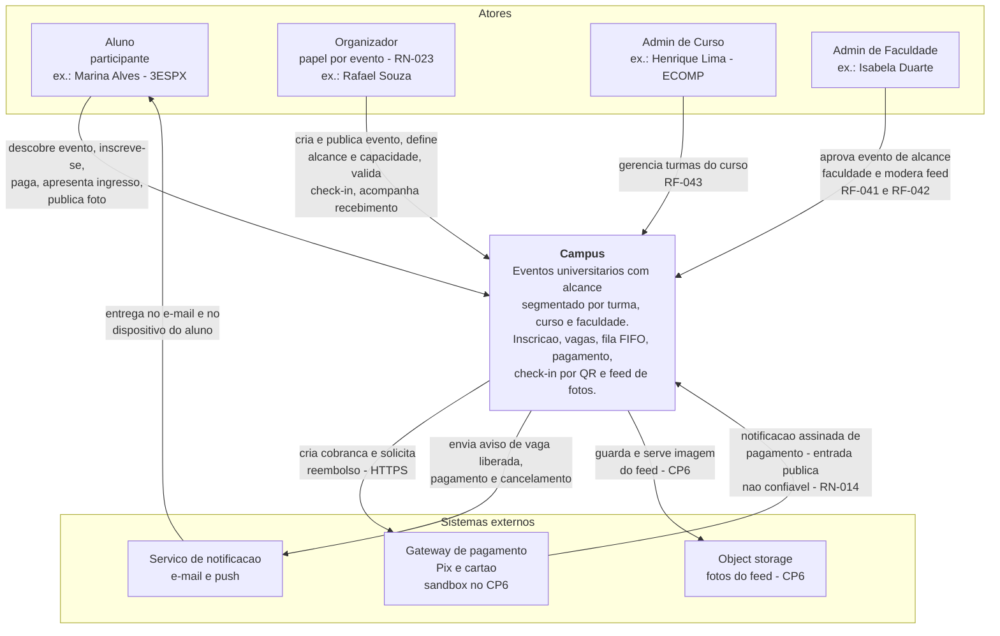
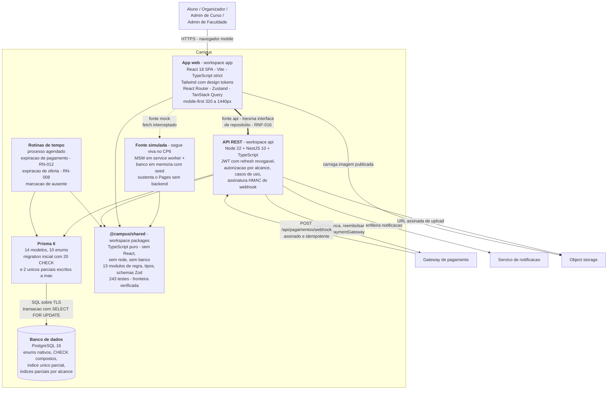
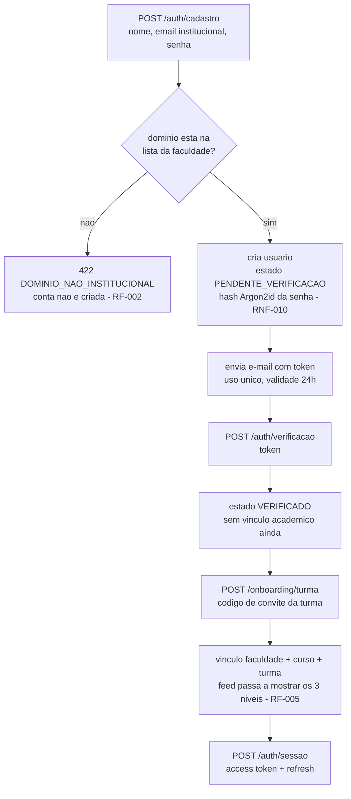

# Arquitetura

## Histórico de revisões

| Versão | Data | Checkpoint | O que mudou |
|---|---|---|---|
| 1.0 | 2026-09-01 | CP4 | Versão inicial: C4 níveis 1 e 2, decisões de stack, camadas do front, contrato de 41 endpoints, autenticação, token de check-in, substituição do mock |
| 1.1 | 2026-09-02 | CP5 | §5.11 reescrita com as 28 rotas implementadas e a **decisão** sobre as três divergências de nome; nota sobre o `openapi.yaml` do CP6 passar a ser a fonte única do contrato |
| 2.0 | 2026-09-02 | CP6 | **A §5 deixou de ser o contrato** e passou a referenciar [`21-api-contrato.md`](21-api-contrato.md) e `api/openapi.yaml`: as dez tabelas de endpoint saíram, e ficou o que um OpenAPI não expressa — as convenções de status e a reconciliação CP4→CP5→CP6. O C4 nível 2 ganhou o monorepo de três pacotes, o Prisma e o PostgreSQL. A §6 foi corrigida: o refresh vai no **corpo** de `POST /auth/refresh`, não em cookie, e os dois tokens ficam em `sessionStorage`. Corrigido "Fastify" para **NestJS** em quatro lugares — a implementação do CP6 é NestJS + Prisma, e o documento dizia Fastify desde o CP4. A contagem de rotas do CP5 foi corrigida de 28 para **30** |


**Responsável técnico:** Lucas Baraldi (Tech Lead / Arquiteto)
**Complementa:** [`05-modelagem/07-diagrama-componentes.md`](05-modelagem/07-diagrama-componentes.md)
(camadas e fronteira entre as duas fontes de dados) · [`adr/README.md`](adr/README.md)
(decisões e alternativas recusadas) · [`21-api-contrato.md`](21-api-contrato.md) (o contrato,
operação por operação)

Este documento descreve **o estado da arquitetura**. Os *motivos* de cada escolha, com as
alternativas recusadas e o custo assumido, estão nas ADRs — e são citados por número em cada
seção. O contrato da API **não** está aqui: está em `api/openapi.yaml`, e a §5 explica por
que essa separação existe.

---

## 1. Visão geral e princípios

O Campus é uma aplicação web mobile-first (React SPA) que hoje conversa com uma API
simulada e, no CP6, passa a conversar com uma API REST real sobre PostgreSQL. A regra de
negócio é escrita uma vez, como função pura, e usada pelos dois lados.

### Princípio 1 — A dependência aponta para dentro

Apresentação depende de estado; estado depende de interface de dados; todos dependem do
domínio; **o domínio não depende de ninguém**. `packages/shared/src/domain/` não importa
React, não importa `fetch`, não conhece banco e não sabe que existe uma tela. É a única
forma de a mesma regra valer no cliente e no servidor sem duas implementações que divergem
com o tempo — e no CP6 deixou de ser princípio para virar verificação:
`node scripts/check-contrato.mjs` reprova o import que violaria a regra, com o motivo
nomeado.

### Princípio 2 — Regra de negócio é função pura

Capacidade, fila FIFO, prazos, política de reembolso e validade de check-in são funções sem
efeito colateral, sobre tipos de domínio. Elas recebem estado e instante, devolvem decisão.

Consequência prática: as 29 regras de [`04-regras-de-negocio.md`](04-regras-de-negocio.md)
são testáveis sem DOM, sem rede e sem banco — o que é o que torna viável cobrir ≥ 60% do
domínio (RNF-015) com seis pessoas em papéis acumulados. No CP6 essa suíte roda em `node`,
sem jsdom: **243 testes em cerca de 2 s** (`npm run test:dominio`), o que é o que mantém a
suíte dentro do laço de edição.

Corolário: **todo parâmetro numérico vive em `packages/shared/src/domain/policy.ts`.** Nenhum módulo carrega
`60`, `24` ou `0.5` literalmente. Mudar a janela de pagamento é editar um arquivo.

### Princípio 3 — O servidor é a autoridade de autorização (RNF-012)

A verificação de alcance no cliente existe para não mostrar botão que vai falhar. **Ela não
é segurança.** A decisão que vale é a do servidor: um aluno de outra turma recebe `403` ou
lista vazia, **inclusive ao acessar por ID direto**, e a tentativa é registrada.

O mesmo vale para as outras três autoridades do sistema:

| Autoridade | Quem decide | Nunca decide |
|---|---|---|
| Visibilidade por alcance (RN-001) | Servidor, comparando vínculo do usuário com a âncora do evento | UI, filtro de consulta do cliente |
| Confirmação de pagamento (RN-014) | Notificação assinada do gateway | App do aluno dizendo "paguei" |
| Ocupação de vaga (RN-004, RNF-013) | Transação no banco com `SELECT … FOR UPDATE` | Contador em cache no cliente |
| Uso único do ingresso (RN-017, RN-018) | Índice `UNIQUE (participacao_id)` em `presenca` | Verificação prévia com `SELECT` |

### Princípio 4 — A fronteira trocável é uma só

Existe **um** ponto onde a fonte de dados pode ser substituída: as interfaces de
`src/services/`. É o que torna RNF-016 verificável por `git diff` em vez de por promessa —
ver [ADR-0003](adr/0003-camada-de-repositorio-com-msw.md) e a seção 8 deste documento.

### Princípio 5 — Estado ilegal é impossível, não improvável

Sempre que a escolha existir, a invariante é declarada onde o banco ou o compilador a
imponha: `CHECK` composto para a âncora de alcance
([ADR-0005](adr/0005-alcance-como-enum-com-ancora-condicional.md)), índice único parcial para
participação ativa ([ADR-0004](adr/0004-participacao-como-entidade-propria.md)), união
discriminada em TypeScript, interface de pagamento sem campo de cartão
([ADR-0006](adr/0006-abstracao-de-gateway-de-pagamento.md)).

---

## 2. Modelo C4

### Nível 1 — Contexto



Duas leituras que o diagrama força:

- **O gateway aparece nas duas direções, e são caminhos diferentes.** A criação da cobrança é
  síncrona e iniciada por nós; a confirmação é assíncrona e iniciada pelo gateway. A segunda
  é uma **entrada pública** e precisa de verificação de assinatura e idempotência.
- **`Organizador` não é um tipo de conta.** `PapelUsuario` tem `ALUNO`, `ADMIN_CURSO` e
  `ADMIN_FACULDADE`; ser organizador é papel **por evento** (RN-023). O ator existe no
  diagrama porque o conjunto de casos de uso é distinto, não porque exista uma conta
  diferente.

### Nível 2 — Contêineres



Por que **cinco** contêineres e não três:

| Contêiner | Existe separado porque |
|---|---|
| App web | Artefato estático, publicável em CDN, versionado e implantado de forma independente da API |
| API REST | Única fronteira de autorização e de escrita transacional |
| Prisma | Fronteira de acesso a dados. Aparece separado porque é onde vive a **migration**, e a migration é o artefato que carrega as garantias que o ORM não sabe declarar |
| Rotinas de tempo | **O modo de falha é diferente.** Se a API cai, ninguém se inscreve e todos percebem em segundos. Se as rotinas param, vagas ficam presas em `PENDENTE_PAGAMENTO`, a fila de `evt-002` congela e **nada dá erro** — sintoma silencioso, que exige alarme próprio (seção 9) |
| Banco | Guardião das invariantes: `CHECK` de âncora, unicidade de participação ativa, unicidade de presença, unicidade de chave de idempotência |

### O que o CP6 mudou no nível 2

Três mudanças, e a terceira é a que mais importa.

**O repositório virou monorepo com três workspaces npm**
([ADR-0008](adr/0008-monorepo-com-dominio-compartilhado.md)): `packages/shared`
(`@campus/shared`), `app` (`campus-app`) e `api` (`campus-api`). O domínio **saiu** de
`app/src/domain/` e foi para o pacote — porque ganhou um segundo consumidor, e a decisão foi
**mover**, não copiar. Sobraram três módulos em `app/src/domain/`, e o motivo é o mesmo nos
três: não são domínio (`format`, `eventAction`, `eventSchema` são apresentação e forma de
formulário).

**O domínio compartilhado não é contêiner: é biblioteca.** Ele aparece no diagrama consumido
pelos quatro lados — app, fonte simulada, API e rotinas de tempo — e é o que faz `isFull`,
`planPromotion` e `decideCheckIn` existirem **uma vez**. Só pode ser compartilhado porque o
servidor também é Node, e essa é boa parte do motivo de o servidor ser Node. A fronteira é
verificada, não confiada: `node scripts/check-contrato.mjs` reprova se qualquer arquivo do
pacote importar React, Prisma, NestJS, `msw` ou API de Node.

**A fonte simulada não morreu no CP6 — virou uma das duas.** O plano do CP4 dizia "MSW
desligado no CP6". A decisão do CP6 é diferente: as duas implementações convivem atrás da
mesma interface de repositório, porque o ambiente de teste do CP5 é conteúdo estático no
GitHub Pages e **precisa continuar funcionando sem processo em execução**. É a razão da seta
pontilhada continuar no diagrama.

A seleção é `VITE_DATA_SOURCE`, com valor `mock` ou `api`, e ela é **uma linha** no
*container* de [`app/src/services/index.ts`](../app/src/services/index.ts). O tipo da
variável é declarado como a união dos dois literais em `app/src/vite-env.d.ts`, e não como
`string` — sem isso, um erro de digitação passaria pelo `tsc` e o app cairia no padrão em
silêncio. `main.tsx` lê a mesma decisão para **não** registrar o MSW quando a fonte é a API:
com o worker no ar, o interceptador captura a requisição antes de ela sair da máquina, e o
app conversaria com o mock acreditando estar falando com o servidor.

---

## 3. Decisões de stack por camada

| Camada | Escolha | Alternativas consideradas | Trade-off assumido | ADR |
|---|---|---|---|---|
| Plataforma de entrega | Web mobile-first (SPA), PWA instalável no CP6 | React Native + Expo; Flutter; nativo separado | Sem câmera nativa (QR depende de `getUserMedia` + fallback numérico) e sem push nativo em iOS antigo — em troca de entrega por link, sem loja | [0001](adr/0001-react-vite-em-vez-de-react-native.md) |
| Build e dev server | Vite 6 | Next.js (`output: export`); Create React App | Sem SSR nem otimização de imagem prontas; em troca, artefato estático e HMR imediato | [0001](adr/0001-react-vite-em-vez-de-react-native.md) |
| UI | React 18 + TypeScript `strict` | Vue; Svelte | Bundle maior que Svelte; em troca, é o que o time domina e onde está o ecossistema de teste | [0001](adr/0001-react-vite-em-vez-de-react-native.md) |
| Estilo | Tailwind CSS com tokens em `tailwind.config.ts` | CSS Modules + variáveis CSS; styled-components; MUI/Chakra | `className` longo no JSX e curva do utilitário; em troca, valor mágico vira erro de lint e o nome do token é o mesmo do Figma | [0002](adr/0002-tailwind-com-design-tokens.md) |
| Roteamento | React Router 6 | TanStack Router; roteamento por arquivo | Sem type-safety de rota; em troca, familiaridade e menos configuração | — |
| Estado de sessão e UI | Zustand | Context + `useReducer`; Redux Toolkit | Menos convenção que Redux; em troca, sem *boilerplate* para um escopo pequeno (usuário atual, toasts) | — |
| Estado de servidor | TanStack Query | `useEffect` + `fetch`; SWR | Uma dependência a mais; em troca, cache, *retry*, invalidação por mutação e estados de carregamento/erro prontos — que são justamente o que a decisão de mock exige exercitar | [0003](adr/0003-camada-de-repositorio-com-msw.md) |
| Acesso a dados | Interfaces de repositório + implementação HTTP única | Mock devolvendo objeto direto; `json-server`; backend real já no CP5 | Service worker a mais para manter e depuração em duas camadas; em troca, RNF-016 verificável e estados de erro reais desde o CP4 | [0003](adr/0003-camada-de-repositorio-com-msw.md) |
| Fonte de dados no CP4/CP5 | MSW + banco em memória com o seed canônico | Fixtures em JSON estático | Concorrência real não é testável no CP5; em troca, link público funcional e demo offline | [0003](adr/0003-camada-de-repositorio-com-msw.md) |
| Formulário e validação | React Hook Form + Zod | Formik + Yup; validação manual | Duas dependências; em troca, o mesmo esquema Zod valida no cliente e (no CP6) na API | — |
| Domínio | Funções puras em `packages/shared/src/domain/`, parâmetros em `policy.ts` | Regra dentro do componente; regra só no servidor; cópia na API | Duplicação aparente entre cliente e servidor — resolvida por compartilhamento, não por reescrita. O custo é mudar uma regra afetar os dois lados de imediato, sem versão intermediária | [0003](adr/0003-camada-de-repositorio-com-msw.md), [0008](adr/0008-monorepo-com-dominio-compartilhado.md) |
| Modelo de dados — relação aluno×evento | `Participacao` como entidade própria | Junção `evento_usuario` com PK composta; estado derivado dos filhos; `Inscricao` + `ItemListaEspera` | Mais uma tabela, mais um join, índice único parcial que precisa ser mantido em sincronia com o enum | [0004](adr/0004-participacao-como-entidade-propria.md) |
| Modelo de dados — alcance | Enum + 3 FKs opcionais com `CHECK` de exclusividade | Hierarquia polimórfica de escopo; coluna `escopo_id` sem tipo; três tabelas de evento | Duas colunas sempre nulas por linha e `CHECK` de três ramos para manter | [0005](adr/0005-alcance-como-enum-com-ancora-condicional.md) |
| Banco (CP6) | PostgreSQL 16 | MySQL; SQLite; banco de documentos | Operação um pouco mais pesada; em troca, enums nativos, `CHECK` composto e índice único parcial — que é onde as invariantes moram | — |
| API (CP6) | Node 22 + **NestJS 10** sobre Express | Fastify puro (o plano do CP4); backend em outra linguagem | Mais convenção e mais arquivos que Fastify; em troca, `ValidationPipe` que aceita o **mesmo** schema Zod do formulário, filtro de exceção único para a forma de erro do contrato, e `@nestjs/swagger` servindo um spec gerado do código para conferir contra o `openapi.yaml`. **O motivo decisivo é anterior aos dois**: Node permite compartilhar `packages/shared` com o cliente — backend em outra linguagem obrigaria a reimplementar as 29 regras | [0008](adr/0008-monorepo-com-dominio-compartilhado.md) |
| Acesso a dados (CP6) | Prisma 6 + migration escrita à mão sobre o SQL gerado | SQL puro com driver `pg`; TypeORM; Drizzle | O Prisma **não** expressa `CHECK`, índice único parcial nem índice parcial — as três garantias centrais do modelo. Em troca de aceitar isso e escrever a segunda metade da migration à mão, ganha-se cliente tipado a partir do schema e migração versionada | — |
| Pagamento | Interface `PaymentGateway` de 4 métodos, simulador no CP5 | SDK do provedor direto; HTTP direto sem interface; adiar para o CP6 | Abstração antes do terceiro caso concreto e tradução de status a manter; em troca, RNF-022 garantido por tipo e o plano B de D-02 já implementado | [0006](adr/0006-abstracao-de-gateway-de-pagamento.md) |
| Teste unitário e de componente | Vitest + Testing Library + jsdom | Jest | Ecossistema menor; em troca, mesma configuração do Vite e execução rápida | — |
| Teste E2E | Playwright (1 fluxo) | Cypress | Instalação de navegador pesada (ver pendência no [roadmap](13-roadmap-cp5-cp6.md)); em troca, execução em três motores e boa interação com MSW | — |
| Hospedagem CP4/CP5 | GitHub Pages, base `/campus/` | Vercel; Netlify | Só conteúdo estático, sem função de servidor; em troca, custo zero e sem cadastro adicional (P-02) | — |

---

## 4. Estratégia de camadas do front

As cinco camadas são as do
[diagrama de componentes](05-modelagem/07-diagrama-componentes.md). A regra é única:
**a dependência aponta para dentro, e nada aponta de volta.**

| # | Camada | Pastas | Pode importar | É proibido de importar |
|---|---|---|---|---|
| L1 | Apresentação | `src/pages/`, `src/components/layout/` | `components/ui/`, `store/`, `hooks/`, `domain/` (só função pura de decisão), `types/` | `mocks/*`, `msw`, `axios`, `fetch` direto, implementação concreta de repositório |
| L1b | Design System | `src/components/ui/` | `types/`, utilitários de classe, tokens do Tailwind | `services/`, `store/`, `hooks/` de dados, `mocks/`, valor literal de cor/fonte/raio |
| L2 | Estado | `src/store/`, `src/hooks/`, `src/lib/queryClient.ts` | `services/` (**interface**), `domain/`, `types/` | `mocks/*`, `msw`, `src/services/http/*` diretamente (a implementação vem do *container*) |
| L3 | Domínio | `packages/shared/src/` (13 módulos de regra) e `app/src/domain/` (3 de apresentação) | `policy.ts`, `types.ts`, `zod` | React, `services/`, `store/`, `mocks/`, qualquer I/O — reprovado por `check-contrato.mjs` no pacote e por `no-restricted-imports` no app |
| L4 | Interfaces de dados | `src/services/` (apenas contratos + `index.ts`) | `types/`, `domain/` (para tipos de erro) | implementação concreta, exceto no *container* `services/index.ts` |
| L5 | Implementação | `src/services/http/`, `src/mocks/` | `services/` (interface), `domain/`, `types/` | `pages/`, `components/`, `store/` |

### A regra que o CI aplica

A fronteira está implementada em `app/.eslintrc.cjs`, em três `overrides` de
`no-restricted-imports` — esta é a configuração real, não uma intenção:

```js
// app/.eslintrc.cjs — overrides, resumido
overrides: [
  {
    // Telas e componentes nao conhecem a origem dos dados nem o mock.
    files: ['src/pages/**/*.tsx', 'src/components/**/*.tsx'],
    rules: { 'no-restricted-imports': ['error', { patterns: [
      { group: ['**/mocks/**', '@/mocks/*'],
        message: 'Tela/componente nao importa o mock. Fale com src/services - RNF-016.' },
      { group: ['axios', 'msw', 'msw/*'],
        message: 'Nenhuma tela faz HTTP direto. Toda chamada passa por um repositorio.' },
    ] }] },
  },
  {
    // Componente de design system e apresentacional: recebe dados por props.
    files: ['src/components/ui/**/*.tsx'],
    rules: { 'no-restricted-imports': ['error', { patterns: [
      { group: ['**/services/**', '**/store/**', '**/hooks/use*Query*', '**/mocks/**'],
        message: 'Componente de design system nao busca dado nem le store.' },
    ] }] },
  },
  {
    // Dominio e puro: e o que permite reusar as mesmas regras no servidor no CP6.
    files: ['src/domain/**/*.ts'],
    rules: { 'no-restricted-imports': ['error', { patterns: [
      { group: ['react', 'react-dom', 'react-router-dom',
                '**/services/**', '**/mocks/**', '**/components/**'],
        message: 'src/domain e puro: so tipos e outras funcoes de dominio. Ver ADR-0003.' },
    ] }] },
  },
]
```

Além disso, no conjunto principal de regras: `no-restricted-syntax` reprova **qualquer `[`**
em `className` — em literal de string e em *template literal*, o que cobre toda forma de
valor arbitrário do Tailwind — e proíbe `style` inline
([ADR-0002](adr/0002-tailwind-com-design-tokens.md)),
`@typescript-eslint/no-explicit-any` é `error` (o `any` exige desabilitar na linha, o que
aparece no diff) e `no-console` só admite `warn` e `error`.

Onde a verificação automática **não** chega — declarado, para não haver ilusão de cobertura:

| Buraco | Por que o lint não pega | Onde fica |
|---|---|---|
| `fetch` global dentro de `src/pages/` | As regras restringem *imports*; `fetch` é global e não é importado | Revisão de PR. Fechável com `no-restricted-globals` para `fetch` nas pastas de apresentação — melhoria registrada, ainda não implementada |
| Escolha semântica errada de token (`text-disabled` em texto de conteúdo) | O valor existe e é token válido; o defeito é de contraste, não de sintaxe | Checklist de PR de tela e revisão da designer |
| Regra de negócio reimplementada dentro de `src/mocks/` | Nenhuma regra estática distingue "aplicar o domínio" de "reescrever o domínio" | Bloqueador de PR, por revisão humana |
| `className` cujo valor vem de variável calculada em outro lugar | A regra é análise estática: casa literal de string e *template literal*, não valor computado | Revisão de PR + busca por hexadecimal no CI |

---

## 5. Contrato da API

### 5.1 Onde o contrato mora — e por que não mais aqui

Até o CP5 esta seção **era** o contrato: dez subseções com tabela de endpoint escrita à
mão. Ela não é mais, e a mudança é consequência de um defeito, não de arrumação.

O CP4 descreveu 41 endpoints aqui. O CP5 implementou 30 rotas no mock. Os dois conjuntos
divergiram em três nomes, e a divergência só apareceu quando alguém conferiu arquivo por
arquivo — porque **nada verificava a tabela**. Manter um OpenAPI e uma tabela em prosa em
paralelo é garantir que os dois discordem na primeira mudança.

A partir do CP6 há uma fonte, e ela é executável:

| Papel | Arquivo | O que é |
|---|---|---|
| **Fonte** | [`../api/openapi.yaml`](../api/openapi.yaml) | **38 caminhos, 43 operações, 44 schemas.** OpenAPI 3.1.0. Valida requisição e resposta e gera cliente |
| **Leitura** | [`21-api-contrato.md`](21-api-contrato.md) | O mesmo contrato em prosa, por módulo, com o **porquê** de cada status |
| **Runtime** | `/api/docs` | Spec gerado do código em execução pelo `@nestjs/swagger`. Tem de concordar com o YAML na lista de caminhos |

**Endpoint novo entra no `openapi.yaml` primeiro.** Se o número desta página divergir do
`grep`, o `grep` está certo:

```bash
grep -cE '^  /' api/openapi.yaml                                  # 38 caminhos
grep -cE '^    (get|post|put|patch|delete):' api/openapi.yaml     # 43 operações
```

Distribuição por módulo, derivada do YAML — é contagem, não segunda definição:

| Módulo | Operações | O que ele cobre |
|---|---|---|
| `saude` | 1 | `GET /health`, com estado da conexão com o banco |
| `autenticacao` | 6 | Cadastro, login, refresh, logout, onboarding, sessão |
| `academico` | 3 | Faculdade, cursos e turmas — públicos, para o onboarding |
| `eventos` | 8 | Lista, criação, detalhe, edição, cancelamento, aprovação, participantes |
| `participacoes` | 6 | Inscrição, fila, cancelamento, confirmação de oferta |
| `pagamentos` | 5 | Cobrança, consulta, webhook, simulação, reembolso |
| `checkin` | 4 | Token do ingresso, painel da porta, validação, presença manual |
| `feed` | 5 | Feed, eventos publicáveis, publicação, comentário, remoção |
| `notificacoes` | 3 | Lista, marcar uma, marcar todas |
| `admin` | 2 | Eventos pendentes, rotação do código de convite |

O que **sobra** desta seção é o que um OpenAPI não expressa bem: a convenção por trás das
escolhas de status, e o registro de como o contrato chegou aqui. É o resto da seção.

### 5.2 As convenções que valem mais que a tabela

- **`404` para invisível.** Um evento de turma acessado por quem não é da turma responde
  `404`, não `403 "você não pode ver"`. Revelar a existência do evento já é vazamento de
  alcance: com `403` versus `404`, varrer identificadores mapeia a agenda de outra turma
  sem ler um único dado. A resposta é byte por byte igual à de um `id` inexistente, e a
  mensagem é ambígua de propósito. O `403` só aparece onde a existência do recurso **já** é
  conhecida por quem pede — o participante que tenta abrir o painel de check-in, por
  exemplo. São 24 respostas `404` e 15 `403` no contrato, e todas as 15 caem nesse padrão.
- **`409` versus `422`.** `409` é conflito com o **estado atual** e pode deixar de
  acontecer — a vaga pode abrir, e por isso a resposta traz `acao`, dizendo o que o cliente
  pode oferecer em seguida (`SEM_VAGA` traz `LISTA_ESPERA`). `422` é regra de negócio
  violada e **não muda por espera** (prazo encerrado, evento gratuito recebendo pagamento),
  e nunca traz `acao`. O mesmo endpoint de inscrição devolve os dois, e é o par que um
  cliente aprende primeiro.
- **`410 Gone` foi eliminado no CP6.** O plano do CP4 o usava para janela expirada. O
  contrato do CP6 não tem nenhum: oferta vencida é `409` (recuperável, volta para a fila) e
  cobrança fora do prazo é `422`. A terceira convenção ficava sem trabalho e custava uma
  regra a mais para o cliente aprender.
- **`erro` é contrato; `mensagem` não é.** `erro` é `SCREAMING_SNAKE_CASE` e estável;
  `mensagem` é escrita no tom de voz da marca e pode ser reescrita sem quebrar ninguém.
  Cliente que decide tela comparando `mensagem` está errado. O vocabulário estável vem de
  duas origens, as duas em código: `api/src/comum/erros.ts` (transporte) e as quatro uniões
  `MOTIVO_RECUSA_*` de `packages/shared/src/types.ts` (domínio).
- **Recusa de check-in não é erro HTTP.** `ResultadoCheckin` traz `aceito: false` com o
  motivo. Na porta do evento o operador precisa da mesma tela em todos os casos, com o nome
  de quem passou ou a razão da recusa; um `4xx` faria o cliente cair no tratamento genérico
  e perder o nome, o horário e o contador.
- **O webhook responde sucesso no reprocessamento.** Responder erro faria o gateway
  reenviar indefinidamente. Idempotência é resposta de sucesso **sem efeito**, não recusa —
  e a garantia é o `UNIQUE (chave_idempotencia)` de `pagamento`, não o código (RN-014).
- **`429` está declarado em duas operações**, cadastro e login. As duas rotas de escrita no
  feed não o declaram, embora o limite esteja configurado — lacuna registrada em
  [`21-api-contrato.md` §6](21-api-contrato.md#6-divergências-abertas-entre-o-contrato-e-o-resto).

### 5.3 A reconciliação com o CP4 e o CP5

O CP4 registrou três nomes implementados diferentes do contrato e disse que "o contrato
ganha". **Ao implementar o CP5, a decisão se inverteu**: os nomes do mock prevaleceram. O
CP6 aceita essa decisão inteira — as três entraram no `openapi.yaml` com o nome que o
código já usava.

| Rota | O que o CP4 propunha | Por que o mock ganhou |
|---|---|---|
| `GET /api/sessao` | `POST /auth/sessao` + `GET /me` | O CP5 separou de fato as duas operações: `POST /api/auth/login` cria a sessão e `GET /api/sessao` lê o titular. O argumento do CP4 estava certo no diagnóstico e errado no nome — faltava o `login`, não renomear a leitura. E `GET /api/sessao` devolve usuário + faculdade + curso + turma **resolvidos**, que é o que toda tela consome junto |
| `GET /api/participacoes` | `GET /me/participacoes` | O titular sai do token, não do caminho. Repetir `/me` não acrescenta garantia nenhuma e cria um segundo lugar para a autorização divergir |
| `POST /api/notificacoes/:id/lida` | `PATCH /api/notificacoes/:id` com `{ "lida": true }` | "Foi lida" é um **evento**, não edição parcial de recurso. O `PATCH` genérico convida a aceitar qualquer campo do corpo, e `POST /api/notificacoes/lidas` (marcar todas) não teria forma natural |

**As 30 rotas do CP5 continuam todas no contrato do CP6** — nenhuma removida, renomeada ou
com método trocado. 14 vinham de
[`app/src/mocks/handlers.ts`](../app/src/mocks/handlers.ts) (base do CP4) e 16 de
[`app/src/mocks/handlersCp5.ts`](../app/src/mocks/handlersCp5.ts):

```bash
grep -hoE 'http\.(get|post|patch|delete)\(`\$\{BASE\}[^`]*' \
  app/src/mocks/handlers.ts app/src/mocks/handlersCp5.ts | wc -l   # 30
```

É essa estabilidade que faz a troca do mock pela API real não tocar em nenhuma tela
(RNF-016): a interface de repositório continua a mesma porque o contrato por baixo dela
continua o mesmo.

**O CP6 acrescentou 13 operações** — 30 + 13 = 43. Cada uma fecha um requisito que o CP5
deixou aberto: `GET /health`, `POST /auth/cadastro` (RF-001), `POST /auth/refresh`
(RNF-020), `PATCH /eventos/{id}` (RN-023), `POST /eventos/{id}/cancelamento` (RN-021,
RN-022), `POST /eventos/{id}/aprovacao` (RN-003), `GET /eventos/{id}/participantes`
(RF-009), `POST /pagamentos/webhook` (RN-014), `POST /participacoes/{id}/reembolso`
(RN-013), `POST /participacoes/{id}/presenca-manual` (RN-018),
`POST /publicacoes/{id}/remocao` (RF-042), `GET /admin/eventos-pendentes` (RF-041) e
`GET /admin/turmas/{id}/codigo` (RF-043). O detalhe de cada uma está em
[`21-api-contrato.md` §4.2](21-api-contrato.md#42-as-13-operações-que-o-cp6-acrescentou).

**Uma quebra de compatibilidade, e é intencional.** `ResultadoLogin` mudou de forma:

```jsonc
// CP5                                    // CP6
{ "token": "…", "sessao": { … } }         { "accessToken": "…", "refreshToken": "…",
                                            "expiraEm": 900, "sessao": { … } }
```

Dois tokens com tempos de vida diferentes obrigam o cliente a guardar os dois, a renovar
por `POST /auth/refresh` e a mandar o refresh no corpo do logout — porque é ele que
identifica **qual** linha de `sessao` revogar. A decisão de onde eles moram está em
[`app/src/services/sessao.ts`](../app/src/services/sessao.ts).

`GET /api/eventos/destaque` continua fora da lista canônica de módulos porque é
conveniência da faixa do feed, servida pela mesma consulta de `GET /api/eventos` com filtro
e limite — no CP6 ela está no contrato, mas segue candidata a virar parâmetro em vez de
rota.

---

## 6. Estratégia de autenticação e autorização

### Identidade: e-mail institucional com verificação de domínio

A identidade da conta é o **e-mail institucional** (RF-001), e o domínio é verificado contra
uma lista de domínios cadastrados como pertencentes à faculdade (RF-002 — no seed,
`fiap.com.br`). Isso é o que substitui integração com sistema acadêmico, ao qual não temos
acesso.

É também o motivo pelo qual **login social foi recusado** (RFX-03): autenticar com Google
reintroduz o problema que o produto resolve — qualquer pessoa entraria, e o alcance por
turma/curso perderia sentido.

Fluxo completo:



Enquanto a conta está `PENDENTE_VERIFICACAO`, o login responde `403 CONTA_NAO_VERIFICADA` —
não `401`. Sem vínculo acadêmico concluído, a sessão existe mas o feed é vazio e a API
responde `403 SEM_VINCULO_ACADEMICO` nas rotas de evento: alcance sem âncora não é
computável.

### Senha: Argon2id (RNF-010)

Hash **Argon2id** com salt por usuário, parâmetros de memória/tempo/paralelismo definidos na
implementação do CP6 e registrados junto do hash (o formato do Argon2 já os carrega, o que
permite reajuste sem invalidar senha antiga). Alternativa aceita pelo requisito: bcrypt com
custo ≥ 12. A senha nunca aparece em log, em URL ou em resposta (RNF-009), e a redefinição
revoga todas as sessões ativas.

### Sessão: JWT curto + refresh revogável (RNF-020)

**Esta subseção mudou no CP6, e a mudança inverte a decisão do CP4.** O plano do CP4 punha o
refresh em cookie `HttpOnly` em `POST /auth/sessao/renovacao`. O contrato do CP6 põe o
refresh no **corpo** de `POST /auth/refresh`, e os dois tokens em `sessionStorage`. O
registro do que foi decidido antes fica no fim da subseção — a razão da inversão é o custo
que o próprio CP4 já havia declarado como honesto.

| Token | Formato | Validade | Onde fica | Por quê |
|---|---|---|---|---|
| **Access** | JWT assinado (HS256), com `sub`, `papel`, `turmaId`, `cursoId`, `faculdadeId`, `exp` | **15 min** (`JWT_ACCESS_TTL_MINUTES`, teto de 60) | `sessionStorage`, chave própria | Janela curta limita o dano de um token vazado a minutos |
| **Refresh** | Opaco (aleatório). Só o **hash** vai para o banco, em `sessao.refresh_hash` | **30 dias** (`JWT_REFRESH_TTL_DAYS`) | `sessionStorage`, chave própria | Um vazamento do banco não dá sessão a ninguém: o que está lá não serve para autenticar |

Os parâmetros são configuração validada no boot
([`api/src/config/ambiente.ts`](../api/src/config/ambiente.ts)), e o processo **não sobe**
sem `JWT_SECRET` de pelo menos 32 caracteres. Não há valor padrão, e a ausência de padrão é
o ponto: um segredo com padrão não é segredo — quem lê o repositório assina token válido.

#### A tabela `sessao` existe porque revogável exige estado

O CP5 não tinha servidor: o token era opaco e a sessão morria com a aba. "Revogar" era
fechar o navegador. Com refresh de 30 dias isso deixa de bastar — trocar de senha, sair de
um dispositivo perdido ou expulsar uma sessão suspeita precisam de um lugar onde o servidor
diga "esta não vale mais". Esse lugar é a linha em `sessao`, com `revogada_em`.

Três consequências que caem direto no contrato:

| Consequência | Onde aparece |
|---|---|
| `POST /auth/logout` exige o refresh **no corpo** | É ele que identifica **qual** linha revogar. Revogar "a sessão do access token" desconectaria a pessoa de todos os dispositivos |
| `POST /auth/refresh` é **público** no contrato | O access token pode estar expirado — é por isso que se está renovando. Exigir `Authorization` válido faria a renovação depender do que ela existe para consertar |
| Redefinir senha revoga **todas** as sessões | Uma linha por sessão torna isso um `UPDATE`, não uma promessa |

#### Por que `sessionStorage`, e não cookie nem memória

A decisão está escrita por extenso em
[`app/src/services/sessao.ts`](../app/src/services/sessao.ts), e o resumo do raciocínio é:

- **Não `localStorage`.** As personas usam o laboratório da faculdade: máquina
  compartilhada, navegador com o perfil de todo mundo. `localStorage` sobrevive ao
  fechamento e entregaria a conta do aluno anterior a quem sentar na mesma cadeira.
  `sessionStorage` morre com a aba, e essa é a regra do CP5 que o CP6 mantém.
- **Não cookie `HttpOnly`.** É a opção mais segura em tese, e o CP4 já havia registrado o
  custo: `SameSite=Strict` com `HttpOnly` só funciona se app e API estiverem no **mesmo
  site**. O app é servido em `lukiin-z.github.io` e a API em outro domínio — o cookie seria
  de terceiro, bloqueado pelos navegadores da matriz do RNF-019. Exigir domínio único
  passaria a ser critério de hospedagem, e no nível gratuito ele não se sustenta.
- **Não refresh só em memória.** É a alternativa que a literatura sugere primeiro e custa
  mais do que parece: em memória, o refresh morre no F5. O access token sobreviveria por até
  15 minutos e a pessoa seria expulsa no meio da navegação, sem entender por quê. Sessão que
  se degrada em silêncio depois de um F5 é pior de diagnosticar do que sessão que termina.
- **E o ganho de segurança é menor do que aparenta.** Um script injetado que lê
  `sessionStorage` já está executando **dentro** da página, com acesso ao access token e ao
  próprio cliente HTTP do app: ele age como o usuário enquanto a aba estiver aberta. O que
  o cookie protegeria é a persistência **depois** de a aba fechar — e `sessionStorage` não
  persiste depois de a aba fechar.

**O custo desta escolha, dito sem rodeio:** XSS na página lê os dois tokens. A mitigação é
a de sempre e não é nova — `helmet` com CSP na API, nenhum `dangerouslySetInnerHTML` no app,
e a janela de 15 minutos do access token. Não é equivalente a `HttpOnly`, e o documento não
finge que é.

O claim de papel e vínculo dentro do JWT serve para o servidor evitar uma consulta por
requisição, **não** para o cliente decidir nada. Mudança de turma (RF-008) ou de papel
revoga as sessões, forçando a emissão de um access token novo com os claims corretos.

### Autorização por alcance, no servidor (RNF-012)

A verificação acontece em **duas etapas obrigatórias**, e nenhuma delas está no cliente:

1. **Filtro na consulta.** Toda listagem de evento e o feed recebem, no `WHERE`, as âncoras
   do usuário autenticado — o que usa os três índices parciais da
   [ADR-0005](adr/0005-alcance-como-enum-com-ancora-condicional.md). O cliente não envia
   "minha turma"; o servidor a lê do token.
2. **Verificação no acesso direto.** Toda rota `/eventos/{id}` e derivadas revalidam a
   âncora do evento contra o vínculo do solicitante antes de responder. Se não pertence,
   responde `404` (sem revelar existência) e **registra a tentativa** no log de segurança.

A matriz completa de permissões por papel está em
[`04-regras-de-negocio.md`](04-regras-de-negocio.md) (RN-024). Três cortes que a arquitetura
impõe:

- Ser **organizador** é papel por evento (RN-023), resolvido por consulta ao evento, não por
  claim no token.
- `ADMIN_CURSO` age dentro do próprio curso; `ADMIN_FACULDADE`, dentro da própria faculdade.
  O escopo do administrador também é verificado contra a âncora — administrador não é
  curinga.
- O organizador **não** é participante automático (RN-016): ver a lista de participantes e
  estar nela são autorizações diferentes.

---

## 7. Token de check-in

O ingresso do aluno carrega um token assinado, gerado **no momento em que o ingresso é
aberto** (`GET /participacoes/{id}/ingresso`), não na confirmação da inscrição.

### Payload

```json
{
  "v": 1,
  "par": "par-101",
  "evt": "evt-001",
  "usr": "usr-marina",
  "iat": 1757768400,
  "exp": 1757769300,
  "jti": "a3f1c8e0"
}
```

Formato do token: `base64url(payload) + "." + base64url(HMAC-SHA256(payload, chaveDoServidor))`.
Nada de dado pessoal no payload — só identificadores opacos, coerente com RNF-020. A chave
HMAC é do servidor, nunca sai dele, e é distinta da chave de assinatura do JWT de sessão
(comprometer uma não compromete a outra).

### Janela de validade

Três janelas encaixadas, todas verificadas antes de qualquer acesso ao banco:

| Janela | Origem | Valor |
|---|---|---|
| Janela de check-in do evento | `policy.ts` | abre `CHECKIN_OPENS_HOURS_BEFORE` = **4h** antes do início; fecha `CHECKIN_CLOSES_HOURS_AFTER` = **2h** depois |
| Validade do token | `exp` do payload | `min(iat + 15 min, fechamento da janela)` — premissa do grupo |
| Renovação automática | Cliente | A tela do ingresso renova o token a cada 10 minutos enquanto está aberta e online |

Por que a validade do token é curta se o ingresso já é de uso único: **o uso único impede o
segundo check-in, mas não impede o primeiro ser feito pela pessoa errada.** O risco real é
banal — o aluno tira print do QR e manda no grupo, e quem chega primeiro entra. Com validade
de 15 minutos, um print enviado na véspera não vale nada. A leitura na porta continua
funcionando porque a tela renova sozinha.

O **código numérico de 8 dígitos** é o caminho alternativo (RF-034, `MetodoCheckin.CODIGO_NUMERICO`,
dependência D-06): mesma participação, mesma verificação de janela, mesmo uso único —
digitado pelo organizador quando a câmera falha. Ele é validado **contra o servidor**, nunca
localmente.

### Uso único

Garantido por `UNIQUE (participacao_id)` em `presenca`
([ADR-0004](adr/0004-participacao-como-entidade-propria.md)), **não** por lista de tokens
usados. A segunda leitura entra na transação, tenta o `INSERT`, viola a restrição, sofre
`ROLLBACK` e recebe `409` com o horário do check-in original. Isso fecha a corrida entre dois
operadores lendo QRs em paralelo — o que um `SELECT "existe presenca?"` seguido de `INSERT`
não faria.

### Por que o token não é armazenado

Quatro razões, em ordem de peso:

1. **Ele é derivável.** Payload mais chave mais instante produzem o token; guardá-lo cria uma
   segunda fonte de verdade que pode divergir de `presenca` — e divergência entre "token
   válido" e "presença registrada" é a pior forma de defeito possível na porta de um evento.
2. **O antirreplay já está no banco.** Sendo o `UNIQUE` de `presenca` o mecanismo de uso
   único, não há nada para uma tabela de tokens fazer.
3. **Token armazenado é segredo em repouso.** Uma tabela de tokens válidos é exatamente o que
   um atacante quer ler; sem tabela, não há o que vazar.
4. **Volume sem retorno.** Cada abertura de ingresso geraria uma linha, com política de
   expurgo para manter — trabalho de operação em troca de nada.

Se algum dia for preciso revogar um token específico antes do `exp` (por exemplo, ingresso
transferido), o mecanismo será revogar a **participação**, não o token — o que já é
representável no modelo.

---

## 8. Como o mock é substituído no CP6

A migração é a seta `==>` do
[diagrama de componentes](05-modelagem/07-diagrama-componentes.md). O roteiro com tarefas,
responsáveis e pontos está em [`13-roadmap-cp5-cp6.md`](13-roadmap-cp5-cp6.md); aqui está o
que muda tecnicamente.

> **O passo 7 foi revisto no CP6, e é a única mudança de plano desta seção.** "Desligar o
> MSW" deixou de ser o objetivo: as duas fontes convivem atrás da mesma interface, porque o
> ambiente de teste publicado no GitHub Pages é conteúdo estático e precisa continuar
> funcionando sem processo em execução. O que era remoção virou **seleção** — ver a nota de
> estado medido no fim da seção 2. Os passos 1 a 5 têm artefato entregue no repositório
> (`api/openapi.yaml`, `api/prisma/`, `api/src/`); os passos 8 a 10 dependem da suíte de
> integração e são medidos em
> [`24-checklist-entrega-cp6.md`](24-checklist-entrega-cp6.md), não aqui.

### Passo a passo

| # | Passo | Detalhe |
|---|---|---|
| 1 | **Congelar o contrato** | Feito: [`api/openapi.yaml`](../api/openapi.yaml), 38 caminhos e 43 operações, com as 30 rotas do mock preservadas. Divergência entre ele e o spec de `/api/docs` é defeito |
| 2 | **Subir esquema e migração** | Feito: [`api/prisma/schema.prisma`](../api/prisma/schema.prisma) (14 modelos, 10 enums) e a migration `0001_init` com **20 `CHECK`**, `ux_participacao_ativa`, `ux_pagamento_aguardando_por_participacao` e 8 índices parciais escritos à mão sobre o SQL gerado. As 22 verificações de [`api/prisma/verificar-restricoes.sql`](../api/prisma/verificar-restricoes.sql) provam que o banco **recusa** |
| 3 | **Implementar a API** | NestJS importando `@campus/shared`. Cada handler do MSW tem um caso de uso correspondente, com a mesma resposta e o mesmo código de erro |
| 4 | **Portar o seed** | `src/mocks/seed.ts` vira *script* de carga: 1 faculdade, 3 cursos, 4 turmas, 12 usuários, 11 eventos. É o mesmo dado da demo, o que mantém a apresentação idêntica |
| 5 | **Ativar as rotinas de tempo** | O que o mock simulava passa a ser processo agendado sobre o banco: expiração de pagamento, expiração de oferta, marcação de ausente |
| 6 | **Trocar o adaptador de pagamento** | `SimulatedPaymentGateway` sai, adaptador do provedor sandbox entra, atrás da mesma interface ([ADR-0006](adr/0006-abstracao-de-gateway-de-pagamento.md)). Nenhum caso de uso muda |
| 7 | **Desligar o MSW** | Remover a chamada de `iniciarMock()` em `src/main.tsx` e apontar a base de URL da implementação HTTP para a API. Hoje **não existe flag de ambiente**: o worker sobe sempre, e o desligamento é essa remoção — visível no diff, e item de checklist do PR. O CI passa a verificar que `msw` não está no bundle de produção |
| 8 | **Rodar a suíte de contrato contra a API real** | A mesma suíte que passava contra o mock passa a rodar contra a API. Divergência aqui é bug da API, não do teste |
| 9 | **Provar a concorrência** | O que o CP5 não pôde testar: 50 requisições paralelas para 1 vaga → exatamente 1 confirmação (RNF-013, CT-020) |
| 10 | **Medir latência real** | RNF-008 passa do alvo mockado (< 300 ms) para o alvo real (p95 < 1,5 s) |

### O que muda e o que não muda

| Não muda | Muda |
|---|---|
| `src/pages/` — **zero linhas** | `src/services/index.ts` (a linha do *container*) e `src/main.tsx` (remoção do bootstrap do MSW) |
| `src/components/` — **zero linhas** | A base de URL da implementação HTTP |
| `src/store/`, `src/hooks/` | `src/mocks/` — removido do build de produção |
| `src/services/` (as interfaces) | `app/public/mockServiceWorker.js` — deixa de ser registrado |
| `src/services/http/` — já fala HTTP | Novo workspace `api/` com NestJS, Prisma e rotinas |
| `src/domain/` — virou `packages/shared` | — |
| `src/types/domain.ts` | — |

### O teste que prova que nenhuma tela foi tocada

Três verificações, em ordem de força:

1. **`git diff --stat` do PR de integração** mostrando **zero** arquivos alterados sob
   `app/src/pages/` e `app/src/components/`. Anexado ao PR — é a evidência direta de
   RNF-016, e um único arquivo alterado ali obriga a explicar por quê.
2. **Guarda automática no CI:** o job de integração falha se
   `git diff --name-only origin/main -- 'app/src/pages' 'app/src/components'` retornar
   qualquer linha no PR que faz a troca.
3. **A mesma suíte, contra as duas fontes:** [`app/src/services/inscricao.test.ts`](../app/src/services/inscricao.test.ts)
   atravessa a camada HTTP e passa hoje contra o MSW; no CP6 passa contra a API, sem
   alteração de asserção. Se passa nas duas fontes, a fronteira é real; se cada fonte exige um
   teste diferente, ela não era.

O E2E do Playwright roda nas duas configurações sem alteração de *selector* nem de asserção —
o que é a prova pelo lado do usuário: o fluxo de inscrição é o mesmo, com dados mockados ou
persistidos.

---

## 9. Observabilidade e operação

### Log estruturado com correlação

Log em **JSON, uma linha por evento**, com um `requestId` (UUID v4) gerado na borda da API e
propagado por toda a cadeia — caso de uso, acesso a banco, chamada ao gateway, enfileiramento
de notificação. Quando a notificação de pagamento chega depois, o `requestId` da criação da
cobrança é recuperado pela `chaveIdempotencia`, o que permite reconstruir o fluxo
assíncrono completo (inscrição → cobrança → notificação → confirmação) em uma consulta.

Campos padrão: `ts`, `nivel`, `requestId`, `rota`, `metodo`, `status`, `duracaoMs`,
`usuarioId`, `eventoId?`, `participacaoId?`, `codigoErro?`. Nas rotinas de tempo, `requestId`
é substituído por `execucaoId` da rodada.

### O que nunca entra em log

| Nunca | Nem mesmo |
|---|---|
| Senha, em qualquer forma | Em erro de validação, em corpo ecoado, truncada |
| Hash de senha | Em log de depuração |
| Access token, refresh token, cookie | Cabeçalho `Authorization` é redigido antes de logar |
| Token ou código numérico de check-in | Nem em `debug` — quem lê o log entraria no evento |
| Chave HMAC ou segredo de assinatura do gateway | — |
| Qualquer dado de cartão | Não existe no sistema (RNF-022); um campo desses no log seria sinal de vazamento de camada |
| Corpo bruto da notificação do gateway | Guarda-se `transacaoId`, `chaveIdempotencia` e resultado da verificação |
| E-mail completo em log de alto volume | Usa-se `usuarioId`; o e-mail fica onde é necessário (RNF-020) |

A garantia é uma lista de redação na camada de log mais um teste que falha se as palavras
`senha`, `password`, `token`, `authorization` ou `cvv` aparecerem em uma linha de log
produzida pela suíte (RNF-009).

### Os dois alarmes que importam

Tudo o mais pode ser investigado depois. Estes dois falham em silêncio e param o produto:

**Alarme 1 — rotina de tempo parada.**
Se a rotina de expiração não roda, ninguém recebe erro: as vagas de quem não pagou continuam
ocupadas, a fila de espera **congela** (a promoção FIFO depende da liberação), e os alunos de
`evt-002` esperam por uma vaga que existe e não é oferecida. O sintoma chega como reclamação,
dias depois.

- **Sinal:** cada rodada grava *heartbeat* com `execucaoId`, instante e contadores
  (`pagamentosExpirados`, `ofertasExpiradas`, `ausentesMarcados`).
- **Condição de alarme:** nenhuma rodada bem-sucedida nos últimos **15 minutos** (premissa
  do grupo, com rodada a cada 5 minutos), **ou** número de participações com
  `pagamentoExpiraEm < agora` e status ainda `PENDENTE_PAGAMENTO` maior que zero por mais de
  duas rodadas.
- **Ação:** reprocessar a rodada; as operações são idempotentes por construção, então
  reexecutar é seguro.

**Alarme 2 — falha no processamento de notificação de pagamento.**
Aqui o silêncio custa dinheiro: o aluno pagou, o gateway avisou, e a participação continua
`PENDENTE_PAGAMENTO` até expirar. O aluno perde a vaga **tendo pagado** — o pior defeito
possível neste produto.

- **Sinal:** contadores por resultado de `verificarNotificacao`
  (`valida`, `ASSINATURA_INVALIDA`, `CORPO_MALFORMADO`) e por resultado do processamento
  (`confirmado`, `duplicado_ignorado`, `erro`).
- **Condição de alarme:** qualquer notificação com `erro` no processamento (limite zero — não
  há volume que torne isso tolerável), **ou** duas ou mais `ASSINATURA_INVALIDA` em 10
  minutos, que pode ser chave rotacionada ou tentativa de forjar confirmação.
- **Ação:** `consultarCobranca` reconcilia o estado a partir do gateway, que é a autoridade
  (RN-014); a fila de notificações não processadas é retentada com *backoff*.

Complementarmente, e sem alarme dedicado: taxa de `409 SEM_VAGA` (indica evento subdimensionado),
taxa de `403` por alcance (indica UI mostrando o que não deveria) e p95 de `/feed` e
`/eventos/{id}/participacoes` contra RNF-006 e RNF-008.

---

## 10. Ambientes e deploy

| Ambiente | Onde | Dados | Como sobe | Checkpoint |
|---|---|---|---|---|
| **Local** | `npm run dev` em `app/` (Vite, porta padrão) | MSW iniciado em `src/main.tsx` antes do render + seed canônico em memória | `npm ci && npm run dev` | CP4 → CP6 |
| **Teste automatizado** | Vitest (jsdom) e Playwright | MSW via `setupServer` / service worker, mesmos handlers | `npm run test`, `npm run test:e2e` | CP4 → CP6 |
| **Público CP4/CP5** | **GitHub Pages** — `https://lukiin-z.github.io/campus/`, `base: '/campus/'` | MSW ativo; nenhuma persistência, nenhum dado real | Job de CI em `main`: `npm ci` → `lint` → `test` → `build` → publica `app/dist` | CP4, CP5 |
| **Alvo CP6** | Hospedagem de nível gratuito com app e API **sob o mesmo domínio** (requisito da estratégia de cookie, seção 6), PostgreSQL 16 gerenciado em nível gratuito | Persistência real; carga inicial pelo *script* de seed; gateway em **sandbox** (dinheiro fictício) | Mesmo pipeline + migração de esquema versionada e job de rotinas agendadas | CP6 |

### Detalhes que já são decisão, não intenção

- **`base: '/campus/'` é obrigatório** no CP4/CP5, e afeta o registro do service worker do
  MSW. É a classe de erro que só aparece no deploy — por isso o job de CI faz uma
  verificação de fumaça sobre a URL publicada, não só sobre o build local.
- **SPA no Pages precisa de fallback de rota.** Acesso direto a `/campus/eventos/evt-001`
  não existe como arquivo; a saída é `404.html` copiando `index.html` no build. Sem isso,
  compartilhar link de evento — que é o comportamento central do produto — quebra.
- **Nenhum segredo no cliente.** O build do CP4/CP5 não tem chave nenhuma, porque não há
  serviço externo. No CP6, chave de gateway, segredo de JWT e chave HMAC de check-in vivem
  **somente** no servidor, injetados por variável de ambiente do host; `VITE_*` só carrega
  valor público (base de URL, flag de mock).
- **CI é obrigatório em push e PR:** `lint` (`--max-warnings 0`), `test` com limite de
  cobertura, `build`, validação de links da documentação e validação dos blocos Mermaid.
  Critérios 1 a 3 de saída em [`03-escopo.md`](03-escopo.md).
- **Plano B de hospedagem (D-04):** se o Pages não estiver habilitado, a entrega é
  `npm run preview` local gravado em vídeo. Não é equivalente — perde o critério "link
  público acessível" — e por isso a dependência está registrada.
